# 十二、主成分分析

当数据点数量与变量数量的比率较高时，回归通常效果最佳。然而，在一些场景中，例如临床试验，数据点的数量是有限的(考虑到从许多个体中收集样本的难度)，并且收集的信息量是高的(想想实验室基于收集的少量血液样本给我们提供了多少信息)。

在这些情况下，数据点与变量的比率较低，由于以下原因，人们在使用传统技术时面临困难:

*   大多数变量很有可能是相互关联的。
*   运行回归所需的时间可能非常长，因为需要预测的权重数量很大。

在这种情况下，像主成分分析(PCA)这样的技术可以派上用场。PCA 是一种无监督的学习技术，有助于将多个变量分组为更少的变量，而不会丢失原始变量集的太多信息。

在这一章中，我们将看看 PCA 是如何工作的，并了解执行 PCA 的好处。我们也将用 Python 和 r 实现它。

## 主成分分析的直觉

PCA 是一种通过使用比原始数据集更少的特征或变量来重构原始数据集的方法。要了解其工作原理，请考虑以下示例:

<colgroup><col align="left"> <col align="left"> <col align="left"></colgroup> 
| Var 部门 | Var 1 | Var 2 |
| :-- | :-- | :-- |
| Zero | one | Ten |
| Zero |   2 |   20 |
| Zero | three | Thirty |
| Zero | four |   40 |
| Zero | five |   50 |
| one | six |   60 |
| one | seven | Seventy |
| one | eight |   80 |
| one | nine |   90 |
| one | Ten | One hundred |

我们将假设 Var 1 和 Var 2 都是用于预测因变量(Dep Var)的自变量。我们可以看到 Var 2 与 Var 1 高度相关，其中 Var 2 = (10) × Var 1。

图 12-1 显示了它们之间的关系。

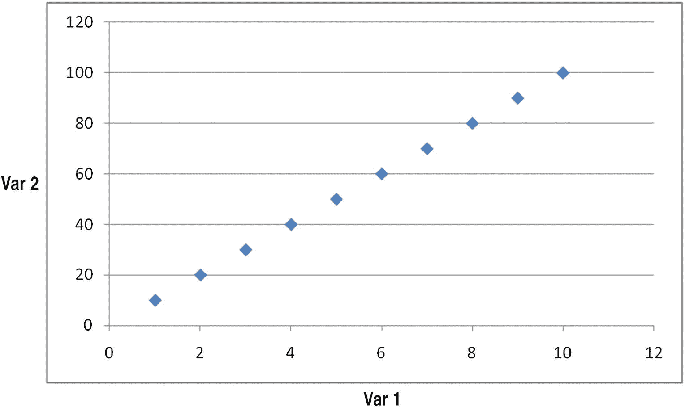

图 12-1

Plotting the relation

在图中，我们可以清楚地看到变量之间有很强的联系。这意味着独立变量的数量可以减少。

该等式可以表示如下:

Var2 = 10 × Var1

换句话说，不是使用两个不同的独立变量，我们可以只使用一个变量 Var1，它会解决这个问题。

此外，如果我们能够通过稍微不同的角度(或者，我们旋转数据集)来观察这两个变量，如图 12-2 中的箭头所示，我们会看到水平方向上有很多变化，而垂直方向上变化很小。

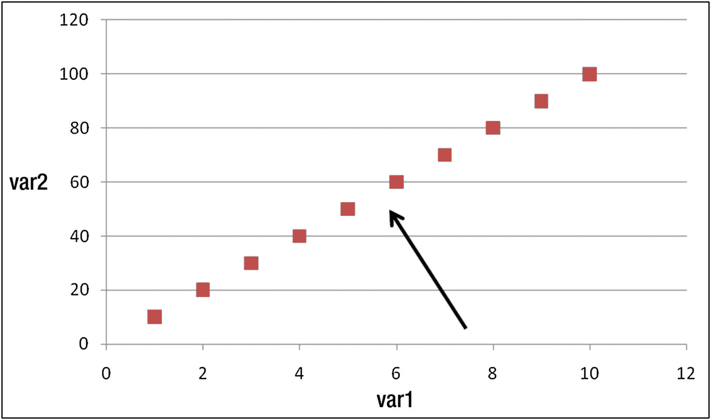

图 12-2

Viewpoint/angle from which data points should be looked at

让我们把数据集变得复杂一点。考虑 v1 和 v2 之间的关系如图 12-3 所示的情况。

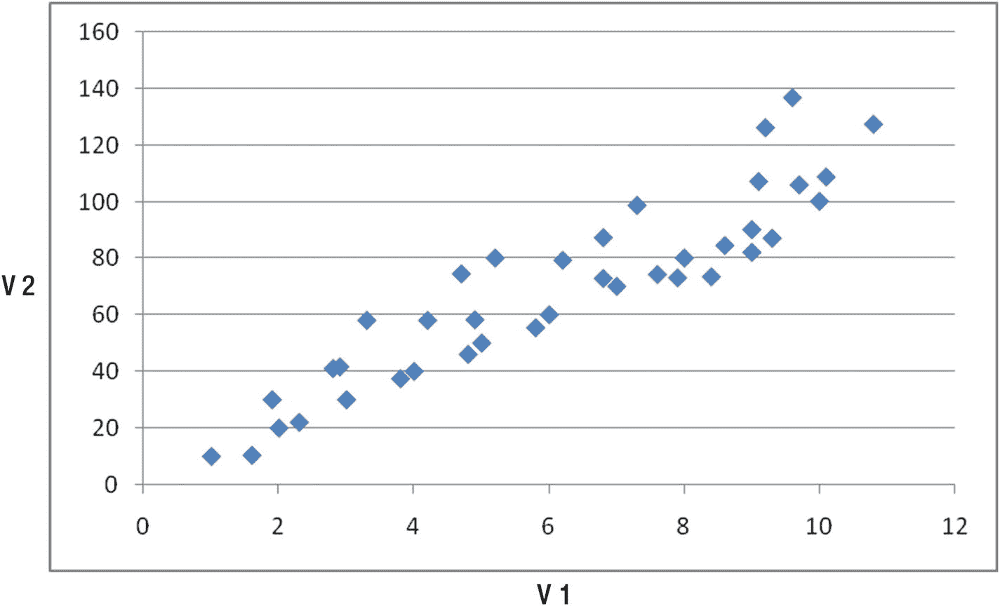

图 12-3

Plotting two variables

同样，这两个变量彼此高度相关，尽管不像前一种情况那样完美相关。

在这种情况下，第一个主成分是解释数据集中最大方差的线/变量，并且是多个独立变量的线性组合。类似地，第二主成分是与第一主成分完全不相关(相关性接近于 0)的线，它解释了数据集中的其余方差，同时也是多个独立变量的线性组合。

通常，第二主成分是垂直于第一主成分的线(因为下一个最高变化发生在垂直于主成分线的方向上)。

一般来说，数据集的第 n 个主成分垂直于同一数据集的第(n–1)个主成分。

## PCA 的工作细节

为了理解 PCA 是如何工作的，让我们看另一个例子(在 github 中以“PCA_2vars.xlsx”的形式提供)，其中 x1 和 x2 是两个彼此高度相关的独立变量:

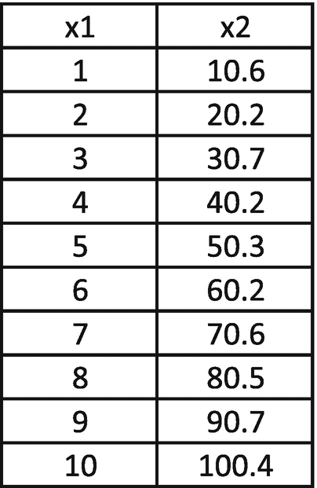

假设主成分是变量的线性组合，我们将表示如下:

PC 1 = w×x1+w<sub>×2</sub>

类似地，第二主分量垂直于原始直线，如下所示:

PC 2 =–w<sub>2</sub>x 1+w<sub>1</sub>x 2

权重 w <sub>1</sub> 和 w <sub>2</sub> 被随机初始化，并且应该被进一步迭代以获得最优的权重。

让我们在求解 w <sub>1</sub> 和 w <sub>2</sub> 时，重新审视一下我们的目标和约束条件:

*   目标:最大化 PC1 方差。
*   约束:主成分的总方差应该等于原始数据集中的总方差(因为数据点没有改变，只是我们观察数据点的角度改变了)。

让我们初始化之前创建的数据集中的主要组件:

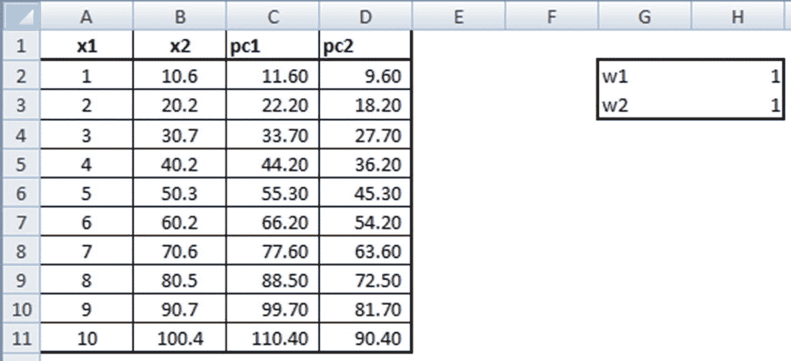

PC1 和 PC2 的公式如下所示:

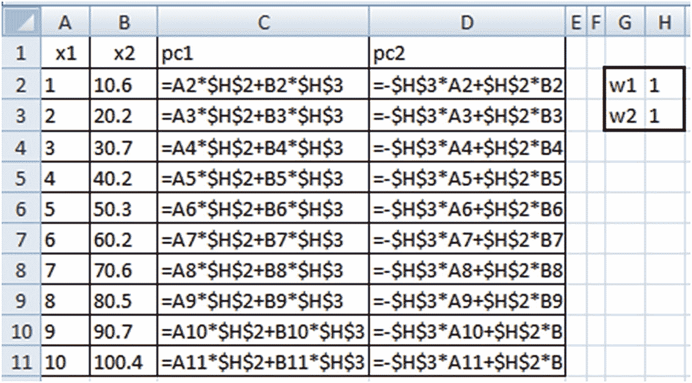

既然我们已经初始化了主成分变量，我们将引入目标和约束:

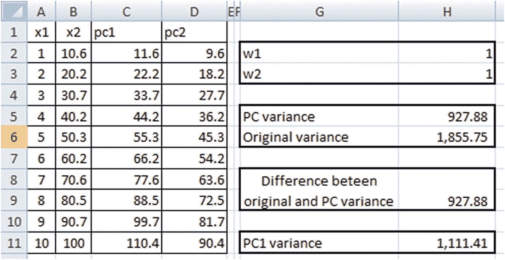

注意，PC 方差= PC1 方差+ PC2 方差。

原始方差= x1 方差+ x2 方差

我们计算原始方差和 PC 方差之间的差异，因为我们的约束是在主成分变换的数据集中保持与原始数据集相同的方差。以下是他们的公式:

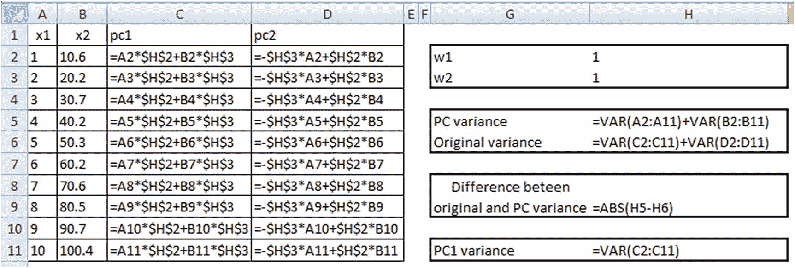

一旦数据集被初始化，我们将继续识别满足我们的目标和约束的 w <sub>1</sub> 和 w <sub>2</sub> 的最佳值。

让我们看看如何通过 Excel 的规划求解加载项实现这一点:

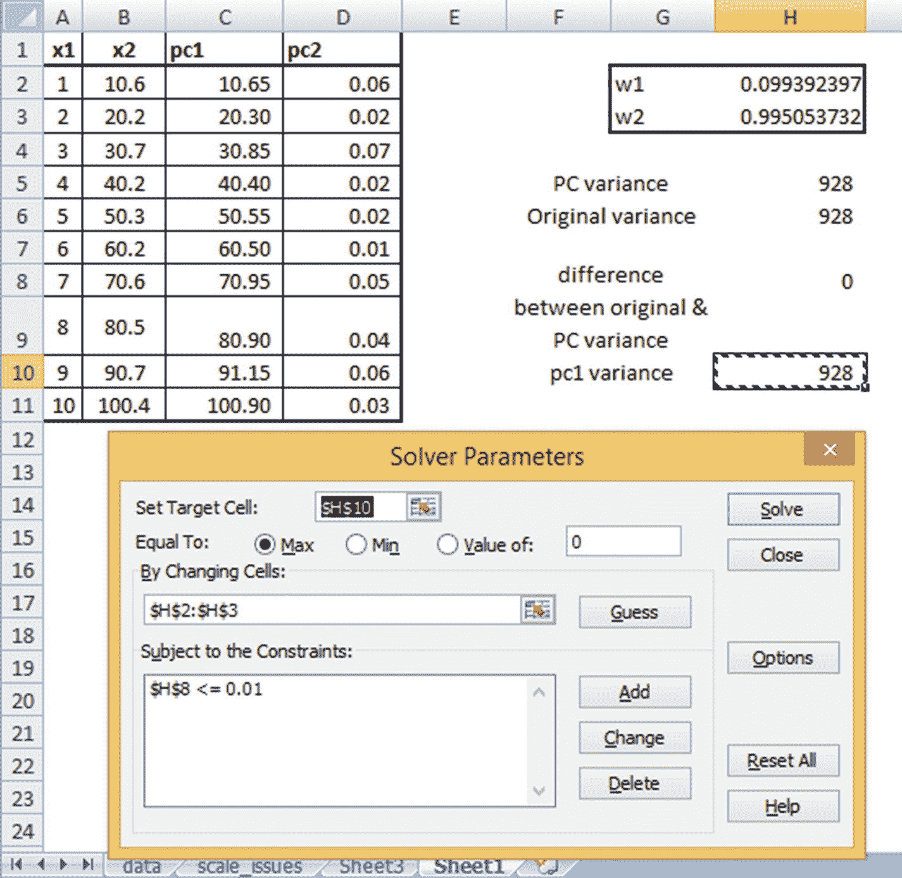

请注意，我们之前指定的目标和标准已经达到:

*   PC1 方差最大化。
*   原始数据集方差和主成分数据集方差之间几乎没有任何差异。(我们只允许小于 0.01 的小差异，以便 Excel 能够解决它，因为可能存在一些舍入误差。)

请注意，PC1 和 PC2 现在高度不相关，PC1 解释了所有变量中最高的方差。此外，x2 在确定 PC1 时比 x1 具有更高的权重(从导出的权重值可以明显看出)。

实际上，一旦得到主成分，它就以相应的平均值为中心，也就是说，主成分列中的每个值都要减去原始主成分列的平均值:

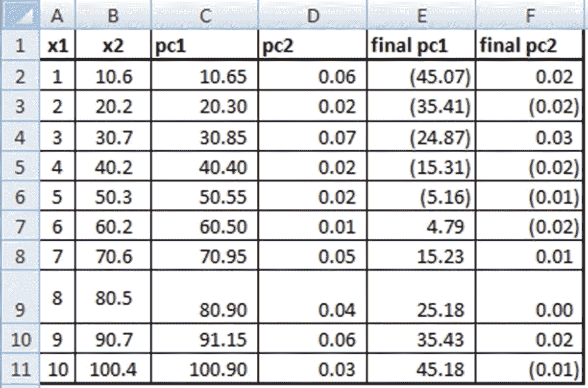

用于推导上述数据集的公式如下所示:

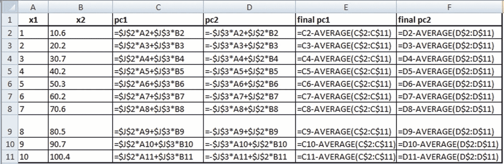

## PCA 中的缩放数据

PCA 中的主要预处理步骤之一是缩放变量。考虑以下场景:我们对两个变量执行 PCA。一个变量的取值范围为 0-100，另一个变量的取值范围为 0-1。

假设使用 PCA，我们试图捕获数据集中尽可能多的变化，第一个主成分将给予与低方差变量相比具有最大方差的变量(在我们的情况下，Var1)非常高的权重。

因此，当我们计算出主成分的 w <sub>1</sub> 和 w <sub>2</sub> 时，我们将最终得到接近 0 的 w <sub>1</sub> 和接近 1 的 w <sub>2</sub> (其中 w <sub>2</sub> 是 PC1 中对应于较高范围变量的权重)。为了避免这种情况，建议调整每个变量，使它们具有相似的范围，这样方差就可以比较。

## 将主成分分析扩展到多个变量

到目前为止，我们已经看到建立一个 PCA，其中有两个独立变量。在这一节中，我们将考虑如何在有两个以上独立变量的情况下手工构建 PCA。

考虑以下数据集(在 github 中以“PCA_3vars.xlsx”的形式提供):

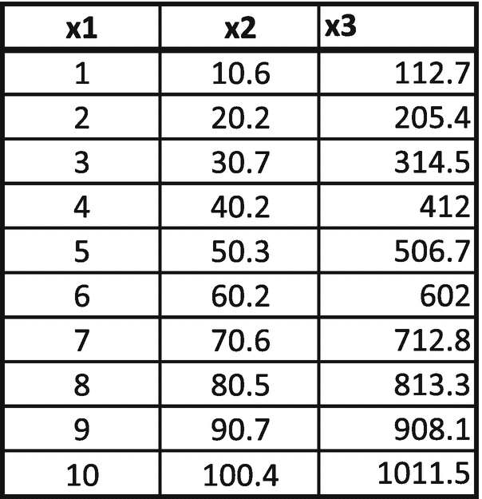

与两变量 PCA 不同，在二维以上的 PCA 中，我们将以稍微不同的方式初始化权重。权重随机初始化，但采用矩阵形式，如下所示:

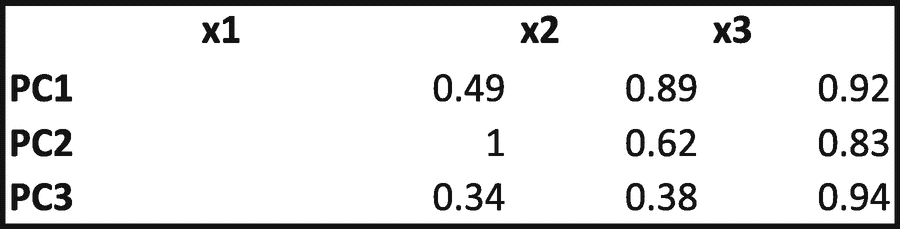

从这个矩阵我们可以认为 PC1 = 0.49 × x1 + 0.89 × x2 + 0.92 × x3。PC2 和 PC3 的计算方法类似。如果有四个独立变量，我们就会有一个 4 × 4 权重矩阵。

让我们看看我们可能有的目标和约束:

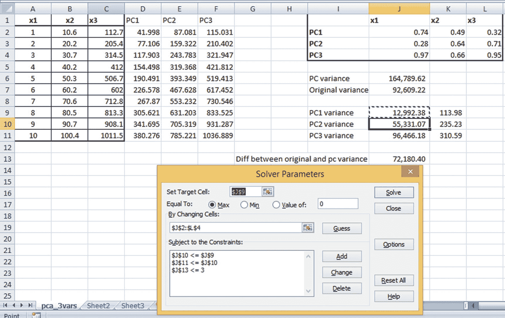

*   目标:最大化 PC1 方差。
*   约束:总体 PC 方差应等于总体原始数据集方差。PC1 方差应大于 PC2 方差，PC1 方差应大于 PC3 方差，PC2 方差应大于 PC3 方差。

求解上述问题将得到满足我们标准的最佳重量组合。请注意，Excel 的输出可能与您在 Python 或 R 中看到的输出略有不同，但与 Excel 的输出相比，Python 或 R 的输出可能具有更高的 PC1 方差，这是由于求解中使用的基础算法。还要注意，尽管理想情况下我们希望原始方差和 PC 方差之间的差值为 0，但出于使用 Excel 规划求解执行优化的实际原因，我们允许差值最大为 3。

类似于具有两个独立变量的 PCA 场景，在处理 PCA 之前缩放输入是一个好主意。此外，请注意，PC1 解释了求解权重后的最大变化，因此 PC2 和 PC3 可以被消除，因为它们对原始数据集变化的解释非常少。

Choosing the Number of Principal Components to Consider

选择主成分的个数没有一个统一的方法。在实践中，一个经验法则是选择最少数量的主成分，这些主成分累计解释数据集中 80%的总方差。

## 在 R 中实现 PCA

PCA 可以使用内置函数`prcomp`在 R 中实现。看看下面的实现(在 github 中以“PCA R.R”的形式提供):

```py
t=read.csv('D:/Pro ML book/PCA/pca_3vars.csv')
pca=prcomp(t)
pca

```

`pca`的输出如下:

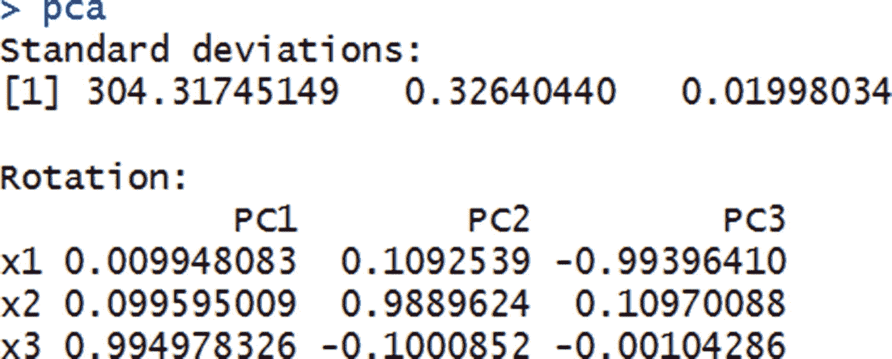

这里的标准偏差值与 PC 变量的标准偏差值相同。旋转值与我们之前初始化的权重值相同。

使用`str(pca)`可以获得更详细的输出版本，其输出如下所示:

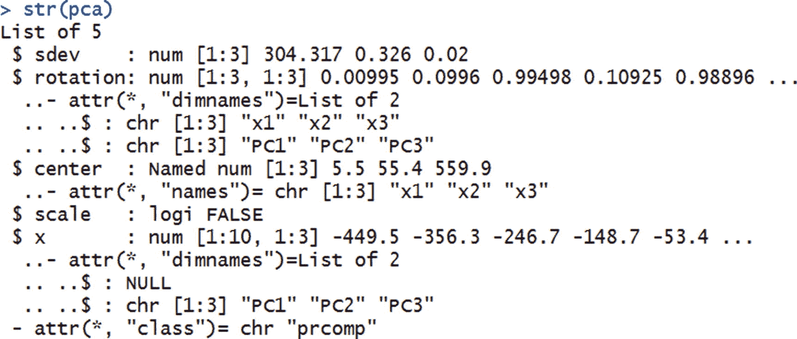

由此，我们注意到，除了 PC 变量的标准偏差和权重矩阵之外，`pca`还提供了转换后的数据集。

我们可以通过指定`pca$x`来访问转换后的数据集。

## 在 Python 中实现 PCA

使用`scikit learn`库在 Python 中实现 PCA，如下所示(在 github 中作为“PCA.ipynb”提供):

```py
# import packages and dataset
import pandas as pd
import numpy as np
from sklearn.decomposition import PCA
data=pd.read_csv('F:/course/pca/pca.csv')
from sklearn.decomposition import PCA
pca = PCA(n_components=2)
pca.fit(data)

```

我们看到，我们拟合了与自变量数量一样多的成分，并在数据上拟合了 PCA。

数据拟合后，将原始数据转换为转换后的数据，如下所示:

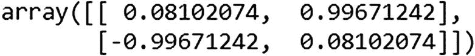

```py
x_pca = pca.transform(data)

pca.components_

```

`components_`与主成分关联的权重相同。`x_pca`是变换后的数据集。

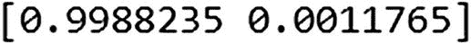

```py
print(pca.explained_variance_ratio_)

```

`explained_variance_ratio_`提供由每个主成分解释的差异量。这非常类似于 R 中的标准差输出，其中 R 给出了每个主成分的标准差。Python 的`scikit learn`中的 PCA 对其进行了轻微的转换，并给出了每个变量所解释的原始方差的方差。

## 将 PCA 应用于 MNIST

MNIST 是一个手写数字识别任务。展开一个 28 × 28 的图像，其中每个像素值用一列表示。基于此，我们可以预测输出是否是 0 到 9 之间的一个数字。

假设总共有 784 列，直观上我们应该观察到以下情况之一:

*   方差为零的列
*   差异很小的列
*   方差大的列

在某种程度上，PCA 帮助我们尽可能地消除低方差和无方差的列，同时仍然用有限数量的列实现相当高的精度。

让我们通过下面的例子来看看如何在不损失太多差异的情况下减少列数。github 中的 r”)。

```py
# Load dataset
t=read.csv("D:/Pro ML book/PCA/train.csv")
# Keep the independent variables only, as PCA is on indep. vars
t$Label = NULL
# scale dataset by 255, as it is the mximum possible value in pixels
t=t/255
# Apply PCA
pca=prcomp(t)
str(pca)
# Check the variance explained
cumsum((pca$sdev)²)/sum(pca$sdev²)

```

上述代码的输出如下:

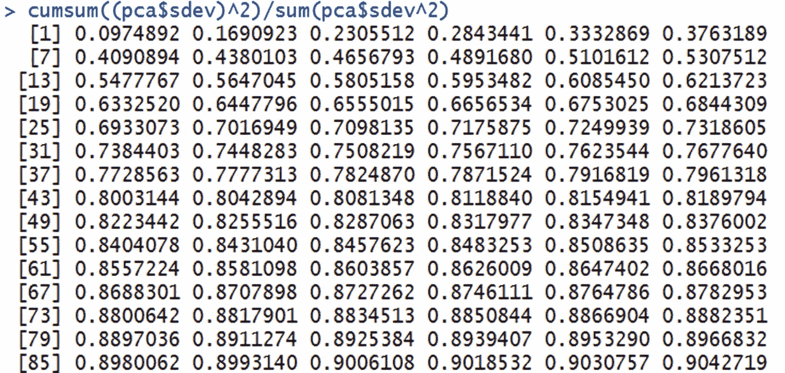

由此我们可以看出，前 43 个主成分解释了原始数据集中约 80%的总方差。我们可以在前 43 个主成分上运行模型，而不是在所有 784 列上运行模型，而不会损失太多信息，因此不会损失太多准确性。

## 摘要

*   PCA 是一种减少数据集中独立变量数量的方法，尤其适用于数据点与独立变量的比率较低的情况。
*   在应用主成分分析之前，先对独立变量进行缩放是一个好主意。
*   PCA 变换变量的线性组合，使得结果变量表示变量组合内的最大方差。