# 13.推荐系统

我们到处都能看到建议。推荐系统旨在

*   最小化用户搜索产品的努力
*   提醒用户他们之前关闭的会话
*   帮助用户发现更多产品

例如，以下是推荐系统的常见实例:

*   电子商务网站中的推荐窗口小部件
*   发送到电子邮件地址的推荐项目
*   社交网站中朋友/联系人的推荐

想象一个场景，电子商务客户没有得到产品推荐。客户将无法执行以下操作:

*   识别与他们正在查看的产品相似的产品
*   了解产品价格是否合理
*   寻找配件或补充产品

这就是为什么推荐系统通常会大幅提升销售额。

在本章中，您将学习以下内容:

*   要预测用户对某个商品的评价(或用户购买该商品的可能性),请使用
    *   协同过滤
    *   矩阵分解
*   欧几里德和余弦相似性度量
*   如何在 Excel、Python 和 R 中实现推荐算法

推荐系统几乎就像一个朋友。它推断你的喜好，并为你提供个性化的选择。构建推荐系统有多种方式，但目标是将用户与一组其他用户关联起来，将一个项目与一组其他项目关联起来，或者两者结合起来。

鉴于推荐是将一个用户/项目与另一个用户/项目相关联，它转化为 k 个最近邻居的问题:识别非常相似的少数几个，然后基于大多数最近邻居表现出的偏好进行预测。

## 了解 k 近邻

最近邻是离所考虑的实体最近的实体(在数据集的情况下是数据点)。如果两个实体之间的距离很小，则它们是接近的。

考虑具有以下属性的三个用户:

<colgroup><col align="left"> <col align="left"></colgroup> 
| 用户 | 重量 |
| :-- | :-- |
| A | Sixty |
| B | Sixty-two |
| C | Ninety |

我们可以直观地得出结论，与 c 相比，用户 A 和 B 在权重方面更加相似。

让我们再添加一个用户属性—年龄:

<colgroup><col align="left"> <col align="left"> <col align="left"></colgroup> 
| 用户 | 重量 | 年龄 |
| :-- | :-- | :-- |
| A | Sixty | Thirty |
| B | Sixty-two | Thirty-five |
| C | Ninety | Thirty |

用户 A 和 B 之间的“距离”可以测量为:

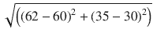T2】

这种用户间距离的计算方式类似于两点间距离的计算方式。

然而，在使用多个变量计算距离时，您需要稍微小心一点。以下示例可以突出距离计算的缺陷:

<colgroup><col align="left"> <col align="left"> <col align="left"></colgroup> 
| 汽车模型 | 可达到的最高速度 | 档位数量 |
| :-- | :-- | :-- |
| A | One hundred | four |
| B | One hundred and ten | five |
| C | One hundred | five |

在上表中，如果我们使用传统的“距离”指标来衡量汽车之间的相似性，我们可能会得出结论，A 型和 C 型最相似(即使它们的档位数量不同)。然而，凭直觉我们知道，B 和 C 比 A 和 C 更相似，因为它们有相同数量的齿轮，它们的最大可达速度也相似。

这种差异突出了变量规模的问题，其中一个变量与另一个变量相比具有非常高的幅度。为了解决这个问题，我们通常会在进一步计算距离之前对变量进行归一化处理。规范化变量是一个将所有变量统一起来的过程。

标准化变量有多种方法:

*   将每个变量除以该变量的最大值(取–1 和 1 之间的所有值)
*   找出变量的每个数据点的 Z 值。z 得分是(数据点的值-变量的平均值)/(变量的标准偏差)。
*   将每个变量除以该变量的(最大–最小)值(称为最小最大缩放)。

诸如此类的步骤有助于规范化变量，从而防止缩放带来的问题。

一旦获得一个数据点到其他数据点的距离——在推荐系统的情况下，也就是说，一旦识别出与给定项目最近的项目——如果系统得知用户在历史上喜欢大多数最近的邻近项目，那么它将向用户推荐这些项目。

k-nearest neighbors 中的 k 代表在对用户是否喜欢最近邻居进行多数投票时要考虑的最近邻居的数量。例如，如果用户喜欢一个项目的 10 (k)个最近邻居中的 9 个，我们将向用户推荐该项目。类似地，如果用户只喜欢 10 个最近邻中的 1 个，我们不会向用户推荐这个项目(因为喜欢的项目是少数)。

基于邻居的分析考虑了多个用户可以合作帮助预测用户是否喜欢某样东西的方式。

有了这个背景，我们将继续前进，看看推荐系统算法的演变。

## 基于用户的协同过滤的工作细节

基于用户当然是指以用户为基础的东西。协作意味着利用用户之间的某种关系(相似性)。而过滤是指从所有用户中过滤掉一部分用户。

为了了解基于用户的协同过滤(UBCF)，考虑下面的例子(在 github 中以“ubcf.xlsx”的形式提供):

<colgroup><col align="left"> <col align="left"> <col align="left"> <col align="left"> <col align="left"> <col align="left"> <col align="left"></colgroup> 
| 用户/电影 | 只是我的运气 | 水中的女士 | 飞机上的蛇 | 超人归来 | 夜间听众 | 你我和杜普利 |
| :-- | :-- | :-- | :-- | :-- | :-- | :-- |
| 克劳迪娅 Puig | three |   | Three point five | four | Four point five | Two point five |
| 吉恩·西摩 | One point five | three | Three point five | five | three | Three point five |
| 杰克·马修斯 |   | three | four | five | three | Three point five |
| 丽莎·罗斯 | three | Two point five | Three point five | Three point five | three | Two point five |
| 米克拉斯拉 | Two | three | four | three | three | Two |
| 托比 |   |   | Four point five | four |   | one |

假设我们想知道用户 Claudia Puig 对电影《水中女士》的评价。我们将从找出与克劳迪娅最相似的用户开始。用户相似性可以用几种方法计算。以下是计算相似性的两种最常见的方法:

*   用户之间的欧几里德距离
*   用户之间的余弦相似度

### 欧几里德距离

计算 Claudia 与每个其他用户的欧几里德距离的方法如下(可在 github 中“ubcf.xlsx”文件的“欧几里德距离”表中找到):

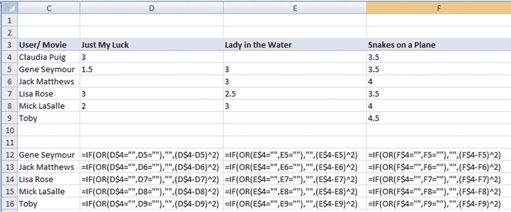

由于空间和格式的限制，我们看不到完整的图片，但基本上相同的公式适用于各列。

对于每部电影，每个其他用户到 Claudia 的距离如下:

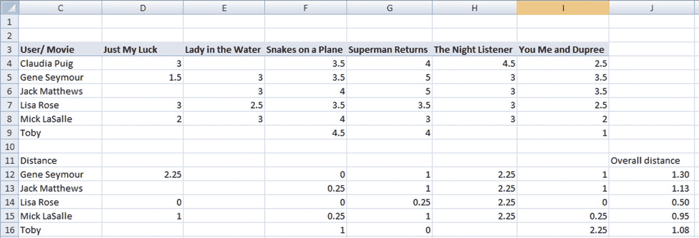

注意，总距离值是两个用户评价给定电影的所有距离的平均值。鉴于 Lisa Rose 是与 Claudia 整体距离最小的用户，我们将考虑 Lisa 提供的评分作为 Claudia 很可能给电影《水中女士》的评分。

在这种计算中要考虑的一个主要问题是，一些用户可能是温和的批评者，而一些用户可能是严厉的批评者。用户 A 和 B 可能隐含地具有观看给定电影的相似经历，但是显而易见地，他们的评级可能不同。

#### 对用户进行规范化

考虑到用户的批评程度不同，我们需要确保解决这个问题。标准化在这里会有所帮助。

我们可以为用户规范化如下:

1.  取给定用户的所有电影的平均评级。
2.  以每部电影与用户平均评分之间的差异为例。

通过获取单个电影的评级和用户的平均评级之间的差异，我们将知道他们是喜欢一部电影多于他们观看的平均电影、少于他们观看的平均电影还是等于他们观看的平均电影。

让我们看看这是如何做到的:

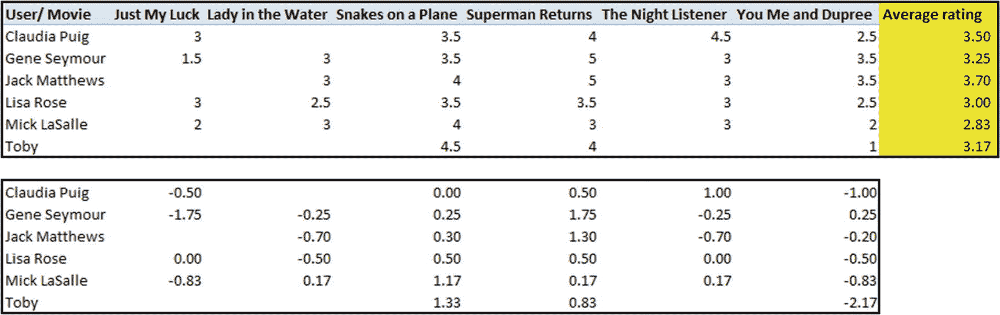

上述公式如下(可在 github 中“ubcf.xlsx”文件的“规范化用户”表中找到):

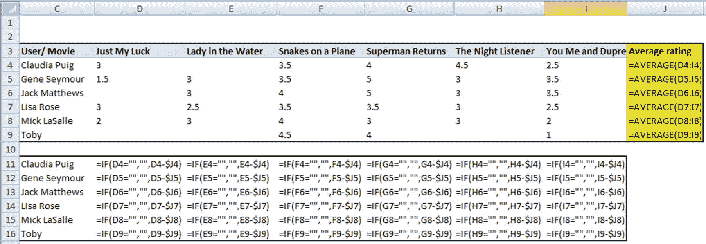

现在，我们已经对给定用户进行了规范化，我们计算哪个用户与 Claudia 最相似，方法与前面计算用户相似度的方法相同。唯一的区别是，现在我们将基于标准化评级(而不是原始评级)计算距离:

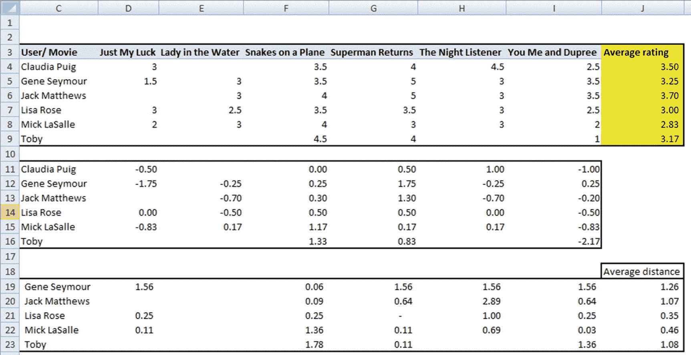

我们可以看到，Lisa Rose 仍然是与 Claudia Puig 距离最近(或最接近，或最相似)的用户。丽莎对《水中女士》的评分比她电影的平均评分 3.00 低 0.50 个单位，这比她的平均评分低了约 8%。鉴于 Lisa 是与 Claudia 最相似的用户，我们预计 Claudia 的评分同样会比她的平均评分低 8%,计算结果如下:

3.5 × (1 – 0.5 / 3) = 2.91

#### 考虑单一用户的问题

到目前为止，我们已经考虑了与 Claudia 最相似的单个用户。在实践中，越多越好——也就是说，确定 k 个与给定用户最相似的用户给出的加权平均评级比确定最相似用户的评级更好。

但是，我们需要注意的是，并不是所有的 k 用户都是同样相似的。有些比较像，有些不太像。换句话说，一些用户的评级应该被赋予更大的权重，而其他用户的评级应该被赋予更小的权重。但是使用基于距离的度量，没有简单的方法来得出相似性度量。

余弦相似性作为一种度量标准，在解决这个问题上派上了用场。

### 余弦相似性

我们可以通过一个例子来看余弦相似性。考虑以下矩阵:

<colgroup><col align="left"> <col align="left"> <col align="left"> <col align="left"></colgroup> 
|   | 电影 | 电影 2 | 电影 3 |
| :-- | :-- | :-- | :-- |
| 用户 1 | one | Two | Two |
| 用户 2 | Two | four | four |

在上表中，我们看到两个用户的评分高度相关。但是，评级的幅度是有区别的。

如果我们要计算两个用户之间的欧几里德距离，我们会注意到这两个用户彼此非常不同。但是我们可以看到，这两个用户在评分的方向(趋势)上是相似的，虽然在评分的幅度上并不相似。使用用户之间的余弦相似性可以解决用户趋势相似但幅度不相似的问题。

两个用户之间的余弦相似度定义如下:

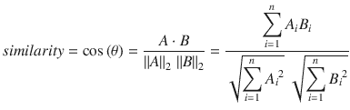

a 和 B 分别是对应于用户 1 和用户 2 的向量。

让我们看看如何计算前面矩阵的相似性:

*   给定公式的分子= (1 × 2 + 2 × 4 + 2 × 4) = 18
*   Denominator of the given formula =

    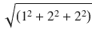

    ×

    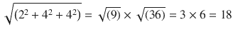

*   相似度= 18 / 18 = 1。

基于给定的公式，我们可以看到，基于余弦相似性，我们能够将高相似性分配给方向相关但不一定在幅度上相关的用户。

我们之前最初计算(在欧几里德距离计算中)的评级矩阵上的余弦相似性将以与我们计算前述公式类似的方式进行计算。余弦相似度计算的步骤保持不变:

1.  正常化用户。
2.  计算给定用户的其余用户的余弦相似度。

为了说明我们如何计算余弦相似度，让我们计算 Claudia 与其他每个用户的相似度(可在 github 中“ubcf.xlsx”文件的“余弦相似度”表中找到):

1.  Normalize user ratings:

    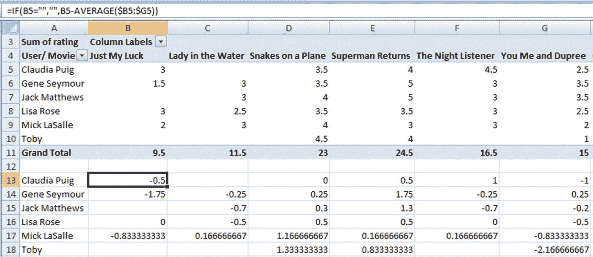

2.  Calculate the numerator part of the cosine similarity calculation:

    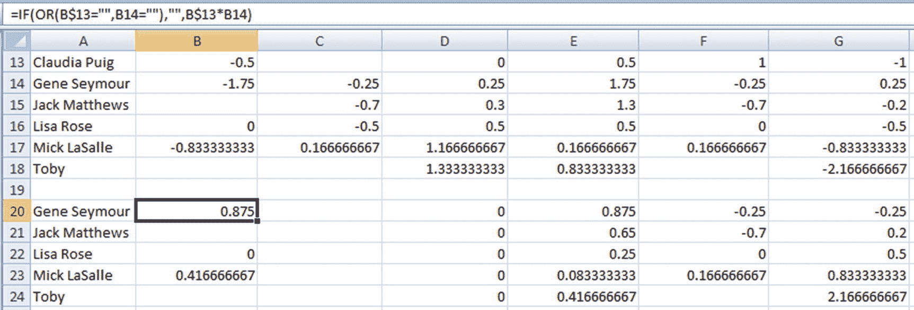

    The numerator would be as follows:

    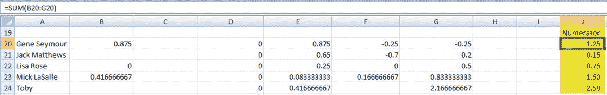

3.  Prepare the denominator calculator of cosine similarity:

    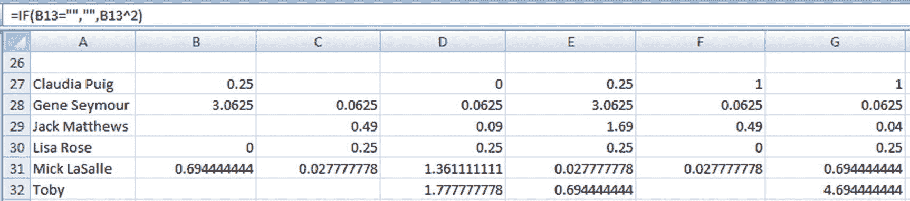

4.  Calculate the final cosine similarity, as follows:

    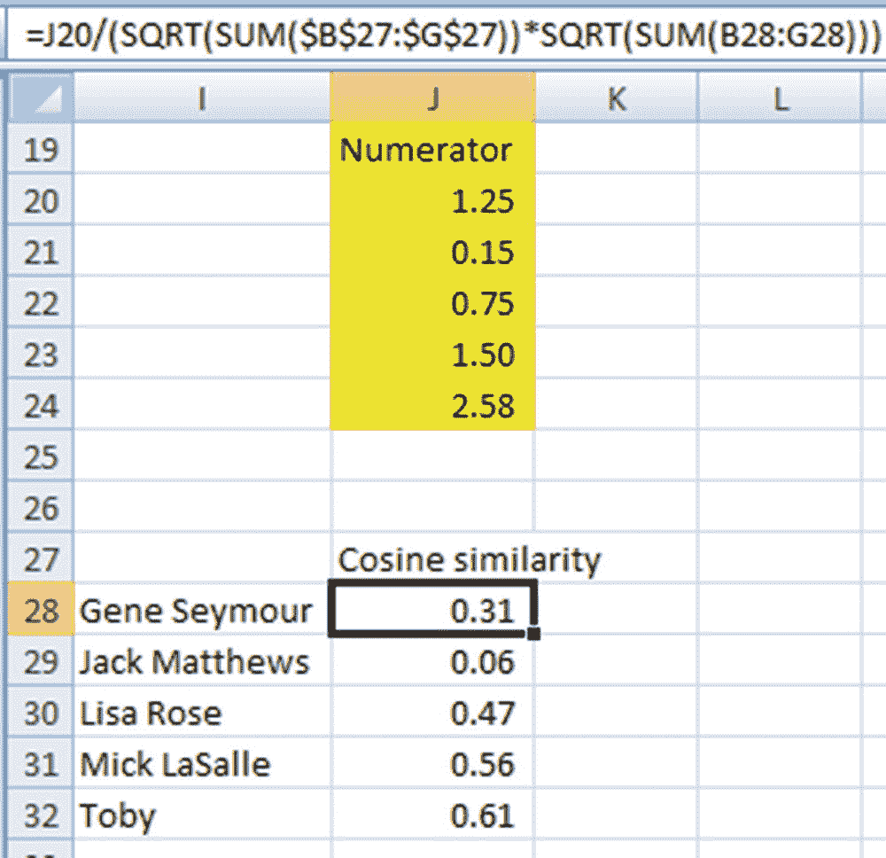

我们现在有了一个介于–1 和+1 之间的相似性值，它给出了给定用户的相似性得分。

我们现在已经克服了在预测给定用户可能给电影的评级时必须考虑多个用户给出的评级所面临的问题。现在可以计算与给定用户更相似的用户。

现在，预测克劳迪娅可能给水电影中的电影女士的评级的问题可以通过以下步骤来解决:

1.  正常化用户。
2.  计算余弦相似度。
3.  计算加权平均标准化评级。

假设我们试图通过使用两个最相似的用户而不是一个来预测评级。我们将遵循以下步骤:

1.  找出两个最相似的用户，他们也对电影《水中女士》进行了评级。
2.  计算他们给电影的加权平均标准化评分。

在这种情况下，Lisa 和 Mick 是与 Claudia 最相似的两个用户，他们在水中评价 Lady。(注意，即使 Toby 是最相似的用户，他也没有对水中的女士进行评级，因此我们不能考虑将他用于评级预测。)

#### 加权平均评级计算

让我们来看看给定的标准化评分和两个最相似用户的相似性:

<colgroup><col align="left"> <col align="left"> <col align="left"></colgroup> 
|   | 类似 | 标准化评级 |
| :-- | :-- | :-- |
| 丽莎·罗斯 | Zero point four seven | –0.5 |
| 米克拉斯拉 | Zero point five six | Zero point one seven |

加权平均评级现在如下:

(0.47 × –0.5 + 0.56 × 0.17) / (0.47 + 0.56) = –0.14

潜在地，克劳迪娅的平均评分现在将减少 0.14，以得出电影《水中女士》中克劳迪娅的预测评分。

得出加权平均评分的另一种方法是基于平均评分的百分比，如下所示:

<colgroup><col align="left"> <col align="left"> <col align="left"> <col align="left"> <col align="left"></colgroup> 
|   | 类似 | 标准化评级 | 平均分 | 平均评级百分比 |
| :-- | :-- | :-- | :-- | :-- |
| 丽莎·罗斯 | Zero point four seven | –0.5 | three | –0.5 / 3 = –0.16 |
| 米克拉斯拉 | Zero point five six | Zero point one seven | Two point eight three | 0.17 / 2.83 = 0.06 |

加权平均标准化评级百分比现在如下:

(0.47 × –0.16 + 0.56 × 0.06) / (0.47 + 0.56) = –0.04

因此，克劳迪娅的平均评级可能会降低 4%，以得出电影《水中女士》的预测评级。

#### 选择正确的方法

在推荐系统中，没有固定的技术被证明总是有效的。这需要一个典型的训练、验证和测试场景来得出最佳的参数组合。

可以测试的参数组合如下:

*   要考虑的相似用户的最佳数量
*   在用户有资格被考虑用于类似的用户计算之前，由用户一起评级的共同电影的最佳数量
*   加权平均评级计算方法(基于百分比或绝对值)

我们可以遍历参数的各种组合的多个场景，计算测试数据集的准确性，并决定给出最小错误率的组合是给定数据集的最佳组合。

#### 计算误差

有多种计算方法，首选方法因业务应用而异。让我们看两个案例:

*   对测试数据集进行的所有预测的均方误差(MSE)
*   用户在下次购买时购买的推荐商品数量

请注意，虽然 MSE 有助于构建算法，但在实践中，我们可能会将模型的性能作为与业务相关的结果来衡量，如第二种情况。

### 与 UBCF 的问题

基于用户的协同过滤的一个问题是，每个用户必须与每个其他用户进行比较，以识别最相似的用户。假设有 100 个客户，这意味着第一个用户与 99 个用户进行比较，第二个用户与 98 个用户进行比较，第三个用户与 97 个用户进行比较，依此类推。这里的总比较如下:

99 + 98 + 97 + … + 1 + 0 = 99 × (99 + 1) / 2 = 4950

对于一百万个客户，比较的总数如下所示:

999,999 × 1,000,000 / 2 = ~500,000,000,000

大约有 5000 亿次比较。计算表明，随着客户数量的增加，识别最相似客户的比较次数呈指数增加。在生产中，这成为一个问题，因为如果每个用户与每个其他用户的相似性需要每天计算(因为用户偏好和评级每天都根据最新的用户数据更新)，那么每天需要执行大约 5000 亿次比较。

为了解决这个问题，我们可以考虑基于项目的协同过滤，而不是基于用户的协同过滤。

## 基于项目的协同过滤

考虑到计算的数量在 UBCF 是一个问题，我们将修改这个问题，以便我们观察项目之间的相似性，而不是用户。基于项目的协同过滤(IBCF)背后的思想是，如果两个项目从相同的用户那里得到的评级是相似的，则这两个项目是相似的。鉴于 IBCF 是基于项目而不是用户相似性，它不存在执行数十亿次计算的问题。

让我们假设一个数据库中总共有 10，000 部电影，该网站吸引了 100 万客户。在这种情况下，如果我们执行 UBCF，我们将执行大约 5000 亿次相似性计算。但是使用 IBCF，我们将执行 9999×5000 = ~ 5000 万次相似性计算。

我们可以看到，随着客户数量的增长，相似性计算的数量呈指数增长。然而，考虑到项目数量(在我们的例子中是电影名称)预计不会经历与客户数量相同的增长率，一般来说，IBCF 的计算敏感度低于 UBCF。

IBCF 的计算方式和涉及的技术与 UBCF 非常相似。唯一的区别是，我们将处理前一节中看到的原始电影矩阵的转置形式。这样，这些行不是用户的，而是电影的。

注意，虽然 IBCF 在计算方面比 UBCF 好，但计算量仍然很高。

## 在 R 中实现协同过滤

在这一节中，我们将查看用于在 r 中实现 UBCF 的函数。我在下面的代码中实现了在`recommenderlab`包中可用的函数，但在实践中，建议您从头构建一个推荐函数，以便为手头的问题进行定制(代码可作为“UBCF”获得。github 中的 r”)。

```py
# Import data and required packages
t=read.csv("D:/book/Recommender systems/movie_rating.csv")
library(reshape2)
library(recommenderlab)
# Reshape data into a pivot format
t2=acast(t,critic~title)
t2
# Convert it to a matrix
R<-as.matrix(t2)

# Convert R into realRatingMatrix structure
# realRatingMatrix is a recommenderlab sparse-matrix like data structure

r<-as(R,"realRatingMatrix")

# Implement the UBCF method
rec=Recommender(r[1:nrow(r)],method="UBCF")

# Predict the missing rating
recom<-predict(rec,r[1:nrow(r)],type="ratings")
str(recom)

```

在这段代码中，我们对数据进行了整形，以便将其转换成一个由`Recommender`函数使用的`realRatingMatrix`类，从而提供缺失值预测。

## 用 Python 实现协同过滤

我们在 R 中使用了一个预测包，但对于 Python，我们将手工构建一种方法来预测用户可能给出的评级。在下面的代码中，我们将通过仅考虑与 Claudia 最相似的用户(代码在 github 中为“UBCF.ipynb ”)来创建一种方法，以预测 Claudia 可能对水电影中的女士给出的评级。

1.  导入数据集:

    ```py
    import pandas as pd
    import numpy as np
    t=pd.read_csv("D:/book/Recommender systems/movie_rating.csv")

    ```

2.  将数据集转换成数据透视表:

    ```py
    t2 = pd.pivot_table(t,values='rating',index='critic',columns='title')

    ```

3.  重置索引:

    ```py
    t3 = t2.reset_index()
    t3=t3.drop(['critic'],axis=1)

    ```

4.  归一化数据集:

    ```py
    t4=t3.subtract(np.mean(t3,axis=1),axis=0)

    ```

5.  删除缺少水中女士值的行:

    ```py
    t5=t4.loc[t4['Lady in the Water'].dropna(axis=0).index]
    t6=t5.reset_index()
    t7=t6.drop(['index'],axis=1)

    ```

6.  计算每个其他用户到克劳迪娅的距离:

    ```py
    x=[]
    for i in range(t7.shape[0]):
        x.append(np.mean(np.square(t4.loc[0]-t7.loc[i])))
    t6.loc[np.argmin(x)]['Lady in the Water']

    ```

7.  计算克劳迪娅的预测评分:

    ```py
    np.mean(t3.loc[0]) * (1+(t6.loc[np.argmin(x)]['Lady in the Water']/np.mean(t3.loc[3])))

    ```

## 矩阵分解的工作细节

尽管基于用户或基于项目的协同过滤方法简单而直观，但矩阵分解技术通常更有效，因为它们允许我们发现用户和项目之间交互的潜在特征。

在矩阵分解中，如果有 U 个用户，每个用户被表示在 K 列中，因此我们有一个 U × K 用户矩阵。同样，如果有 D 项，每一项也用 K 列表示，给我们一个 D × K 的矩阵。

用户矩阵的矩阵乘法和项目矩阵的转置将产生 U × D 矩阵，其中 U 个用户可能已经对 D 个项目中的一些进行了评级。

这 K 列基本上可以转化为 K 个特征，其中一个或另一个特征中较高或较低的幅度可以给我们一个项目类型或流派的指示。这使我们能够知道用户会给哪些功能更高的权重，或者用户可能不喜欢哪些功能。本质上，矩阵分解是一种以这样的方式来表示用户和项目的方式，即如果对应于项目的特征是用户给予较高权重的特征，则用户喜欢或购买项目的概率很高。

我们将通过一个例子来看看矩阵分解是如何工作的。让我们假设我们有一个用户(U)和电影(D)的矩阵，如下(数据集在 github 中以“matrix factorization example . xlsx”的形式提供):

<colgroup><col align="left"> <col align="left"> <col align="left"></colgroup> 
| 用户 | 电影 | 实际的 |
| :-- | :-- | :-- |
| one | one | five |
| one | Two | three |
| one | three |   |
| one | four | one |
| Two | one | four |
| Two | Two |   |
| Two | three |   |
| Two | four | one |
| three | one | one |
| three | Two | one |
| three | three |   |
| three | four | five |
| four | one | one |
| four | Two |   |
| four | three |   |
| four | four | four |
| five | one |   |
| five | Two | one |
| five | three | five |
| five | four | four |

我们的任务是预测实际列中缺少的值，这些值表明用户还没有对电影进行评级。

在这种情况下，矩阵分解的数学计算如下:

*   目的:改变 P 和 Q 矩阵的随机初始值，以最小化总误差。
*   约束:任何预测都不能大于 5 或小于 1。

1.  Initialize the values of P matrix randomly, where P is a U × K matrix. We’ll assume a value of k = 2 for this example. A better way of randomly initializing the values is by limiting the values to be between 0 and 1. In this scenario, the matrix of P will be a 5 × 2 matrix, because k = 2 and there are 5 users:

    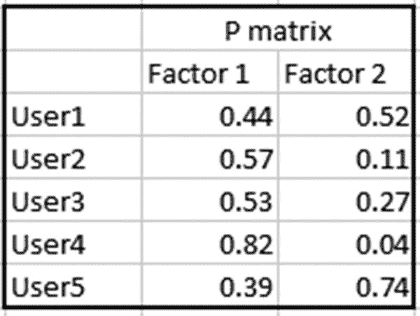

2.  Initialize the values of Q matrix randomly, again where Q is a K × D matrix—that is, a 2 × 4 matrix, because there are four movies, as shown in the first table. The Q matrix would be as follows:

    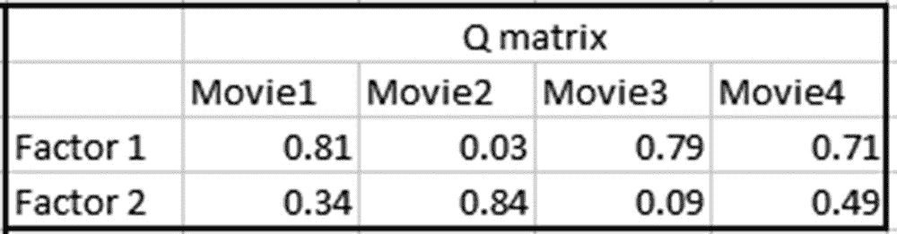

3.  Calculate the value of the matrix multiplication of P × Q matrix. Note that the Prediction column in the following is calculated by the matrix multiplication of P matrix and Q matrix (I will discuss the Constraint column in the next step):

    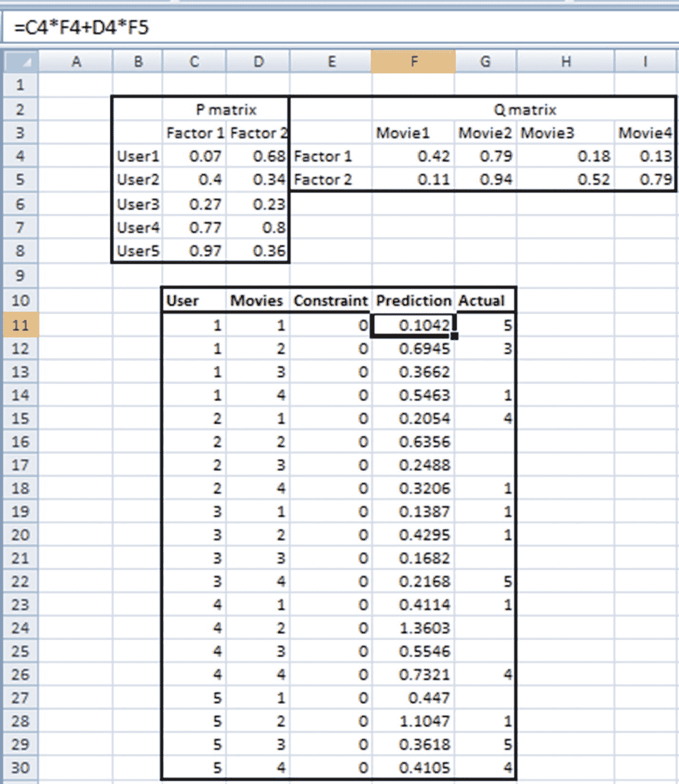

4.  Specify the optimization constraints. The predicted value (the multiplication of each element of the two matrices) should ideally be equal to the ratings of the big matrix. The error calculation is based on the typical squared error calculation and is done as follows (note that the weight values in P and matrices have varied because they are random numbers and are initialized using the `randbetween` function, which changes values every time Enter is pressed in Excel):

    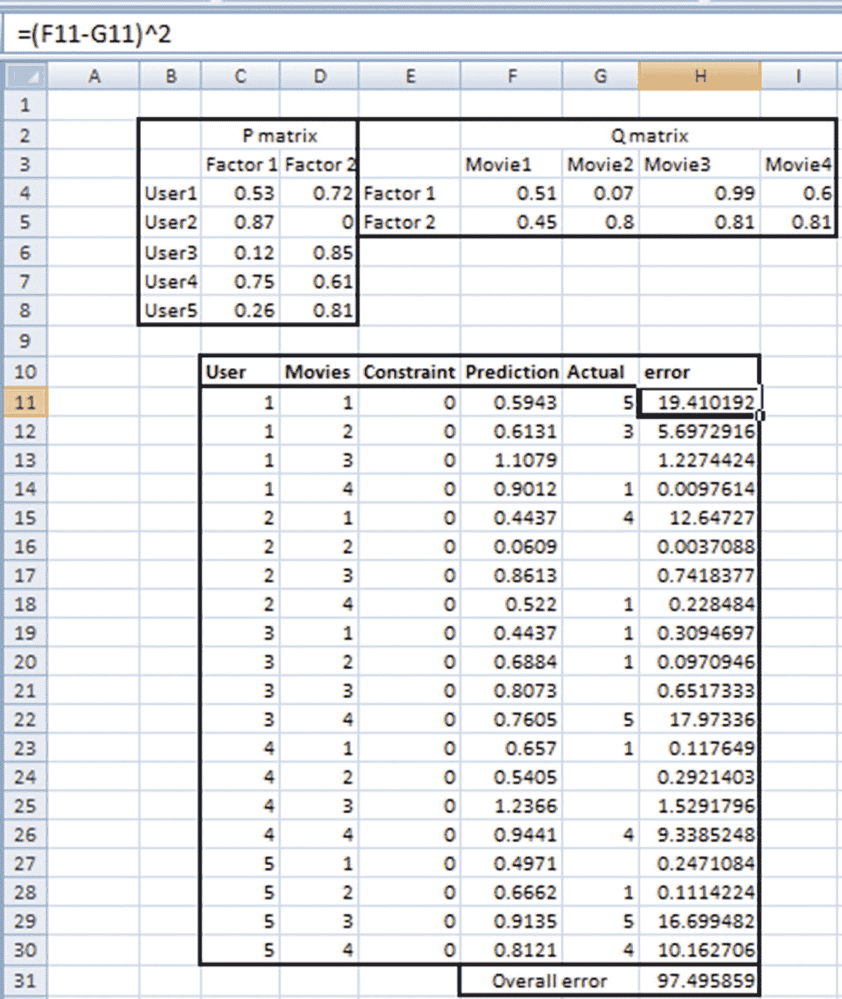

上述目标和约束可以在规划求解中指定为优化方案，如下所示:

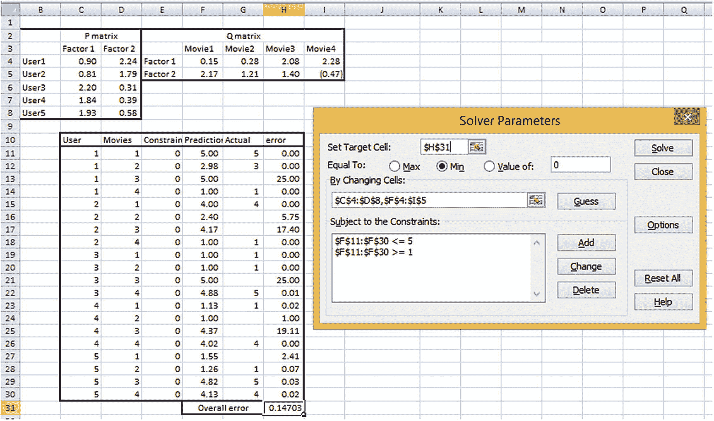

注意，一旦我们针对给定的目标和约束进行了优化，P 和 Q 矩阵中的权重的最优值就被得出，并且如下:

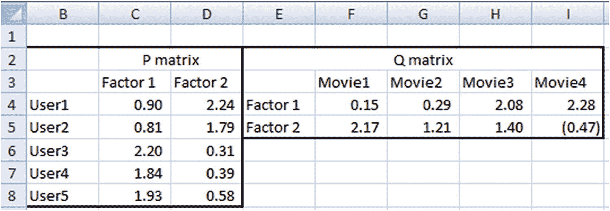

Insights on P AND Q MATRICES

在 P 矩阵中，用户 1 和用户 2 对于因子 1 和 2 具有相似的权重，因此他们可能被认为是相似的用户。

此外，用户 1 和用户 2 对电影进行评级的方式非常相似——用户 1 评级高的电影也具有来自用户 2 的高评级。类似地，用户 1 评价差的电影也具有来自用户 2 的低评价。

这同样适用于对 Q 矩阵(电影矩阵)的解释。电影 1 和电影 4 之间有相当大的距离。我们还可以看到，对于大多数用户来说，如果电影 1 的评分很高，那么电影 4 的评分就很低，反之亦然。

## 用 Python 实现矩阵分解

请注意，P 矩阵和 Q 矩阵是通过 Excel 的求解器获得的，它实际上是在后端运行梯度下降。换句话说，我们正在以一种类似于基于神经网络的方法来推导权重，在这种方法中，我们试图最小化总体平方误差。

让我们看看在 keras 中为以下数据集实现矩阵分解(代码在 github 中以“matrix factorization.ipynb”的形式提供):

<colgroup><col align="left"> <col align="left"> <col align="left"></colgroup> 
| 用户 | 电影 | 实际的 |
| :-- | :-- | :-- |
| one | four | one |
| Two | four | one |
| three | one | one |
| three | Two | one |
| four | one | one |
| five | Two | one |
| one | Two | three |
| Two | one | four |
| four | four | four |
| five | four | four |
| one | one | five |
| three | four | five |
| five | three | five |

```py
# Import the required packages and dataset
import pandas as pd
ratings= pd.read_csv('/content/datalab/matrix_factorization_keras.csv')
# Extract the unique users
users = ratings.User.unique()
# Extract the unique movies
articles = ratings.Movies.unique()
# Index each user and article
userid2idx = {o:i for i,o in enumerate(users)}
articlesid2idx = {o:i for i,o in enumerate(articles)}
# Apply the index created to the original dataset
ratings.Movies = ratings.Movies.apply(lambda x: articlesid2idx[x])
ratings.User = ratings.User.apply(lambda x: userid2idx[x])
# Extract the number of unique users and articles
n_users = ratings.User.nunique()
n_articles = ratings.Movies.nunique()
# Define the error metric
import keras.backend as K
def rmse(y_true,y_pred):
    score = K.sqrt(K.mean(K.pow(y_true - y_pred, 2)))
    return score
# Import relevant packages
from keras.layers import Input, Embedding, Dense, Dropout, merge, Flatten
from keras.models import Model

```

函数`Embedding`有助于创建向量，类似于我们在第 [8 章](08.html)中把一个单词转换成低维向量的方法。

通过下面的代码，我们将能够创建 P 矩阵和 Q 矩阵的初始化:

```py
def embedding_input(name,n_in,n_out):
    inp = Input(shape=(1,),dtype='int64',name=name)
    return inp, Embedding(n_in,n_out,input_length=1)(inp)
n_factors = 2
user_in, u = embedding_input('user_in', n_users, n_factors)
article_in, a = embedding_input('article_in', n_articles, n_factors)
# Initialize the dot product between user matrix and movie matrix
x = merge.dot([u,a],axes=2)
x=Flatten()(x)
# Initialize the model specification
from keras import optimizers
model = Model([user_in,article_in],x)
sgd = optimizers.SGD(lr=0.01)
model.compile(sgd,loss='mse',metrics=[rmse])
model.summary()
# Fit the model by specifying inputs and output
model.fit([ratings.User,ratings.Movies], ratings.Actual, nb_epoch=1000, batch_size=13)

```

现在模型已经建立，让我们提取用户和电影矩阵(P 和 Q 矩阵)的权重:

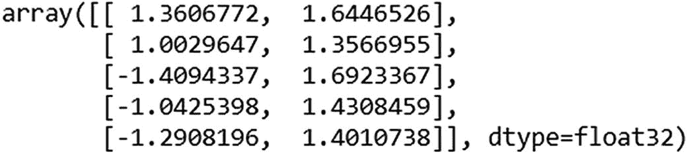

```py
# User matrix
model.get_weights()[0]

```

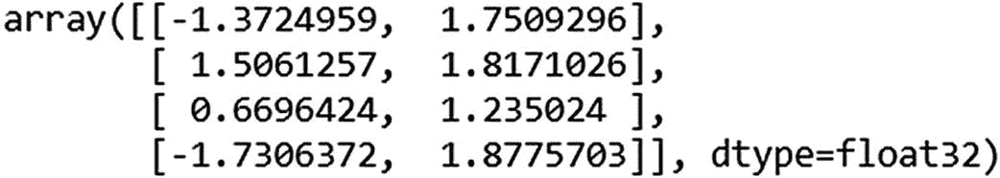

```py
# Movie matrix
model.get_weights()[1]

```

## 在 R 中实现矩阵分解

虽然矩阵分解可以使用`kerasR`包来实现，但我们将使用`recommenderlab`包(与我们用于协同过滤的包相同)。

下面的代码实现了 R 中的矩阵分解(可作为“矩阵分解”使用。github 中的 r”)。

1.  导入相关包和数据集:

    ```py
    # Matrix factorization
    t=read.csv("D:/book/Recommender systems/movie_rating.csv")
    library(reshape2)
    library(recommenderlab)

    ```

2.  数据预处理:

    ```py
    t2=acast(t,critic~title)
    t2
    # Convert it as a matrix
    R<-as.matrix(t2)
    # Convert R into realRatingMatrix data structure
    # RealRatingMatrix is a recommenderlab sparse-matrix like data-structure
    r <- as(R, "realRatingMatrix")

    ```

3.  Use the `funkSVD` function to build the matrix factors:

    ```py
    fsvd <- funkSVD(r, k=2,verbose = TRUE)

    p <- predict(fsvd, r, verbose = TRUE)
    p

    ```

    Note that the object `p` constitutes the predicted ratings of all the movies across all the users. The object `fsvd` constitutes the user and item matrices , and they can be obtained with the following code:

    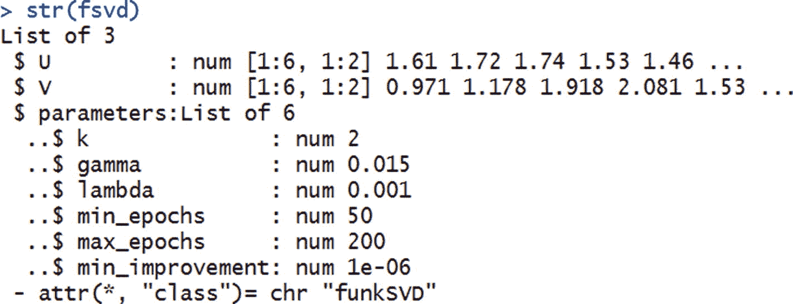

    ```py
    str(fsvd)

    ```

因此，用户矩阵可通过`fsvd$U`访问，项目矩阵可通过`fsvd$V`访问。这些参数是我们在第 [7](07.html) 章中了解到的学习率和纪元参数。

## 摘要

在本章中，您学习了以下内容:

*   用于提供推荐的主要技术是协同过滤和矩阵分解。
*   就大量的计算而言，协同过滤是非常禁止的。
*   矩阵分解的计算量较小，并且通常提供更好的结果。
*   在 Excel、Python 和 R 中构建矩阵分解和协作过滤算法的方法