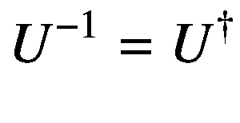
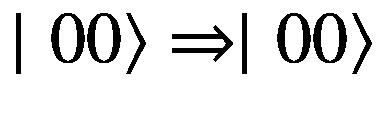
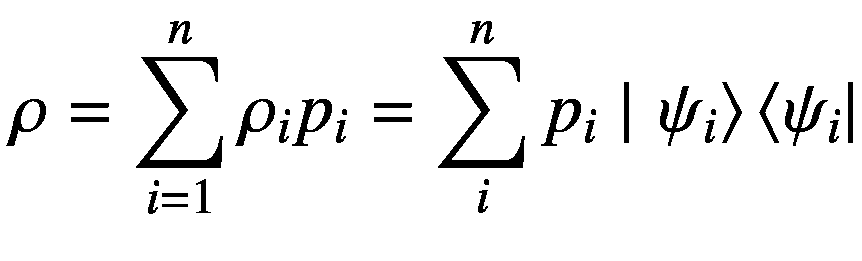

# 一、量子机器的崛起：基础

> 小智慧就像玻璃杯里的水:清澈、透明、纯净。大智慧就像大海中的水:黑暗、神秘、不可渗透。
> 
> —罗宾德拉纳特·泰戈尔

1983 年 4 月 14 日，洛斯阿拉莫斯实验室庆祝成立四十周年。物理学奖得主理查德·p·费曼(Richard P. Feynman)在题为“遵守量子力学定律的微型计算机”的演讲中指出，基于经典逻辑的计算无法轻松有效地处理描述量子现象的计算。他提出了他对能够以量子方式运行的计算的设想。在做出这些历史性的评论之前，费曼一直是计算机利用量子力学定律的思想倡导者，他说，“底部有足够的空间”和“自然不是经典的”。如果你想对自然进行模拟，你最好把它做成量子力学，”这意味着要正确地模拟量子系统，你必须使用量子计算机。

量子计算是在量子模拟的背景下发展起来的，人们努力建造遵循量子力学定律的计算设备。加州理工学院于 1999 年发布了约翰·普雷斯基尔教授关于量子计算的讲稿供公众查阅[1]。随后，人们对这个令人兴奋的领域越来越感兴趣，这个领域有望成为物理学定律与应用技术实践相结合的奇点。

文献中对*量子计算机*有各种定义。就本书的一般目的而言，量子计算机是一种计算设备，其计算过程可以用量子理论的定律明确描述。为什么我们期望量子计算机比经典计算机更有优势？这是因为传统计算机固有的构造方式。将传统计算机的能力加倍，需要两倍的电路和相关的门电路来解决问题。相比之下，每次只添加一个量子位，量子计算机的能力就可以提高大约一倍。

## 这本书是如何组织的

前三章提供了对量子力学科学和经典机器学习技术相结合的见解，这将成为经典信息技术力量与物理力量相遇的奇点。后续章节对各种量子机器学习算法、量子优化和高级 QML 算法的应用(例如，HHL、量子退火、量子相位估计、优化、量子神经网络)进行了系统、结构化的研究。这本书最后讨论了先进的研究领域，如量子行走，哈密顿模拟，和量子升压。

一切都辅以当今行业和研究中常用的开源库的实践练习，如 Rigetti 的森林和 QVM，谷歌的 tensor flow Quantum(2020 年 3 月发布)，以及 Xanadu 的 PennyLane，并附有实现说明。在适用的情况下，讨论了访问与特定算法相关的量子计算和机器学习生态系统的各种选项。这本书附有练习中使用的所有代码示例。这些代码将定期更新，以跟上该领域的进展，并可从以下网站下载: [`https://www.apress.com/de/book/9781484270974`](https://www.apress.com/de/book/9781484270974) 。

## 量子计算的本质

现代计算机是建立在处理信息的电子电路基础上的物理设备。算法，即计算机程序或软件，是我们操纵这些电路来执行我们想要的计算并获得其输出的管道。这些计算设备的物理过程涉及电子、原子和分子等微观粒子，可以用电路电特性的宏观经典理论来描述。

如果光子、生物 DNA、电子和原子等非常小规模的系统被直接用于处理相同的信息，这将涉及使用一套特定的数学结构，与我们现有的经典计算案例中的结构不同。这个被称为*量子理论*的数学框架被用来捕捉这样一个事实，即大自然的行为与我们的直觉告诉我们的非常不同。量子理论自二十世纪初发展以来，一般来说是小尺度物理最全面的描述。

当考虑数字计算和通信的基础时，人们通常会想到二进制数字或位。一个比特在任何时候都可以是 0 或 1，就像我们桌子上的硬币可以是正面也可以是反面一样。量子计算机使用*量子比特*，或*量子比特*，它们在任何给定的时间可以是 0 或 1，或者处于两种状态(称为*叠加态*)。这就像抛硬币一样；当硬币在空中旋转时，它肯定不会显示正面或反面；我们可以认为它是一个*叠加*(将在本章后面以及第四章中进一步阐述)。

这允许某些操作并行运行，而不是顺序运行，这意味着它们以指数方式减少了某些算法中所需的操作数量。因此，它们并不是普遍更快(即，每个操作本身仍然需要相同的时间来完成)，这意味着在量子计算机(QC)上浏览互联网、编写 Word 文档或播放视频不一定更快。这就是为什么量子计算机无法取代日常使用的标准经典计算设备。

量子计算机到底有什么优势？一个例子在分子模拟领域很有用。为了模拟具有 42 个原子的青霉素分子，电子配置的指数大参数空间将需要 10 个 <sup>86 个</sup>状态，这比宇宙中的原子数目还多；量子系统只用 286 个量子比特就可以做到这一点。在经典系统中，模拟一个咖啡因分子需要 10<sup>48</sup>比特，这大约是地球上原子的 5 %- 10%。一个量子系统只需要 160 个量子位元就可以执行相同的任务。

作为另一个例子，假设我们想在一台 64 位计算机上做一些“简单”的事情:在一台“快速”的经典计算机上，一直添加数字 1，直到 64 位寄存器溢出。你可以合理地估计，一台现代的“快速”计算机每秒可以执行 20 亿次+1 加法；但是，按照这种速度，为了完成使寄存器溢出的任务，计算机要运算大约 400 年，因为它是一点一点地增加的。然而，一台 64 量子位量子计算机可以同时拥有所有这些数字 0 到 2 64 T1 T2 T3！如图 1-1 所示。每一台经典计算机都可以用量子物理学的原理完全描述，但反过来就不正确了。


图 1-1

经典计算与量子计算

许多公司和联邦机构都采用了质量控制。谷歌、IBM、Xanadu、Rigetti、D-Wave 和许多其他公司都在争夺“量子霸权”。众所周知，空中客车公司举办了一场量子计算竞赛，以解决航空航天业中长期存在的计算挑战。D-Wave 的 2000Q 型量子退火计算机安装在美国宇航局、 <sup>1</sup> 谷歌和 USRA(大学太空研究协会)。

QC 时代正在到来，也许比许多人想象的要快得多。随着这个时代的到来，随着世界各国政府继续投资于这项诱人的未来技术，更广泛的工业机构也意识到了一个日益严峻的挑战:合格和训练有素的劳动力。质量控制的基础是跨职能的，需要物理、数学和编码。这一领域的发展需要在人员发展方面的投资，需要大学和学术机构承诺为感兴趣的学生开设越来越多的相关课程。

这本书从现有的机器学习算法和研究人员目前正在研究的算法中汲取灵感、激情、算法和框架。附录涵盖了一些数学背景作为参考，如张量积和傅立叶变换。

### 量子位

量子位或*量子位*是一个两级量子力学系统，由量子态表示。任何可以在两种离散状态下测量的量子粒子都可以被用作量子位；例如，俘获的离子，如单个钙离子(使用电磁场限制在光腔中)、极化的光子和电子自旋。

量子位类似于经典计算系统中的经典位。两者之间的基本区别是，在经典系统中，一个比特可以取值 0 或 1，而量子比特可以取值∣0⟩和∣1⟩之间的一整套值，代表状态的*叠加*，如图 1-4 所示。在量子力学中，通常使用竖线和尖括号将抽象复向量空间的元素 *ψ* 表示为 *ket* ∣ *ψ* ⟩，并将它们称为 *kets* 而不是向量。

### 量子位的状态

经典位的状态是数字(00 或 11)，量子位的状态是二维向量空间中的向量。这个向量空间也被称为*状态空间*。量子系统的*状态*由一个矢量∣ *ψ* ( *t* )⟩给出，它包含了系统在任何给定时间的所有可能信息。向量∣ *ψ* ( *t* )⟩是希尔伯特空间的成员(稍后描述)，并且可以是时间变量(即，可以随时间改变)。在量子力学中，通常将状态规范化(即，找到一种方法来设置内积⟨ * ψ * | * ψ * ⟩ = 1)。图 1-2 显示了一个量子位的量子态的二维表示。

图 1-2 中的两个上图显示了如果基础状态是∣0⟩和∣1⟩.时向量的位置请注意，向量的顶部是常规 x 轴或∣0⟩轴上的位置，底部是常规 y 轴或∣1⟩.上的位置最上面的两个图显示了州∣0⟩以及∣0⟩和∣1⟩.的州向量量子位读取∣0⟩的输出的概率为 1(或 100%)，反之亦然


图 1-2

用于量子计算的二维量子态

如果我们假设一个量子比特态是由∣ *ψ* ⟩给出的，那么 *α* 和 *β* 的*平方*分别是∣ *ψ* ⟩分别在∣0⟩和∣1⟩被发现的个体概率，并且 *α* 和 *β* 的平方之和为 1，其中 *α* 和 *β* 被称为换句话说，有 100%的可能性出现这样的结果，∣是∣0⟩或者是∣1⟩，并且这种结果的概率总和是 1。图 1-2 的底部图示出了一个例子，∣0⟩操纵量子态 0.8，∣1⟩操纵量子态 0.6，分别转化为 36%和 64%的概率。

### 布洛赫球

布洛赫球是量子位状态空间的三维几何表示，作为虚拟单位球表面上的点。这是表示量子位的两种方式之一。另一种方式是用狄拉克符号表示量子位。简而言之，布洛赫表示采用二维(2-D)图形表示，并以三维表示来描述它，量子位的状态由球体上的一个点来表示，如图 1-3 所示。


图 1-3

布洛赫球

图 1-3 中布洛赫 <sup>2</sup> 球面的角度 *ϕ* 称为*方位角*角，从正 x 轴到状态∣ *ψ* ⟩在*x*y*y*平面上的投影测量。角度 *θ* 被称为*极角*，是从正 z 轴到代表∣ *ψ* ⟩.的布洛赫向量的距离

布洛赫球允许概率中出现负数和复数。在量子信息处理中通常使用的单个量子位的操作可以在布洛赫球描述中完全描述。布洛赫球对于解释量子门特别有用。我们前面的例子和相关讨论中使用的概率( *α* 和 *β* )可以换成表示状态所在球面上的振幅或纬度。量子计算中的态可以表示为一个向量，它从原点开始，到单位布洛赫球的表面结束。通过对状态向量∣ *ψ* ⟩应用酉运算(稍后描述)，它可以围绕图 1-3 中的球面旋转和移动。按照惯例，球体的两极分别取为球体顶部 *z* <sub>+</sub> (或北极点)的∣0⟩和球体底部*z*<sub>-</sub>(或南极点)的∣1⟩。在经典极限中，一个量子位元可以在布洛赫球上的任何地方拥有量子状态，但它会缩减为经典位元，只能在两极找到。

量子计算中使用的*线性代数*符号可能需要快速介绍。在量子力学中，向量用保罗·狄拉克发明的狄拉克符号来表示。在狄拉克符号中，标识矢量的符号写在一个 *ket* 内，例如，矢量或*T6a*在量子力学中写成∣ * a * ⟩.向量 *a* 的对偶向量用 *bra* 表示，写成⟨ * a * |。他们的内积写成 *bra-kets* 。换句话说，两个向量∣*ψ*t21】1⟩和∣*ψ*T25】2⟩之间的内积由⟨*ψ*t29】1|*ψ*t33】2⟩给出，结果类似于向量代数的*点积*。另一方面，两个向量| * ψ * <sub> 1 </sub> ⟩和| * ψ * <sub> 2 </sub> ⟩的外积在 Dirac bra-ket 符号中给出|*ψ*<sub>1</sub>⟩⟨*ψ*<sub>2</sub>|并且它产生一个维数为 *m* × *n* 的矩阵两个向量|*ψ*t75】1⟩和|*ψ*t79】2⟩称为*正交*如果⟨*ψ*t85】1|*ψ*t89】2⟩= 0。

### 可观测量和算子

在量子计算中，对于任何一个动态变化的、物理上可以作为量来测量的变量 *x* ，都有一个对应的算符。操作员本质上是隐士。它由向量空间中的正交特征向量基组成。特征向量的定义包含在附录中。

### 希尔伯特空间

从数学的角度来看，向量∣ *ψ* ⟩是定义了内积的完备向量，是一类称为*希尔伯特空间*的向量空间的元素，用表示。本书中提到的向量空间包括实数和复数空间，并且是有限维的，这简化了处理 QC 所需的数学。由于是有限维的，可以选择一个基将这个基中的向量表示为有限列向量，用有限矩阵表示算子。对于某个正整数 *n* ，量子计算感兴趣的希尔伯特空间通常具有 2 <sup>* n *</sup> 维。一个*量子位*状态的数学表示存在于一个 2 维的希尔伯特空间中。原则上*，*量子系统的状态向量可以是任意维的希尔伯特空间的元素。在本书中，让我们考虑*有限维*希尔伯特空间。

当在量子系统中执行计算时，固定一个基并将其称为*计算基*通常是方便的。在此基础上，我们使用长度为 *n* 的二进制字符串将狄拉克符号中的 2<sup>T3】nT5】基向量标记如下。</sup>


(1.1)

在等式 1.1 中， *n* 是指二进制字符串的长度。

希尔伯特空间由一组向量 *ψ* 、 *ϕ* 、 *φ* 组成...以及 *a* 、 *b* 、 *c* 、。。，它展示并遵循四个属性。

1.   **是线性空间**。线性向量空间由两组元素和两个代数规则组成。
    1.  一组向量 *ψ* ， *ϕ* ， *φ* ...以及 *a* 、 *b* 、 *c* 、。。

    2.  向量加法规则和标量乘法规则。

2.  ****中的标量积是严格正的**。**

***    **是可分的**。

     *    **完成**

     **

 **如果你对希尔伯特空间的进一步讨论感兴趣，试试 R. Shankar (Plenum，2010) [2]的*量子力学原理*。

量子计算和量子机器学习最重要的两个基础是*叠加*和*纠缠*。让我们快速浏览一下这两者的基本原理，然后在我们浏览书中各种例子时进一步展开，在这些例子中，每个属性都被利用了。

一般来说，如果一个算子满足下列关系，就说它是线性的。


(1.2)

### 衡量

与经典物理学相比，量子力学中的测量具有挑战性。在经典世界中，测量是简单的，并且被假定为不影响其参数或特征被测量的项目；例如，我们可以自由地测量一个球的重量，然后测量这个球的周长，并确信另一次测量这个球的重量会得到同样的结果。

在量子世界中，任何给定量子态的测量都会导致相应波函数的坍缩。根据量子力学的假设，一个物理变量必须有真实的*期望值*和*特征值*。这意味着代表物理变量的算子具有特殊的性质。通过计算物理变量期望值的复共轭，可以看出物理算符是它们自己的厄米共轭ℍ<sup>= ℍ.自身为埃尔米特共轭的算子称为*埃尔米特算子*。</sup>

根据量子力学的假设，作为动态变量的测量的可能结果的结果是应用于状态 *ψ* 的线性厄米算符 *A* 的本征值*A*T3*n*T6】。在这种情况下，厄米算符是可观测的，例如粒子的可观测位置向量。获得∣0⟩或∣1⟩的概率与量子位在测量基础上的投影有关。厄米共轭可以用作数学工具来计算一个状态到另一个状态的投影。

埃尔米特复数的一个性质是:一个数的共轭或共轭*υ*T2， *υ* 是这个数的复共轭*υ*t8】⋆:*υ*T12=*υ*t16】⋆。厄米算符的另一个性质是它们的特征值是实数，这有助于测量某些物理性质。测量的结果保证是一个特征值，比如说，被观察系统的 *λ* 。测量结果由*投影操作员 P* 描述。 *P* 在性质上是埃尔米特，因此根据埃尔米特算子的定义*P*=*P*<sup>+T29】，等于其自身的平方:*P*<sup>2</sup>=*P*。</sup>

按照量子力学的假设，量子系统被测量后，描述该状态的波函数会坍缩。因此，尽管在之前的系统状态*，测量可能是基础的叠加。但是，*在*测量完成后，系统坍缩到对应于测量结果的基态。数学上，如果测量前的原始状态是∣ *ψ* ⟩，则测量后系统的状态∣*ψ*t8】′⟩由下式给出*


(1.3)

投影测量也可以用一个*可观测值*来描述，它是一个埃尔米特算子 *A* 作用于系统的状态空间。由于 *A* 是厄米的，它的*谱分解*由下式给出


(1.4)

其中*A*<sub>T3】IT5】为 *A* 的特征值 *P* <sub>*i*</sub> 为 *A* 的特征空间上的正交投影。在这种情况下，执行投影测量与测量关于分解的可观测值*I*=∑*P*<sub>*I*</sub>相同，其中特征值 *a* <sub>*i*</sub> 对应于第 *i* 个测量结果。</sub>

*谱分解*定理(SDT)告诉我们，对于作用在有限维希尔伯特空间上的每一个正规算子 *T* ，都有一个由 *T* 的特征向量∣ * T * <sub> * j * </sub> ⟩构成的的正交基。换句话说，属于某个向量空间的算子 *T* 相对于该向量空间的某个基具有对角矩阵表示。这个结果被称为谱分解定理。假设算子 A 满足某种基的谱分解定理。根据 SDT，我们总是可以对角化有限维中的正规算子。从线性代数中我们知道，对角化可以通过将基变换为由特征向量组成的基来实现。基的改变是通过将运算符 *T* 与酉运算符共轭来完成的。假设一个算子 *T* 带特征值 *T* <sub>* j *</sub> 满足谱分解定理对于某些基∣*v*<sub>*j*</sub>⟩.然后，SDT 的运算符 *T* 由下式给出


### 叠加

叠加原理是量子物理学的基础。该原理指出，量子系统的状态可以叠加，以形成几个状态的组合，例如经典物理中的波，以形成相干量子状态，该状态是与其组成状态分离且不同的状态。因此，尽管一个量子位可以存在于∣0⟩状态或∣1⟩状态，它也可以存在于∣0⟩状态和∣1⟩.状态的线性组合状态因此，如果一个量子位状态由∣ *ψ* ⟩给出，那么这个量子位的叠加态可以写成


(1.5)

其中 *α* 和 *β* 是复数，称为量子位状态的*振幅*。

设想叠加原理的最简单的方法是想象一束光经过一个偏振滤光器，这个滤光器会使光垂直偏振，比如说，在∣0⟩.状态下现在考虑第二偏振器，其轴*水平*于从第一偏振器出射的垂直偏振光束(即，强制*水平偏振*)；在这种情况下，不再有任何光从第二偏振器射出。这是因为水平偏振轴与垂直偏振轴成 90 度<sup>∘</sup>，光束通过第一偏振滤光器已经具有垂直偏振轴，这加强了水平状态。在我们的例子中，根据等式 1.5 ，水平状态是∣1⟩.状态状态∣1⟩与垂直偏振光正交，并且两个偏振器抵消出射光的剩余部分，从而完全不给出任何东西。现在，如果第二个偏振镜的轴倾斜到另一个角度，比如 30 度 <sup>∘</sup> ，那么我们将有一些光从整个装置中射出。

在另一个例子中，我们考虑一个原子量子位，它是基于一个呈现上下自旋并受磁场影响的电子。电子*不是传统意义上的自旋*；*自旋*这个词描述了它的*角动量*，可以量子化表示向上或向下(1 或 0)。在我们测量量子位以查看它是 0 还是 1 之前，它处于叠加状态，这意味着它可以是 0 或 1 的一部分，或者换句话说，像 0-37%，1-63%这样的加权组合(参数 *α* 和 *β* )。物理学家还没有开发出自旋背后的物理现实的可视化。但是他们可以用数学方法描述自旋，并在实验室实验中预测其行为。

在任何给定的时刻，量子位可能会以某种比例的自旋偏向 1 或 0。只有当我们测量量子位时，它才会坍缩成一个确定的状态，∣0⟩或∣1⟩，如图 1-4 所示。


图 1-4

量子叠加和测量效应——当测量到一个离散的状态时，叠加就崩溃了

∣0⟩和∣1⟩可以用列向量的形式表示如下。


和


因此，通过取 0 和 1 路径的状态向量的线性组合来描述叠加，因此一般路径状态由类似于等式 1.5 的向量来描述。


(1.6)

如果量子位(例子中的光子或电子)被物理测量以查看它当前在哪个路径中，我们以概率| *α* | <sup>2</sup> 在路径 0 中找到它，并且以概率| *β* | <sup>2</sup> 在路径 1 中找到它。最后，因为我们应该在*中找到光子，正好一个路径*，从概率的角度来看，我们必须有，


(1.7)

等式 1.7 也被称为*玻恩法则*【3】的数学表示。

如果你有兴趣了解更多关于叠加态的知识，可以参考 Nielsen & Chuang [3]的《量子计算与量子信息》一书。

### 纠缠

纠缠是多个量子系统之间关联的一个特例。这种性质在古典世界中是没有类比的。当两个(或更多)粒子，例如两个光子或两个电子，处于纠缠态，并且对它们中的一个进行测量时，那么该测量可以立即影响对其他粒子的相同测量的行为，*与它们之间的物理距离*无关。这种现象的非直觉性质是如此奇怪，以至于阿尔伯特·爱因斯坦称之为“幽灵般的超距作用”，因为还没有关于它为什么会发生的已知解释。当我们测量一个量子位元时，测量的行为会瓦解它的状态，同时瓦解其他纠缠量子位元的状态。


图 1-5

测量单个量子位会导致它的叠加态崩溃一个确定的状态，从而导致所有其他纠缠的量子位崩溃

如图 1-5 所示，这种现象使我们能够推断出其他纠缠量子位的状态，无论它们之间的物理距离有多远。纠缠的量子比特成为一个具有单一量子态的系统。

## 量子算符和门

像经典的可逆门一样，量子门在逻辑上是可逆的，但是它们在普适性上有显著的不同。最小的通用经典可逆门必须使用三位，而最小的通用量子门只需要使用两位。一些通用的经典逻辑门，如 Toffoli 门，提供了可逆性，可以直接映射到量子逻辑门。量子逻辑门由酉矩阵表示。任何作用于二维量子系统或一个量子比特的幺正算符被称为*单量子比特量子门*。在量子电路模型中，逻辑量子位沿着*线*传输，量子门作用于这些量子位。一个作用于 *n* 量子位的量子门通过 *n* 线将输入量子位传送给它，其他 *n* 线将输出量子位带离量子门。因此，量子门可以由具有正交行的 2<sup>*n*</sup>×2<sup>×2*n*</sup>矩阵来表示。单量子位门如哈达玛门用 2 × 2 矩阵表示。

在数学上，一个运算符被描述为一个规则，当它被应用到由一个 *ket* 描述的一个状态时，比如∣ * ψ * ⟩，它就被转换成在同一空间中的另一个 ket，比如∣*ψ*T7】’⟩；当同一个操作符应用于一个*胸罩*时，它输出另一个胸罩。

和

这本书突出了一些基本的量子门，相关的矩阵，和算子，如酉，泡利，交换，等等。强烈建议您学习更多关于运算符和门的知识[3]。

### 标识运算符

*恒等运算符*，通常用 *I* 表示，是一个对角元素全为 1，其余元素全为 0 的方阵。因此，单位矩阵在数学上可以定义为


(and)   and

*I*<sub>T3】nmT5】= 0，当*n*≦*m*1.9</sub>

下面是一个 2 × 2 单位矩阵的例子。


### 酉算子

如果一个算子与它自己的伴随算子相乘时产生一个单位矩阵作为输出，则该算子被认为是酉的。酉算子有一个与其共轭算子相等的逆算子。

算子 *U* 的逆用*U*T4】1 表示。这满足以下关系。


(1.10)

其中 *I* 是恒等运算符。

为了使 *U* 成为一体，


(1.11)

和



(1.12)

*酉变换*将一种基中的算子矩阵变换为另一种基中的同一算子的表示。例如，对于二维矩阵，从∣ *r* <sub>*i*</sub> ⟩到∣*e*<sub>*I*</sub>⟩的基的变化由下式给出


值得注意的是，量子进化的酉性意味着量子操作*是可逆的，*除了那些用于测量的算符。这种可逆性是把注意力限制在封闭系统上的结果。任何不可逆的经典计算都可以被可逆的经典计算有效地模拟。量子计算也是如此。

### 矩阵和门的泡利群

泡利矩阵组是一组单量子位量子算符，它产生泡利*门*(应用于量子电路)，并跨越所有单量子位算符形成的向量空间。泡利门在量子计算中的重要性是巨大的，因为任何单量子位酉算符都可以表示为泡利门的线性组合。

认为有四种不同的泡利算符，包括恒等算符(但有些作者省略了恒等算符)。在各种文献中有许多不同的符号用来描述泡利算符。在本书中，出于上下文的考虑， *I* 、 *X* 、 *Y* 和 *Z* 被一致使用。然而，出于完整性的原因，提到了所有的符号，因为泡利算符是在计算的基础上定义的。

 

 

有趣的是，NOT 门通常等同于 Pauli X 门，因为两者具有相同的矩阵表示和相同的基矢效应(即，它们反转基矢)。例如，零状态的列符号是


如果你将音符或 X 门应用于它，你有


(1.14)

类似地，x 运算符应用于∣1⟩时，会将其反转为∣0⟩，产生与非门相同的效果(因此，x 门也被称为*位翻转*门)。我们鼓励您验证这一点。

*Z* 算子也被称为*相位翻转算子*，因为它的作用是将状态向量围绕 Z 轴旋转 *π* 弧度或 180 度。泡利门 X、Y 和 Z 分别对应于绕布洛赫球的 X、Y 和 Z 轴的旋转。

### 相位门

相移运算器或旋转门使状态∣0⟩保持不变，但将∣1⟩状态旋转一个定义的角度或相位 *θ* 。


(1.15)

利用*欧拉恒等式*在 1.15 中，如果我们设 *θ* = *π* ，我们恢复泡利 Z 门是因为*e*<sup>*Iθ*</sup>= cos(*π【T15)+*I*。*sin*(*π*)= 1。*

如果我们在方程 1.15 中代入 *θ* = *π* /2，则得到*e*<sup>*Iθ*</sup>=*I*，进而给出另一个叫做 *S* 的算子。


(1.16)

其中 *S* 操作器将原始状态绕 z 轴旋转 90 <sup>∘</sup> 或弧度。

t 操作符将原始状态绕 z 轴旋转 45 <sup>∘</sup> 或 *π* /4 弧度。T 门也被称为 *π* /8 门，因为 *e* <sup>*iπ* /8</sup> 可以被分解，留下绝对相位为| *π* /8|的对角线分量。


(1.17)

关于旋转类型和参数化门的更详细的讨论可以在 Nielsen 和 Chuang 的教科书中找到[3]。

### 笛卡尔旋转门

之前，您看到了几个相位门的属性。以下是 QC 和 QML 中常用的一些附加旋转门表示。


(1.18)


(1.19)


(1.20)

### 哈达马德门

哈达玛门创造叠加态。哈达玛门具有以下矩阵表示。


(1.21)

它将计算基础状态映射如下。

![$$ H\mid \left.0\right\rangle =\frac{1}{\sqrt{2}}\left(\begin{array}{cc}1&amp; 1\\ {}1&amp; -1\end{array}\right)\left(\genfrac{}{}{0pt}{}{1}{0}\right)=\frac{1}{\sqrt{2}}\left[\left(\genfrac{}{}{0pt}{}{1}{0}\right)+\left(\genfrac{}{}{0pt}{}{0}{1}\right)\right]=\frac{1}{\sqrt{2}}\left(|\left.0\right\rangle +|\left.1\right\rangle \right) $$](img/502577_1_En_1_Chapter_TeX_Equy.png)

(1.22)

同理，。该操作将量子位状态旋转 *π* 弧度或 180 度，围绕*x*T5】z 平面中的轴对角线。

哈达玛门的另一个性质是它是自逆的(即*H*=*H*<sup>—1</sup>)；因此，

![$$ H\left[\frac{1}{\sqrt{2}}\Big(|\left.0\right\rangle +\left|\left.1\right\rangle \right)\right]=\mid \left.0\right\rangle $$](img/502577_1_En_1_Chapter_TeX_Equz.png)

和

![$$ H\left[\frac{1}{\sqrt{2}}\Big(|\left.0\right\rangle -\left|\left.1\right\rangle \right)\right]=\mid \left.1\right\rangle $$](img/502577_1_En_1_Chapter_TeX_Equaa.png)

(1.23)

该操作相当于应用一个 *x* 门，然后绕 Y 轴旋转。

### CNOT 门

CNOT 门，也被称为*受控非*门，是一个两量子位门。量子计算中的*控制*门涉及使用*控制*或 C 量子位作为第一个输入量子位，第二个量子位作为目标量子位。CNOT 门的第一个输入充当控制量子位:如果控制量子位处于∣0⟩状态，则该门不对目标量子位做任何事情；但是如果控制量子位的状态是∣1⟩，那么 gate 对目标量子位应用 NOT 或 *X* 运算符(等式 1.14 )。换句话说，在量子计算领域，CNOT 门迫使两个量子位纠缠在一起。

CNOT 门可能的输入状态如下:∣00⟩、∣01⟩、∣10⟩、∣11⟩.CNOT 门对这些状态的作用如下。




CNOT 门的电路表示如下


受控 CNOT 门的矩阵表示由下式给出


(1.24)

CNOT 的外部产品表示是


(1.25)

CNOT 门对于制备纠缠态是有用的。它是自伴的；第二次使用它会逆转它的效果。

### 交换门

*交换*门也是两量子位门。一个*交换*操作符反转输入量子比特状态中比特的状态。例如，它可以接收∣10⟩，并将其反转为∣01⟩. *SWAP* 运算符由以下矩阵表示。


(1.26)

### 密度算子

在本书遇到的其他算子中，最后一个重要的算子是*密度算子*。在一个封闭的纯量子系统中，很容易计算出找到某个状态∣ *x* ⟩.的概率是其振幅| *α* | <sup>2</sup> 的平方(参考方程 1.7 )。一个*纯*单态∣ *ψ* ⟩的密度算符由其外积给出。


(1.27)

一个*纯*系统*唯一*的密度算符的平方的迹为 1:*Tr*(*ρ*T8】2)= 1

如果一个封闭的纯系统的密度依赖于时间，那么密度算符的时间演化就幺正算符而言由下式给出


(1.28)

但是，在混合量子系统存在*统计分布的环境下(例如系统-1 的 *n* <sub>1</sub> 和系统-2 的 *n* <sub>2</sub> )，密度算符的一般描述可以解释这样一个混合物的性质。这是通过首先为每个状态制定密度算符，对这些状态应用适当的权重，然后总结所有的可能性来完成的。*

于是，让∣*ψ*T2】T3】It5】⟩代表混合量子系统中系综的 *n* 个可能态，其中 *i* ∈ {1... *n* }，而 *p* <sub>*i*</sub> 是某成员处于相应状态的概率∣*ψ*<sub>t21】I</sub>⟩.因此，在这种情况下，整个混合量子系统的密度算符由下式给出



(1.29)

密度算子是厄米算子(即*ρ*=*ρ*<sup>；密度算子的迹是 1)，并且密度算子对于任何状态向量总是正的。</sup>

## 哈密顿函数

系统的哈密顿量是量子力学、量子计算和量子机器学习中最重要的概念之一。量子优化、机器学习、变分算法中一些最重要的算法都依赖于哈密顿量。一个*哈密顿量*就是一个系统的总能量。它提供了经典力学和量子力学之间的物理联系。每个系统都有自己的哈密顿函数。决定系统如何随时间演变的是这个函数的*形式*，而不是这个值。哈密顿算符是量子力学中应用最广泛的算符之一。因此，理解构造哈密顿函数的过程在 QML 是非常重要的，正如你在后面的章节中看到的。

## 系统的时间演化

物理隔离或“封闭”量子系统的时间演化由薛定谔方程给出如下。


(1.30)

其中 *H* 是系统的*哈密顿量*。由于哈密顿量对应系统的总能量，量子系统可能的能量已经由算符 *H* 的本征值给出。时间 *t* 之后的系统状态由下式给出


(1.31)

而系统量子态的时间演化由*么正算符*描述。


(1.32)

## 不克隆定理

1982 年，Wootters 和 Zurek [4]推导出了现在所知的*不可克隆定理*，这是量子系统最基本的属性之一。这表明不可能创造一个属于特定希尔伯特空间的任意量子系统的*精确完美的*副本。与经典计算机相比，这增加了对量子计算机编程的挑战。因此，根据不可克隆定理，没有有效的量子操作可以将任意状态∣ *ψ* ⟩映射到∣ *ψ* ⟩ ∣ *ψ* ⟩.

## 忠诚

保真度是量子系统中一个状态与另一个状态“有多接近”的量度。保真度被描述为两个量子分布之间的统计混合或重叠量。

与经典系统不同，一般来说，要区分两个量子位元序列是不可能的，除非它们彼此正交。因此，如果两个状态不正交，则对这两个状态进行投影测量是没有意义的。该属性将度量限制为作为正运算符值度量或 POVM 进行。保真度是两种不同状态的可区分性的度量，给出了区分这两种状态的最佳度量。

保真度衡量两种状态之间的重叠。因此，如果*ρ*<sub>1</sub>=∣*ψ*⟩⟨*ψ*和*ρ*<sub>2</sub>=∣*ϕ*⟩⟨*ϕ*|是两种不同分布的密度算子，则系统的保真度由下式给出

![$$ \mathcal{F}\left({\rho}_1,{\rho}_2\right)= Tr\left[\sqrt{\sqrt{\rho_1}{\rho}_2\sqrt{\rho_1\ }}\right]=\left|\left\langle \phi \right|\left.\psi \right\rangle \right| $$](img/502577_1_En_1_Chapter_TeX_Equao.png)

(1.33)

等式 1.33 暗示|⟨*ϕ*|*ψ*⟩|<sup>2</sup>是系统处于状态∣ *ϕ* ⟩的概率，已知它已经处于状态∣ *ψ* ⟩.

以下是保真的基本属性。

1.  两个纯态的保真度在{0，1}范围内的自变量中是对称的(即)。

2.  Fidelity is invariant when a unitary operator acts on it.

    

    (1.34)  
3.  保真度等于 1 当且仅当*ρ*<sub>1</sub>=*ρ*<sub>2</sub>。

4.  Tensor product of the density operators for fidelity is given by

    

    (1.35)  

## 复杂性

问题的*复杂度*是指对问题类别的研究，比如 NP-hard 或者 PSPACE。计算练习涉及从算法和计算时间的角度使用资源来解决特定的问题。为了估计总的计算成本等等，您需要分析运行算法(在计算系统上)所需的资源，这是解决问题所需要的。

问题可以是任何计算问题；例如，使用一系列图像对猫和狗进行分类。为了解释这两种动物之间的区别，我们可以将猫和狗的大小和形状定义为约束或标签。然后我们选择一种算法，它通常独立于硬件，来为我们完成这项工作。当我们运行该算法时，它需要两个主要的计算资源:运行时间和内存。

计算机运行一个算法的时间就是该算法在特定计算平台上的运行时间。根据经典计算的基本原理，通过验证数据库中的项目直到找到一个期望的项目，可以获得数据库搜索目标的解决方案。这个练习需要时间复杂度为 *O* ( *n* )的最坏情况场景。

量子复杂性理论[5]试图回答量子计算机相对于经典计算机在运行时的加速和效率问题。在本书中，*复杂度*一词指的是量子系统的渐近运行时复杂度。第二章第二章和第三章第五章详细阐述了复杂性。

## 格罗弗算法

最初，Grover 的搜索算法是为了在没有重复元素的非结构化环境中，在量子数据库中对特定元素进行无序搜索而创建的。在以随机顺序存储元素的数据库中找到特定元素的唯一方法是进行彻底搜索。Grover 的算法可以推广到搜索具有重复元素的数据库。Grover 的算法对于乘法常数也是最优的(即*不可能*提高其计算复杂度)。如果数据库由 *N* 元素{*x*T8】1，*x*T12】2 的数据库条目组成...、*x*<sub>*N*</sub>}，那么 Grover 的算法利用量子性质查询数据库次使用 *O* (log *N* )存储空间找到一个标记元素 *x* <sub>0</sub> 的概率很大。格罗弗算法可以用 *通用门*实现。从统计上来说，Grover 的算法大约需要一个的顺序来尝试在量子数据库中找到一个标记的对象。例如，如果位串是 4 位，那么在经典上下文中，搜索算法将需要 2<sup>4</sup>1 = 15 次尝试来正确标记条目；相比之下，格罗弗的算法需要次尝试。随着位串变得更大，Grover 算法提供的改进变得更加显著。

格罗弗的算法基于*振幅放大*，这是本书后面章节描述的一种技术。

为了解释格罗弗算法的机制，让我们考虑一个函数 *f* ( *x* )在空间中具有 *n* 个输入，其中*N*= 2<sup>= T9】N</sup>和 *x* = ∈ {0，1} <sup>*n*</sup> 。设函数 *f* ( *x* )使得 *f* ( *x* ) = 1，当且仅当*x*=*x*T30<sub>0</sub>对于特定的*x*T34】0。因此，


(1.36)

挑战在于用尽可能少的评估数找到 *x* <sub>0</sub> 。函数 *f* ( *x* )称为甲骨文 *x* <sub>0</sub> 称为*标记元素*。

在实践中，神谕可能被视为一个黑匣子，其内部机制的细节可能被忽略。oracle 被建模为一个门，它接受一个 *n* 位输入并产生一个 1 位输出。神谕是*不是一个有效的量子门*，因为它不是单一的和不可逆的。

首先，∣0⟩<sub>1</sub>⨂∣0⟩<sub>2</sub>⨂∣0⟩<sub>3</sub>的 *n* 输入状态...⨂∣0⟩<sub>*n*</sub>≡∣0⟩<sup>⨂*n*</sup>全部初始化为∣0⟩.

作为第二步，哈达玛门被应用于这些∣0⟩输入状态中的每一个，从而总共有 *H* <sup>⨂ *n*</sup> 门将每个∣0⟩ <sup>⨂ *n*</sup> 输入转换成叠加状态。如果∣ *ψ* ⟩是所有可能的∣ *x* ⟩的叠加态，那么


(1.37)

Grover 算法的应用利用 Grover 算子，也称为 Grover 扩散算子 *G* 。

Grover 算子由下式给出


(1.38)

格罗弗算法的实现涉及两个哈达玛门，每个门需要 *n* 次运算。酉门控制条件相移，尽管整体复杂度取决于应用，但是时间复杂度是有效的，因为每次迭代只需要一次调用。发现 Grover 算法高效到需要计算 *f* ( *x* )小于 *N* 次才能找到 *x* <sub>0</sub> 的地步。它按照的顺序求值，这是渐近最优的。与经典情境相比，这种量子情境在时间复杂度上有二次增益。

Grover 算法一般实现如下。

<colgroup><col class="tcol1 align-left"></colgroup> 
| **算法:格罗弗算法** |
| **输入**:*N*= 2<sup>T5【N</sup>和*f*；初始状态∣0⟩<sup>⨂*n*t13】</sup> |
| **输出** : *x* <sub>0</sub> 概率 |
| 第一步。应用 *n* + 1 个量子比特的二能级量子计算机 |
| 第二步。应用哈达玛门初始化叠加:*h*T2】⨂*n*t5】∣0⟩<sup>⨂*n*T9】。</sup> |
| 第三步。`for` 次`do`应用 Grover 运算符 *G* |
| 第四步。在计算的基础上测量系统。 |

图 1-6 显示了一个用五量子位电路实现 Grover 算法的例子。显示为绿色的 On 框表示如果测量，量子位的概率处于 On 状态。在这种情况下，它们开启的概率是 100%，除了中间的量子位，这是炫耀。如前所述，预言是按照渐近最优的顺序的评估。


图 1-6

代表五个量子位的 Grover 算法的电路。第一个登记处最初设在∣0⟩.方框中的 H 代表实现超级运算的 Hadamard 门。在这种情况下，预期迭代的顺序为，在模拟图像中表示为“Oracle”。[6]

## 肖尔算法

Shor 的算法是展示量子计算能力和重要性的基础。它可以用来分解质数，这意味着它可以在实际的量子计算机上破解加密代码(在本书写作时，一台足够大的量子计算机尚未建成)。

Shor 的有效因子分解算法由量子部分和经典部分组成。前一个是对所谓的*寻序问题*的基于量子的解决方案。因为这种算法隐藏了开创性的思想，它允许在步骤或门中分解大量的 *N* ，而不是最著名的经典方法，该方法要求渐近地，其中常数通常取为 0.9。


is a constant often taken as 0.9.


where

这意味着在经典(非量子)计算机上分解素数的最著名算法需要的时间量基本上与 *N* 的大小成指数关系。这就是 Shor 算法被认为重要的原因；运行它的量子计算机只需要多项式(而不是指数)时间。由于流行的 RSA 密码系统的安全性是基于素数分解的困难性，Shor 算法吸引了隐私和数据安全社区的大量兴趣。这个算法得到了很多人的关注！

寻序部分是肖尔算法的 *only* 量子部分；剩下的涉及经典计算。Shor 算法的一个简单表述就是，它利用寻序来寻找某个奇数 *N* 的因子。

肖尔的算法通过将问题简化为一个*阶*或*周期*的寻找练习来分解质数。如果 *x* 和 *N* 都是互为质数的正整数，也就是说，它们没有任何公因数并且<T8】N，那么 *x* 的*阶*就是下面给出的关系中最小的正整数 *r*

*x*<sup>*r*</sup>= 1 mod*1.39*

 *肖尔算法的目的是当 *N* 为要因式分解的数时，求 *r* 即*x*<sup>T5】r</sup>的周期。

Shor 算法的基础起源于数论，如下所述。

*f*(*r*)=*x*<sup>【r</sup>【mod】1.40

其中 *f* ( *r* )是周期函数， *x* 与 *N* 互质(即它们没有公因数，而 *N* 是要因式分解的数)。

## 海森堡的测不准原理

理解量子计算和量子机器学习挑战的深度的关键在于实现海森堡的不确定性原理。

沃纳·海森堡(1901-1976)指出了经典世界和量子世界的主要区别。根据经典的自然定律，如果作用在物体上的初始位置、速度和所有其他力都是已知的，那么借助牛顿定律，就可以以绝对的准确度精确地预测这个物理系统的未来路径(位置和速度)。既然这个预测是准确的，那么经典物理就是*确定性*。

海森堡的测不准原理，在其原始形式[7]中陈述:如果用不确定度*δp*T4]T5]xT7]测量一个粒子的动量分量*x*，那么它的*x*位置，同时不能比*δx*=/(2*δp*T14]xT17)更精确地测量；普朗克常数在哪里？因此，量子物理系统的测量结果有一个自然的精度极限。三维中的不确定关系可以用数学方法表示如下。

⑼t0]x*p*<sub>*x*</sub>≥2；⑼t8〖和〗T9〗p〖t11〖T12〗t13〗和〖t14〖t15〗2；δt16【z】*【p】*<sub>*【z】*</sub>≥2 1.41

根据海森堡的原理，尽管有可能同时*精确测量*一个粒子的位置或动量，但是当同时测量这两个*时*不可能*以任意精度*测量这两个可观测量。*对一个量子系统的位置的测量不能在不对系统产生大动量的情况下完成；量子粒子的位置测量不能被动完成。测量行为扰乱了粒子位置的固有性质，并给了它动量。测不准原理是物质本身固有的性质，因为它嵌入在物质的波动性质中。***

 *认识到测不准原理适用于物理观察和相关测量以及*经典和量子系统*之间的任何相互作用，而不考虑任何特定的观察者，这一点非常重要。这一原理深刻地影响了量子光学、光子学、各种形式的量子计算机的硬件设计工作，以及我们从中受益的无数其他设备和过程。

## 从数据中学习:人工智能、人工智能和深度学习

从数据中学习用于分析和确定性结果不可用的情况。这一基本事实导致了数据科学与量子力学世界的联姻，在量子力学世界中，决定论基本上是不存在的。

在我们的日常生活中，决定论失效的情况围绕着我们。例如，如果我们给一个五岁的孩子看一张动物园的照片，并问里面是否有一头大象，我们很可能会得到正确的答案。然而，如果我们问一个二十岁的人，大象的定义是什么，我们可能会得到一个不确定的答案。通过数学定义向我们解释了对大象的描述；我们通过观察大象或它们的照片来了解什么是大象。换句话说，我们从数据中学习。

人工智能这个术语是在 1956 年创造的。从那时起，人工智能(AI)就占据了人们的想象力，尤其是科幻迷。A. C. Clarke 在 *2001:太空漫游*中的 HAL the computer 和*星球大战*中的 C-3PO 就是两个例子。机器学习(ML)起源于人工智能的早期思想家，他们多年来试图简化算法方法来解决现实生活中的问题，包括决策树学习、归纳逻辑编程、聚类、强化学习和贝叶斯网络等。

术语 *AI* 、 *ML* 和*深度学习*经常互换使用。然而，当大多数人谈论 AI 时，他们指的是 ML。从根本上说，ML 使用算法从数据中学习，然后对数据集所代表的系统或环境进行确定性的预测或预测。因此，通过使用大量数据和算法来“训练”机器，使其能够学习如何执行特定任务，而不是用特定的指令集重复手动编写软件例程来完成特定任务。图 1-7 展示了深度学习(DL)、AI、ML 之间的区别。

*人工智能*是一门类似于物理或化学的科学。这门学科利用数学和统计理论，并着眼于创造智能程序或机器的过程，这些程序或机器可以主动解决自己的问题，这一直被认为是人类的特权。人工智能通常被分为弱人工智能、强人工智能和超智能(强)人工智能。

*机器学习*是人工智能(AI)的一个子集，它使用数学和统计见解赋予计算系统自动学习和提高效率的能力，因为它从经验中学习，而不需要任何进一步的手动编程调整。与人工智能一样，人工智能中的任务可以使用各种算法来完成，这些算法可以用来解决各种相应的问题。

*深度学习*是机器学习的一个子集，它在很大程度上使用神经网络来分析类似于人类神经系统的结构内的不同问题。


图 1-7

AI、ML 和 DL 之间的关系

第 2 和 3 章详细阐述了与这些理论相关的算法。

## 量子机器学习

*计算智能*利用机器学习算法解决优化问题。ML 的最大挑战之一是处理多维数据。叠加、纠缠和上下文敏感性的原理被证明是为难题提供解决方案的有力支持者。量子力学在解决被研究的系统表现出上下文行为的问题上是有用的。在这种情况下，自然的量子力学性质被证明是理想的匹配[8]。

近年来，*量子神经网络* (QNN)和*量子卷积神经网络* (QCNN)成为研究人员深感兴趣的领域。这些领域研究量子状态下的经典数据编码选项，并利用量子系统的叠加特性来解决特定问题，例如利用 QCNN 或 QNN 算法的图像分类，以及使用量子图像灵活表示(FRQI)、数字图像的新型增强量子表示(NEQR)和量子布尔图像处理(QBIP)等算法的量子图像处理(QIP)[9，10]。

量子理论的前景和承诺对数据科学家越来越有吸引力，因为它的固有性质将几何和概率统一在一个框架中。随着大数据的激增接管了数字世界，实时处理不同维度空间中不断增长的数据量给行业和政府带来了挑战；例如，金融行业正试图理解 QML 和量子场论的深度，以开发用于风险分析、预测等的金融算法，而联邦政府正从安全和减轻威胁的角度研究 QML 和优化理论。随着全球安全威胁的出现，对相同的威胁进行建模并在此基础上进行预测对经典算法来说是一个越来越大的挑战[11]。

这本书主要集中在从经典系统获得的经典数据集的 QC 处理作为可观测量，如文本，图像和金融数据，利用经典量子接口。当你阅读这本书时，你会看到 QC 和 QML 任务的各种选项；也就是说，并不是所有形式的量子计算机都能以同样的效率做同样的工作。为此，我们利用谷歌的 Cirq、OpenFermion 和 TensorFlow Quantum、D-Wave 的工具、Xanadu 的 PennyLane 和 Strawberry Fields 等。

当你阅读这本书时，你会看到几个由物理学推动的领先的机器学习算法，最后是量子行走和 QBoost 等前沿作品。

## 设置软件环境

在你变得量子化并开始根据物理定律进行黑客攻击之前，设置好你的基本软件环境是一个很好的实践。当你阅读这本书时，我们在我们的基础环境上安装了各种其他的库。

我的操作系统是 Linux Ubuntu 18.04 LTS。Python 3.6.x 及更高版本应支持该代码。对于 TensorFlow Quantum、Cirq 等的最新支持，建议使用 Python 3.7+版本。网站上有在 Windows 和 macOS 上安装 Python 的说明，供您选择 Python 安装。本书中的大部分代码都基于 Jupyter 笔记本。你应该为你的操作系统下载相关的库；因此，代码独立于操作系统。

Python 可以从各种网站以各种风格下载。以下是两个例子。


图 1-8

Anaconda Python 支持的版本

*   默认的 Python 下载站点在 [`www.python.org/downloads/`](http://www.python.org/downloads/) 。这里提供了在 Windows、Linux 和 macOS 上下载和安装 Python 的选择和说明。

*   我的偏好是 Anaconda Python(Anaconda 3*)*at[`www.anaconda.com/products/individual`](http://www.anaconda.com/products/individual)，提供各种操作系统支持的免费 Python，如图 1-8 所示。

Python 在 Ubuntu Linux 上的安装是使用其原生打包系统完成的。

```py
apt-get install

```

macOS 提供 MacPorts 或 HomeBrew 作为打包系统。Anaconda 有一个叫做 conda 的包装系统。Python 使用`pip`或`pip3`进行 Python 3.x 安装。

你需要安装一个 Jupyter 笔记本来使用这本书里的代码。如果你想访问 Python IDE，可以从 [`www.jetbrains.com/pycharm/download/#section=linux`](http://www.jetbrains.com/pycharm/download/%2523section%253Dlinux) 下载非商业用途的免费 PyCharm。

Anaconda Python 的个人免费发行包可以通过 Jupyter 笔记本和名为 Spyder 的免费 IDE 下载，如图 1-9 所示。


图 1-9

Anaconda Python dashboard 提供了 Jupyter、Spyder 等软件包

如果 Anaconda 是在 Windows 上下载的，那么可以通过从**启动➤ Anaconda3 ➤ Anaconda PowerShell 提示符**打开 Anaconda PowerShell 并运行`conda`命令来完成包升级。巨蟒的安装说明在 [`https://docs.anaconda.com/anaconda/user-guide/tasks/install-packages/`](https://docs.anaconda.com/anaconda/user-guide/tasks/install-packages/) 。

一旦安装了 Python，例如，建议为 QML 代码创建一个永久的工作空间目录(随意将名称或路径更改为更有意义的名称)。

```py
$ export QML = "$HOME/qml"   # path and directory
$ mkdir – p $QML

```

强烈建议为本书中的所有编码工作创建一个单独的隔离环境。这可以防止同一环境中其他项目和编码版本之间的意外重叠。

### 选项 1:原生 Python

为此，需要将 Python 中的`virtualenv`安装在 Python 中，如下所示。

```py
$ pip3 install –user –upgrade virtualenv
collecting virtualenv
[...]
Successfully installed virtualenv

```

一旦安装了 virtualenv，就可以如下创建独立的 Python 环境。

```py
$ cd $QML
$ virtualenv qml    # create isolated environment "qml"
[...]
Installing setuptools, pip, wheel...done

```

然后激活创建的虚拟环境。

```py
$ source qml/bin/activate #activates the isolated env
(qml) sgangoly@ubuntu:~$

```

要退出隔离系统以恢复到您的全局 Python 环境，请输入下面的`deactivate`命令。

```py
(qml) sgangoly@ubuntu:~$ deactivate

```

### 选项 2: Anaconda Python

使用`conda`包管理器创建隔离的虚拟环境很容易。

```py
$ conda create --name qml     # create isolated environment "qml"
[...]
$ conda activate qml          # activate isolated environment
(qml) sgangoly@ubuntu:~$

```

要退出隔离系统以恢复到您的全局 Python 环境，请键入下面的`conda deactivate`命令。

```py
(qml) sgangoly@ubuntu:~$ conda deactivate

```

只要环境处于活动状态，安装在隔离虚拟环境中的任何软件包都不会与安装在系统任何其他部分的任何其他软件包或库进行交互。

### 安装所需的软件包和库

您需要安装一些必要的包和库来设置我们的基本系统。随着您阅读本书的进展，您可以在需要时安装额外的库和包。如果您使用的是全局 Python 环境，请使用`pip3`,如果是在隔离的虚拟 Python 3.x+环境中，请使用`pip`,比如前面例子中的`"qml"`。如果使用 Anaconda 安装，使用`conda`命令。Ubuntu 环境可能需要`sudo`命令。

对于原生 Python(选项 1)

```py
$ pip3 install –upgrade jupyter numpy pandas scipy scikit-learn matplotlib
Collecting jupyter
[...]

```

对于蟒蛇(选项 2)

```py
$ conda install -c anaconda scikit-learn
$ conda install -c anaconda matplotlib

```

如果安装成功，没有任何错误或警告，尝试使用以下命令打开 Jupyter 笔记本(参见图 1-10 )。


图 1-10

Jupyter 笔记本:终端输出和浏览器界面

```py
$ jupyter notebook
[...]
[I 21:26:32.372 NotebookApp] The Jupyter Notebook is running at:
[I 21:26:32.372 NotebookApp] http://localhost:8888/?token=2c99c1f3108242781947a02d6ff692187f19af7565c355cb

```


Jupyter 笔记本浏览器打开后，点击新建选项卡，选择 Python 3，如图 1-10 所示。这将打开 Python 3.x 安装的第二个 Jupyter 笔记本浏览器。您已经准备好编码了！

如果你不想安装任何东西，欢迎你在 [`https://colab.research.google.com`](https://colab.research.google.com) 试用谷歌的 Colab。它构建在 Jupyter 笔记本上，并且原生支持 Python。除了编码友好之外，它还支持 GPU 和 TPU (Google 的 TensorFlow 处理单元)。

## 量子计算云接入

如果你有兴趣接触*真实*量子位，以下是建立免费(但有限)公共云访问各种*真实量子硬件*系统的指南。除了 Xanadu 之外，大多数 QC 环境都基于超导量子位，Xanadu 是业界第一个使用半导体光子量子位创建 QC 的公司，最近还开放了对其 QC 平台的云访问。

对 QC 环境的云访问非常容易。这只是一个向他们注册并获得访问权限的问题。除了提供基于云的访问，几乎所有的质量控制供应商都提供模拟器选项，你可以在上面尝试算法，如 Rigetti 的 QVM。以下是一些提供商的网站，它们通过云提供有限数量的量子位。

*   瑞迪: [`www.rigetti.com`](http://www.rigetti.com)

*   IBM Q 体验: [`https://quantum-computing.ibm.com`](https://quantum-computing.ibm.com)

*   世外桃源: [`https://xanadu.ai/request-access`](https://xanadu.ai/request-access)

*   d 波飞跃: [`https://cloud.dwavesys.com/leap/login/?next=/leap/`](https://cloud.dwavesys.com/leap/login/%253Fnext%253D/leap/)

*   亚马逊(Amazon)最近推出了一款名为 Braket 的云产品。客户可以使用 Amazon Braket 在他们选择的基于不同技术的量子处理器上运行他们的量子算法，包括来自 D-Wave、IonQ 和 Rigetti 的系统。模拟和量子硬件作业都通过统一的开发体验进行管理，客户只需为使用的计算资源付费。要开始使用 Amazon Braket，请访问 [`https://aws.amazon.com/braket`](https://aws.amazon.com/braket)

## 摘要

量子计算和机器学习算法在工业中的应用近年来出现了历史性的增长。第一章讲述了进入 QML 世界所需的一些基础知识。附录 A 涵盖了一些重要的数学背景作为参考，如张量积和傅立叶变换。下一章涵盖了经典机器学习概念的本质，作为翻译到量子领域的发射台。

Footnotes 1

[www . nas . NASA . gov/project/quantum . html](http://www.nas.nasa.gov/projects/quantum.html)

  2

在圣安德鲁斯大学的网站上可以找到一个很棒的布洛赫球体模拟。圣安德鲁斯。交流电。uk/physics/quvis/simulations _ html 5/sims/Bloch sphere/Bloch sphere。html

 ****