# 五、QML 算法 1

> 你不能仅仅站着盯着水看就穿过大海。
> 
> —罗宾德拉纳特·泰戈尔

第一台量子计算机是几年前建造的。目前，QC 技术有多种平台可供选择，每种平台都在某些领域表现出效率。应用程序可以从量子计算中受益。你只需要找到合适的设备。开发应用程序时，了解哪种设备最适合特定问题的解决方案，以及在同一平台上哪种算法最受支持非常重要。

用量子计算推动经典机器学习的想法已经存在好几年了。这些想法几乎不像有些人认为的那样新颖或激进。事实上，D-Wave quantum annealer 的机器学习演示可以追溯到 2009 年[60]。

Note

在之前的章节中，我们进行了与 gates 和基本算法相关的动手编程，例如 Deutsch with Qiskit 和 Google 的 Cirq。在这一章中，我们用 Rigetti 的 Forest SDK 做了同样的事情。在接下来的章节中，我们将深入研究 D-Wave 的量子退火解决方案和 Xanadu 基于光子的量子机器学习库。

通过处理编码在所有可能输入的叠加中的量子信息，量子计算机可以同时计算每个可能输入的每个输出值。这叫做*量子并行*。量子计算和相关算法领域是通过 Deutsch 在 1985 年[37]基于 Feynman [41]的早期思想对通用量子计算的研究而开创的。该领域可分为与补充研究工作相关的不同部分，如。

*   开发用于计算和通信的量子算法

*   开发用于计算和通信的硬件

*   寻求鲁棒容错的解决方案

*   为机器学习开发量子算法

*   提高可扩展性

*   寻找普遍性的证据

彼得·肖尔(Peter Shor)在 1994 年提出了一种将数字因式分解为素数的量子算法。他的算法能够以比经典计算更快的速度完成任务。于是，实现量子计算机的可能性就成了安全问题。诸如 RSA 加密这样的代码，基于数学上未证实的复杂性假设被认为是有效安全的， <sup>[1](#Fn1)</sup> 突然变得易受攻击；不再是因为不存在数学证明，而是因为一种新型的计算机，它的存在是物理定律所允许的。然而，矛盾的是，量子密钥分发(QKD)中的量子理论也提供了无条件安全问题的解决方案；即使是量子计算机也不能让量子密码变得不安全。

今天的量子计算机是嘈杂的(即，它们的量子位在物理层面上容易出错)，因此，它们的实际状态是不稳定的(即，状态在短时间内衰减)。此外，用于操纵量子位的门的实现容易出错(即，门不精确地操纵它所操作的量子位)，导致与预期结果的小偏差，并且这种错误在算法执行期间传播。量子位出错的现象被称为*退相干*。门是错误的现象被称为*门不忠*。

除了退相干、错误和不忠，当前构建物理量子计算机的技术在设备上的量子位数量方面具有有限的扩展能力。单个设备上超过一定数量的量子位以及控制和连接它们的工程方法会引入量子位和周围系统的干扰。因此，今天的量子技术的可扩展性仅限于(充其量)中等规模。嘈杂和中等规模的特性促使质量控制大师约翰·普雷斯基尔创造了术语*嘈杂的中等规模量子* (NISQ)计算机【68】。

根据量子并行性和叠加态的定义，量子计算机在普适量子计算中的强大之处在于量子算法应该利用大量(尽可能多的)量子比特；否则，这些算法可以在经典计算机上模拟。然而，很大程度上由于工程和实际实现的限制，大多数 NISQ 时代的量子算法都以“低深度”告终。

*深度*是基于电路的量子计算的*三个主要复杂性*之一。计算复杂度可以根据机器用来完成所述计算的时间或空间量来指定。对于计算的电路模型，复杂性的一个自然量度是电路中使用的*门的数量*。第二个度量是电路的深度。电路复杂性的测量如图 [5-1](#Fig1) 所示。

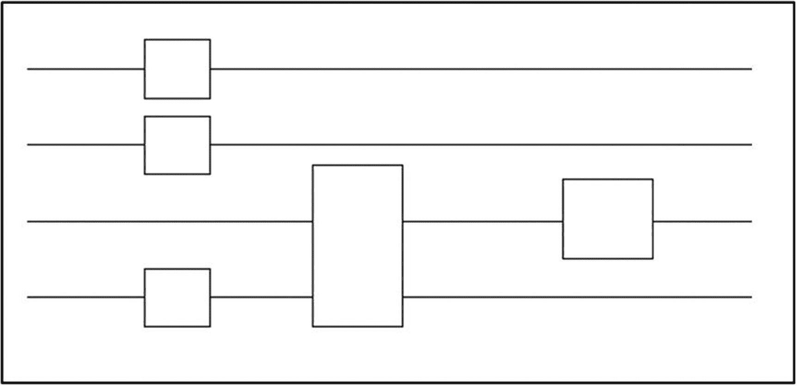

图 5-1

一种深度为 3，空间为 4，宽度为 4，共有 5 个门的电路

如果我们将电路想象成被分成一系列离散时间片的*，其中单个门的应用需要单个时间片，则电路的*深度*是其时间片的总数。这不一定与电路中门的总数相同，因为作用于不相交位的门通常可以并行应用；例如，在同一时间片期间，一对门可以应用于两条不同线上的位。电路复杂性的第三个度量*类似于图灵机的空间(或宽度)。这是电路中位或“线”的总数，有时称为电路的*宽度*或*空间*。**

低深度算法也称为*浅*算法。按照现在的情况，如果一个算法需要很高的深度(深度算法)，它可以只利用几个量子位，那么它就可以被模拟。这意味着量子优势必须基于浅层算法(即仅使用几层并行门的算法)来显示。

今天的 NISQ 机器的物理量子位限制所强加的浅算法的低深度自动要求实现混合算法(即，被分成经典部分和浅量子部分的算法)。混合算法的经典部分和量子部分在一个循环中执行，结果在迭代之间得到优化[56] [69]。优化行为可能会影响混合算法的量子部分和经典部分[70]。

图 [5-2](#Fig2) 显示了混合算法的一般结构。它的量子部分使状态准备好被恰当地表示算法的酉变换操纵。酉变换产生的结果被测量并传递到工作流的经典部分。如果测量结果被认为是可接受的，则作为结果交付；否则，再次处理测量结果。输出作为输入传递给预处理步骤，该步骤相应地控制状态准备。


图 5-2

量子算法的一般结构(来源[48])

混合算法的结构遵循大多数量子算法的一般结构(即，由算法处理的量子态，如酉变换)，必须准备好，这通常需要经典的预处理。通过测量算法本身的结果产生的输出需要被再次处理(后处理)(例如，通过评估或改进其质量)。在许多情况下，后处理步骤不会启动另一个迭代(即，它不会将输入传递给预处理步骤)。

实现算法的电路应该在其上运行的目标 QC 平台影响整个算法，因为它可能支持与算法所假设的不同的门集，或者因为目标机器具有某些硬件限制。例如，以基于退火的平台作为目标量子机器的基于门的算法将不会是成功的实现。

在我们深入研究量子算法和机器学习的本质细节之前，最好了解更多关于*量子计算复杂性*的信息。

## 量子复杂性

你在第 [1](1.html) 章已经初步了解了计算复杂性。问题的*复杂性*指的是从算法、计算时间等角度来看，涉及占用资源的问题类别。为了估计总的计算成本，需要对资源进行分析。这是通过运行解决问题所需的算法来完成的。

计算机运行一个算法的时间就是该算法在特定计算平台上的运行时间。根据经典计算的基本原理，通过验证数据库中的项目直到找到一个期望的项目，可以获得数据库搜索目标的解决方案。这个练习需要时间复杂度为 *O* ( *n* )的最坏情况场景。

算法的*计算复杂度*是算法的时间、规模和相关资源需求如何随着数据集或问题规模的增长而发展的定量表达。算法旨在应用于未知函数或一组数据，以确定函数的属性(如周期或最小值)、因数或分类数据。

该函数的输入数量(即数据的*大小)可以是从一位数到数万亿或更多。有很多算法可以选择。尝试它们，直到你找到似乎能完成这项工作的算法。一旦我们选择了一个我们认为适合我们的目的或目标的算法，我们需要决定对以下问题的响应:随着算法所操作的输入数量的增加，算法的运行时间会如何表现？这被称为算法对*大小*的*敏感度*。*

随着算法问题规模的增长，它的运行时间也在增长。这被称为*时间复杂度*。以下是在下一章中讨论的各种时间复杂性。

*   恒定时间复杂度

*   多项式时间复杂度

*   非多项式时间复杂度

如果硬件电路可以随着数据集的增长而增长(或者利用大量现有服务器中的大量处理器)，那么计算所需的时间可能不会很长，并且可以用*时间复杂度*换取*空间复杂度*。

当谈到量子超越经典方法时，当前的兴趣是量子计算和通信领域的相对加速。为了实现这一点，通常，硬件黑盒类型的方法找出量子算法提供的时间优势(如果有的话)。

如果考虑到空间复杂度，那么算法中的电路在最坏的情况下是线性增长的 T2，而在大多数情况下是对数增长的 T4。任务是采用经典的昂贵的*指数算法，并使用*量子计算*找到*多项式算法*。因此，估计硬件的线性或对数增长被有利的时间成本所克服，因此可以忽略。*

量子复杂性理论的领域已经发展成为经典复杂性理论的扩展[44] [45]。它基于量子计算机是否在原则上能够更快地解决与运行时间复杂性相关的计算问题。

为了比较算法，习惯上使用度量或工具。一个这样的度量是*渐近符号*，有时被称为“大 T2”O 符号。这种符号表示执行给定计算任务所需的资源的估计值，以及当问题的规模变化时相同资源的变化特征。它*没有给出需要多少资源的定性指示，而是一种渐进趋势。例如，考虑某个需要(25*n*T8】2+*n*+21)个时间步长的特定算法，其中 *n* 是定义问题所需的位数。在这种情况下，它表示该问题具有由*O*(*n*<sup>2</sup>给出的二次时间复杂度，因为 25 *n* <sup>2</sup> 是到目前为止支配大 *n* 的那些步骤的最大因子。在将复杂度估计表述为*O*(*n*T30】2 时，常数 25 被忽略，因为对于大的 *n* ，当将该算法与另一个算法的时间复杂度进行比较时，常数的重要性是微不足道的。*

渐近符号允许我们比较足够大的 *n* 的算法，当涉及到分类决策问题的理论时，它是一个重要的工具。这被称为*计算复杂性*理论，并根据他们最著名的解决方案的资源效率将计算问题分组在一起。这些组被称为*复杂性类、*，并且有很多这样的组。在本书的上下文中，只考虑了少数几个。当涉及到空间资源时，这些类都是有效的，空间资源在这里被定义为具有*空间复杂度*≤*O*(*n*<sup>*p*</sup>)的问题类。随着问题的增长，*不需要*比多项式增加更多的内存。这个类被称为 PSPACE。*时间效率*以同样的方式定义:一个时间效率的解决方案需要几个与 *n* 中的多项式成比例的时间步长。当一个解决方案被称为*高效时，*这通常意味着该解决方案表现出*时间效率和空间效率。*

在这种情况下，*运行时间优势*被称为*量子增强*、*量子优势*，或者简称为*量子加速*。证明一个指数级加速被有争议地称为*量子优势*。

虽然量子计算的圣杯仍然是找到一个可证明的指数加速，但在渐近复杂性方面量子优势的更广泛定义为现实研究开辟了更多的途径，例如:

*   量子算法经常必须与经典采样进行比较，经典采样同样是非确定性的，并且与量子计算有密切关系。

*   定义明确的计算任务

*   这个问题的一个合理的量子算法

*   给任何古典主义竞争者的时间/空间

*   复杂性理论假设，并且可选地

*   一种验证方法，可以使用允许的资源有效地将量子算法与任何经典竞争对手区分开来

这里的*似是而非的*指的是近期硬件上的*理想状态下的*，可能包括处理噪音和实验缺陷的需求。

一个*复杂性类*是一组在某种意义上具有相似复杂性的决策问题，例如，可以用多项式时间或多项式空间解决的问题。

下面是一些主要的经典复杂性类。

*   **P** :利用多项式时间，*经典确定性*计算机可以解决的一类问题。

*   **BPP** :可以被*经典随机化*计算机使用多项式时间解决的问题，每个输入的错误概率。

*   NP :如果某个证明者提供一个多项式长度的“证人”，Yes 实例可以在多项式时间内被验证的问题类这一类中的一些问题是 NP 难问题，其中我们知道算法仍然以指数时间运行，但比暴力搜索快得多。一个例子是著名的旅行推销员问题(TSP)，我们在第 [8](8.html) 章中亲自解决了这个问题。还有 NP 完全问题，也就是说 NP 中的任何其他问题都可以在多项式时间内化简为它。*因此 NP 完全问题是 NP* 中最难的问题。一个例子是可满足性问题:如果证明者给我们一个满意的赋值，我们可以验证一个给定的 *n* 变量布尔公式是可满足的。因此它是 NP 完全的，可以证明它是 NP 完全的。其他例子有整数线性规划、旅行销售人员(在第 [7](7.html) 章中有一个真实的实现)、给图表着色的能力等等。

*   **PSPACE** :经典确定性计算机利用多项式空间可以解决的问题。

所有类别的量子类似物也可以被定义，这是由 Bernstein 和 Vazirani [44]开始的努力。

*   **EQP** :量子计算机利用多项式时间可以精确解决*的一类问题*。这个类依赖于计算中允许的一组基本门。

*   **BQP** :量子计算机可以使用多项式时间解决的问题，每个输入都有错误概率。这个类被认为是可以被量子计算机有效解决的*。*

*   **量子 NP** :一类问题，其中如果某个证明者提供了多项式数量的量子位的“量子见证”，则 Yes 实例可以被有效地验证。对于每个 Yes 实例，应该有一个量子见证以概率 1 通过验证，而对于 No 实例，应该以概率 1 拒绝每个量子见证。这个类也依赖于允许的基本门，并且利用每个输入的错误概率，得到一个被称为量子梅林-亚瑟(QMA)的类。

*   **QPSPACE** :量子计算机利用多项式空间可以解决的问题。它和经典的 PSPACE 一样。

## 量子特征图

经典的机器学习方法需要在不同的空间中处理它们的输入数据，以使其更容易处理，或者因为新的空间提供了便于相关模型分析的属性。支持向量机(SVM)就是一个例子。支持向量机使用线性超平面对数据进行分类。当数据在原始空间中已经是线性可分的时，线性超平面工作得很好；然而，对于许多数据集来说，这不太可能是真的。一种解决方法是将数据转换到一个新的空间，在该空间中，数据通过要素地图呈线性。

设 *φ* 为一组输入数据， *ϑ* 为特征空间。那么特征图ω被定义为

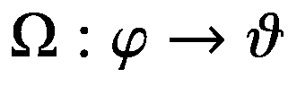

输出图上的输出数据点 *φ* ( *x* )称为*特征向量。ϑ* 通常是一个向量空间。转换关系如图 [5-3a](#Fig3) 所示。虽然在训练输入的原始空间中，来自两个类(红色正方形和绿色圆圈)的数据不能通过简单的线性模型来分离(左)，但是我们可以将它们映射到更高维度的特征空间，其中线性模型确实足以定义作为决策边界的分离超平面(右)。有关更多信息，请参见舒尔德和基洛兰[52]。


图 5-3a

量子特征空间变换

在*量子特征图的上下文中，*特征向量是量子状态。 *ϑ* 是希尔伯特空间的成员。映射ω:*φ*→*ϑ*应用酉变换 *U* 和变换*x*→∣*φ*(*x*)⟩.通常，在这种情况下， *U* 是一个变分电路，其转换如图 [5-3b](#Fig4) 所示。


图 5-3b

具有变分电路的量子特征空间变换

## 量子嵌入

通常，量子算法被输入产生结果所需的输入数据。这种输入数据必须表示为量子态，才能被量子计算机理解和操作。今天，量子机器学习的大多数应用程序使用量子特征映射来将经典数据映射到希尔伯特空间中的量子状态。这是设计量子算法的一个非常重要的方面，直接影响它们的计算成本。这个过程被称为*量子* *嵌入*，涉及将经典 *x* 数据点转化为量子电路中的一组门参数，创建量子态∣*ψ*t8】T9】xt11】⟩.更多细节可以在[5]和[47]中找到。


图 5-4

从经典到量子嵌入

如图 [5-4](#Fig5) 所示，如果我们考虑经典输入数据由 *P* 个数据点组成，每个数据点具有 *R* 个特征，那么，对于数据集 *D* ，


其中， *x* <sup>*p*</sup> 为一个*R*-维向量， *p* = 1，2，…， *P* 。该数据可以嵌入或编码到 *n* 量子*子系统*中。这些子系统对于离散变量(DV)量子计算可以是 *n* 个量子比特，对于连续变量(CV)量子计算可以是 *n* 个量子比特。

## 信息编码

信息可以被编码成一个*n*-量子位系统，由一个状态以各种方式描述。通常，编码方法随着数据集的性质和要解决的问题而变化。对于量子机器学习和数据挖掘，编码的重要性是至关重要的。有相当多的编码方法。这本书主要关注以下内容:基本编码、振幅编码、张量积编码和哈密顿编码。本章着眼于这些编码方法的基本属性。它在未来的章节中对它们进行了扩展，即在章节 [6](6.html) 、 [7](7.html) 和 [8](8.html) 中，我们将探索它们与量子机器学习算法的关系。

根据目前的实践，*输入准备*有一个经典的部分，称为*预处理，*它创建了一个可以在量子计算机上处理的电路，以准备量子态。制备量子态的后一部分被称为*态制备*。在这种情况下，经典部分期间的 p *再处理*的过程可以构成由人执行的手动任务或者由程序执行的自动任务。

为了将量子算法的输入准备为量子状态，定义了一个量子电路，它准备相应的状态。该电路可以在传统的预处理步骤中生成，如图 [5-5](#Fig6) 所示。


图 5-5

量子算法经典输入的准备(改编自[55])

生成的电路被预先添加到算法的电路中，发送到量子设备并执行。生成的电路用目标器件的量子指令语言表示，例如 Cirq、QaSM 或 Quil。因此，要评估给定算法在特定设备上的可执行性，必须考虑正确准备算法输入所需的额外门和量子位的工作量和复杂性。

参考文献[50]讨论了从经典数据生成制备任意量子态所需的门数。在这种情况下，在将经典数据编码成适于由量子算法处理的量子叠加态时，时间和空间复杂度的效率是至关重要的。

图 [5-6](#Fig7) 显示了经典数据驱动量子计算过程的三个一般执行阶段。


图 5-6

量子计算机执行的三个阶段

用于将经典数据加载到量子态以供量子计算机处理的量子电路是当前研究的活跃焦点。由于不同的量子算法对如何加载经典输入数据并将其格式化为相应的量子态有不同的限制，因此目前在该领域中使用了几种数据加载电路。

采用了各种编码技术，下面将解释其中的一些技术。

### 基本编码

*基础编码*是将二进制字符串形式的经典输入数据与量子子系统的计算基础状态相关联的过程。二进制或数字编码是将数据表示为量子位串，而模拟编码以状态的幅度来表示数据。如果数据必须通过算术计算来处理，数字编码是更可取的。另一方面，模拟编码是将数据映射到量子设备的大型希尔伯特空间的首选，这在机器学习算法中经常需要。在[52]中可以找到几种编码方案的简要概述，如基本编码、幅度编码或乘积编码，而[51]讨论了它们在量子机器学习中的使用。关于初始化任意量子态的一般机制的细节在参考文献[51]中给出。

*基本编码*主要用于在量子算法中必须对实数进行算术运算的时候。这种编码将实数表示为二进制数，然后在计算基础上将它们转换为量子态。

在基本编码中，实数 *x* ∈ ℝ由 *k* 个小数位近似，并转换成该近似的二进制表示。


其中 *a* <sub>*i*</sub> ，*a*<sub>—*I*</sub>∈0，1，实数的符号通过添加前导二进制数进行编码，如“0”代表“+”，1 代表 a。因此，实数近似为( *n* + *k* + 2)比特和一个( *n* + *k* + 2)维量子态。图 [5-7](#Fig8) 显示了基态的输入编码程序。

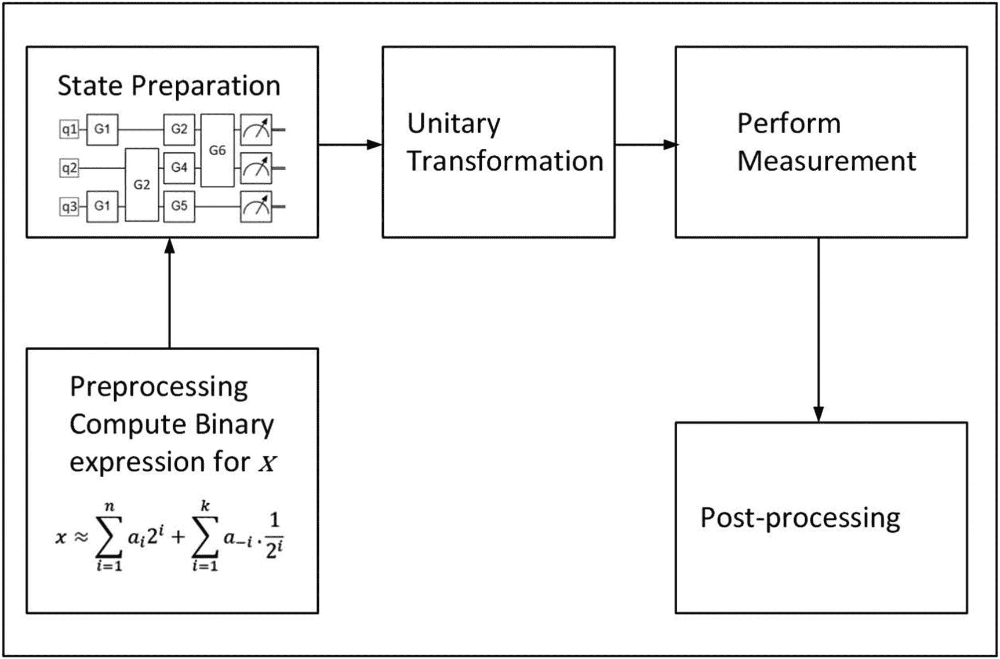

图 5-7

基本编码的输入准备(改编自[55])

以下是基本编码的步骤。

1.  第一步，对经典数据的预处理计算出二进制近似值*a*<sub>*s*</sub>*a*<sub>*n*</sub>…， *a* <sub>0</sub> ，*a*<sub>—1</sub>，*a*<sub>—*k*</sub>实数，其中 *a*

2.  通过在量子位 *i* 上应用门来产生相应的电路。这个电路创造了代表实数 *x* 的量子态。

3.  所生成的电路被预先加到算法本身的电路上(由图中的酉变换表示),并在诸如来自 IBM 或 Rigetti 的量子计算机之类的量子设备上执行。

每个基本状态的振幅值的唯一目的是以足够高的被测量概率来标记或标示计算结果；他们没有携带其他信息。基本编码方法的量子算法的目标是增加对应于对解进行编码的基本状态的振幅的概率或绝对平方。

任何向量 *x* = *x* <sub>1</sub> ， *x* <sub>2</sub> ，…*x*<sub>*n*</sub>∈ℝ<sup>*n*</sup>都可以通过计算其每个分量 *x* <sub>*i*</sub> 的基编码映射成一个基编码作为一个例子，让我们尝试二进制分数表示，其中区间[0，1]中的每个数由一个 *T* 位串表示，根据


在这种情况下，要在基本编码中对向量(0.7，0.1，1.0) <sup>*T*</sup> 进行编码，首先需要将其转换为二进制序列，其中选择精度为 *T* = 4 的二进制小数表示，第一位对符号进行编码，如下所示:0 表示 a +, 1 表示 a–。


因此，向量(0.7，0.1，1.0) <sup>*T*</sup> 转化为二进制序列 11011 01001 01111，并在基本编码中编码为∣ *x* ⟩ = ∣ 11011 01001 01111⟩。

当一个数据集 *D* = { *x* <sup>1</sup> ， *x* <sup>2</sup> ，…，*x*<sup>*p*</sup>}为二进制嵌入时， *D* 在二进制编码中的表现为 *D* 元素的二进制编码状态的均匀叠加。


关于创建这种叠加的时间复杂度为 O ( *mn* )的算法，请参见参考文献【56】。二进制编码状态的数据集的状态表示的单个元素 *D* = { *x* <sup>1</sup> ， *x* <sup>2</sup> ，…，*x*<sup>*p*</sup>}⊆ℝ<sup>*n*</sup>可以通过下面的量子随机存取存储器(QRAM)表示来访问。

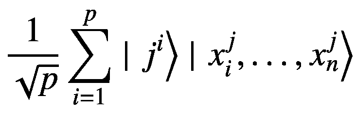

例如，对于一个包含两个例子*x*T2】1= 10 和*x*T6】2= 01 的经典数据集，对应的基编码用两个量子位表示∣ *x* <sup>1</sup> ⟩ = ∣ 10⟩和∣ *x* <sup>1</sup> ⟩ = ∣ 01⟩，给出

![$$ \mid \left.D\right\rangle =\frac{1}{\sqrt{2}}\left[|\left.10\right\rangle +|\left.01\right\rangle \right]\mathrm{Information}\ \mathrm{encoding}\ \mathrm{methodbasis}\ \mathrm{encoding} $$](img/502577_1_En_5_Chapter_TeX_Equj.png)

参考文献[57]提出了一种实现这种时间复杂度为*O*(log*p*)的 QRAM 的架构。来自ℝ <sup>*n*</sup> 的数据可以以复杂度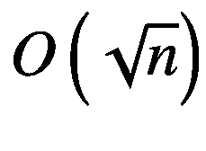编码在其存储单元中。

### 振幅编码

*振幅编码*技术涉及将数据编码成量子态的振幅。虽然量子算法对数据的算术操作不是最重要的，但更紧凑的数据表示是有用的。具体来说，量子器件的大希尔伯特空间在这种编码中得到了恰当的利用。在这个方案中，归一化的经典 *N* 维 *x* 数据点由一个 *n* 量子比特量子态|*ψ*<sub>*x*</sub>⟩的振幅表示为，


其中 *x* <sub>*i*</sub> 是 *x* 的第 *i* 个元素，| *i* ⟩是第 *i* 个计算基态，*n*= 2<sup>*n*</sup>。

这种编码需要 log<sub>2</sub>T2n 个量子位来表示一个 *n* 维数据点。

例如，如果我们希望使用幅度编码对四维浮点数组 *x* = 1.5，0.0，5.0，0.0 进行编码，那么第一步是以下列方式对其进行归一化。

![$$ {x}_{norm}=\frac{1}{\sqrt{27.25}}\left[1.5,0.0,-5.0,0.0\right] $$](img/502577_1_En_5_Chapter_TeX_Equl.png)

那么对应的幅度编码用两个量子位来表示*x*<sub>T3】范数 T5】为</sub>

![$$ \left.|{\psi}_{x_{norm}}\right\rangle =\frac{1}{\sqrt{27.25}}\left[1.5\left.|00\right\rangle +0.0\left.|01\right\rangle -5.0\left.|10\right\rangle +0.0\left.|11\right\rangle \right] $$](img/502577_1_En_5_Chapter_TeX_Equm.png)

![$$ =\frac{1}{\sqrt{27.25}}\left[1.5\left.|00\right\rangle -5.0\left.|10\right\rangle \right] $$](img/502577_1_En_5_Chapter_TeX_Equn.png)

如果我们考虑前面的经典数据集 *D* = { *x* <sup>1</sup> ， *x* <sup>2</sup> ，…，*x*<sup>p</sup>}，那么如果我们把所有的输入实例 *x* <sup>*i*</sup> 串联在一起成为一个向量，就可以完成它的幅度编码。


其中， *c* <sub>*范数*</sub> 为归一化常数，归一化准则为| *α* | <sup>2</sup> = 1。输入数据集在计算基础上表示为


其中， *α* <sub>*i*</sub> 为振幅向量 *α* 的元素。∣是计算的基态。要编码的振幅数量由 *N* × *P* 给出，并且由于一个 *n* 量子位的系统与 2 个 <sup>*n*</sup> 振幅相关联，振幅编码需要*N*≥log<sub>2</sub>*NP*数量的量子位。

在幅度编码期间，可以通过酉变换*u*=*u*<sub>1</sub>⊗*u*<sub>2</sub>⊗…⊗*u*<sub>*k*</sub>来创建状态，其中每个 *U* <sub>*i*</sub> 或者是一个单量子比特门或者是一个 CNOT，并且 *k* 是在这种情况下， *x* <sub>*i*</sub> 可以有不同的数值数据类型(如整数或浮点)。

如果要从| 0⟩基态(即| *x* ⟩ = *U* | 0⟩)准备好 *x* ，那么 2 个 *n* 门就足够了，如申德和马尔科夫所示[50]。对于满足某些约束的 *x* ，这种复杂性可以进一步降低。例如，Soklakov 和 Schack [58]给出了单位长度状态的多项式算法，这些状态是特定有界的(即，如果应该避免制备量子态的指数复杂性，则只能制备有限的一组状态)。Schuld 等人[59]提出了一种不一定是单位长度向量的幅度编码，它特别显示了如何通过填充来消除经常做出的假设 *n* 是 2 的幂。

即使振幅编码仅需要( *log* <sub>2</sub> *n* )个量子位来编码*x*∈*R*<sup>*n*</sup>)，但是这种状态的准备通常是指数级昂贵的。

### 张量积编码

与振幅编码不同，*张量积编码*需要 *n* 个量子位来表示 *n* 维数据，但就复杂性而言，准备起来更便宜，因为它需要每个量子位旋转一次。这种编码对于在量子神经网络中处理数据是直接有用的，并且在本文中被称为参考文献[5]中的角度编码。图 [5-8](#Fig9) 显示了张量积编码的过程。

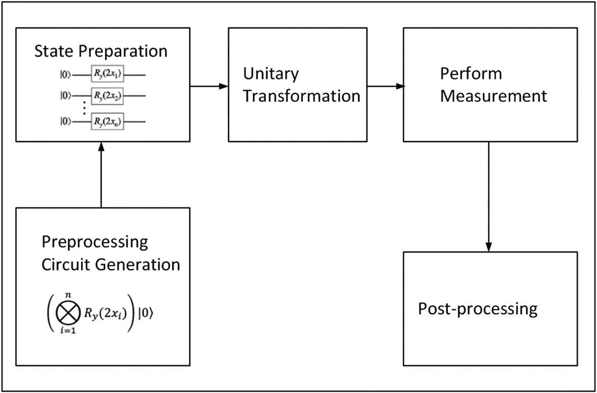

图 5-8

张量积或角度编码的输入准备(改编自[55])

图 [5-8](#Fig9) 中的过程如下。

设 *x* = *x* <sub>1</sub> ， *x* <sub>2</sub> ，…，*x*<sub>*n*</sub>∈ℝ<sup>*n*</sup>。每个分量 *x* <sub>*i*</sub> 上的张量积编码由下式给出


这给出了以下完整的矢量表示


(5A)

第 [1](1.html) 章讨论了泡利矩阵和旋转算子。当对泡利 X、Y 和 Z 矩阵求幂时，产生旋转算子，其将布洛赫绕 X、Y 和 Z 轴旋转给定的角度 *θ* 。

![$$ {R}_x\left(\theta \right)\equiv {e}^{-i\frac{\theta }{2}X}=\cos \frac{\theta }{2}I-i\sin \frac{\theta }{2}X=\left[\begin{array}{cc}\cos \frac{\theta }{2}&amp; -i\sin \frac{\theta }{2}\\ {}-i\sin \frac{\theta }{2}&amp; \cos \frac{\theta }{2}\end{array}\right] $$](img/502577_1_En_5_Chapter_TeX_Equs.png)

![$$ {R}_y\left(\theta \right)\equiv {e}^{-i\frac{\theta }{2}Y}=\cos \frac{\theta }{2}I-i\sin \frac{\theta }{2}Y=\left[\begin{array}{cc}\cos \frac{\theta }{2}&amp; -\sin \frac{\theta }{2}\\ {}\sin \frac{\theta }{2}&amp; \cos \frac{\theta }{2}\end{array}\right] $$](img/502577_1_En_5_Chapter_TeX_Equt.png)

![$$ {R}_Z\left(\theta \right)\equiv {e}^{-i\frac{\theta }{2}Z}=\cos \frac{\theta }{2}I-i\sin \frac{\theta }{2}Z=\left[\begin{array}{cc}{e}^{- i\theta /2}&amp; 0\\ {}0&amp; {e}^{i\theta /2}\end{array}\right] $$](img/502577_1_En_5_Chapter_TeX_Equu.png)

将酉*r*<sub>*y*</sub>(2*x*)应用于图 [5-6](#Fig7) 中的矢量∣ *x* ⟩。

![$$ {R}_y(2x)=\left[\begin{array}{cc}\cos x&amp; -\sin x\\ {}\sin x&amp; \cos x\end{array}\right] $$](img/502577_1_En_5_Chapter_TeX_Equv.png)

它意味着以下内容。


反过来，前面的等式意味着


(5B)

这里我们从方程[5*a*t5】中得到原始向量∣ *x* ⟩。在方程](#Equr) [5 *B*](#Equx) ，是*r*<sub>*y*</sub>(2*x*<sub>*I*</sub>)与状态∣0⟩在整个 *i* 范围内的张量积。

预处理步骤可以生成图 [5-6](#Fig7) 的电路，使得状态准备步骤准备 *x* 的量子表示。然后，电路可以作为代码生成，预先添加到算法本身，发送到量子计算机，然后在那里执行。

### 哈密尔顿编码

量子多体系统(将在本章后面讨论)展示了极其多样的相位和物理现象，这构成了物理学及其他许多领域的中心研究对象。*哈密顿量* *编码*通过对量子系统演化中的信息进行编码，使用一种隐含的技术。后面章节中的量子机器学习算法使用哈密尔顿编码和一些其他的量子程序。在本书的剩余部分，我们将通过一个例子驱动的方法来更严格地研究它们。

第 [4](4.html) 章介绍了一些著名的量子算法，比如 Deutsch 的算法。我们在这一章中介绍一些更多的量子程序。

## Deutsch-Jozsa 算法

1992 年的*Deutsch–Jozsa 算法*[41]启发了 Shor 和 Grover 的工作，可能是最著名的量子算法，并且基于 Deutsch 的算法[37]，David Deutsch 和 Richard Jozsa 将其扩展为更令人信服的算法分离，成为现在所谓的 *Deutsch-Jozsa 算法*。格罗弗 1996 年的算法是用于搜索数据库[42](在第 [1](1.html) 章和本章后面讨论)。这些想法的共同点是，它们说明了量子信息处理为纯经典术语定义的问题提供解决方案的潜力，这些问题被认为无法通过经典信息处理有效解决。与量子密码术为经典通信所实现的类似，量子算法提供了执行某些经典计算的潜在更好的方法，即使在中间阶段，通信和计算都将依赖于量子资源和处理。

基本上，量子算法有两个主要类别:基于*量子傅立叶变换* (QFT)的算法，对应于隐藏子群问题和量子搜索算法的一般实现。Shor 和 Deutsch–Jozsa 算法属于前一类，而后者由 Grover 算法的变体组成。不属于这两类算法的一个例子是*量子模拟*。在这种情况下，量子计算模拟了一个量子系统，正如费曼最初设想的那样[41]。

模拟哈密顿量的概念是定义量子计算的最方便的起点。量子化谐振子俗称 *qumodes* 。量子信息有两种常见的编码。通常所知的是基于离散的二能级系统——因此，被称为*量子比特*。另一种方法依赖于无限维量子系统，如量子化谐振子(也称为 *qumodes* )，这些更让人想起经典的模拟编码。基于量子位编码的方案通常被称为离散变量(DV)方法。相比之下，那些利用无限维系统以及根据具有连续光谱的变量制备和测量量子信息的可能性的方案被称为*连续变量* (CV)方案。

我们在第 [1](1.html) 和 [4](4.html) 章中研究了量子并行性、纠缠和多伊奇算法，以及一些相关的编码示例。一个态中的纠缠量子位| *ψ* <sub>*ent*</sub> ⟩，根据定义，不再是可分的，计算基础由下式给出


(5.1)

其中，*λ*<sub>*I*</sub>∈*ℂ*，对于*I*= 1…2<sup>*n*</sup>和。基底{| 0…00⟩…| 1…11⟩}定义了第 *n* 个量子位的计算基础。

在方程 [5.1](#Equy) 中，使用了以下表示张量积的常用约定:∣*x*⟩⊗∣*y*⟩=∣*xy*⟩.下面在计算基础上的狄拉克矢量表示也非常有用。


(5.2)

我们从纯粹基于量子电路的角度来看 Deutsch 的算法。如果你更熟悉量子力学的基本原理，通过图 [5-9a](#Fig10) 所示的费曼图中的路径，对同一问题进行另一种可视化可能是有用的。


图 5-9a

多伊奇算法:费曼路径图

为简单起见，让我们使用图 [5-9b](#Fig11) 中电路所示的简化相位甲骨文模型。


图 5-9b

多伊奇算法:图 [4-20](4.html#Fig20) 的简化阶段甲骨文模型

以下步骤根据图 [5-2a](#Fig2) 总结了图 [5-2b](#Fig2) 的电路的每一步的量子态。

1.  输入是∣0⟩

2.  

3.  ![$$ \frac{1}{\sqrt{2}}\left({\left(-1\right)}^{f(0)}\mid \left.0\right\rangle +{\left(-1\right)}^{f(1)}\left|\left.1\right\rangle \right)=\frac{{\left(-1\right)}^{f(0)}}{\sqrt{2}}\right(\mid \left.0\right\rangle +{\left(-1\right)}^{\left[f(1)-f(0)\right]}\left|\left.1\right\rangle \right) $$](img/502577_1_En_5_Chapter_TeX_IEq9.png)

    

4.  

在表达式(1) <sup>*f* (0)</sup> 中，是一个称为量子位的*全局相位*的常数因子。从测量的角度来看，全局相位可以忽略，因为量子态的全局相位是不可检测的。在量子力学中，*只有能量差*，而不是物理系统动力学的绝对值，才是重要的。一个经典的类比是电子在导线中的运动，在导线中只测量电压差，而不是绝对值。这说明如果 *f* (1) = *f* (0)最终测量的结果总是 0，如果*f*(1)≦*f*(0)最终测量的结果总是 1。

Deutsch 的算法可以用所谓的*相位反冲*来很好地解释。相位反冲方案考虑输入| *x* ⟩|−⟩，for *x* ∈ {0，1}，并将 Oracle*u*<sub>*f*</sub>应用于该输入。对于∣ *ψ* ⟩州来说，这给


(5.3)

等式 [5.3](#Equad) 可以被认为是针对单输入的多伊奇算法的一般情况(参见第 [4 章](4.html))。对于方程 [5.3](#Equad) ，可以有两种不同的情况: *f* ( *x* ) = 1 或者 *f* ( *x* ) = 0。如果 *f* ( *x* ) = 0，等式 [5.3](#Equad) 给出


这表明输入| *x* ⟩|−⟩在 *U* <sub>*f*</sub> 的作用下保持不变。相反，如果 *f* ( *x* ) = 1，则等式 [5.3](#Equad) 给出


这表示输入| *x* ⟩|−⟩.增加了一个相位(1)这两种情况可以用下面的表达式来概括。


(5.4)

方程 [5.4](#Equag) 是*相位反冲*方程。

Deutsch 算法的解决方案是精确的，因为它产生错误概率为零的正确答案，并且它只需要一个 oracle 查询，因此它的时间复杂度为常数 *O* (1)。该算法采用了 *n* + 1 个量子位，给出了线性内存消耗 *O* ( *n* )。

当 *f* : {0，1} → {0，1}作用于一个不太有趣的*单输入*位时，Deutsch 的算法工作得很好。感兴趣的是更一般的场景，其涉及用于确定函数 *f* : {0，1} <sup>*n*</sup> → {0，1}的性质的量子算法的设计和分析，该函数作用于*多个*输入值。这有可能提供超越任何经典确定性解决方案的指数级加速。

*Deutsch-Jozsa 算法*是 Deutsch 算法的 *n* 位推广。这个算法和 Deutsch 的算法一样，确定一个函数 *f* ( *x* )对于*多个*输入值是平衡的还是常数。如果 *f* ( *x* )不变，则 *x* 的所有输入值的输出都相同(即 *f* ( *x* )始终为 0，或者 *f* ( *x* )始终为 1)。如果 *f* ( *x* )平衡，则对于一半的输入， *f* ( *x* ) = 0，对于另一半的输入， *f* ( *x* ) = 1。

在*经典计算*期间，通常在最坏的情况下，需要查询(2<sup>*n*—1</sup>+1)次，需要超过一半的域{0，1} <sup>*n*</sup> 的输入，以确定 *f* ( *x* )是平衡的还是恒定的。当使用随机化算法时，该练习可能会在个查询的结果上实现有界误差 *ε* 。

对于一个量子解决方案，图 [5-10](#Fig12) 中显示了一个费曼图，便于跟踪量子态。


图 5-10

Deutsch-Jozsa 算法:费曼路径图

下面的步骤总结了图 [5-3](#Fig3) 中每一步的量子态，这类似于 Deutsch 算法的费曼图中的路径。

1.  输入状态是∣*ψ*T2】0⟩=∣0⟩<sup>⊗*n*T7】</sup>

2.  

3.  

步骤 3 的扩展给出了步骤 4。


其中， *H* 照常是哈达玛变换。

类似于图 [5-11](#Fig13) 的电路用于一般量子解的 Deutsch-Jozsa 算法。


图 5-11

Deutsch-Jozsa 算法的量子电路

在图 [5-11](#Fig13) 中，一般的 Deutsch-Jozsa 算法是通过以下步骤推导出来的。

1.  输入状态为∣*ψ*T2】0⟩=∣0⟩<sup>⊗*n*T7】⊗∣1⟩</sup>

2.  Then, the Hadamard gates are applied, giving

    ![$$ \mid \left.{\psi}_1\right\rangle =\frac{1}{\sqrt{2^n}}\ \sum \limits_{i\in {\left\{0,1\right\}}^n}\mid \left.i\right\rangle \left[\frac{1}{\sqrt{2}}\left(|\left.0\right\rangle -|\left.1\right\rangle \right)\right] $$](img/502577_1_En_5_Chapter_TeX_Equal.png)

3.  The state from step 2, after analysis, gives

    ![$$ \mid \left.{\psi}_2\right\rangle =\frac{1}{\sqrt{2^n}}\ \sum \limits_{i\in {\left\{0,1\right\}}^n}{\left(-1\right)}^{f(i)}\mid \left.i\right\rangle \left[\frac{1}{\sqrt{2}}\left(|\left.0\right\rangle -|\left.1\right\rangle \right)\right] $$](img/502577_1_En_5_Chapter_TeX_Equam.png)

4.  After applying Hadamard transformation to all the *n* qubits, we have

    

    (5.5)  

前面的步骤给出了以下内容。

![$$ \mid \left.{\psi}_3\right\rangle =\frac{1}{2^n}\ \sum \limits_{i\in {\left\{0,1\right\}}^n}\sum \limits_{j\in {\left\{0,1\right\}}^n}{\left(-1\right)}^{ij+f(i)}\mid \left.j\right\rangle \left[\frac{1}{\sqrt{2}}\left(|\left.0\right\rangle -|\left.1\right\rangle \right)\right] $$](img/502577_1_En_5_Chapter_TeX_Equao.png)

最后，测量状态∣0⟩<sup>⊗*n*T3】的概率由下式给出</sup>


如果*f*(*I*)=常数，那么我们得到相长干涉，这就得到*p*(|0⟩<sup>⊗*n*</sup>)= 1。如果 *f* ( *i* )是平衡的，那么相消干涉给我们的概率是 0。

总之，Deutsch-Jozsa 算法之所以有效，是因为以下原因。

在案例 1 中，神谕是*常数*。在这种情况下，就全局相位而言，它不会影响输入量子位。H 门是它自己的反向门，因此


在第二种情况下，甲骨文是*平衡的*。在这种情况下，在步骤 2 之后，输入寄存器是计算基础中所有状态的相等叠加，并且*相位反冲*将*负*相位添加到这些状态的一半。

![$$ {U}_f\left(\frac{1}{\sqrt{2^n}}\left[\begin{array}{c}1\\ {}1\\ {}1\\ {}.\\ {}.\\ {}.\\ {}1\end{array}\right]\right)=\left[\begin{array}{c}-1\\ {}\kern0.75em 1\\ {}-1\\ {}.\\ {}.\\ {}.\\ {}\kern0.5em 1\end{array}\right] $$](img/502577_1_En_5_Chapter_TeX_Equar.png)

(5.7)

这表明查询 oracle 后的量程状态与查询 oracle 前的量程状态正交。同样地，应用 h 门给出了与全零∣000…0⟩态正交的量子态，这意味着 al-零态不应该被测量。

*Deutsch-Jozsa 算法*的量子查询复杂度。求解多伊奇问题时最小化的*代价函数*是应用于 *U* <sub>*f*</sub> 的量子查询的数量。这是量子查询复杂性模型的一个例子，许多量子算法都是用它开发的。在量子查询复杂度的研究中，给一个黑盒 *U* <sub>*f*</sub> 实现函数 *f* ，询问对 *U* <sub>*f*</sub> 的最小查询次数是多少，以确定 *f* 的一个期望性质。注意，计算该属性的量子算法可以包括例如 999999999 个量子门；如果它只包含对 *U* <sub>*f*</sub> 的两个查询，那么我们认为算法的代价为 2(即所有“非查询”操作都被认为是免费的)。

## 有 Cirq 的 Deutsch-Jozsa

第 4 章包括对谷歌开源量子计算库 Cirq 的实际介绍，其中大部分内容都局限于构建电路、门，最后是 Deustch 的算法。本章尝试用 Cirq 构造一个两比特 Deutsch-Jozsa 算法。Deutsch-Jozsa 算法可以使用对 oracle 的单个查询来区分常数和平衡函数。这个练习的目标是写一个可以区分这些的量子电路。

我们首先导入所需的库，如清单 [5-1a](#PC1) 所示，用于可以从该书网站下载的`Deutsch-Jozsa_cirq.ipynb` Jupyter 笔记本。


```py
import cirq
import numpy as np
import matplotlib.pyplot as plt

Listing 5-1aLibraries for Deutsch-Jozsa_cirq.ipynb

```

在关于 Deutsch 算法的讨论中，您看到了一个输入位的布尔函数要么是常数，要么是平衡的。然而，我们也从 Deutsch-Jozsa 算法部分看到，对于两个输入位的布尔函数，不是所有的函数都是常数或平衡的。有两个常量函数( *x* <sub>1</sub> 、 *x* <sub>2</sub> ) = 0、 *f* ( *x* <sub>1</sub> 、 *x* <sub>2</sub> ) = 1、平衡函数。下面的代码给出了这些函数的操作，其中我们取两个输入量子位并计算第三个量子位中的函数。

```py
# Define three qubits to use.
q0, q1, q2 = cirq.LineQubit.range(3)

# Define the operations to query each of the two constant functions.
constant = (
    [],
    [cirq.X(q2)]
)

# Define the operations to query each of the six balanced functions.
balanced = (
    [cirq.CNOT(q0, q2)],
    [cirq.CNOT(q1, q2)],
    [cirq.CNOT(q0, q2), cirq.CNOT(q1, q2)],
    [cirq.CNOT(q0, q2), cirq.X(q2)],
    [cirq.CNOT(q1, q2), cirq.X(q2)],
    [cirq.CNOT(q0, q2), cirq.CNOT(q1, q2), cirq.X(q2)]
)

Listing 5-1bInput States for Deutsch-Jozsa_cirq.ipynb

```

接下来，我们为量子电路定义一个函数，它可以在两个比特上区分常数和平衡函数。

```py
# Define a function

def deJo_circuit(oracle):
    # Phase kickback trick.
    yield cirq.X(q2), cirq.H(q2)

    # Get an equal superposition over input bits.
    yield cirq.H(q0), cirq.H(q1)

    # Query the function.
    yield oracle

    # Use interference to get result, put last qubit into |1>.
    yield cirq.H(q0), cirq.H(q1), cirq.H(q2)

    # Use a final OR gate to put result in final qubit.
    yield cirq.X(q0), cirq.X(q1), cirq.CCX(q0, q1, q2)
    yield cirq.measure(q2)

Listing 5-1cFunction Definition for Deutsch-Jozsa_cirq.ipynb

```

然后，我们通过运行以下单元来验证我们的 Deutsch-Jozsa 电路，该单元模拟所有 oracles 的电路。

```py
simulator = cirq.Simulator()

print("\nResult on constant functions:")
for oracle in constant:
    result = simulator.run(cirq.Circuit(deJo_circuit(oracle)), repetitions=10)
    print(result)

print("\nResult on balanced functions:")
for oracle in balanced:
    result = simulator.run(cirq.Circuit(deJo_circuit(oracle)), repetitions=10)
    print(result)

Listing 5-1dRun Cirq Simulator to Verify Deutsch-Jozsa_cirq.ipynb

```

下面的输出显示，对于不同的 oracles，该电路按预期工作。

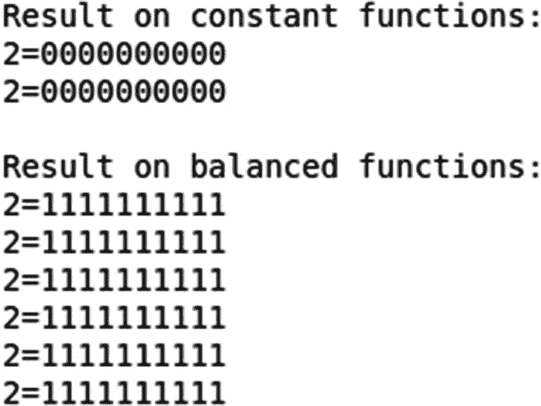

正如 Deutsch 的算法使用一位的情况一样，对于常数函数，我们总是测量 0，对于平衡函数，我们总是测量 1。

## 量子相位估计

*相位估计*是一个量子例程，帮助找到酉矩阵的特征值 *U* 应用于作为受控门的量子寄存器。相位估计使用 QFT 来写入以振幅的相位编码的信息。通常，*量子机器学习* (QML)算法使用这种技术来评估包含 QML 训练集信息的算子的特征值。

上一节快结束时，我们注意到 Deutsch 算法和 Deutsch–Jozsa 算法中的最后一个 Hadamard 门用于获取状态相对相位中的编码信息。哈达玛门是自反的(参考方程 [5.6](#Figw) 和 [5.7](#Equar) )，因此反其道而行之；也就是说，它可以*将信息*编码到相位中。

让我们来看看我们对方程 [5.5](#Equan) 的哈达马状态的推导，然后考虑一个 h 门作用于基态∣ *x* ⟩，对于 *x* ∈ {0，1}，那么，对于 *n* = 1，从方程 [5.5](#Equan) ，


(5.8)

哈达玛门可以被认为是保存了关于基态∣0⟩和∣1⟩.之间的相对相位的值的编码信息由于哈达玛门是自反的，将其应用于等式 [5.8](#Equas) 右侧的状态，我们又回到了状态∣ *x* ⟩，

![$$ H\left[\frac{1}{\sqrt{2}}\Big(|\left.0\right\rangle +{\left(-1\right)}^x\left|\left.1\right\rangle \right)\right]=\mid \left.x\right\rangle $$](img/502577_1_En_5_Chapter_TeX_Equat.png)

(5.9)

因此，在方程 [5.9](#Equat) 中，哈达玛门可以被认为是*解码关于相位中编码的 *x* 值的信息*。同样，如果我们考虑*h*t8】⊗*n*t11】作用于一个 *n* 量子比特基态∣ *x* ⟩，那么我们得到等式 [5.5](#Equan) 的等价式，即


(5.10)

因此，*n*-量子比特哈达玛变换可以被解释为将关于∣ *x* ⟩的值的编码信息处理成*相位*(1)<sup>*x*。*y*∣</sup>y*⟩.*注意(1) <sup>*x* 。 *y*</sup> 是一种非常特殊形式的阶段。一般来说，相位是一个形式为*e*T22】2*πIω*T25】的复数，其中 *ω* ∈ {0，1}为任意实数 *ω* 。这允许在相位为 1 时。一般来说，*n*-量子位哈达玛变换不可能完全访问以比相位更一般的方式编码的信息。然而，可以编写一个特殊的程序，允许哈达玛门确定相位编码的信息。

设∣ *ψ* <sub>*n*</sub> ⟩， *n* = 1，2，…, *n* 为酉算子 *U* 的特征向量。 *U* 定义在∣*ψ*<sub>t17】n</sub>⟩构成正交基的希尔伯特空间中。受控 *U* 对特征向量的酉运算给出，


(5.11)

其中 *ω* ∈ {0，1}为任意实数 *ω* 。等式 [5.12](#Equaw) 成立，因为酉算子的 e *特征值*是相位。

为了形象化方程 [5.12](#Equaw) ，我们可以考虑由下式给出的初始状态


(5.12)

为了进一步分析表达式 5.12，我们需要考虑基本编码。

考虑到 *j* 位串为 0 到(2*j*1)的整数，∣ *y* ⟩参考∣ *y* ⟩标注的*基态*，其中 *y* 为整数 *y* 的*二进制编码*。查看等式 [5.12](#Equaw) ，确定值，或者至少是相位参数 *ω* 的适当估计，必然会有兴趣找到 *ψ* 。这就是*相位估计问题*【43】。为了解决这个问题，相位估计例程允许以下变换


(5.13)

其中是对 *ω* 的估计。等式 [5.13](#Equax) 暗示正交∣*ψ*<sub>t8】n</sub>⟩的特征值对于 *ω* <sub>* j *</sub> 如下。


(5.14)

我们需要记住，既然是 *U* 酉，*λ*<sub>T5】j</sub>必然有 1 的量级。我们从二进制定义 *ω* 开始，

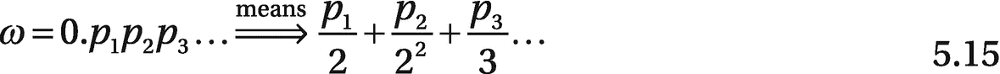

同样， *ω* 的二次方倍数可以写成


(5.16)

对于方程 [5.12](#Equaw) 的相位部分，我们也知道 *e* <sup>2 *πik*</sup> = 1 对于任意整数 *k* ，我们有


(5.17)

现在，如果我们有一个给定的输入状态，并考虑一个量子电路来确定对 *ω* 的估计，那么，对于一个一量子位的输入状态，其中 *j* = 1，我们有 *ω* = 0。*p*T9】1 及以下由等式 [5.5](#Equan) 得出。


(5.18)

求解相位估计的电路如图 [5-12](#Fig14) 所示。


图 5-12

相位估计电路

在图 [5-12](#Fig14) 中，经过受控的 *U* 变换后，特征向量保持不变，特征值 *λ* 包含在第一个量子位的相位中。在第一量子位上的哈达玛变换将信息转换成可以测量的振幅。换句话说，参考等式 [5.9](#Equat) 和 [5.18](#Equbh) ，确定*p*T12】1 的值并估算 *ω* ，我们有

![$$ H\left[\frac{1}{\sqrt{2}}\Big(|\left.0\right\rangle +{\left(-1\right)}^{p_1}\left|\left.1\right\rangle \right)\right]=\mid \left.{p}_1\right\rangle $$](img/502577_1_En_5_Chapter_TeX_Equbi.png)

(5.19)

既然你已经完成了一个单量子比特输入的相位估计练习，让我们来看看一个两量子比特的状态。


(5.20)

等式 [5.20](#Equbk) 表明*p*T4】2 可以通过以与等式 [5.19](#Equbi) 中相同的方式对第一个量子位应用哈达玛门来确定。但是还需要确定 *p* <sub>1</sub> ，在那个过程中涉及到第二个量子位。如果 *p* <sub>2</sub> = 0，那么第二个量子位处于状态，由此可以确定 *p* <sub>1</sub> 。然而，如果 *p* <sub> 2 </sub> = 1，那么就有一个挑战，因为前面的直接方法将不起作用。为了实现它，我们需要应用相位旋转算子(参考等式 [1。15](1.html#Equr) 。


其中指数中的 0.01 以 2 为基数。换句话说，0.01 = 2<sup>—2</sup>。*R*<sub>T5】θ</sub>的倒数由下式给出


(5.21)

因此，对于 *p* <sub>2</sub> = 1，我们考虑应用一个*R*<sub>*θ*</sub><sup>—1</sup>的效果。

![$$ {R_{\theta}}^{-1}\left[\frac{1}{\sqrt{2}}\Big(|\left.0\right\rangle +{e}^{2\pi i\left(0.{p}_11\right)y}\left|\left.1\right\rangle \right)\right]=\frac{1}{\sqrt{2}}\Big(\mid \left.0\right\rangle +{e}^{2\pi i\left(0.{p}_11-0.01\right)y}\left|\left.1\right\rangle \right) $$](img/502577_1_En_5_Chapter_TeX_Equbm.png)


(5.22)

现在，如果我们将阿达玛门应用于等式 [5.22](#Equbn) 的结果，那么我们可以确定 *p* <sub>1</sub> 。如果 *p* <sub>2</sub> = 1 或 *p* <sub>2</sub> = 0 是决定我们是在对第二个量子位应用*R*<sub>*θ*</sub><sup>-1</sup>变换之后还是之前应用哈达玛门的因素。在我们将阿达玛门应用于第一个量子位之后，第一个量子位的状态是∣*p*t24】2⟩.

可以推广相位估计的方法。对于一个和两个量子位输入所采取的相同步骤可以用于 *p* <sub>3</sub> 、 *p* <sub>4</sub> …并且有条件地旋转 *p* <sub>3</sub> 、 *p* <sub>4</sub> …对于 *n* 量子位上的模拟电路，估计形式为 *ω* = 0 的相位。*p*<sub>1</sub>*p*<sub>2</sub>*p*<sub>3</sub>…，电路的输出由∣*p*<sub>*n*</sub>…*p*<sub>2</sub>*p*<sub>1</sub>⟩.给出添加一些门来颠倒量子位的顺序给了我们一个有效的电路，它实现了


(5.23)

如果我们以相反的顺序在逻辑上标记方程 [5.23](#Equbo) 中的量子位，那么我们得到


(5.24)

等式 [5.24](#Equbp) 是通过反向应用相位估计电路实现的酉变换。“反向”应用电路意味着用它的反向门替换每个门，并以相反的顺序运行电路。方程 [5.24](#Equbp) 类似于科学和工程中广泛使用的经典*离散傅立叶变换* (DFT)(见附录 A)。DFT 将向量 *X* 作为大小为 *N* 的输入，并输出向量 *Y* = *WX* ，其中 *W* 是傅立叶矩阵。QFT 被定义为使用 DFT 值确定的两个量子态之间的变换。如果*X*= {*X*<sub>*I*</sub>}和*Y*= {*Y*<sub>T29】I</sub>}是向量使得 *Y* = *WX* ，那么 QFT 被定义为变换。

相位估计程序使用 QFT。QFT 可以被解释为相位估计操作的逆操作，并且向后应用相位估计电路给出了用于执行 QFT 的有效电路。

一个经典的 DFT 过程通过下面的变换将一个实向量映射到另一个向量在*O*(*n*2<sup>*n*</sup>)步骤中，其中是跨越{1…2 <sup>* n *</sup> 的一组实数。


其中 *k* = 1，2，3…2<sup>T3】nT5】。</sup>

QFT 将振幅对*φ*<sub>T3】kT5】编码的量子态映射到振幅对 *y* <sub>*k*</sub> 编码的量子态。</sub>


(5.25)

其中，在 *O* (2 <sup>* n *</sup> 步骤中。

方程 [5.25](#Equbr) 中的 *j* 上的和由于量子傅立叶变换应用于仅处于一个计算基态的状态而消失。基态∣ *j* ⟩对应经典情况，其中一个 *φ* <sub>*j*</sub> 不为零，其余为零。

图 [5-13](#Fig15) 显示了用 Quirk [6]生产的八量子位 QFT 电路的电路表示。


图 5-13

八量子位量子傅里叶变换电路(用 Quirk [6]制作)

等式 [5.25](#Equbr) 的运算要求量子位获得二进制串的第一个 *b* 位，以概率 1*ε*编码本征态。在量子相位估计过程中使用 QFT 的逆过程。

为了获得 *ω* 的估计，经由相位估计技术，使用酉 QFT 的逆，其中 *U* <sub>* f *</sub> 是量子傅立叶变换。基于状态∣0⟩、∣ 1⟩、…∣*m*1⟩应用的逆 QFT 状态由下式给出


(5.26)

综上所述，给定一个酉门 *U* ，则 *U* 的一个特征向量∣*ψ*T4*n*T7】⟩由*u*|*ψ*|<sub>*n*</sub>⟩=*λ*|*ψ*<sub>*n*</sub>⟩.给出目的是找到特征值 *λ* 的近似值(或估计值)。由于 *U* 是酉的，所以 *λ* 的大小一定是 1，我们可以设*λ*=*e*<sup>2*πIω*</sup>，其中 *ω* ∈ {0，1}和 *ω* = 0。*p*<sub>1</sub>*p*<sub>2</sub>*p*<sub>3</sub>…高达 *n* 位的精度。目的是找到相位 *ω* 的估计值。

然后，通过以下步骤给出相位估计算法。

1.  用| 0<sub>t1】nT3】⟩|*ψ*⟩.发起</sub>

2.  对第一个 *n 个*量子位应用*h*<sup>⊗*n*t5【⊗】I 得到*n*= 2<sup>*n*</sup>从而得到。</sup>

3.  根据第一个寄存器给定的次数，将 *U* 应用于第二个寄存器。换句话说，套用 map |*k*⟩|*ψ*⟩→|*k*⟩*u*<sup>*k*</sup>|*ψ*⟩=*e*<sup>2*πIωk*|*k*⟩|*ψ*⟩.经过这一步，第一个 *n 个*量子位处于状态，其中 *U* <sub>* f *</sub> 为傅里叶变换。因此，傅立叶逆变换以概率 1 提供了∣2<sup>*n*</sup>*ω*⟩=∣*p*<sub>1</sub>…*p*<sub>2</sub>⟩。</sup>

4.  对第一个寄存器应用傅里叶逆变换并测量结果。

如果 *ψ* 不能精确地以 *n* 位的精度写入，则可以表明该过程仍然能够以高概率提供对 *ψ* 的良好的 *n* 位近似。

## 用 Rigetti 森林进行量子编程

ri getti Computing<sup>[2](#Fn2)</sup>是一家总部位于加州伯克利的量子计算机制造商，由他们自己的超导量子处理器提供动力。该公司还开发了一个名为量子云服务(QCS)的云平台，通过该平台，他们的机器可以集成到任何公共、私有或混合云。Rigetti 的计算环境由一个名为 Forest 的 SDK 提供支持，这是一个用于量子/经典计算的全栈编程和执行环境。

森林可以开发量子/经典混合计算的算法，并了解量子计算机和算法的工作原理。可以使用运行在云中的量子虚拟机或 QVM 在量子位上模拟这些算法。还可以使用执行活动量子系统的简单函数调用与*真实量子芯片*进行交互。

以下是一些你应该知道的术语(也参见 Rigetti [61]的文档)。

*   pyQuil :帮助编写和运行量子程序的开源 Python 库。源代码托管在 GitHub 的 [`http://github.com/rigetti/pyquil`](http://github.com/rigetti/pyquil) 。

*   **Quil** :量子指令语言标准。用 Quil 编写的指令可以在量子抽象机(QAM)的任何实现上执行，如量子虚拟机(QVM)或真实的量子处理单元(QPU)。关于 Quil 的更多细节可以在白皮书“实用量子指令集架构”[71]中找到。

*   **QVM** :量子虚拟机是量子抽象机在经典硬件上的开源实现。QVM 可以让你用一台普通的计算机模拟一台小型量子计算机，并执行 Quil 程序。QVM 可以在 GitHub 的 [`https://github.com/rigetti/qvm`](https://github.com/rigetti/qvm) 找到，可以在标准笔记本电脑上运行。我们用 QVM 做下一个练习。

*   **QPU** : *量子处理器*。这是指可以运行量子程序的物理硬件芯片。

*   Quil 编译器:编译器 quilc 将为一个 QAM 编写的 Quil 编译成另一个 QAM。根据其支持的指令集体系结构，我们的开源编译器采用任意的 Quil 并为给定的 QAM 编译它。在 [`https://github.com/rigetti/quilc`](https://github.com/rigetti/quilc) 的 GitHub 上找到 quilc。

*   **Forest SDK** : Rigetti 的软件开发套件，针对作为协处理器运行的近期量子计算机进行了优化，与传统处理器协同工作，运行混合量子经典算法。关于近期量子计算机可解决问题的参考，参见“NISQ 时代及以后的量子计算”[68]。

Forest SDK 是一个全面的语言套件，允许定义电路的能力，提供模拟器，收集量子算法，以及其他重要的组件。有关在各种操作系统上设置它的信息，请参考位于[`https://pyquil-docs.rigetti.com/en/stable/`](https://pyquil-docs.rigetti.com/en/stable/)【61】的森林文档。下面是 Ubuntu Linux 18.04 LTS 版的设置概要。建议 Linux 环境中的所有工作都在虚拟环境中完成。

### 安装 QVM

为了充分利用 Rigetti Forest SDK，我们需要 pyQuil、QVM 和 Quil 编译器。在写这本书的时候，pyQuil 2.0 是 Rigetti 的库，用于在 Rigetti Forest 平台上生成和执行 Quil 程序。在安装之前，建议激活 Python 3.6+虚拟环境。然后，使用`pip`安装 pyQuil(对于 Ubuntu，您可能需要`sudo`命令)。

```py
$ pip install pyquil

```

或者

```py
$ sudo pip install pyquil

```

对于任何现有的 pyQuil 环境，运行升级总是好的。

```py
pip install --upgrade pyquil

```

在下一步中，需要如下下载 QVM 和 Quil 编译器。

Forest 2.0 可下载 SDK 预览版包含以下内容。

*   Rigetti 量子虚拟机(`qvm`)允许 Quil 程序的高性能模拟

*   Rigetti Quil 编译器(`quilc`)允许将 Quil 程序编译和优化到本机门集

QVM 和编译器打包成程序二进制文件，可以通过命令行访问。两者都支持直接的命令行交互，以及一个*服务器模式*。使用 pyQuil 时，服务器模式是*必需的*。

森林 SDK 可以在 [`https://qcs.rigetti.com/sdk-downloads`](https://qcs.rigetti.com/sdk-downloads) 下载。同一个下载站点提供了 Windows、macOS、Linux(.deb)、Linux(。rpm)和 Linux(裸机)。

#### 在 Linux 上安装 QVM 和编译器

1.  通过点击 SDK 下载页面上适当的链接来下载发行版(对于 Ubuntu，下载 Debian 的包)。[T2`https://qcs.rigetti.com/sdk-downloads`](https://qcs.rigetti.com/sdk-downloads)

2.  解压缩`tarball`并切换到该目录。

    ```py
    tar -xf forest-sdk-linux-deb.tar.bz2
    cd forest-sdk-2.0rc2-linux-deb

    ```

3.  从同一个目录中，运行以下命令。


图 5-14

在虚拟环境中启动 QVM 服务器

1.  成功安装后，您应该能够运行以下两个命令。

    ```py
    qvm --version
    quilc --version

    ```

2.  SDK 安装成功后，打开一个终端窗口，切换到安装 SDK 的同一个虚拟环境，用`qvm -S`命令`.`在服务器模式下启动 QVM，这应该会启动 QVM 服务器，如图 [5-14](#Fig16) 所示，这里的虚拟环境称为`qml`。

```py
sudo ./forest-sdk-2.0rc2-linux-deb.run

```


图 5-15

在虚拟环境中启动 Quilc 服务器

1.  保持 QVM 的终端运行，打开一个新的终端，切换到同一个虚拟环境，用`quilc -S`命令在服务器模式下启动 Quilc。

    `quilc -S`运行在`qml`虚拟环境中如图 [5-15](#Fig17) 所示。

1.  若要卸载林 SDK，请输入以下内容。

```py
sudo apt remove forest-sdk

```

此时，你应该至少有*两个终端窗口在后台打开并运行*:一个用于`qvm`，一个用于`quilc`。

如果在同一个虚拟环境中没有安装 Jupyter notebook 或其他 Python 库，请使用下面的命令。

```py
$ python3 -m pip install -U jupyter matplotlib numpy pandas scipy scikit-learn

```

下一步是启动 Jupyter 笔记本。打开一个新的第三终端窗口，切换到同一个虚拟环境，通过键入以下命令启动 Jupyter notebook。

```py
$ jupyter notebook

```

这将在您的浏览器中打开一个 Jupyter 笔记本会话。保持此终端窗口打开。所以，在这个过程的最后，三个不同的终端窗口从*同一个虚拟环境*中运行:一个用于`qvm`，一个用于`quilc,`，一个用于 Jupyter `notebook`。


图 5-16

QVM、Quilc 和 Jupyter 笔记本电脑在同一个虚拟环境中运行

QVM、Quilc 和 Jupyter 笔记本终端的最终状态应该类似于图 [5-16](#Fig18) 所示的屏幕截图。

pyQuil [72]提供了一个函数来确保本地`qvm`和`quilc`当前正在环境中运行。为了确保两者都可用，我们需要执行`from pyquil.api import local_forest_runtime`，然后使用`local_forest_runtime()`。这将使用子流程启动`qvm`和`quilc`实例，如果它们还没有启动的话，如清单 [5-2](#PC14) 所示。

```py
from pyquil import get_qc, Program
from pyquil.gates import CNOT, Z
from pyquil.api import local_forest_runtime

prog = Program(Z(0), CNOT(0, 1))

with local_forest_runtime():
    qvm = get_qc('9q-square-qvm')
    results = qvm.run_and_measure(prog, trials=10)

Listing 5-2pyQuil Code to Verify qvm and quilc Are Available

```

对象允许我们构建一个 Quil 程序。`get_qc()`将我们连接到一个`QuantumComputer`对象，它指定了我们的程序应该在什么对象上运行(参见 [`https://pyquil-docs.rigetti.com/en/stable/qvm.html#qvm`](https://pyquil-docs.rigetti.com/en/stable/qvm.html%2523qvm) )。(*)从`pyquil.gates`模块导入*所有*门，这允许我们向程序添加操作。

清单 [5-3a](#PC15) 给出了使用 QVM 在 pyQuil 中引入一些操作的代码，并构建了一个三量子位*量子傅立叶变换* (QFT)的描述。最初，我们导入一些库，并验证从 Jupyter 笔记本可以访问 QVM 和 Quilc 服务器。如果这一步没有出现任何错误，那么我们就可以开始了。

```py
from pyquil import Program, get_qc
from pyquil.gates import *
import cmath
import matplotlib.pyplot as plt
import numpy as np
from pyquil.api import ForestConnection
from pyquil.api import WavefunctionSimulator
from pyquil.api import QVMConnection
from qutip import Bloch
from tempfile import mkdtemp
qvm = QVMConnection()

# Verify QVM and Quilc are available

from pyquil import get_qc, Program
from pyquil.gates import CNOT, Z
from pyquil.api import local_forest_runtime

prog = Program(Z(0), CNOT(0, 1))

with local_forest_runtime():
    qvm = get_qc('9q-square-qvm')
    results = qvm.run_and_measure(prog, trials=10)

Listing 5-3aLibraries for Quantum Fourier Transform (QFT) qft_forest.ipynb

```

对于第一个测试，让我们生成一个状态。

```py
# Test
qvm = QVMConnection()
hello_qubit = Program()
print(qvm.wavefunction(hello_qubit))

Listing 5-3bLibraries for Quantum Fourier Transform (QFT) qft_forest.ipynb

```

这给出了以下输出。


作为第二个测试，让我们首先构建一个响铃状态并运行程序。量子位 0 被初始化为具有哈达玛 H 门的叠加态。然后用 CNOT 门在量子位 0 和 1 之间产生一个纠缠态。然后运行程序。

```py
# construct a Bell State program
p = Program(H(0), CNOT(0, 1))
# run the program on a QVM
qc = get_qc('9q-square-qvm')
result = qc.run_and_measure(p, trials=10)
print(result[0])
print(result[1])

Listing 5-3cTest with Bell State qft_forest.ipynb

```

贝尔状态的代码给出了以下输出。


`QC`是模拟量子计算机。`run_and_measure`告诉 QVM 运行程序，执行一个测量来压缩状态，并返回结果。`trials`是指程序运行的次数。

对`run_and_measure`的调用向已经启动的两个服务器(`qvm`和`quilc`)发出请求。调用 Quilc 服务器实例将 Quil 程序编译成本机 Quil，调用 QVM 服务器实例模拟并返回程序十次测量结果。如果您打开运行您的服务器的终端窗口，您应该看到输出打印到控制台关于我们提出的请求。

下一步，做量子傅立叶变换。任务是将 QFT 应用于对应于我们想要计算 DFT(离散傅立叶变换)的序列的状态的幅度。为此，我们需要三个量子位来转换一个 8 位序列。

需要计算的序列是 01000000，所以初始状态是|001⟩.对于具有多于一个 1 的位串，需要所有选定状态的相等叠加；例如，01100000 是|001⟩和|010⟩.的等量叠加一个 x 门应用于第零个量子位建立了|001⟩态。可以通过用`Wavefunction Simulator`计算其波函数来验证这一点。我们需要添加一些“虚拟”量子位，否则，波函数将只为量子位 0 返回一个二元向量。这显示在清单 [5-3d](#PC18) 中。

```py
# Quantum Fourier Transform

state_prep = Program(X(0))
qft = Program()
qft += H(0)
qft += CPHASE(π/2, 1, 0)
qft += H(1)
qft += CPHASE(π/4, 2, 0)
qft += CPHASE(π/2, 2, 1)
qft += H(2);

# Add dummy qubits
from pyquil.api import WavefunctionSimulator
add_dummy_qubits = Program(I(1), I(2))  # The identity gate I has no affect
wf_sim = WavefunctionSimulator()
wavefunction = wf_sim.wavefunction(state_prep + add_dummy_qubits)
print(wavefunction)

Listing 5-3dState Preparation for Quantum Fourier Transform (QFT) qft_forest.ipynb

```

这给出了以下输出。


接下来，它被定义为一个函数 qft1，来制作一个三量子比特的 qft 量子程序。该算法在本章前面已有描述。该实现由 Hadamard 和 CPHASE 门组成，并带有一个用于位反转校正的交换门。`qft1`函数不计算 QFT，而是制作一个量子程序来计算量子位`q0, q1,`和`q2`的 QFT。

```py
# 3 qubit QFT Program: DFT of [0, 1, 0, 0, 0, 0, 0, 0], using pyQuil:
from math import pi

def qft1(q0, q1, q2):
    p = Program()
    p += [SWAP(q0, q2),
          H(q0),
          CPHASE(-pi / 2.0, q0, q1),
          H(q1),
          CPHASE(-pi / 4.0, q0, q2),
          CPHASE(-pi / 2.0, q1, q2),
          H(q2)]
    return p

print(qft1(0, 1, 2))

Listing 5-3eState Preparation for QFT qft_forest.ipynb

```

代码片段将以下内容作为输出返回。


接下来，我们运行 QFT。

```py
compute_qft_prog = state_prep + qft1(0, 1, 2)
wavefunction = wf_sim.wavefunction(compute_qft_prog)
print(wavefunction.amplitudes)

Listing 5-3fExecute Quantum Fourier Transform (QFT) qft_forest.ipynb

```

这将返回以下输出。


在最后一步中，我们运行清单 [5-3g](#PC21) 来验证使用快速傅立叶逆变换(FFT)的 QFT 运行。

```py
# Verify qft by inverse FFT

from numpy.fft import ifft
ifft(wavefunction.amplitudes, norm="ortho")

Listing 5-3gVerify QFT with Inverse FFT qft_forest.ipynb

```

如果我们忽略 1e-17 级的项，就会产生下面的数组作为输出，给出[0，1，0，0，0，0，0，0]，这是我们的输入。


展望未来，我们将使用更多来自 Rigetti Forest 的示例，尤其是当我们在未来章节中查看变分算法(如 Max-Cut)时。

## 测量和混合状态

测量在第 [1 章](1.html)中进行了说明。本节从动手编程的角度来看这个问题。测量是量子力学中的一个核心概念。考虑它的一种方式是作为一个概率分布的样本。作为一个有很多结果的随机变量，每个结果都是以一定的概率产生的。除非对系统进行测量，否则它会保持叠加态，因为一般来说，测量行为会破坏量子态。

测量是量子系统和我们现有的经典世界之间的核心联系。自然界中的量子态不能被直接观察到——只有在对它们的状态进行测量后，才能记录下关于它的统计数据。除了量子世界和经典世界之间明显的界限之外，还有一个微妙的现实:一个量子系统与其周围的环境相互作用，除非它完全和完美地与之隔离。这种相互作用导致混合态的存在。在一定限度内，混合态恢复经典概率，给出量子态的解释。量子测量是通过让一个封闭的量子系统以一种受控的方式与一个外部系统相互作用来完成的，从该外部系统可以恢复量子系统的测量状态。

在量子力学中，测量状态的基本原理包括 *bra* 和 *ket* 。作为一个提醒，一个*胸罩*被⟨ψ|命名为某种量子态∣ *ψ* ⟩.他们一起形成了 *bra-ket* 或狄拉克符号。一个*胸罩*是一个*胸罩*的共轭转置，反之亦然。这也意味着胸罩是一个行向量。Qiskit 中的代码如本书代码库中的清单 [5-4a](#PC22) 所示。


```py
import numpy as np
zero_ket = np.array([[1], [0]])
print("|0> ket:\n", zero_ket)
print("<0| bra:\n", zero_ket.T.conj())

Listing 5-4aBra and Ket in Qiskit MeasMixedSt_qiskit.ipynb

```

这给出了以下输出。


我们也可以尝试胸罩和胸衣，这是一个矩阵；本质上，两个向量的外积:|0⟩⟨0|，如代码清单 [5-4b](#PC23) 所示。

```py
zero_ket.dot(zero_ket.T.conj())

Listing 5-4bBra and Ket in qiskit MeasMixedSt_qiskit.ipynb

```

这进而给出了一个矩阵数组作为输出。


这个输出看起来很熟悉，因为它是规范基的第一个元素的投影(见第 [1](1.html) 章)。总的来说，|𝜓⟩⟨𝜓|将成为|𝜓⟩.的投影仪如果我们取一些其他的量子态|𝜙⟩，并对其应用|𝜓⟩⟨𝜓|矩阵，我们得到|𝜓⟩⟨𝜓|𝜙⟩.最右边的两个术语是 bra 和 ket，这表明它是点积，是|𝜙⟩和|𝜓⟩.之间的重叠由于这是一个标量，它缩放最左边的项，即 ket |𝜓⟩，所以实际上，|𝜙⟩投影到了这个向量上。

量子力学中的测量通常会产生一个由算符驱动的随机变量。测量理论是一个丰富而活跃的研究领域，这意味着仍有许多未知和问题有待回答。然而，我们今天拥有的大多数量子计算机只实现了一个非常特定的测量，这使得事情简单了很多。这种测量是在规范的基础上进行的。换句话说，测量包含两个投影，|0⟩⟨0|和|1⟩⟨1|，这种测量可以应用于量子计算机的任何量子位。

第 1 章解释了如何在矢量上应用投影。为了得到标量值，我们需要在左边添加一个胸罩。例如，对于|𝜓⟩，我们得到⟨𝜓|0⟩⟨0|𝜓⟩.的标量这被称为操作者|0⟩⟨0|.的*期望值*

为了将理论放在上下文中，可以在叠加态上进行投影|0⟩⟨0|，即哈达玛变换，其可以表示为列向量![$$ \frac{1}{\sqrt{2}}\left[\begin{array}{c}1\\ {}1\end{array}\right] $$](img/502577_1_En_5_Chapter_TeX_IEq29.png)。这显示在清单 [5-4c](#PC24) 中。

```py
ψ = np.array([[1], [1]])/np.sqrt(2)
Π_0 = zero_ket.dot(zero_ket.T.conj())
ψ.T.conj().dot(Π_0.dot(ψ))

Listing 5-4cProjection MeasMixedSt_qiskit.ipynb

```

它给出了以下输出


那正好是叠加态|0⟩对应的概率振幅的*绝对值*的*平方*的一半。下面是第 [1](1.html) 章中一个索赔的数学形式:给定一个状态|*ψ*⟩=*α*<sub>0</sub>|0⟩+*α*<sub>1</sub>|1⟩，我们以概率|*α*<sub>*I*|<sup>2</sup>，【T26 这是*天生法则*的一种体现。玻恩规则提供了量子理论的数学形式和实验之间的联系。因此，它是与几乎所有量子物理预言相关的最重要的理论之一。在科学史上，与海森堡的测不准关系一样，玻恩法则通常被视为非决定论进入基础物理学的转折点。这正是量子模拟器中实现的内容。这里描述的是模拟器中的测量。</sub>

对于与哈达玛门的相等叠加(使用 Jupyter 笔记本中的量子电路章节 [4](4.html) ，我们需要应用测量并观察统计，如清单 [5-4d](#PC25) 所示。

```py
from qiskit import QuantumCircuit, ClassicalRegister, QuantumRegister
from qiskit import execute
from qiskit import BasicAer
from qiskit.tools.visualization import plot_histogram
backend = BasicAer.get_backend('qasm_simulator')
q = QuantumRegister(1)
c = ClassicalRegister(1)
circuit = QuantumCircuit(q, c)
circuit.h(q[0])
circuit.measure(q, c)
job = execute(circuit, backend, shots=100)
plot_histogram(job.result().get_counts(circuit))

Listing 5-4dMeasurment Statistics MeasMixedSt_qiskit.ipynb

```

输出显示在图 [5-17a](#Fig19) 的柱状图中。如果是运行几次，那就是一个*随机输出*。图 [5-17b](#Fig20) 是清单 [5-4d](#PC25) 第二次运行的示例。


图 5-17b

测量统计数据输出的随机性


图 5-17a

测量统计的输出

输出显示，大约一半的结果约为 0。然而，即使测量有一个随机的结果，一旦它被执行，量子态就在相应的基矢中。即*叠加被破坏*。这被称为波函数的*坍缩。测量的这一性质是许多正在进行的辩论和研究结果的主题，关于它如何发生以及为什么发生，但重要的是，我们可以在测量后很容易地“计算”相应量子态的状态。然而，将状态投影到基向量是不够的，因为它不会被规范化，所以我们必须将其重新规范化。*

例如，如果我们在测量叠加后观察到零，测量后的状态在清单 [5-4e](#PC26) 中给出。

```py
ψ = np.array([[np.sqrt(2)/2], [np.sqrt(2)/2]])
Π_0 = zero_ket.dot(zero_ket.T.conj())
probability_0 = ψ.T.conj().dot(Π_0.dot(ψ))
Π_0.dot(ψ)/np.sqrt(probability_0)

Listing 5-4eMeasurment Statistics MeasMixedSt_qiskit.ipynb

```

它有以下输出。

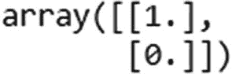

简单地说，我们得到一个由列向量![$$ \left[\begin{array}{c}1\\ {}0\end{array}\right] $$](img/502577_1_En_5_Chapter_TeX_IEq31.png)给出的|0⟩。将两个测量值按顺序放在同一个量子位上，就可以看到结果。第一次测量是随机的，但是第二次测量是确定的，因为在第一次测量之后在计算基础上没有叠加。因此，第二次测量总是给出与第一次相同的结果。下面是我们 Jupyter 笔记本的清单 [5-4f](#PC27) 中对此的模拟。我们通过将两次测量的结果写入两个不同的经典寄存器来创建它。

```py
c = ClassicalRegister(2)
circuit = QuantumCircuit(q, c)
circuit.h(q[0])
circuit.measure(q[0], c[0])
circuit.measure(q[0], c[1])
job = execute(circuit, backend, shots=100)
job.result().get_counts(circuit)

Listing 5-4fMeasurment Statistics MeasMixedSt_qiskit.ipynb

```

下面显示了输出。


可以看到，没有 01 或 10 之类的输出。

现在你已经看到了单量子位中的测量行为，测量多量子位系统是有帮助的。大多数量子计算机实现的是局部测量，也就是说每个量子比特都是单独测量的。因此，如果我们有一个两量子位系统，其中第一个量子位处于相等的叠加态，第二个处于|0⟩态，也就是说，我们有状态，我们观察到“0 和 0”或“0 和 1”作为两个量子位的测量结果。

```py
q = QuantumRegister(2)
c = ClassicalRegister(2)
circuit = QuantumCircuit(q, c)
circuit.h(q[0])
circuit.measure(q, c)
job = execute(circuit, backend, shots=100)
plot_histogram(job.result().get_counts(circuit))

Listing 5-4gMeasurment of Multi-Qubit Systems MeasMixedSt_qiskit.ipynb

```

这将直方图作为统计输出，如图 [5-18](#Fig21) 所示。


图 5-18

多量子比特系统的测量统计

接下来，让我们对一个纠缠态进行测量，并获得 100 次这样的测量后的统计量。

```py
q = QuantumRegister(2)
c = ClassicalRegister(2)
circuit = QuantumCircuit(q, c)
circuit.h(q[0])
circuit.cx(q[0], q[1])
circuit.measure(q, c)
job = execute(circuit, backend, shots=100)
plot_histogram(job.result().get_counts(circuit))

Listing 5-4hMeasurement of Entangled State MeasMixedSt_qiskit.ipynb

```

列表 [5-4h](#PC29) 给出了图 [5-19](#Fig22) 所示的直方图作为统计输出。


图 5-19

纠缠系统的测量统计

作为输出，我们只观察 00 和 11。既然状态是，这应该不足为奇。然而，这里发生了一些不寻常的事情。在最后一段代码的末尾，有相同的统计数据，但是在相同的量子位上有*个测量值。我们有*两个空间分离的量子位*表现出相同的行为，这是一种*非常强的关联形式*。这意味着，如果我们测量一个量子位并得到比如说 0 的结果，我们肯定知道如果我们测量另一个量子位，我们也会得到 0，即使第二次测量*也是一个随机变量。**

为了更好地理解这一点，想象我们正在投掷两枚无偏的硬币。如果我们观察其中一个的正面，除了一个概率为 0.5 的预测外，我们完全无法知道另一个可能是什么。如果我们使用有偏见的硬币，那么我们可能会提高我们的预测准确性。然而，我们仍然不能根据我们在一枚硬币上观察到的结果来肯定地说另一枚硬币是什么。

尽管纠缠现象与两个量子位之间的物理距离无关，甚至可以跨越光年的宇宙距离，但纠缠量子位之间不存在激活或瞬时“超过光速”信号。*测量对于量子位是局部的，*信息也是局部的。如果其他人正在测量另一个量子位，我们必须通过经典的通信渠道告诉这个人，我们碰巧知道结果会是什么。因此，虽然我们肯定不能用纠缠来违反相对论，但这种强关联形式仍然是许多量子算法的核心。

### 混合状态

混合状态在第 [1](1.html) 章中进行了阐述。一个*密度矩阵*是另一种写量子态的方式，而不是 kets。正如我们已经看到的，胸乳是一种投射。但是它们也可以形成密度矩阵。例如，我们可以写𝜌=|𝜓⟩⟨𝜓|，𝜌是|𝜓⟩.的密度矩阵玻恩法则仍然适用，但是现在结果的*轨迹*变得重要了。例如， *Tr* [|0⟩⟨0| *ρ* |]将是看到 0 的概率。清单 [5-4i](#PC30) 是这样的代码。

```py
ψ = np.array([[1], [1]])/np.sqrt(2)
ρ = ψ.dot(ψ.T.conj())
Π_0 = zero_ket.dot(zero_ket.T.conj())
np.trace(Π_0.dot(ρ))

Listing 5-4iTrace in Mixed States MeasMixedSt_qiskit.ipynb

```

这给出了输出


换句话说，再拿一半。测量后的重正化类似地发生，如下所示。

![$$ \frac{\left|\left.0\right\rangle \left\langle 0\right|\rho \right|\left.0\right\rangle \left\langle 0\right|}{Tr\left[\left|\left.0\right\rangle \left\langle 0\right|\rho \right|\right]\kern0.5em } $$](img/502577_1_En_5_Chapter_TeX_Equbt.png)

这显示在清单 [5-4j](#PC31) 中。

```py
probability_0 = np.trace(Π_0.dot(ρ))
Π_0.dot(ρ).dot(Π_0)/probability_0

Listing 5-4jRenormalization MeasMixedSt_qiskit.ipynb

```

随着输出


尽管每个状态都被创建为 ket 和 bra，但还有其他被称为混合状态的状态:纯状态上的经典概率分布。形式上，一个混合状态写成∑*ρ*<sub>*I*</sub>∣*ψ*<sub>*I*</sub>⟩⟨*ψ*<sub>*I*</sub>∣，其中∑*ρ**I*= 1， *ρ* <sub>我们可以举个例子，比较一下相等叠加态和混合态 0.5( ∣ 0⟩⟨0| + | 1⟩⟨1 ∣)的密度矩阵，如清单 [5-4k](#PC32) 所示。</sub>

```py
zero_ket = np.array([[1], [0]])
one_ket = np.array([[0], [1]])
ψ = (zero_ket + one_ket)/np.sqrt(2)
print("Density matrix of the equal superposition")
print(ψ.dot(ψ.T.conj()))
print("Density matrix of the equally mixed state of |0><0| and |1><1|")
print((zero_ket.dot(zero_ket.T.conj())+one_ket.dot(one_ket.T.conj()))/2)

Listing 5-4kMixed State MeasMixedSt_qiskit.ipynb

```

输出如下。


被称为*相干*的*非对角*元素在第二种情况下消失了。相干性的存在表明状态是量子的。这些值越小，量子态就越接近经典的概率分布。

第二密度矩阵只有*个对角*元素，且相等；这是一个*均匀分布*的等价写法。均匀分布具有*最大熵*，因此，具有这种结构的密度矩阵称为*最大混合态。换句话说，我们完全不知道规范基的哪些元素构成了状态。*

理想情况下，量子态应该与环境完全隔绝。然而，在现实中，量子计算机还不能实现高度的隔离。因此，相干性慢慢地消失在环境中。这个过程叫做*消相干*。退相干发生的速度决定了我们可以在量子计算机上运行的量子算法的*长度:如果它发生得很快，我们就有时间应用一些门或进行任何其他形式的计算，并快速测量结果。*

密度矩阵比状态向量更有表现力，因为状态向量只能表示纯状态。但是，即使是一个处于混合状态的系统，它也可以被看作是一个处于纯状态的更大系统的一部分。这个*将放大系统的混合态*转化为纯态的过程叫做*净化*。一个 *n* 量子位系统的混合状态可以通过添加更多的 *n* 量子位并与 2 *n* 量子位系统一起工作来提纯。一旦纯化，2 个 *n 个*量子位的联合系统处于纯态，而第一个 *n 个*量子位仍处于原始混合态。

## 开放和封闭量子系统

让我们从列出你已经获得的封闭量子系统的见解开始。

*   封闭系统是基本的，任何考虑中的系统都表示为封闭系统。

*   在标准量子力学中，人们考虑封闭系统(即，与环境完全隔离的系统)。由此产生的动力是单一的。

*   这是一种理想化，因为物理系统不可能与它们的环境完全隔离(也许与整个宇宙隔离)。

在封闭的量子系统中，系统的动力学完全独立于环境的动力学。因此，在这个系统产生时与它相关的可观察量，例如，它的总能量，在系统演化期间保持不变。这样的系统，虽然便于获得洞察力和理解，但远远不现实。图 [5-20](#Fig23) 显示了封闭量子系统的图示。


图 5-20

封闭量子系统

然而，由于每个量子系统都与它的环境相互作用，遵守完美幺正量子动力学的孤立、封闭量子系统的理想化是一种理想化。事实上，每个系统都是开放的，这意味着它与外部环境相耦合。图 [5-21](#Fig24) 展示了一个开放的量子系统。


图 5-21

开放量子系统

开放量子系统理论是几乎所有现代量子力学及其应用研究的基础。有时，这些开放系统的影响很小，但它们很难被忽略。这在量子信息处理领域中特别相关，在该领域中，相对于经典信息处理的量子优势的存在通常首先来自理想化的封闭系统观点，然后必须在现实的开放系统环境中重新审视。有了这些想法，我们开始考虑以下观点来研究开放系统。

*   开放系统是基础，任何考虑中的系统都表示为开放系统。

*   感兴趣的系统与外部环境相互作用的事实对于我们描述该系统是至关重要的。

当我们在混合环境中单独观察子系统 A 时，两体系统的纯态可能表现得像混合态。如果我们只想知道 A 的动力学呢？即使我们不完全了解子系统 B，我们能描述它的演化吗？如果我们假设二体系统的状态经历幺正演化，我们如何单独描述 A？

封闭系统和开放系统之间的区别在于将系统与环境分开的边界的假定特征。对于封闭系统，边界是不可渗透的(即，系统和环境之间不允许信息流，从而使系统能够孤立地发展)。因此，完整的哈密顿量描述了系统本身的动力学。

在开放的量子系统中，边界不再是不可渗透的，因此，系统可以自由地与其环境交换信息，无论是相位还是能量。因此，没有一个框架来确保可观测的量在系统的演化过程中保持守恒。一个开放的系统比一个封闭的系统更接近真实的场景。因此，宇宙中包含的任何东西(即宇宙的任何子系统都必须是开放系统)。任何被认为是封闭系统的系统都只是一种近似。

量子态演化，其演化由酉矩阵描述。这导致了量子计算中一些有趣的性质。酉进化对于一个封闭的系统是真实的；也就是一个与环境完美隔绝的量子系统。我们今天拥有的量子计算机却不是这样，它们是开放的量子系统，由于与环境的不可控相互作用而发生不同的进化。在本节中，我们将通过一些 Jupyter 笔记本示例来深入了解这一过程。对开放量子系统和相关动力学的深入理论讨论超出了本书的范围。我推荐 Rivas 和 Huelga 的书[62]和麻省理工学院开放课件[63]。

在这本笔记本中，我们对这两种类型的进化都有所了解。如果一个算子与它自己的伴随算子相乘时产生一个单位矩阵作为输出，则该算子被认为是酉的。酉算子有一个与其共轭算子相等的逆算子。算子 *U* 的逆用*U*T4】1 表示。这满足以下关系。

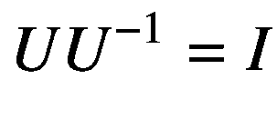

其中 *I* 是恒等运算符。

为了使 *U* 成为一体，

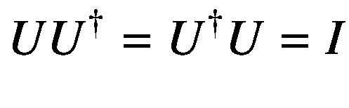

和


“非”运算是由量子计算机中的 *X* 门执行的。虽然关于门的一般性讨论只出现在后续的笔记本中，但是我们可以研究 X 门的属性。它的矩阵表示是。Jupyter 笔记本代码`ClosedOpenSystems.ipynb`的清单 [5-5a](#PC33) 验证它是否确实是酉的。


```py
import numpy as np
X = np.array([[0, 1], [1, 0]])
print("XX^dagger")
print(X.dot(X.T.conj()))
print("X^daggerX")
print(X.T.conj().dot(X))

Listing 5-5aEvolution of Unitary Gates ClosedOpenSystems.ipynb

```

清单 [5-5a](#PC33) 给出以下输出。


因此， *X* 看起来是一个合法的酉运算。单一性确保了*1*<sub>2</sub>范数得以保留；也就是说，量子态被映射到量子态。清单 [5-5b](#PC34) 显示了寻找范式演变的代码。

```py
print("The norm of the state |0> before X is applied")
zero_ket = np.array([[1], [0]])
print(np.linalg.norm(zero_ket))
print("The norm of the state after X is applied")
print(np.linalg.norm(X.dot(zero_ket)))

Listing 5-5bEvolution of Norm ClosedOpenSystems.ipynb

```

以下输出确认了规范得到了保留。


由于酉运算是矩阵，所以*线性*。测量值也用矩阵表示。这两个观察暗示量子计算机实现的一切都是线性的。如果某种形式的*非线性*是期望的，那么这必须涉及一些经典的干预。

酉运算的另一个结果是可逆性(即，任何酉运算都可以反转)。因此，量子计算库通常提供逆转整个电路的功能。由于 *X* 门是自身的共轭转置，因此需要再次应用该门进行反转，这意味着*X*T4】2= 1。

```py
import numpy as np
from qiskit import QuantumCircuit, ClassicalRegister, QuantumRegister
from qiskit import execute
from qiskit import BasicAer
from qiskit.tools.visualization import circuit_drawer
np.set_printoptions(precision=3, suppress=True)
backend_statevector = BasicAer.get_backend('statevector_simulator')
q = QuantumRegister(1)
c = ClassicalRegister(1)
circuit = QuantumCircuit(q, c)
circuit.x(q[0])
circuit.x(q[0])
job = execute(circuit, backend_statevector)
print(job.result().get_statevector(circuit))

Listing 5-5cEvolution of norm ClosedOpenSystems.ipynb

```

输出是


这和预期的完全一样是 0。

正如我们之前强调的，真实的量子系统很少是封闭的。他们不断地以一种非常困难的方式与他们的环境进行交互，以今天的技术水平来看，有时是不可能控制的，这反过来又会导致他们失去连贯性。对于当前和近期的量子计算机来说也是如此。这意味着它们的实际时间演化不是由一个酉矩阵描述的，而是由一个叫做*完全* *正轨迹保持映射*的其他算子描述的。

量子计算库通常提供各种噪声模型来模拟和模仿不同类型的相互作用。增加与环境相互作用的强度会导致*更快的*消相干。退相干的时间尺度通常被称为*T*T4】2 时间。在其他几个参数中， *T* <sub>2</sub> 时间对于门的数量或我们可以执行的量子计算的持续时间至关重要。

研究退相干效应的一个简单方法是将一个纯态与最大混合态混合，其中𝑑是量子比特的数量。这样，我们不必指定噪声模型或任何其他映射建模去相干。例如，我们可以混合|𝜙+⟩态和最大混合态。

```py
def mixed_state(pure_state, visibility):
    density_matrix = pure_state.dot(pure_state.T.conj())
    maximally_mixed_state = np.eye(4)/2**2
    return visibility*density_matrix + (1-visibility)*maximally_mixed_state

φ = np.array([[1],[0],[0],[1]])/np.sqrt(2)
print("Maximum visibility is a pure state:")
print(mixed_state(φ, 1.0))
print("The state is still entangled with visibility 0.8:")
print(mixed_state(φ, 0.8))
print("Entanglement is lost by 0.6:")
print(mixed_state(φ, 0.6))
print("Hardly any coherence remains by 0.2:")
print(mixed_state(φ, 0.2))

Listing 5-5dMaximally Mixed State ClosedOpenSystems.ipynb

```

清单 [5-5d](#PC36) 给出了以下输出。


在开放系统中观察量子态的一种方式是通过它的平衡过程。例如，一杯热气腾腾的茶由于与环境相互作用而失去热量，最终达到环境的温度。这个过程包括能量交换。量子态表现出同样的行为。

这个平衡态被称为*热态* *，*，它有一个非常特殊的结构，我们以后会再讨论它。取自热状态的统计样本的*能量*遵循波尔兹曼分布【64 】,由下式给出


其中*p*(*ϵ*<sub>*I*</sub>)为状态 *i* 的概率。 *ϵ* <sub>*i*</sub> 是状态 *i* 的能量。 *k* 是玻尔兹曼常数。 *T* 是系统的温度。M 是感兴趣系统可访问的所有状态的数量。 *Q* 是归一化分母。温度越高，我们就越接近均匀分布。在无限温度极限下，它恢复均匀分布。在高温下，所有能级的概率相等。相比之下，在零温度下，整个概率质量都集中在最低能级——基态能量。为了了解这个过程，清单 [5-5e](#PC37) 绘制了不同温度下的玻尔兹曼分布。

```py
import matplotlib.pyplot as plt
temperatures = [.5, 5, 2000]
energies = np.linspace(0, 20, 100)
fig, ax = plt.subplots()
for i, T in enumerate(temperatures):
    probabilities = np.exp(-energies/T)
    Z = probabilities.sum()
    probabilities /= Z
    ax.plot(energies, probabilities, linewidth=3, label = "$T_" + str(i+1)+"$")
ax.set_xlim(0, 20)
ax.set_ylim(0, 1.2*probabilities.max())
ax.set_xticks([])
ax.set_yticks([])
ax.set_xlabel('Energy')
ax.set_ylabel('Probability')
ax.legend()

Listing 5-5eBoltzmann Distribution ClosedOpenSystems.ipynb

```

这给出了图 [5-22](#Fig25) 中的图作为输出。


图 5-22

玻尔兹曼能量分布

该图显示 T1 < T2 < T3。T1 是低温，并且预期在低能级急剧达到峰值。相比之下，T3 是非常高的温度，概率分布几乎完全平坦。

这些练习旨在增加你对来自外部观察者的测量的影响如何触发在封闭系统中没有类似物的新型多体现象的理解。概括地说，孤立量子系统的时间演化由单个厄米算符(即哈密顿量)描述。相反，在连续观察下，由于测量反作用，动力学变得本质上非酉，并且不仅由哈密顿量表征，而且由测量过程表征。

## 量子主成分分析

机器学习和分析练习通常有许多特征，其中一些是相关的。例如，考虑房价，它是房子的许多特征的函数，例如卧室和浴室的数量、平方英尺、地段大小、建造日期和位置。通常，您希望将要素的数量限制为最重要的要素(即获取数据中最大方差的要素)。例如，如果有人只考虑特定街道上的房屋，那么位置可能并不重要，但面积可能会有很大的差异。

确定哪些特征捕捉到最大的方差被称为*主成分分析* (PCA) [65]。数学上，PCA 涉及获取原始数据(例如，各种房屋的特征向量)并计算协方差矩阵。

参考文献[66]中提出的用于执行 qPCA(量子 PCA)的量子算法使用密度矩阵表示。这里讨论的算法有四个主要步骤。

1.  在量子密度矩阵 *ρ* 中编码协方差矩阵σ。

2.  准备多份 *ρ* 。

3.  对每个拷贝和一个目标系统执行指数*交换*操作。

4.  执行量子相位估计以确定特征值。

要在高噪声模拟器上实现这种 qPCA 算法，请参考参考文献[67]。作者还在 GitHub 的 [`https://github.com/rmlarose/vqsd`](https://github.com/rmlarose/vqsd) 发布了 Cirq 中的代码。图 [5-23](#Fig26) 显示了在噪声量子模拟器上实现 qPCA 量子算法的步骤。作者称该算法为*变分量子态对角化*或 VQSD。


图 5-23

qPCA/VQSD 算法实现(来源[67])

下面解释 VQSD 算法的步骤，如图 [5-23](#Fig26) 所示。

(a)输入是量子态 *ρ* 的两个副本。这些状态被发送到参数优化循环，(b)其中混合量子经典变分算法(将在后面的章节中解释)近似对角化酉*U*<sub>T5】p</sub>*α*<sub>*opt*</sub>。这里， *p* 是一个超参数，表示解决方案的质量。该最优酉被发送到特征值读出电路(c)以获得位串 *z* ，其频率提供了对 *ρ* 的特征值的估计。连同最优酉*<sub>*p*</sub>*α*<sub>*opt*</sub>，这些位串被送到本征向量准备电路，(d)在量子计算机上准备 *ρ* 的本征态。特征值和特征向量都是 VQSD 算法的输出。*

 *## 摘要

这一章冒险进入量子算法的第一部分，从我们上一章结束的地方开始。它着眼于一些重要的算法和方法，如 Deutsch-Jozsa 算法，量子计算复杂性，编码技术(基础，张量积，振幅和哈密顿)，以及经典数据输入到量子算法的过程。我们也冒险进入测量和混合状态，量子傅立叶变换，和它的一个重要应用，即相位估计。我们首先查看了 Rigetti 的森林 SDK 和 QVM，并在其他练习中使用了 Qiskit 和 Cirq。下一章继续到先进的量子算法和相关的代码。

Footnotes [1](#Fn1_source)

人们认为这种代码很难被经典计算机破解。例如，没有已知的经典算法能够在有效的时间内分解数字以破解 RSA 加密。

  [2](#Fn2_source)

Aspen、Forest、Forest SDK、Pyquil、QCS、Quantum Advantage Prize、quil、Quilc、Quil-T、QVM 和 Rigetti 是 Rigetti & Co，Inc .的商标或注册商标。

 *