# 八、深度量子学习

> 头脑无所畏惧的地方

> *并且头被抬得高高的*

> 知识是免费的。
> 
> —罗宾德拉纳特·泰戈尔

通过学习来拓展我们的知识是人类的天性。通过不断学习来培养和发展优化我们生活中每一个小角落的艺术，是人类文明史上进步的支柱。我们受益于改善日常生活各个方面的努力。第七章讲述了量子退火，虽然最优化理论来源于数学概念，但它们也可以被转化并构建到物理学中。比如物理学有*最小作用量原理*，最小熵产生*原理*，变分原理*。物理学提供*物理退火*，它先于计算模拟退火。物理学还提供了绝热原理，从量子形式来看，就是量子退火。因此，物理机器可以解决优化的数学问题，包括约束——这种属性可以扩展到使用量子系统来处理经典和量子数据。*

*Note

第章 7 解决了最大割 NP 难问题。本章着眼于利用 D-Wave 的 qbsolve 解决一个更复杂的 NP-hard 问题:旅行推销员问题。我们还从第 2 和 3 章中从经典神经网络获得的见解中收集信息，并在 Xanadu 的 PennyLane 和谷歌的 TensorFlow Quantum 提供的库的帮助下，发展成为量子深度学习的选项。

为了解决今天的现实问题，量子计算机需要读取、解释和分析输入数据集。量子系统的输入数据可以是自然或人工量子系统中的任何数据源。

图 5-6 显示了经典数据驱动量子计算过程的三个一般执行阶段，此处再次显示以供参考。

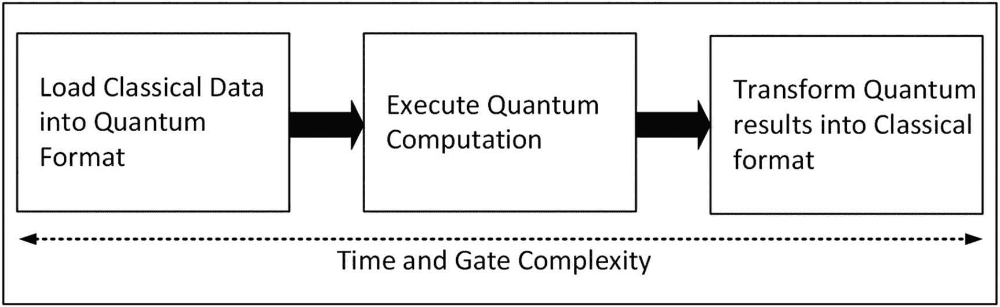

*转载图* 5-6 *。量子计算机执行的三个阶段*

将经典数据加载到量子态以供量子计算机处理的量子电路公式是当前研究的活跃焦点。由于不同的量子算法对如何加载经典输入数据并将其格式化成相应的量子状态具有不同的限制，因此目前在该领域中使用了几种数据加载电路(例如，基本编码、幅度编码等。).随着本章的深入，你会看到经典数据是如何通过量子系统进行编码和处理的。

作为第七章的延续，我们来看看如何使用 D-Wave 的 qbsolve 来解决一个众所周知的 NP 难题:旅行销售人员。

## 通过 D-Wave 优化学习

在第七章中，我们从 D-Wave 探索了一些基于量子退火的系统可以解决的功能和问题。经典的最优化问题，由方程式 7 给出。27 (为便于阅读在此转载)，给了我们以下数学表达式，可以用来在 D-Wave 平台上建立编程模型。

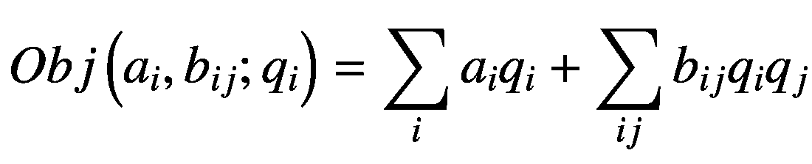

方程式 7。27 通过伊辛模型哈密顿量量化，并用于通过在退火驱动平台上映射来实现量子增强优化。为此，方程式 7。4 ， 7。5 和 7。27 制定以下哈密顿量(D-Wave 文档[144])。

![$$ H(s)=A(s)\sum \limits_i{\sigma_i}^x+B(s)\left[\sum \limits_i{a}_i{\sigma_i}^z+\sum \limits_{ij}{b}_{ij}{\sigma_i}^z{\sigma_j}^z\right] $$](img/502577_1_En_8_Chapter_TeX_Equb.png)

(8.1)

其中 *A* ( *s* )和 *B* ( *s* )为拉格朗日乘数。 <sup>1</sup> 在编程术语中， *A* ( *s* )也被称为`gamma`参数(后面解释)。

在这种背景下，熟悉 D-Wave 的 QB solve([`https://github.com/dwavesystems/qbsolv`](https://github.com/dwavesystems/qbsolv))【161】是有帮助的。qbsolve 是一个分解，混合量子/经典求解器。它通过将一个大型二次无约束二元优化(曲波)问题分解成多个部分来寻找其最小值，通过 D-Wave 系统或经典的禁忌求解器来求解。这是一个开源软件工具，专为太大和/或太密集的问题而设计，无法在 D-Wave 量子计算机上运行，该计算机将问题分成块，并迭代成子量子。qbsolve 过程可以在经典计算机上运行。

qbsolve 采用曲波文件格式或 Q 矩阵作为模拟退火或 QPU 的输入，并给出位串作为输出(见图 8-1 )。

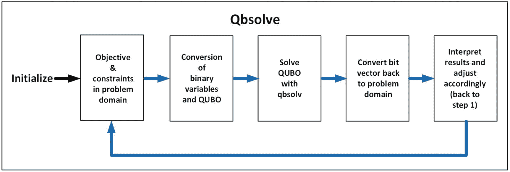

图 8-1

免除混合算法工作流

图 8-1 显示了 qbsolve 算法的工作流程，包括以下步骤。

*   读取曲波实例

*   划分成更小的子量子

*   求解子量子(这可以在 CPU 或 QPU 上完成)

*   合并结果

qbsolve 的一个很好的例子是旅行推销员问题。

### 旅行推销员问题(qbsolve)

旅行推销员问题(TSP)<sup>2</sup>【162】是一个众所周知且臭名昭著的 NP-hard 问题，它让数学家们兴奋了几个世纪，也让计算机科学家们兴奋了几十年。从应用程序的上下文来看，TSP 类型的问题在金融和营销行业中很重要。TSP 由于其*硬度*以及与实践中出现的一些其他相关组合优化问题的相似性而被认为是重要的。

基于早期分析的数学公式是由爱尔兰数学家 W. R .汉密尔顿和英国数学家托马斯·柯克曼在 19 世纪早期提出的。从数学上来说，这个问题可以用图来抽象(例如，最大割)。图的节点上的 TSP 要求可以通过每个节点的最短哈密顿圈。哈密尔顿圈是一个封闭的路径，它使用图的每个顶点一次。一般的解决方案是*未知的，*并且有效地找到它的算法，例如，不期望在多项式时间内存在。

TSP 的公式如下:一个旅行推销员从一个城市到另一个城市去推销商品。给定一个城市列表和每对城市之间的距离，最短的可能路线是什么，可以访问每个城市一次，然后返回出发城市？这种优化的路线使销售人员能够在最短的时间内实现最大的潜在销售额。

在我们的例子中，我们考虑一个九个城市的 TSP，其中销售人员必须访问九个城市来进行销售。这个问题对于任何数量的城市都可以解决。我们选择了以下九个美国首都城市，并用它们的位置参数(纬度和经度)定义了一个数据文件(`data_9cities.txt`)，并为它们编制了索引，以便于编程(该文件可在本书的网站上找到)。

```py
0,Colorado,Denver,39.7391667,-104.984167
1,Connecticut,Hartford,41.767,-72.677
2,Delaware,Dover,39.161921,-75.526755
3,Illinois,Springfield,39.783250,-89.650373
4,Indiana,Indianapolis,39.790942,-86.147685
5,Massachusetts,Boston,42.2352,-71.0275
6,Michigan,Lansing,42.7335,-84.5467
7,New Hampshire,Concord,43.220093,-71.549127
8,New Jersey,Trenton,40.221741,-74.756138

```

我们定义了另一个数据文件(`data_distance9.txt`)，其中每对首都城市之间的距离总共为 9 × 8 = 72 个距离(这个文件可以在本书的网站上找到)。下面是一个问题路径的例子。


或者


如果路径和行进时间对于销售人员来说是优化的，则可以使用任何其他组合来最大化他们的销售。当制定 QUBU 时，在我们的问题中考虑以下两个约束。

*   销售人员在他开始的地方结束。

*   他每个城市只去一次。

最初，我们需要考虑用数学方法来建模这个问题。为此，我们首先定义我们的*二进制变量*。


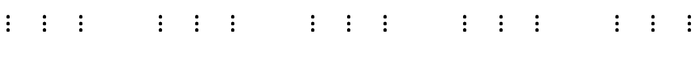


这些约束允许我们用数学公式来最小化我们的距离算子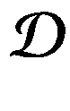

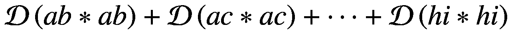

记住我们的限制，每个城市在曲波出现两次——一次到达，一次离开。举个例子，

对于城市 0(丹佛)，我们有

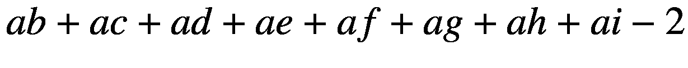

对于城市 1(哈特福德)，我们有

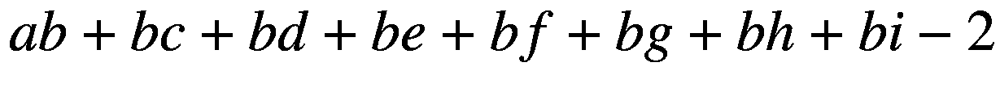

如此类推，直到第八个城市，也就是特伦顿。

既然我们已经定义了预备工作，我们必须制定约束和目标(方程式)7。27 。

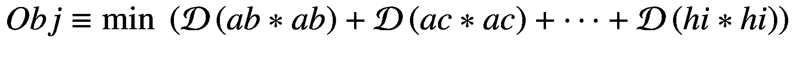

其中， *min* 代表*最小化*。*最小化*的动作寻找边之间的最短距离，这发生在相等时。使用正方形是为了消除负距离。*约束*由下式给出

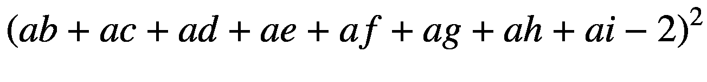

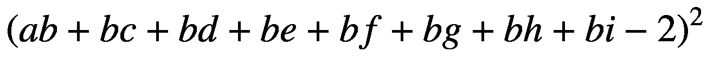

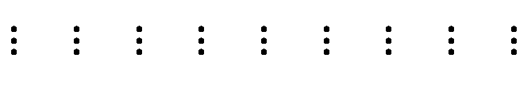

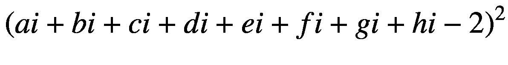

接下来，我们结合目标和约束来制定我们的曲波。

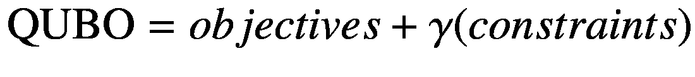

其中， *γ* 是一个拉格朗日参数，可以对其进行调整以获得最佳结果。

有了这个，我们开始练习 Jupyter 笔记本文件`TSP_9City_Dwave.ipynb`,可以从该书的网站下载。第一个代码片段是库和可视化工具。


```py
## Libraries & visualization tools for us to use.
import networkx as nx
import pylab
import matplotlib.pyplot as plt
from matplotlib.pyplot import pause
import sys
from bokeh.sampledata import us_states
from bokeh.plotting import *
from bokeh.models import Plot, Range1d, MultiLine, Circle, HoverTool, TapTool, BoxSelectTool
from bokeh.io import output_notebook
from bokeh.palettes import Spectral4
from bokeh.models.graphs import from_networkx, NodesAndLinkedEdges, EdgesAndLinkedNodes
output_notebook()
%matplotlib inline
import argparse
import re

Listing 8-1aLibraries and Pauli 

Matrices for TSP_9City_Dwave.ipynb

```

这里的`bokeh`指的是为现代网络浏览器创建交互式可视化的 Python 库。在我们的练习中，我们用它来创建一张美国地图和旅行过的城市的地图。

下一个任务是设置问题中城市的数量和一个索引函数。二元变量是*x*<sub>T3】I， *j*</sub> = 1 当且仅当在停靠点 *j* 访问城市 *i* 时。曲波字典/矩阵是*N*T14】2×*N*T18】2，因此，这些变量必须被赋予行和列索引。函数 *x* ( *a* ， *b* )给 *x* <sub>*a* ， *b*</sub> 变量分配一个曲波矩阵索引。

```py
# Number of cities in our problem
N = 9
# Function to compute index in Q for variable x_(a,b)
def x(a, b):
    return (a)*N+(b)

Listing 8-1bMatrix for TSP_9City_Dwave.ipynb

```

在这个例子中，有两个*拉格朗日参数*。

*   *A* 或`gamma`是标准的拉格朗日参数，表示我们的约束在我们的解决方案的质量中有多重要。这可以微调以获得最佳结果。这决定了是满足约束条件更重要还是找到最短距离更重要。对于这个问题，至关重要的是我们要访问路线上的每个城市，所以我们应该将这个参数设置为大于两个城市之间的最大距离。

*   𝐵指出了目标函数在我们的曲波中的重要性。一般我们定义 *B* = 1，修改 *A* 中的值。

也可以调整以下参数。

*   **链强度** ( `chainstrength`):这告诉嵌入函数将物理量子位的链捆绑在一起形成一个逻辑量子位的强度。这应该大于曲波中的任何其他值。

*   **运行次数** ( `numruns`):这告诉系统我们的问题要运行多少次。由于 D 波 QPU 的概率性质，我们应该多次运行该问题，并寻找找到的最佳解决方案。

这段代码不会在物理 QPU 上运行，而是离线或传统地使用`qbsolv`。`numruns`经常运行`qbsolv`，但是*链强度*不会影响样本，除非我们修改代码使用 QPU。

```py
# Gamma = A
A = 6500
B = 1
chainstrength = 3000
# Number of runs
numruns = 100

Listing 8-1cTunable Parameters TSP_9City_Dwave.ipynb

```

接下来，利用城市位置`data_9cities.txt, the`第一个数据文件，我们生成美国地图。销售人员去过的城市用红色标出。

```py
us_states = us_states.data.copy()
# Delete states Hawaii and Alaska from mainland map
del us_states["HI"]
del us_states["AK"]
# separate latitude and longitude points for the borders
#   of the states.
state_xs = [us_states[code]["lons"] for code in us_states]
state_ys = [us_states[code]["lats"] for code in us_states]
with open('data_9cities.txt', "r") as myfile:
    city_text = myfile.readlines()
    myfile.close()
cities = [',']*N
states = [',']*N
lats=[]
longs=[]
for i in city_text:
    index, state, city,lat,lon = i.split(',')
    cities[int(index)] = city.rstrip()
    states[int(index)] = state
    lats.append(float(lat))
    longs.append(float(lon))

# init figure
p = figure(title="Find shortest route that visits each city",
           toolbar_location="left", plot_width=550, plot_height=350)
# Draw state lines
p.patches(state_xs, state_ys, fill_alpha=0.0,
    line_color='blue', line_width=1.5)
# The scatter markers
p.circle(longs, lats, size=10, color='red', alpha=1)
show(p)

Listing 8-1dMap

of the cities TSP_9City_Dwave.ipynb

```

这段代码生成了如图 8-2 所示的美国地图，突出显示了 bokeh 提供的九个城市。

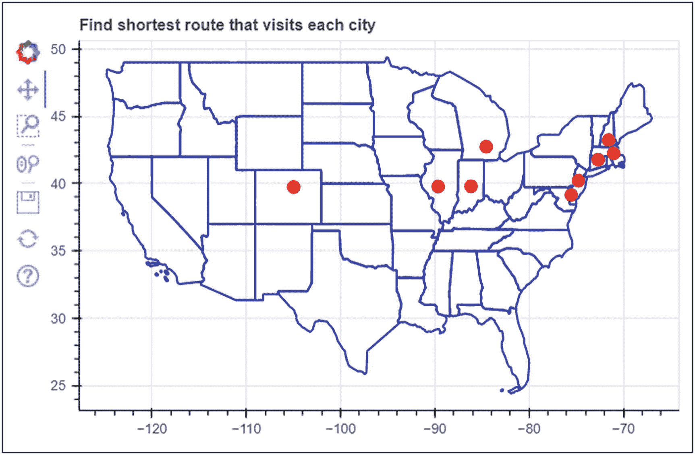

图 8-2

参观过的九个城市的地图

现在我们有了基础地图，我们通过文件`data_distance9.txt`上传城市间的距离。

```py
# Input file containing inter-city distances
fn = "data_distance9.txt"

# check that the user has provided input file
try:
  with open(fn, "r") as myfile:
    distance_text = myfile.readlines()
    myfile.close()
except IOError:
  print("Input distance file missing")
  exit(1)

Listing 8-1eInter-City Distances TSP_9City_Dwave.ipynb

```

距离存储在一个 *N* × *N* 矩阵中。矩阵在对角线上有零点。从一个城市(例如 0)到下一个城市(例如 1)的距离在条目中，因为当在两个城市之间的任一方向旅行时，距离是相同的。矩阵是对称的。

```py
# Initialize matrix of correct size with all 0's
D = [[0 for z in range(N)] for y in range(N)]
# Read in distance values and enter in matrix
for i in distance_text:
  if re.search("^between", i):
    m = re.search("^between_(\d+)_(\d+) = (\d+)", i)
    citya = int(m.group(1))
    cityb = int(m.group(2))
    D[citya][cityb] = D[cityb][citya] = int(m.group(3))

Listing 8-1fCreate the Matrix TSP_9City_Dwave.ipynb

```

在下一步中，我们通过创建一个所有值都初始化为 0 的空 Q 矩阵，开始开发这个问题的曲波。

```py
Q = {}
for i in range(N*N):
    for j in range(N*N):
        Q.update({(i,j): 0})

Listing 8-1gQ-matrix TSP_9City_Dwave.ipynb

```

下一个代码块定义了在置换矩阵中每行恰好有*个* 1 的约束。对于第 1 行，此约束条件为

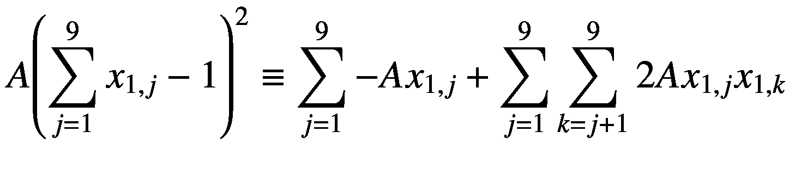

```py
for v in range(N):
    for j in range(N):
        Q[(x(v,j), x(v,j))] += -1*A
        for k in range(j+1, N):
            Q[(x(v,j), x(v,k))] += 2*A

Listing 8-1hPermutation Matrix TSP_9City_Dwave.ipynb

```

下一步是开发曲波。主要目标是最小化行进的距离。

考虑这样的情况，旅行的销售人员在第 3 站访问城市 *u* ，在第 4 站访问城市 *v* 。然后，他在这一段旅行的距离是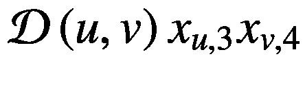。如果他在第 3 站访问城市 *u* 并在第 4 站访问城市 *v* ，则总距离增加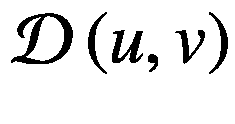，否则总距离增加 0。因此，对于每一对城市， *u* 和 *v* ，我们添加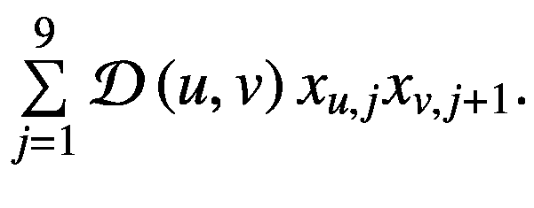这将添加从城市 *u* 和 *v* 到总路线的直接行驶距离。双向中的每个 *u* 和 *v* 选项都需要添加。

```py
for u in range(N):
    for v in range(N):
        if u!=v:
            for j in range(N):
                Q[(x(u,j), x(v,(j+1)%N))] += B*D[u][v]

Listing 8-1iAdd Distance objective TSP_9City_Dwave.ipynb

```

#### 运行问题

现在我们离线运行 qbsolv。qbsolv <sup>3</sup> 是一个问题分解工具，它既可以经典的离线运行(例如在我们的笔记本电脑上)，也可以以经典和 QPU 的混合方式运行。

```py
from dwave_qbsolv import QBSolv
resp = QBSolv().sample_qubo(Q)

Listing 8-1jRun qbsolve TSP_9City_Dwave.ipynb

```

下一步，我们做*后处理*。一旦`qbsolv`运行，我们收集结果并报告找到的最佳答案。这里，我们列出了找到的最低能耗解决方案、销售人员路线中城市的访问顺序，以及这条路线所需的总里程。我们在此输出中包含了一些有效性检查，指示某个站点是否被分配给多个城市，以及某个站点是否没有分配城市。

```py
# First solution is the lowest energy solution found
sample = next(iter(resp))
# Display energy for best solution found
print('Energy: ', next(iter(resp.data())).energy)
# Print route for solution found
route = [-1]*N
for node in sample:
    if sample[node]>0:
        j = node%N
        v = (node-j)/N
        if route[j]!=-1:
            print('Stop '+str(i)+' used more than once.\n')
        route[j] = int(v)
# Compute and display total mileage
mileage = 0
for i in range(N):
    mileage+=D[route[i]][route[(i+1)%N]]
print('Mileage: ', mileage)
print('\nRoute:\n')
for i in range(N):
    if route[i]!=-1:
        print(str(i) + ':  ' +cities[route[i]]+ ',' + states[route[i]] + '\n')
    else:
        print(str(i) + ':  No city assigned.\n')

Listing 8-1kAdd Distance Objective TSP_9City_Dwave.ipynb

```

这个运行在 qbsolve 上的代码片段以最低的能耗、总里程和路线给出了我们想要的输出。

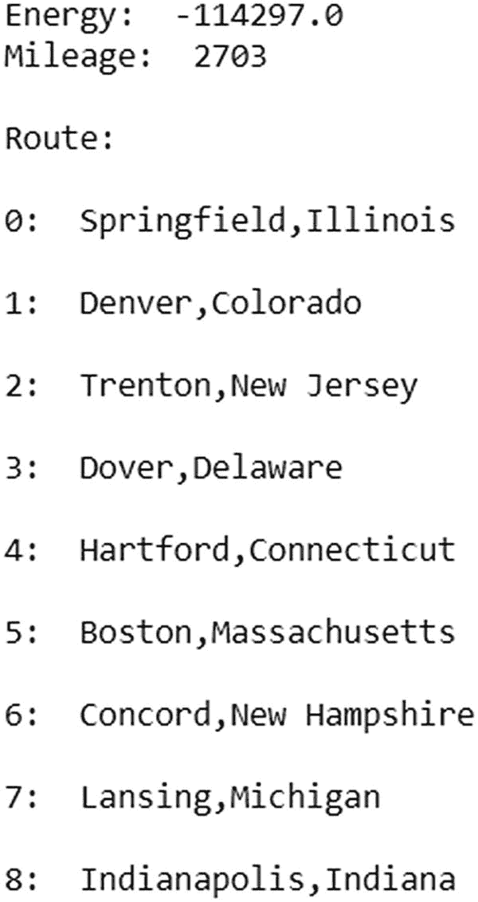

请注意，由于计算的概率性质，所访问城市的顺序可能会因运行而异。鼓励你将拉格朗日值从低变高，并观察计算出的最低能量的变化。通常，参数 *A* 的值被设置为大于两个城市之间的最大距离。

让我们运行一些检查来验证我们的结果是有效的。

*   如果每个城市在我们的列表中恰好出现一次，那么我们的路线列表由数字 0、1、2……(*N*-1)按照一定的顺序组成，总计为*N*(*N*-1)/2。如果这个总数不正确，我们的路线就无效。

*   验证是否每个城市都有指定的站点，反之亦然。如果没有，我们打印一条消息给用户，让他们知道。

```py
alert = 0
if sum(route)!=N*(N-1)/2:
    print('Route invalid.\n')

for i in range(N):
    if route[i]==-1:
        print('Stop '+str(i)+' has no city assigned.')

if alert==0:
    print("Route valid.")

Listing 8-1lVerify If Route Is Valid TSP_9City_Dwave.ipynb

```

在我们的例子中，代码块验证路由是有效的。


最后的代码块将找到的路线可视化。

```py
Path = nx.Graph()
coord={}
coord[route[0]]=(longs[route[0]],lats[route[0]])
Path.add_node(cities[route[0]],pos=coord[route[0]],label=cities[route[0]])

for i in range(N-1):
    e=(cities[route[i]],cities[route[i+1]])
    Path.add_edge(*e)
    coord[route[i+1]]=(longs[route[i+1]],lats[route[i+1]])
    Path.add_node(cities[route[i+1]],pos=coord[route[i+1]],label=cities[route[i+1]])

e=(cities[route[N-1]],cities[route[0]])
Path.add_edge(*e)

fig, ax = plt.subplots(figsize=(120,60))
margin=0.15
fig.subplots_adjust(margin, margin, 1.-margin, 1.-margin)
ax.axis('equal')
nx.draw(Path, nx.get_node_attributes(Path, 'pos'), with_labels=True, width=10, edge_color='b', node_size=200,font_size=72,font_weight='bold', ax=ax)
plt.show()

Listing 8-1mVisualization of the Route TSP_9City_Dwave.ipynb

```

最后一个代码块给出了地图上路径的可视化输出。

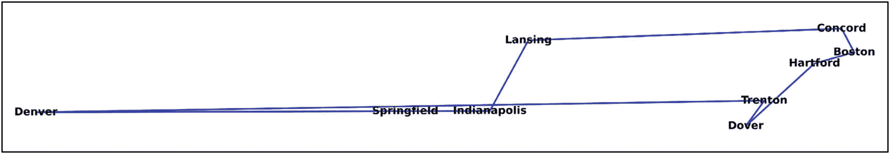

我们鼓励您将数据文件(`data_9cities.txt`和`data_distance9.txt`)修改为更多的城市及其坐标、额外的城市间距离，并多次尝试可视化。随着城市数量的增加，每次跑步的视觉效果可能会有所不同。

如果你有兴趣体验真正的量子位计算代码，D-Wave 在 Leap ( [`https://cloud.dwavesys.com/leap/`](https://cloud.dwavesys.com/leap/) )上提供有限的免费用户配额——基于云的硬件平台访问。如第 1 和 7 章所述，来自 38 个国家(目前)的用户可以在 Leap 注册免费账户，并利用大量的培训材料、文档、开发者资源等等。一旦您登录到 Leap 平台，他们需要在第一个登录屏幕上向下滚动。左下角有一个带有 API 信息的框，可以复制并用于进行 API 调用，以利用 D-Wave 的实际 QPU。

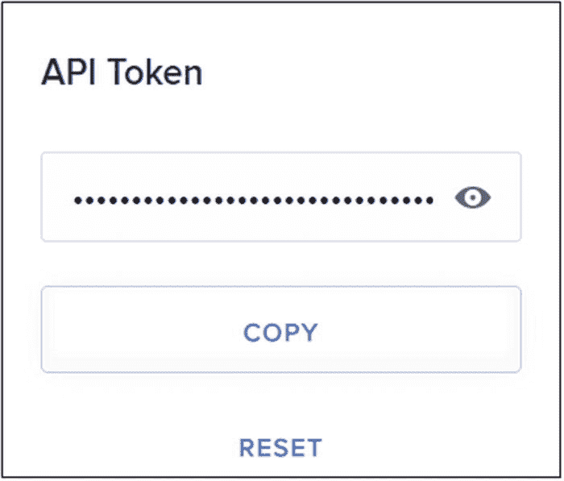

要使用 qbsolve 调用 QPU 来解决本节中的 TSP 问题，可以使用下面的代码块。

```py
from dwave.system.composites import EmbeddingComposite
from dwave.system.samplers import DWaveSampler

sampler = DWaveSampler(solver={'qpu': True})  # Some accounts need to replace this line with the next:
sampler = EmbeddingComposite(DWaveSampler(token = 'my_token', solver=dict(name='solver_name')))
print("Connected to QPU.")

```

蓝色的两个代码行在非此即彼的基础上使用。对于大多数用户来说，需要 API 令牌的第二行是有效的。API 令牌从 Leap 接口复制并输入到`<my_token>`中，以保护到实际 QPU 的连接。使用 qbsolve 时，名称的值由`name='qbsolve'.`给出

让我们前进到量子领域的深度学习方法论。*量子深度学习*今天有几个实现；除了 D-Wave，还有 Google 的 TensorFlow Quantum 和 Xanadu 的 PennyLane。

## 量子深度神经网络

经典深度神经网络是机器学习的有效工具，也是发展深度量子学习方法的基础。最简单的用于量化的深度神经网络是玻尔兹曼机器[139]。经典玻尔兹曼机器(阿克利等人 1985 年[168]；Du 和 Swamy 2019 [169])为概率分布建模提供了一个强大的框架。这些类型的神经网络使用无向图结构来编码相关信息。相应的信息存储在网络节点的偏置系数和连接权重中，这些网络节点通常与二进制自旋系统相关，并被分组为确定输出的那些:可见节点；还有那些作为潜在变量的:隐藏节点。网络结构链接到*能量函数*，其通过使用来自统计力学的概念(即*吉布斯状态*)来促进在可能的节点配置上概率分布的*定义(Boltzmann 1877【170】；吉布斯 1902 [171])。*

经典玻尔兹曼机 <sup>4</sup> 由相互作用可调的部件组成。通过调整这些相互作用来训练玻尔兹曼机器，以便由*玻尔兹曼–吉布斯分布*(见图 7-11b )描述的比特的热统计再现数据的统计。为了量子化玻尔兹曼机器，神经网络被表示为对应于可调谐伊辛模型的一组相互作用的量子自旋。用作玻尔兹曼机器输入的神经元被初始化为固定状态；在此之后，系统可以热化，并且输出量子位作为结果被读取。深度量子学习的一个吸引人的特点是，它不需要大型通用量子计算机。

之前我们讨论了专用量子信息处理器，如量子退火器，它们非常适合构建深度量子学习网络[164，165，166]。本章还着眼于基于可编程光子电路的量子系统，因为它们对于创建高效的量子深度学习网络也是有用的。

经典神经网络涉及神经元的处理、神经元执行的转换、神经元之间的互连、神经网络动力学和学习规则。神经网络学习规则控制神经网络连接强度的变化。神经网络通过监督或无监督方式的训练来区分。神经网络可以使用单个系统来保存不同类别的数据，并以分布式方式对刺激进行分类。因此，神经网络在创建分类系统方面非常有用。

量子态中的相干性被称为*叠加*，被认为类似于经典神经网络中的神经元。量子计算中的测量功能类似于经典神经网络中的互连。神经网络中的增益函数类似于量子计算中的纠缠特性。

量子神经网络(QNN)类似于大脑功能，有助于创建新的信息系统。qnn 用于解决需要指数级容量和内存的经典挑战性问题。简而言之，qnn 被认为是神经计算系统进化的自然下一步。

量子计算和机器学习之间的联系在过去几年里一直在发展。然而，许多定义明确的“教科书”QML 算法是在考虑容错量子计算机的情况下设计的。在当前的高噪声中尺度量子(NISQ)器件时代，需要一套不同的算法、工具和策略。有必要介绍一下 NISQ 时代机器学习的关键思想，并调查一下当前的发展状况。

## 用 Xanadu 进行量子学习

Xanadu 是一家位于加拿大多伦多的全栈量子初创公司，该公司正在推进一种量子光子处理器，该处理器采用开源的全栈量子软件平台，名为 Strawberry Fields。该公司还开发了一个用于量子计算机可微分编程的跨平台 Python 库[146]，名为 PennyLane ( [`https://pennylane.readthedocs.io/en/stable/introduction/pennylane.html`](https://pennylane.readthedocs.io/en/stable/introduction/pennylane.html) )。PennyLane 和 Strawberry 字段是用 Python 实现的。Xanadu 还开始发布他们在不同领域的硬件和软件成果，如量子化学、图论、量子机器学习等。

PennyLane<sup>5</sup>【145】是一个围绕量子可微编程构建的开源软件框架，用量子计算机实现机器学习任务。它将经典的机器学习库与量子模拟器和硬件无缝集成，使用户能够训练量子电路。PennyLane 虽然有 QML 的能力，但也有多种多样的能力。

*   支持混合量子和经典模型，允许用户将量子硬件与 PyTorch、TensorFlow 和 NumPy 连接，从而增强量子机器学习能力

*   允许量子电路的内置自动微分

*   提供优化和机器学习工具

*   硬件不可知——相同的量子电路模型可以在不同的后端运行——并允许插件访问不同的设备，包括 Strawberry Fields、Amazon Braket、IBM Q、Google Cirq、Rigetti Forest、Microsoft QDK 和 ProjectQ

安装 PennyLane 非常简单。它需要 Python 3.6 或更高版本。推荐的 Python 安装是 Anaconda Python 3 ( [`www.anaconda.com/download/`](http://www.anaconda.com/download/) )。因为这本书从一开始就承认了 Anaconda，所以我们在这方面应该没问题。剩下的很简单:通过下面的命令安装最新版本的 PennyLane。

```py
pip install pennylane --upgrade

```

这个命令应该可以在 Python 3.6+环境上成功而轻松地安装 PennyLane。PennyLane 有一些依赖项，比如 NumPy、SciPy、network，它会在安装时检查这些依赖项(如果需要，会自动安装它们)，如图 8-3 所示。

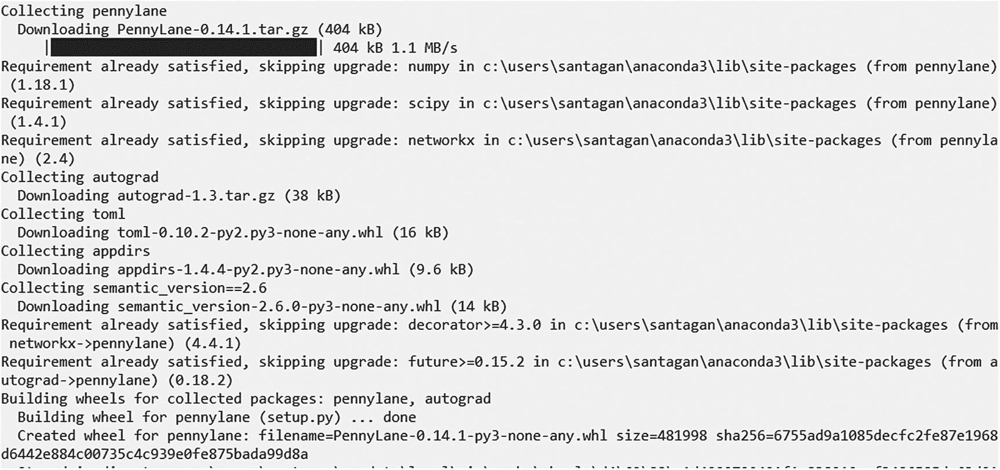

图 8-3

PennyLane 安装过程

Xanadu 正在开发一种光子量子计算机:一种处理以光的量子状态存储的信息的设备。光子量子计算机使用连续的自由度——如光的振幅和相位——来编码信息。这种连续或模拟结构使得光子器件成为神经网络量子版本的一个有吸引力的平台。

qnn 是量子电路或算法，非常类似于经典神经元和神经网络的结构(见第三章)，同时用强大的量子属性扩展和概括它们。已经发表了利用光子学的 qnn 研究[84]，并且在文献中还有几个其他的提议。

用光子学模拟量子阱的提议让一些研究团体兴奋不已。基洛兰等人在 2018 年发表了一篇论文[84]，其中他们提出了一种由一系列重复的构建块或*层*组成的光子电路。这些层可以用一层的输出作为下一层的输入来构建。这些光子层类似于经典神经网络中出现的层(见第三章)。经典网络采用一个输入 *x* ，乘以一个权重矩阵 *W* ，加上一个偏差 *b* ，并将结果通过一个非线性激活函数，如 sigmoid、tanh 和 ReLU。

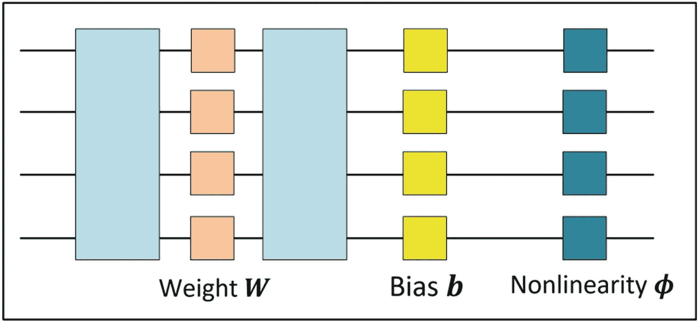

图 8-4

经典神经网络的基本单元

图 8-4 显示了经典神经网络(NN)的基本结构，它执行以下转换。

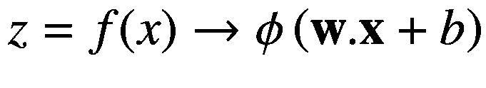

(8.2)

典型地，在等式 8.2 中，权重 **w** 由两个正交矩阵和一个对角矩阵表示。

通过使用光子量子门，量子神经网络层类似于图 8-4 中所示的经典神经网络的功能，光子量子门包括由移相器和分束器制成的干涉仪、压缩和位移门以及固定的非线性变换。这些是建造光子量子计算机的相同的门；因此，QNN 架构被解释为具有量子计算机的计算能力。

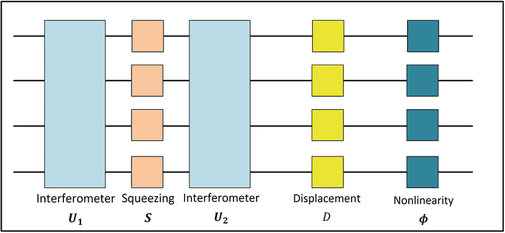

图 8-5

光子量子神经网络的基本单元

图 8-5 显示了光子量子系统定义的基本 QNN 单位。它有彩色的门来指示它们与图 8-4 中的哪个古典部件相关。干涉仪和压缩门类似于权重矩阵。位移门映射到偏压，量子非线性激活函数映射到经典非线性。神经网络的量子版本与经典神经网络非常相似，可以用来运行经典版本。通过以一种抛弃任何量子“怪异”的方式控制量子网络，比如叠加和纠缠。PennyLane 可以结合现有的经典节点来创建和探索混合模型，如图 8-6 (来自 PennyLane 文档【145】)。

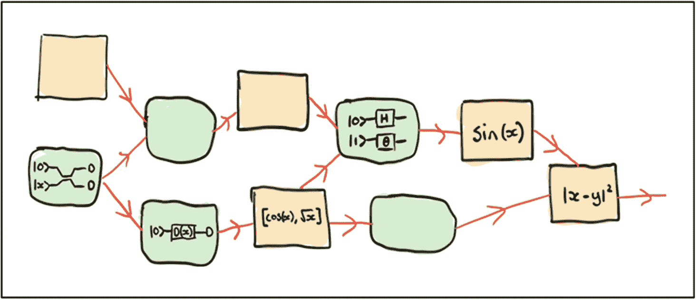

图 8-6

含 PennyLane 的混合经典量子模型的示例结构

当我们讨论量子深度学习时，我们需要记住，我们仍然没有处于一个可以在量子 NN 模型上训练和测试大量量子数据的时代。今天现实生活中的许多数据本质上都是经典的。因此，我们需要问自己如何编码这些经典数据并将其输入量子机器？

有很多方法可以将经典数据嵌入到量子电路中:量子计算平台的不同供应商已经提供了可用的模板来实现这一点。比如 PennyLane 就有`qml.templates`模块。PennyLane 通过一系列插件支持各种量子框架和量子硬件。例如，光子层需要草莓地的`pennylane-sf`插件。

为了构建量子节点层(或者 PennyLane 术语中称为 QNodes ),除了手动放置单个门之外，还可以使用预先构建的量子位层的模板。以下是一些预构建的层。

*   `RandomLayers`

*   `StronglyEntanglingLayers`

*   `BasicEntanglerLayers`

*   `SimplifiedTwoDesign`

*   `CVNeuralNetLayers`

类似经典神经网络的重复层提供了以下优点。

*   它提供对电路深度的控制。

*   层可以被设计成硬件友好的。

*   这是一个通用量子计算的模型。

### 用于神经网络的戊炔

现在我们已经探索了量子 NNs (QNNs)和 PennyLane 的理论方面，是时候进行编码了。

#### 用 QNN 拟合余弦函数

以下示例改编自 PennyLane 文献[172]。这个例子构成了学习一维函数的*拟合*的变分电路。为了实现这一点，我们以带有噪声的`cosine`函数的形式生成合成数据，并训练量子神经网络(QNode)来应用它们。

下面解释了如何做到这一点。

1.  用`default.qubit.`创建一个`device`

2.  创建一个 QNode，它接受一个输入<sup>′</sup>*x*<sup>′</sup>和可训练权重，并输出一个<sup>′</sup>*y*<sup>′</sup>。

3.  定义 *x* 的训练范围( *π* 到 *π* )并计算 *y* = cos *x* 。

4.  选择 PennyLane 优化器。

5.  运行优化循环。

以下示例中使用的变分电路是基洛兰等人(2018) [84]中描述的*连续变量量子神经网络*模型。

第一步，我们`import` PennyLane(安装好之后)，PennyLane 提供的 NumPy 的包装版本，以及一个名为`AdamOptimizer (` [`https://pennylane.readthedocs.io/en/stable/code/api/pennylane.AdamOptimizer.html`](https://pennylane.readthedocs.io/en/stable/code/api/pennylane.AdamOptimizer.html) 的优化器。用于此的`device`是草莓地模拟器，可以通过 PennyLane 的草莓地插件安装，如下所示。

```py
$ pip install pennylane-sf

```

从这个练习开始，我们打开名为`qnn_cosine_pl.ipynb`的 Jupyter 笔记本，它可以从本书网站的下载链接中获得。


```py
# Import PennyLane, the wrapped version of NumPy provided by PennyLane, and an optimizer.
import pennylane as qml
from pennylane import numpy as np
from pennylane.optimize import AdamOptimizer
import matplotlib.pyplot as plt
import pylab
import pickle

Listing 8-2aLibraries and Optimizer qnn_cosine_pl.ipynb

```

`AdamOptimizer`是随机优化的一种方法。它基于具有自适应学习速率的梯度下降优化器[84]的原理，使用依赖于步长的学习速率提供自适应力矩估计。第三章 T2 讲述了经典神经网络的梯度下降，这是前馈网络最常见的训练算法之一。梯度下降优化器使用斜率(或梯度)来引导参数空间。数学上，梯度下降，由方程 3 给出。5 ，此处转载。

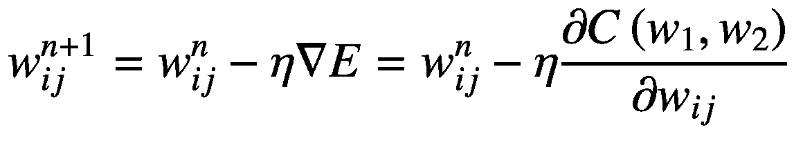

(8.3)

其中，当前权重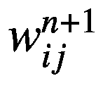是更新后的权重，是朝着最陡梯度方向向下的前一步的权重， *η* 是对应于学习速率或步长的用户定义的超参数， *E* 是成本函数， *C* 是相对于*w*T12】T13】ijT15】具有导数的 *E* 的数学等价形式

`pickle`模块实现了二进制协议，用于序列化和反序列化 Python 对象结构。*酸洗*是将 Python 对象层次结构转换成字节流的过程。*拆包*是相反的操作，一个字节流(来自二进制文件或类似字节的对象)被转换回一个对象层次。`Pickle`可用于稍后将数据加载到另一个 Python 脚本中。

下一步，我们创建一个噪声余弦函数进行采样。

```py
Xlim = 5
noise = np.random.normal(0,0.1,100) # generate noise to add to the function values (Y-values)
# define functions
X = np.arange(-Xlim, Xlim, 0.1)
Y = np.cos(X)+noise

Listing 8-2bNoisy Cosine Function Definition qnn_cosine_pl.ipynb

```

这个代码块用 X 轴和 Y 轴数据生成两个列表 X 和 Y。现在让我们将 Y 轴数据写入一个文件，以备将来使用。

```py
# write the data out to a file
cosdata = open('cosdata.md', 'wb')
pickle.dump(Y, cosdata)
cosdata.close()
plt.plot(X[0:200], Y[0:200])

Listing 8-2cWrite Noisy Cosine Data 

to a File qnn_cosine_pl.ipynb

```

这段代码将 *y* 的数据写入一个名为`cosdata.md`的文件中。有了这个，我们用`plt.plot()`函数绘制一些数据，以生成下面的噪声余弦函数图。

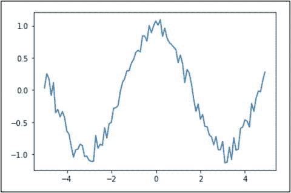

现在我们有一些噪声余弦数据来训练我们的 QNN。使用的设备是只有一个量子模式(或线)的草莓场模拟器。为了完成这个练习，我们需要按照之前的指定安装 PennyLane 的草莓地插件。

Note

如果 PennyLane 的 Strawberry Fields 插件是*而不是*安装的，您会得到以下错误:DeviceError:设备不存在。确保安装了所需的插件。

```py
dev = qml.device("strawberryfields.fock", wires=1, cutoff_dim=10)

Listing 8-2dStrawberry Fields plugin qnn_cosine_pl.ipynb

```

PennyLane 的草莓地插件访问一个 Fock <sup>6</sup> 州模拟器后端。这个模拟器代表了∣0⟩、∣1⟩、∣2⟩,…、∣*d*1⟩的 Fock 基量子态，其中 *D* 是用户给定的`cutoff_dim`值，该值*限制了*希尔伯特空间的维度。这种表示法的优点是可以表示任何连续变量的运算。请注意以下事项。

*   模拟是近似值，其精确度随着截止尺寸`cutoff_dim.`的增加而增加

*   对于 *M* 模式或线以及 *D* 的截止尺寸，Fock 状态[288]模拟器需要至少跟踪 *M* <sup>*D*</sup> 值。因此，与基于量子位的模拟器相比，模拟时间和所需内存随着模式数量的增加而增长得更快。

*   在优化过程中跟踪量子状态的归一化通常是有用的，以确保电路不会“学会”将其参数推入模拟非常不准确的状态。

下一步，我们利用我们在第七章中对变分电路的探索来定义 QNode。对于单量子模式，*变分电路*的每一层都定义有一个*输入层*，一个*偏置*，一个*非线性变换*。

```py
def layer(v):
    # Matrix multiplication of input layer
    qml.Rotation(v[0], wires=0)
    qml.Squeezing(v[1], 0.0, wires=0)
    qml.Rotation(v[2], wires=0)

    # Bias
    qml.Displacement(v[3], 0.0, wires=0)

    # Element-wise nonlinear transformation
    qml.Kerr(v[4], wires=0)

Listing 8-2eDefine the QNN Layer qnn_cosine_pl.ipynb

```

量子节点中的变分电路首先将输入编码成模式的位移，然后执行各层。输出是*x*-正交[288]的期望值。

```py
@qml.qnode(dev)
def quantum_neural_net(var, x=None):
    # Encode input x into quantum state
    qml.Displacement(x, 0.0, wires=0)
    # "layer" subcircuits
    for v in var:
        layer(v)
    return qml.expval(qml.X(0))

Listing 8-2fEncode Input qnn_cosine_pl.ipynb

```

作为目标，我们取目标标签和模型预测之间的损失的平方。

```py
def square_loss(labels, predictions):
    loss = 0
    for l, p in zip(labels, predictions):
        loss = loss + (l - p) ** 2
    loss = loss / len(labels)
    return loss

Listing 8-2gPrediction Modeling qnn_cosine_pl.ipynb

```

接下来，我们定义成本函数。在成本函数中计算来自变分电路的输出。函数拟合是一个回归问题，我们将来自量子节点的*预期*解释为*预测*，而不应用诸如阈值处理的后处理。

```py
def cost(var, features, labels):
    preds = [quantum_neural_net(var, x=x) for x in features]
    return square_loss(labels, preds)

Listing 8-2hCost Function qnn_cosine_pl.ipynb

```

下一步，我们将噪声数据加载到成本函数中。在训练模型之前，让我们检查一下数据(参见清单 8-2i )。

```py
plt.figure()
plt.scatter(X, Y)
plt.xlabel("x", fontsize=18)
plt.ylabel("f(x)", fontsize=18)
plt.tick_params(axis="both", which="major", labelsize=16)
plt.tick_params(axis="both", which="minor", labelsize=16)
plt.show()

Listing 8-2iCost Function qnn_cosine_pl.ipynb

```

清单 8-2i 给出了下面的输出图。

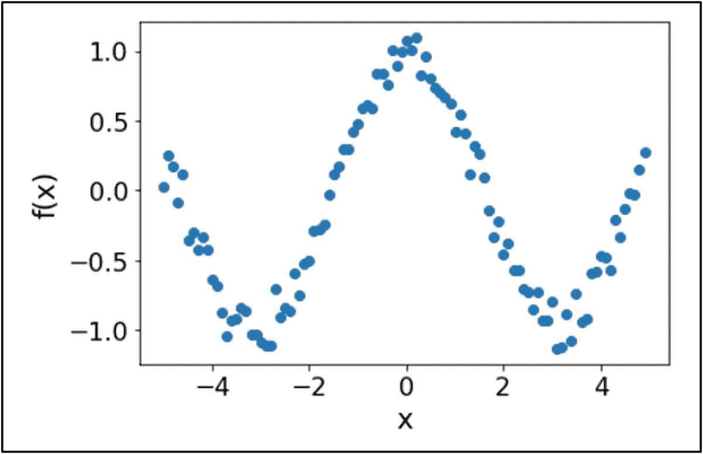

网络的权重(这里称为`var`)用从正态分布中采样的值初始化。我们使用四层。已经发现性能在大约六层时达到稳定。

```py
np.random.seed(0)
num_layers = 4
var_init = 0.05 * np.random.randn(num_layers, 5)
print(var_init)

Listing 8-2jDefine the Number of Layers qnn_cosine_pl.ipynb

```

这个代码片段给出了层的如下输出。

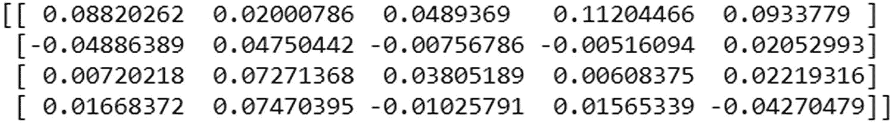

最后，我们使用 AdamOptimizer。我们运行优化器，并更新本练习中仅*50 步的权重。这运行了一段时间。*

```py
opt = AdamOptimizer(0.01, beta1=0.9, beta2=0.999)
var = var_init
for it in range(50):
    var = opt.step(lambda v: cost(v, X, Y), var)
    print("Iter: {:5d} | Cost: {:0.7f} ".format(it + 1, cost(var, X, Y)))

Listing 8-2kRun the Optimizer qnn_cosine_pl.ipynb

```

运行这个代码块开始 50 步的迭代输出。以下是输出的截断示例。

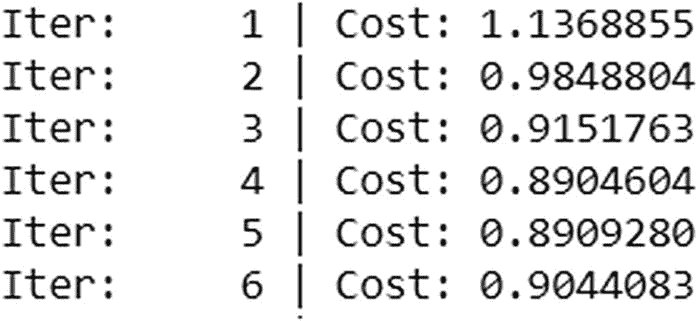

代码块中的步骤越多，效果越好，但运行时间也越长。我们鼓励您运行此功能；例如，通过调整`for it in range(<number_of_steps>).`中的步长值，可以达到 500 或 700 步

接下来，我们收集训练模型在[0，30]范围内的 50 个值的*预测*，并绘制模型从噪声数据(褐红色点)中“学习”的函数。

```py
x_pred = np.linspace(-3, 3, 50)
predictions = [quantum_neural_net(var, x=x_) for x_ in x_pred]
# plot the function
plt.figure()
plt.scatter(X, Y)
plt.scatter(x_pred, predictions, color="maroon")
plt.xlabel("x")
plt.ylabel("f(x)")
plt.tick_params(axis="both", which="major")
plt.tick_params(axis="both", which="minor")
plt.show()

Listing 8-2lCollect Predictions and Plot Function qnn_cosine_pl.ipynb

```

这会产生以下输出。

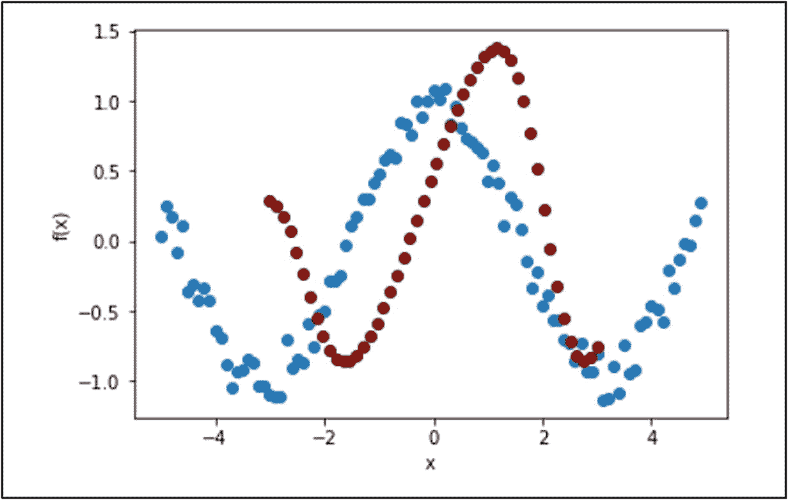

该模型已经学会平滑噪声数据。我们可以使用 PennyLane 来查看模型在完全没有经过训练的情况下产生的典型函数。清单 8-2k 中更高的步数导致更好的拟合，但是运行时间更长。

最后一步，我们用方差超参数绘制函数。

```py
variance = 1.0
plt.figure()
x_pred = np.linspace(-5, 5, 50)
for i in range(7):
    rnd_var = variance * np.random.randn(num_layers, 7)
    predictions = [quantum_neural_net(rnd_var, x=x_) for x_ in x_pred]
    plt.plot(x_pred, predictions, color="black")
plt.xlabel("x")
plt.ylabel("f(x)")
plt.tick_params(axis="both", which="major")
plt.tick_params(axis="both", which="minor")
plt.show()

Listing 8-2mFunctions Against Hyperparameter qnn_cosine_pl.ipynb

```

这将产生本练习的最后一个输出，绘制超参数方差的函数行为。


这些函数的形状随着权重初始化的方差超参数而显著变化。将这个超参数设置为一个小值会产生几乎线性的函数，因为变分电路中的所有量子门都执行恒等变换。较大的值产生平滑振荡的函数，其周期取决于所用的层数，通常层数越多，周期越小。

#### PennyLane 二元分类器

第二章介绍了使用 Iris 数据集的分类器(用于经典数据分析)。我们在`svmIris.ipynb`中运行了一个支持向量分类器，在 10000 次迭代之后，我们获得了一个混淆矩阵和大约 98%的准确率。第三章在`DNNIris.ipynb`中针对经典深度神经网络分类器查看了相同的虹膜数据集，我们运行了 100 个时期以获得 100%的准确率。

观察量子神经网络算法如何不同于相同数据集的经典经验将是有趣的。这里使用的数据在第 2 和 3 章中使用:一个公开可用的数据集，名为 *Iris* ，可从 Python 的`sklearn`获得。标题为`qml_iris_pl.ipynb`的 Jupyter 笔记本可从该书的网站上获得。首先，我们从 Python 和 PennyLane 导入所有必要的库，以及 PennyLane 的`GradientDescentOptimizer`来执行优化。我们还使用`StronglyEntanglingLayers`模板来构建 NN 层。


```py
from itertools import chain
from sklearn import datasets
from sklearn.utils import shuffle
from sklearn.preprocessing import minmax_scale
from sklearn.model_selection import train_test_split
import sklearn.metrics as metrics

import pennylane as qml
from pennylane import numpy as np
from pennylane.templates.embeddings import AngleEmbedding
from pennylane.templates.layers import StronglyEntanglingLayers
from pennylane.init import strong_ent_layers_uniform
from pennylane.optimize import GradientDescentOptimizer
from pennylane.devices.default_qubit import DefaultQubit

Listing 8-3aFunctions Against Hyperparameter qml_iris_pl.ipynb

```

`GradientDescentOptimizer`是一个基本的优化器，它是其他基于梯度下降的优化器的基类。梯度下降优化器的一个步骤通过等式 8.3 中定义的规则计算新值。

`StronglyEntanglingLayers`是由单量子位旋转和纠缠组成的层的模板，其灵感来自 Schuld 等人在 2020 年[59]的论文中提出的以电路为中心的分类器设计。

在下一步中，我们导入数据，对其执行预处理(混洗、选择类并将其规范化)，并将数据分为 80%–20%，分别用于训练数据集和测试数据集。

```py
# Import data, pre-processing, data splitting
# load the dataset
iris = datasets.load_iris ()

# shuffle the data
X, y = shuffle (iris.data , iris.target , random_state = 0)

# select only 2 first classes from the data
X = X[y <=1]
y = y[y <=1]

# normalize data
X = minmax_scale (X, feature_range =(0 , np.pi ))

# split data into train + validation and test
X_train_val , X_test , y_train_val , y_test = train_test_split (X, y, test_size =0.2)

Listing 8-3bLoad Data, Preprocess and Split qml_iris_pl.ipynb

```

下一步是构建量子分类器。为了实现这一点，我们定义量子位的数量以匹配特征的数量，用`DefaultQubit()`函数定义一个设备，为变分分类器和成本函数设置一个函数。

```py
# Building the Quantum Classifier
# number of qubits is equal to the number of features
n_qubits = X.shape [1]

# quantum device handle
dev = DefaultQubit(n_qubits)

# quantum circuit
@qml.qnode (dev )
def circuit (weights , x= None ):
    AngleEmbedding (x, wires = range (n_qubits ))
    StronglyEntanglingLayers (weights , wires = range ( n_qubits ))
    return qml.expval ( qml.PauliZ (0))

# variational quantum classifier
def variational_classifier (theta, x= None ):
    weights = theta [0]
    bias = theta [1]
    return circuit ( weights , x=x) + bias

def cost (theta , X, expectations ):
    e_predicted = \
      np.array ([ variational_classifier (theta , x=x) for x in X])
    loss = np.mean (( e_predicted - expectations )**2)
    return loss

Listing 8-3cBuilding the Quantum Classifier qml_iris_pl.ipynb

```

`StronglyEntanglingLayers()`的参数`weights,`包含每层的权重。 <sup>7</sup> 层数来源于`weights`的第一维度。

```py
# number of quantum layers
n_layers = 3

# split into train and validation
X_train , X_validation , y_train , y_validation = \
train_test_split ( X_train_val , y_train_val , test_size =0.20)

# convert classes to expectations : 0 to -1, 1 to +1
e_train = np. empty_like ( y_train )
e_train [ y_train == 0] = -1
e_train [ y_train == 1] = +1

# select learning batch size
batch_size = 5

# calculate numbe of batches
batches = len ( X_train ) // batch_size

# select number of epochs
n_epochs = 10

Listing 8-3dPrepare to Training the Data qml_iris_pl.ipynb

```

这段代码片段运行了十个时期。我建议你先通过设置`n_epochs = 5,`运行五个纪元，然后再运行十个纪元。历元运行的差异反映在最终精度计算中。

在下一步中，我们对数据施加随机权重，训练变分分类器，让优化器开始学习过程，并将训练数据分成批次，就像我们在第 2 和 3 章中对经典系统所做的那样。

```py
# draw random quantum node weights
theta_weights = strong_ent_layers_uniform ( n_layers , n_qubits , seed =42)
theta_bias = 0.0
theta_init = ( theta_weights , theta_bias ) # initial weights

# train the variational classifier
theta = theta_init
# start of main learning loop
# build the optimizer object
pennylane_opt = GradientDescentOptimizer ()

# split training data into batches
X_batches = np.array_split (np.arange (len ( X_train )), batches )
for it , batch_index in enumerate ( chain (*( n_epochs * [ X_batches ]))):
    # Update the weights by one optimizer step
    batch_cost = \
        lambda theta : cost (theta , X_train [ batch_index ], e_train [ batch_index ])
    theta = pennylane_opt.step ( batch_cost , theta )
    # use X_validation and y_validation to decide whether to stop
# end of learning loop

Listing 8-3eTrain the Data! qml_iris_pl.ipynb

```

最后，既然我们已经定义并准备好了所有的工具，我们就可以探索推论了。

```py
# Inference
# convert expectations to classes
expectations = np. array ([ variational_classifier (theta , x=x) for x in X_test ])
prob_class_one = ( expectations + 1.0) / 2.0
y_pred = ( prob_class_one >= 0.5)

print ( metrics . accuracy_score ( y_test , y_pred ))
print ("Accuracy: {:.2f} %".format(metrics.accuracy_score ( y_test , y_pred )*100))
print ( metrics.confusion_matrix ( y_test , y_pred ))

Listing 8-3fInference qml_iris_pl.ipynb

```

此代码块在`n_epochs`值为 10 时输出以下内容。

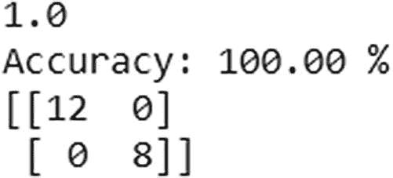

然而，如果我们通过设置`n_epochs = 5`将历元减少到值 5，我们会得到下面的输出。

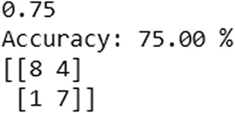

正如在经典案例中所预期的那样，对于更多的历元，我们会得到更准确的结果。

## 张量流量子 QNN

QNN 被解释为任何具有可训练连续参数的量子电路。QNN 是一种机器学习模型，允许量子计算机对各种数据集进行分类，其中包括图像数据。使用的图像数据是经典数据，但经典数据无法达到叠加状态。因此，要在量子系统上实现这个协议，数据必须能够被一个提供叠加的量子设备读取。QNN 领域相对较新，因为该领域的研究和工作持续增长。我们之前已经看到了一些解决特定 QNN 问题的 PennyLane 代码的例子。本节着眼于 QNN 的*图像分类*。

QNN 使用监督学习方法来预测图像数据，如 Benedetti，Lloyd 等人(2019) [186]所示。Farhi 和 Neven 在 2019 年提出了[185]一种 QNN，可以表示经典或量子的标记数据，并通过监督学习进行训练。量子电路由一系列依赖于参数的幺正变换组成，它作用于一个输入量子态。对于二进制分类，在指定的读出量子位上测量单个泡利算符。测量输出是输入状态二进制标签的 QNN 预测器。论文的作者[185]写道，“我们继续使用单词 *neural* 来描述我们的网络，因为该术语已被机器学习社区采用，并认识到与神经科学的联系现在只是历史。”对于类 MNIST 图像分类，作者在电路中随机分配两个量子比特的单位。用于子集宇称的 Reed-Muller 表示[187]是考虑两量子位单位的另一种方式。

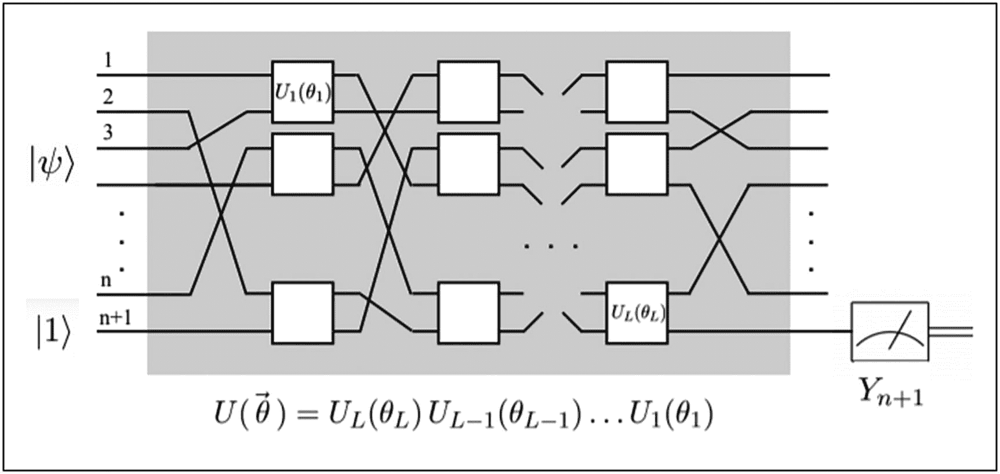

图 8-7

量子处理器上 QNN 的示意图(来源 Farhi 和 Neven，2019 [185])

图 8-7 展示了 Farhi 和 Neven【185】在量子处理器上提出的 QNN 的示意图。∣ *ψ* ，…，1⟩是准备好的输入状态，然后馈入 QNN。这些输入状态经历由*u*<sub>*I*</sub>(*θ*<sub>*I*</sub>)依赖于参数 *θ* <sub>*i*</sub> 给出的一系列*少数*量子位单位，这些量子位单位又在学习过程中得到调整，使得*y*<sub>*n*</sub>

 *TensorFlow Quantum (TFQ)由布劳顿等人在 2020 年提出[191]，是一个用于混合量子-经典机器学习的 Python 框架，主要专注于对量子数据进行建模。TFQ 是一个应用程序框架，旨在允许量子算法研究人员和机器学习应用研究人员探索利用谷歌量子计算产品的计算工作流，所有这些都来自 TensorFlow。谷歌人工智能于 2020 年 3 月发布了 TFQ，作为量子机器学习模型快速原型的开源库。TFQ 依赖于 Cirq，这是一个在近期计算机上实现量子电路的开源平台。Cirq 包括定义量子计算所需的基本结构，如量子位、门、电路和计算运算符。Cirq 背后的概念是提供一个简单的编程模型，抽象出量子应用的基本构件。

现在，我们将亲身体验 TensorFlow quantum。 <sup>8</sup> 本练习<sup>9</sup>【188】构建一个 QNN 对 MNIST 的简化版本进行分类，类似于 Farhi 和 Neven (2019) [185]中使用的方法。将 QNN 在这个经典数据问题上的性能与经典神经网络进行比较。

首先，我们利用谷歌在谷歌实验室的免费计算资源，如第 1 、 2 和 3 章所述。第一步，我们下载并安装 TFQ，这是 TensorFlow 的先决条件。


```py
!pip install tensorflow==2.3.1

Listing 8-4aInstall

TensorFlow qnn_mnist_tfq.ipynb

```

输出(截断)。

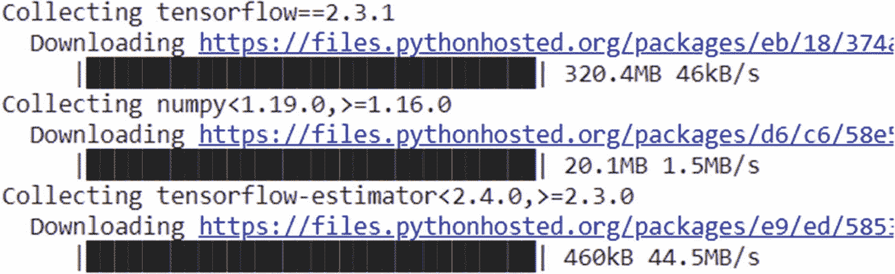

此步骤可能会显示以下有关重新启动 TensorFlow 运行时的消息。

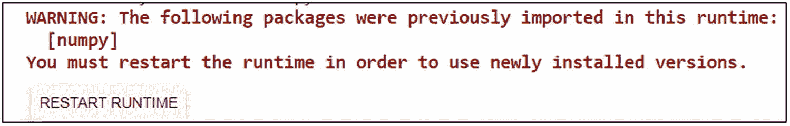

在这种情况下，点击`Restart Runtime`按钮。

接下来，安装 TFQ。

```py
!pip install tensorflow-quantum

Listing 8-4bInstall TensorFlow Quantum qnn_mnist_tfq.ipynb

```

输出(截断)。

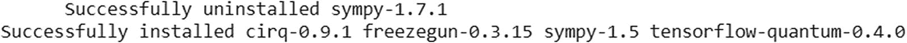

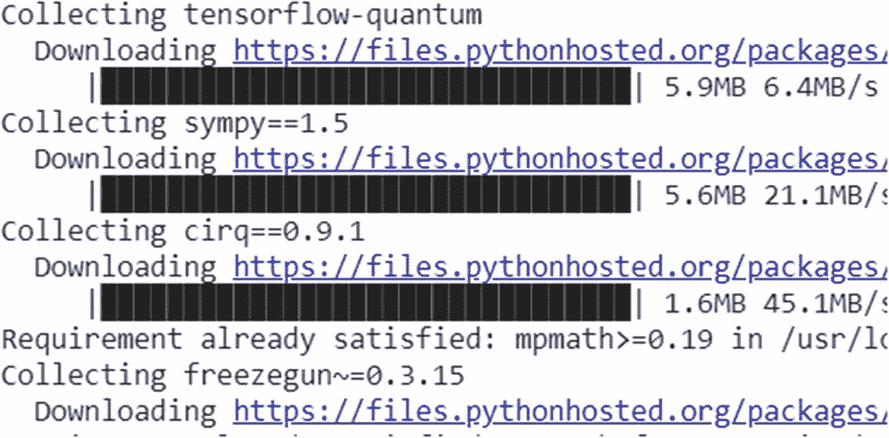

接下来，我们导入 TensorFlow 和模块依赖项。

```py
import tensorflow as tf
import tensorflow_quantum as tfq
import cirq
import sympy
import numpy as np
import seaborn as sns
import collections

# visualization tools
%matplotlib inline
import matplotlib.pyplot as plt
from cirq.contrib.svg import SVGCircuit

Listing 8-4cImport Libraries qnn_mnist_tfq.ipynb

```

现在，我们准备加载数据。在本练习中，我们按照 Farhi 和 Neven [185]的方法，构建了一个二元分类器来区分数字 1 和 7。本节介绍数据处理。

1.  从 Keras 加载原始数据。

2.  仅将数据集过滤为 1 和 7。

3.  缩小图像的尺寸，以便它们可以放入量子计算机。

4.  删除任何矛盾的例子。

5.  将二进制镜像转换为 Cirq 电路。

6.  将 Cirq 电路转换为 TFQ 电路。

在下一步中，我们加载随 Keras 一起分发的原始 MNIST 数据集。

```py
(x_train, y_train), (x_test, y_test) = tf.keras.datasets.mnist.load_data()

# Rescale the images from [0,255] to the [0.0,1.0] range.
x_train, x_test = x_train[..., np.newaxis]/255.0, x_test[..., np.newaxis]/255.0

print("Number of original training examples:", len(x_train))
print("Number of original test examples:", len(x_test))

Listing 8-4dLoad the Data qnn_mnist_tfq.ipynb

```

输出。

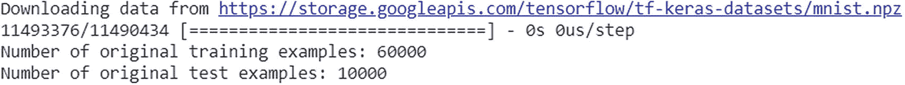

接下来，我们过滤数据集，只保留 1 和 7，删除其他类。同时，将标签 *y* 转换为`boolean`:1 为真，7 为假。

```py
def filter_17(x, y):
    keep = (y == 1) | (y == 7)
    x, y = x[keep], y[keep]
    y = y == 1
    return x,y

x_train, y_train = filter_17(x_train, y_train)
x_test, y_test = filter_17(x_test, y_test)

print("Number of filtered training examples:", len(x_train))
print("Number of filtered test examples:", len(x_test))

Listing 8-4eFilter the Data qnn_mnist_tfq.ipynb

```

过滤过程的输出读出用于训练和测试分割的数字。


我们尝试了一个例子，看看数据是什么样的。

```py
print(y_train[0])
plt.imshow(x_train[0, :, :, 0])
plt.colorbar()

Listing 8-4fExample qnn_mnist_tfq.ipynb

```

这个代码块给出了下面的输出。

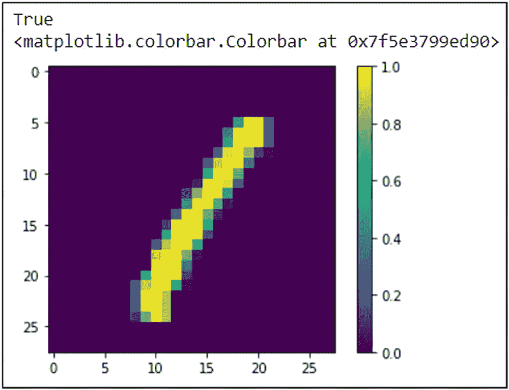

接下来，我们将图像缩小到 4 × 4，因为 28 × 28 的图像尺寸对于当前的量子计算机来说太大了，并在调整大小后显示它。

```py
x_train_small = tf.image.resize(x_train, (4,4)).numpy()
x_test_small = tf.image.resize(x_test, (4,4)).numpy()
print(y_train[0])
plt.imshow(x_train_small[0,:,:,0], vmin=0, vmax=1)
plt.colorbar()

Listing 8-4gExample qnn_mnist_tfq.ipynb

```

以下是输出。

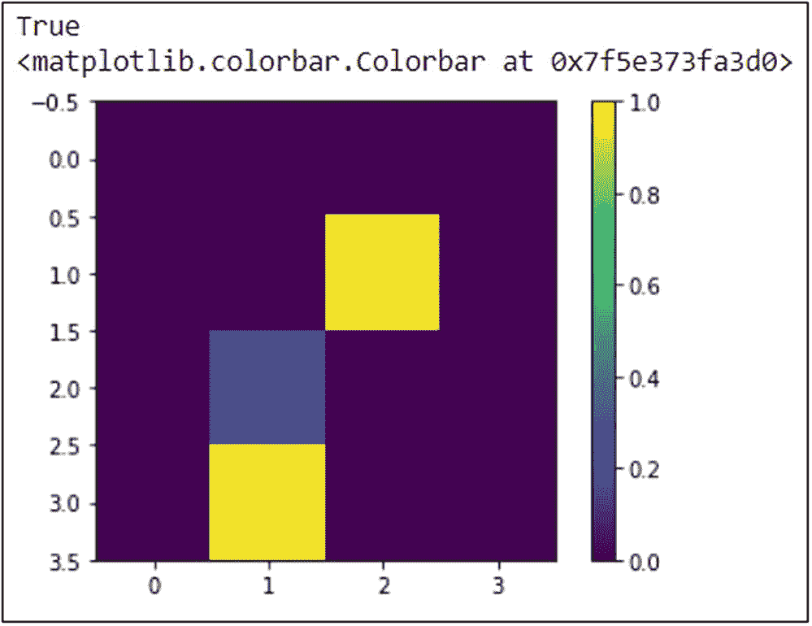

下一步是通过用量子位表示每个像素，将数据编码为量子电路，其中量子位状态取决于像素的值。第一步是转换成二进制编码。

```py
THRESHOLD = 0.5
x_train_bin = np.array(x_train_nocon > THRESHOLD, dtype=np.float32)
x_test_bin = np.array(x_test_small > THRESHOLD, dtype=np.float32)

Listing 8-4hBinary Encoding qnn_mnist_tfq.ipynb

```

现在，我们通过一个 X 门旋转量子位，像素索引值超过一个阈值，形成一个电路。

```py
def convert_to_circuit(image):
    """Encode truncated classical image into quantum datapoint."""
    values = np.ndarray.flatten(image)
    qubits = cirq.GridQubit.rect(4, 4)
    circuit = cirq.Circuit()
    for i, value in enumerate(values):
        if value:
            circuit.append(cirq.X(qubits[i]))
    return circuit
x_train_circ = [convert_to_circuit(x) for x in x_train_bin]
x_test_circ = [convert_to_circuit(x) for x in x_test_bin]
SVGCircuit(x_train_circ[0])

Listing 8-4iRotate Qubits Through X Gate qnn_mnist_tfq.ipynb

```

下面是为第一个例子创建的电路(电路图没有显示零门量子位)。

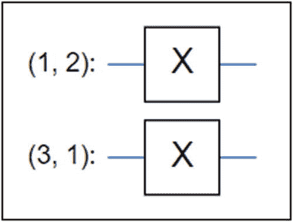

现在，我们可以将该电路与图像值超过阈值的指数进行比较。

```py
bin_img = x_train_bin[0,:,:,0]
indices = np.array(np.where(bin_img)).T
indices

Listing 8-4jComparison qnn_mnist_tfq.ipynb

```

以下输出。

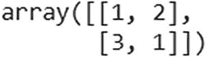

量子数据以张量的形式加载，定义为用 Cirq 编写的量子电路。TensorFlow 在量子计算机上执行这个张量，生成一个*量子数据集*。因此，我们现在将这些 Cirq 电路转换为 TensorFlow Quantum ( `tfq`)的*张量*，如清单 8-4k 所示。

```py
x_train_tfcirc = tfq.convert_to_tensor(x_train_circ)
x_test_tfcirc = tfq.convert_to_tensor(x_test_circ)

Listing 8-4kComparison qnn_mnist_tfq.ipynb

```

现在我们准备建造 QNN。然而，对图像分类的量子电路结构的指导是稀疏的。由于分类是基于对读出量子位的期望，Farhi 等人提出使用双量子位门，读出量子位总是起作用。这在某些方面类似于 Arjovsky 等人[190]提出的跨像素运行小型酉 RNN。

为了实现这一点，我们从构建模型电路开始。下面的代码块显示了一种分层的方法。每一层使用同一个门的 *n* 个实例，每个数据量子位作用于读出量子位。我们从一个简单的类开始，在电路中增加一层这样的门。

```py
class CircuitLayerBuilder():
    def __init__(self, data_qubits, readout):
        self.data_qubits = data_qubits
        self.readout = readout

    def add_layer(self, circuit, gate, prefix):
        for i, qubit in enumerate(self.data_qubits):
            symbol = sympy.Symbol(prefix + '-' + str(i))
            circuit.append(gate(qubit, self.readout)**symbol)
demo_builder = CircuitLayerBuilder(data_qubits = cirq.GridQubit.rect(4,1),
                                   readout=cirq.GridQubit(-1,-1))
circuit = cirq.Circuit()
demo_builder.add_layer(circuit, gate = cirq.XX, prefix='xx')
SVGCircuit(circuit)

Listing 8-4lBuild the QNN Model Circuit qnn_mnist_tfq.ipynb

```

输出显示了电路。

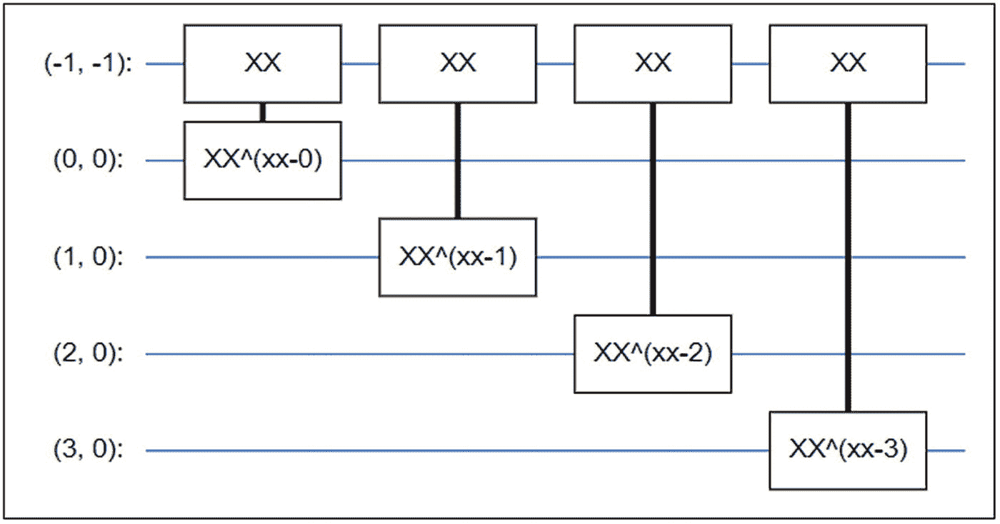

接下来，我们建立一个两层模型，匹配数据电路的大小，并包括准备和读出操作。

```py
def create_quantum_model():
    """Create a QNN model circuit and readout operation to go along with it."""
    data_qubits = cirq.GridQubit.rect(4, 4)  # a 4x4 grid
    readout = cirq.GridQubit(-1, -1)         # a single qubit at [-1,-1]
    circuit = cirq.Circuit()

    # Prepare the readout qubit.
    circuit.append(cirq.X(readout))
    circuit.append(cirq.H(readout))
    builder = CircuitLayerBuilder(
        data_qubits = data_qubits,
        readout=readout)
    # Then add layers (experiment by adding more).
    builder.add_layer(circuit, cirq.XX, "xx1")
    builder.add_layer(circuit, cirq.ZZ, "zz1")
    # Finally, prepare the readout qubit.
    circuit.append(cirq.H(readout))
    return circuit, cirq.Z(readout)
model_circuit, model_readout = create_quantum_model()

Listing 8-4mBuild a Two-Layer Model qnn_mnist_tfq.ipynb

```

下一个任务是用量子组件将模型电路包装在 tfq-keras 模型中，以便训练它。这个模型被输入来自`x_train_circ`的量子数据，它对经典数据进行编码。它使用一个*参数化量子电路*层`tfq.layers.PQC`，根据量子数据训练模型电路。Farhi 等人提出在参数化电路中采用读出量子位的期望值来对这些图像进行分类。期望值返回一个介于 1 和–1 之间的值。

```py
# Build the Keras model.
model = tf.keras.Sequential([
    # The input is the data-circuit, encoded as a tf.string
    tf.keras.layers.Input(shape=(), dtype=tf.string),
    # The PQC layer returns the expected value of the readout gate, range [-1,1].
    tfq.layers.PQC(model_circuit, model_readout),
])

Listing 8-4nBuild Keras Wrapper qnn_mnist_tfq.ipynb

```

由于预期读数在`[–1,1]`范围内，优化铰链损耗是一个自然的选择。

Note

另一种有效的方法是将输出范围移动到[0，1]，并将其视为模型分配给类 1 的概率。这可以与标准的 a TF . loss . binary cross entropy loss 一起使用。

为了使用这里的铰链损耗，我们需要做两个小的调整。首先，我们将标签`y_train_nocon`从布尔转换为`[-1,1]`，正如铰链损耗所预期的。

```py
y_train_hinge = 2.0*y_train_nocon-1.0
y_test_hinge = 2.0*y_test-1.0

```

我们使用一个定制的`hinge_accuracy`度量，它正确地将`[–1, 1]`作为`y_true`标签参数。

```py
def hinge_accuracy(y_true, y_pred):
    y_true = tf.squeeze(y_true) > 0.0
    y_pred = tf.squeeze(y_pred) > 0.0
    result = tf.cast(y_true == y_pred, tf.float32)
    return tf.reduce_mean(result)

model.compile(
    loss=tf.keras.losses.Hinge(),
    optimizer=tf.keras.optimizers.Adam(),
    metrics=[hinge_accuracy])

print(model.summary())

Listing 8-4oLabel Argument qnn_mnist_tfq.ipynb

```

这将打印出模型摘要。


我们现在训练 QNN 模型，大约需要 30 到 45 分钟——取决于您的系统。如果你不想等那么久，使用数据的一个小的子集(下面的 set `NUM_EXAMPLES=500`)。这不会影响模型在训练过程中的进度，因为它只有 32 个参数，因此，约束这些参数所需的数据并不多。使用较少的例子可以更早地结束训练(大约 5 分钟)，但是运行时间足够长，可以显示它在验证日志中取得了进展。

```py
EPOCHS = 3
BATCH_SIZE = 32
NUM_EXAMPLES = len(x_train_tfcirc)
x_train_tfcirc_sub = x_train_tfcirc[:NUM_EXAMPLES]
y_train_hinge_sub = y_train_hinge[:NUM_EXAMPLES]
qnn_history = model.fit(
      x_train_tfcirc_sub, y_train_hinge_sub,
      batch_size=32,
      epochs=EPOCHS,
      verbose=1,

      validation_data=(x_test_tfcirc, y_test_hinge))
qnn_results = model.evaluate(x_test_tfcirc, y_test)

Listing 8-4pTrain the Quantum Model qnn_mnist_tfq.ipynb

```

这给出了铰链精度、运行时间和损耗的以下输出。

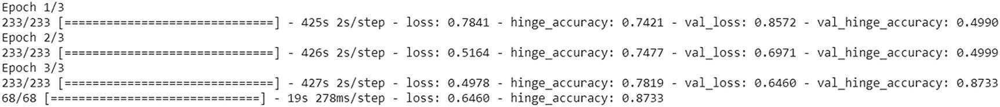

训练精度报告了整个时期的平均值。在每个时期结束时评估验证准确性。

既然我们已经看了事物的量子方面，我们可能希望找出一个经典网络如何在相同的数据集上运行。尽管 QNN 可以解决这个简化的 MNIST 问题，但基本的经典神经网络在这个任务上可以胜过 QNN。在单个时期之后，传统的神经网络可以在维持集上实现> 98%的准确度。

在下面的示例中，经典的神经网络用于 1–7 分类问题，使用*整个* 28 × 28 图像，而不是对图像进行二次采样。这很容易收敛到接近 100%的测试集的准确性。

```py
def create_classical_model():
    # A simple model based off LeNet from https://keras.io/examples/mnist_cnn/
    model = tf.keras.Sequential()
    model.add(tf.keras.layers.Conv2D(32, [3, 3], activation='relu', input_shape=(28,28,1)))
    model.add(tf.keras.layers.Conv2D(64, [3, 3], activation='relu'))
    model.add(tf.keras.layers.MaxPooling2D(pool_size=(2, 2)))
    model.add(tf.keras.layers.Dropout(0.25))
    model.add(tf.keras.layers.Flatten())
    model.add(tf.keras.layers.Dense(128, activation='relu'))
    model.add(tf.keras.layers.Dropout(0.5))
    model.add(tf.keras.layers.Dense(1))
    return model
model = create_classical_model()
model.compile(loss=tf.keras.losses.BinaryCrossentropy(from_logits=True),
              optimizer=tf.keras.optimizers.Adam(),
              metrics=['accuracy'])
model.summary()

Listing 8-4qBuild the Classical Model qnn_mnist_tfq.ipynb

```

这将生成如下的模型摘要。

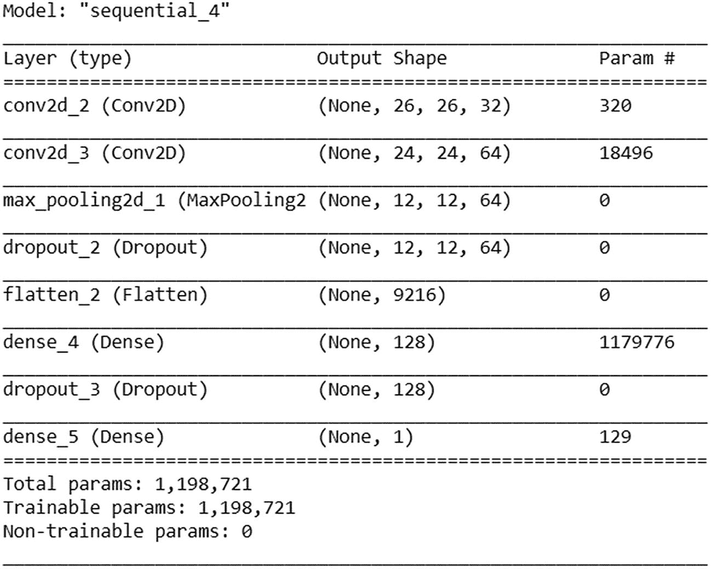

这个模型有将近 120 万个参数。接下来，我们按如下方式训练经典模型。

```py
model.fit(x_train,
          y_train,
          batch_size=128,
          epochs=1,
          verbose=1,
          validation_data=(x_test, y_test))

cnn_results = model.evaluate(x_test, y_test)

Listing 8-4rTrain the Classical Model qnn_mnist_tfq.ipynb

```

这个代码块为具有 120 万个参数的经典模型生成精度、损耗等方面的输出。为了更公平的比较，我们在二次抽样图像上尝试 37 参数模型。

```py
def create_fair_classical_model():
    # A simple model based off LeNet from https://keras.io/examples/mnist_cnn/
    model = tf.keras.Sequential()
    model.add(tf.keras.layers.Flatten(input_shape=(4,4,1)))
    model.add(tf.keras.layers.Dense(2, activation='relu'))
    model.add(tf.keras.layers.Dense(1))
    return model
model = create_fair_classical_model()
model.compile(loss=tf.keras.losses.BinaryCrossentropy(from_logits=True),
              optimizer=tf.keras.optimizers.Adam(),
              metrics=['accuracy'])

model.summary()

Listing 8-4s37-Parameter 

Model qnn_mnist_tfq.ipynb

```

这就产生了我们想要的 37 参数模型。

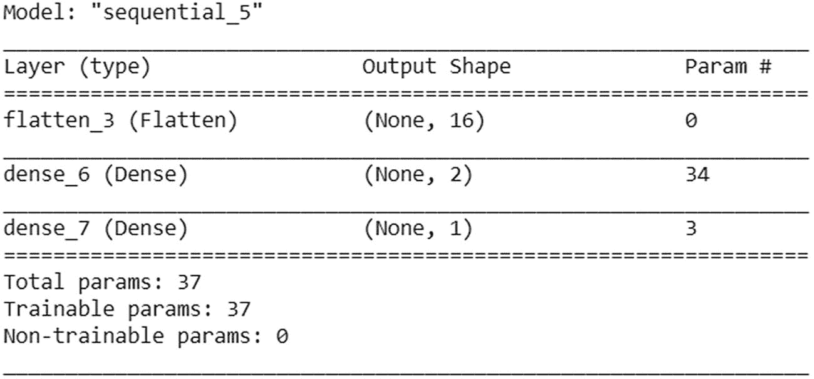

现在，我们用 37 个参数的新范围来训练这个模型。

```py
model.fit(x_train_bin,
          y_train_nocon,
          batch_size=128,
          epochs=20,
          verbose=2,
          validation_data=(x_test_bin, y_test))

fair_nn_results = model.evaluate(x_test_bin, y_test)

Listing 8-4tTrain the 37-Parameter Model qnn_mnist_tfq.ipynb

```

这给出了以下(截断的)输出。

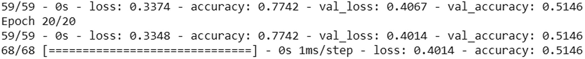

最后，我们比较了量子神经网络和经典神经网络。

```py
qnn_accuracy = qnn_results[1]
cnn_accuracy = cnn_results[1]
fair_nn_accuracy = fair_nn_results[1]
sns.barplot(["Quantum", "Classical, full", "Classical, fair"],
            [qnn_accuracy, cnn_accuracy, fair_nn_accuracy])

Listing 8-4uComparison of Quantum and Classical qnn_mnist_tfq.ipynb

```

此代码块给出以下输出作为比较。

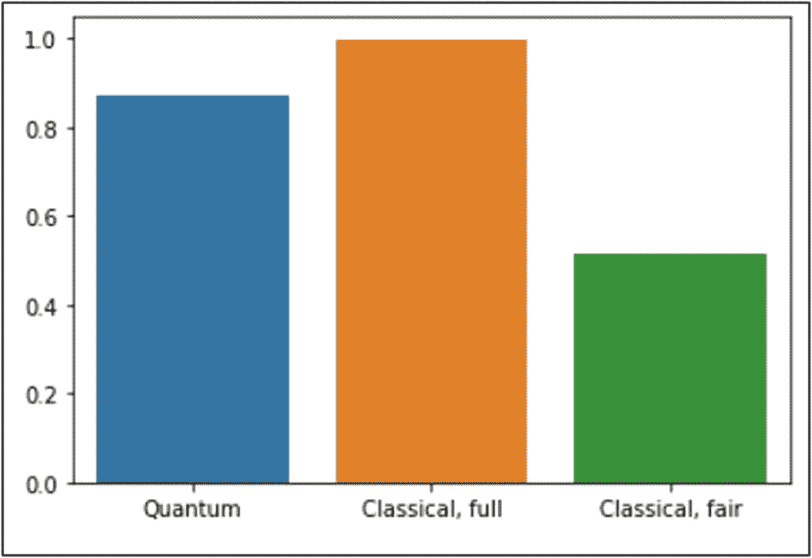

更高分辨率的输入和更强大的模型使得这个问题对 CNN 来说很容易。虽然相似功率(约 32 个参数)的经典模型在一小部分时间内训练到相似的精度，但经典神经网络优于量子神经网络。

在*经典数据集*中，鉴于近期量子系统的状态，量子系统很难击败经典神经网络。然而，在具有经典输入数据的量子系统上的练习确实承诺利用希尔伯特空间的多维度和某些特定问题的叠加能力。从经典数据中获得的见解也为我们在下一代量子计算系统上实现算法做好了准备，我们希望这将带来前所未有的计算能力。

## 量子卷积神经网络

如第三章所见，经典卷积神经网络(CNN)是图像处理和计算机视觉相关领域的流行模型。CNN 的结构包括将交替的*卷积层*(加上一个*激活函数*)和*汇集*层应用于输入阵列，通常在输出之前跟随一些完全连接的层。卷积层的工作原理是扫描整个输入阵列，并逐块应用不同的滤波器(通常是 2 × 2 或 3 × 3 矩阵)。它们检测图像中可能出现的特定特征。然后，使用池层对这些卷积的结果进行下采样，以提取最相关的特征并减少数据的大小，从而更容易在后续层中进行处理。常见的池化方法包括用最大值或平均值替换数据块。

CNN 具有便于有效利用数据的相关性信息的属性。然而，如果数据或模型的给定维度变得太大(这在大数据时代很可能发生)，与 CNN 相关的计算费用可能会很快成为一个挑战。量子卷积神经网络(QCNN)使用量子计算环境为 CNN 提供了一种新的解决方案，以提高现有学习模型的性能。

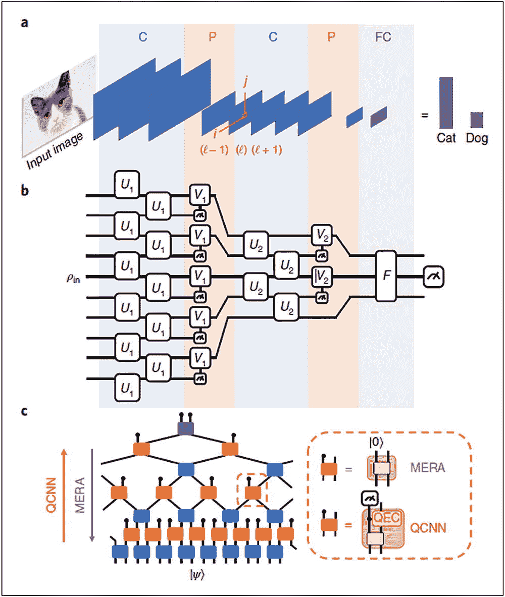

图 8-8

QCNN 示意图(来源丛等 2018 [193])

qcn 首先由丛等人(2018) [193]提出。QCNNs 的结构受 CNN 结构的启发，如图 8-8 所示。在 QCNN 中，卷积是在相邻量子位对上执行的操作(参数化酉旋转)，类似于常规的变分电路。这些卷积之后是池层，池层通过测量量子位的子集并使用测量结果来控制后续操作而受到影响。完全连接层的模拟是在最终测量之前对剩余量子位的多量子位操作。所有这些操作的参数都是在训练期间学习的。

在 Oh，Choi 和 Kim 在 2020 年完成的研究中[192]提出了一种模型，通过将 CNN 的结构应用于量子计算环境来有效地解决量子物理和化学中的分类问题。该研究还提出了一个可以用 O(log(n))深度计算的模型，使用*多尺度纠缠重整化 ansatz* (MERA)。

该研究介绍了一种方法，通过在现有计算机视觉中使用的 CNN 学习模型中添加一个使用量子系统的层来提高模型的性能。该模型也可用于小型量子计算机。混合学习模型可以通过在 CNN 模型中增加一个量子卷积层或者用卷积层代替来设计。本文还通过 TensorFlow 量子平台使用 MNIST 数据集进行训练，验证了 QCNN 模型相对于 CNN 是否能够高效学习。

关于丛等人[193]关于 QCNN 的另一篇论文的完整实践教程可在 [`www.tensorflow.org/quantum/tutorials/qcnn`](http://www.tensorflow.org/quantum/tutorials/qcnn) 的 Google AI 上获得。如果你对量子深度学习感兴趣，请按照自己的节奏浏览教程。

量子 CNN 的一个自然应用是对量子态进行分类。丛等人[193]的原始工作使用它们来区分不同的拓扑相位。QCNNs 也可以用来分类图像，就像它们的经典对应物一样。

## 摘要

量子数据是自然或人工量子系统中出现的任何数据源。这可以是从量子力学实验中得到的经典数据，也可以是由量子设备直接生成的数据，然后作为输入输入到算法中。有证据表明，由于量子力学特性，对*量子数据*的混合量子-经典机器学习应用可以提供优于仅经典机器学习的量子优势。量子数据表现出叠加和纠缠，导致联合概率分布，这可能需要指数数量的经典计算资源来表示或存储。

也许量子机器学习最直接的应用是量子数据——量子系统和过程产生的实际状态。许多量子机器学习算法通过将数据映射到量子力学状态，然后使用基本的量子线性代数子例程操纵这些状态，来找到经典数据中的模式。这些量子机器学习算法可以直接应用于光和物质的量子态，以揭示它们的潜在特征和模式。由此产生的量子分析模式通常比从量子系统中提取的数据的经典分析更有效和更有启发性。

本章探讨了 D-Wave、Xanadu 的 PennyLane 的 QNN 和 Google 的 TensorFlow Quantum 上的旅行销售员问题和解决方案，并探讨了量子卷积神经网络。我们还探讨了 QCNN 领域的最新研究和进展。

第九章探索先进的领域，如量子化学、量子行走和层析成像，量子机器学习在这些领域正变得活跃并有望发展。

Footnotes 1

湖泊乘数: [`https://en.wikipedia.org/wiki/Lagrange_multiplier#:~:text=In%20mathematical%20optimization%2C%20the%20method,chosen%20values%20of%20the%20variables`](https://en.wikipedia.org/wiki/Lagrange_multiplier%2523:%257E:text%253DIn%252520mathematical%252520optimization%25252C%252520the%252520method,chosen%252520values%252520of%252520the%252520variables)

  2

出差销售人员问题: [`https://en.wikipedia.org/wiki/Travelling_salesman_problem#cite_note-6`](https://en.wikipedia.org/wiki/Travelling_salesman_problem%2523cite_note-6)

  3

qbsolv 基于 Wang，Lu，Glover 和 Hao (2012)的论文“大型无约束二元二次优化的多级算法”。[163]

  4

经典玻尔兹曼机:[`https://en.wikipedia.org/wiki/Boltzmann_machine`](https://en.wikipedia.org/wiki/Boltzmann_machine)【167】

  5

pennylanae/pennylane 根据 Apache 许可证 2.0 获得许可。

  6

福克状态: [`https://en.wikipedia.org/wiki/Fock_state#:~:text=In%20quantum%20mechanics%2C%20a%20Fock,the%20Soviet%20physicist%20Vladimir%20Fock`](https://en.wikipedia.org/wiki/Fock_state%2523:%257E:text%253DIn%252520quantum%252520mechanics%25252C%252520a%252520Fock,the%252520Soviet%252520physicist%252520Vladimir%252520Fock) 。

  7

strong 纠缠层文档: [`https://pennylane.readthedocs.io/en/stable/code/api/pennylane.templates.layers.StronglyEntanglingLayers.html`](https://pennylane.readthedocs.io/en/stable/code/api/pennylane.templates.layers.StronglyEntanglingLayers.html)

  8

对于这个练习，代码改编自 TensorFlow Quantum 文档: [`https://www.tensorflow.org/quantum/tutorials/mnist`](https://www.tensorflow.org/quantum/tutorials/mnist)

  9

根据 Apache 许可证 2.0 版许可(“许可证”)

 **