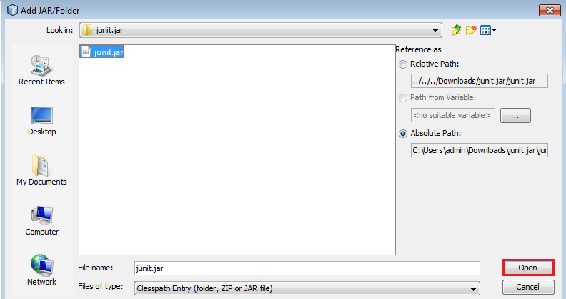

# 一、人工智能和 Java 简介

在这一章中，我们将讨论什么是机器学习，为什么我们要进行机器学习，什么是监督学习，什么是无监督学习。我们还将了解分类和回归的区别。接下来，我们将开始安装 JDK 和 JRE，还将在我们的系统上设置 NetBeans。在本章的末尾，我们将下载一个 JAR 文件并用于我们的项目。

因此，我们将在本章中讨论以下主题:

*   什么是机器学习？
*   分类和回归的区别
*   安装 JDK 和 JRE
*   设置 NetBeans IDE
*   导入 Java 库并将项目中的代码导出为 JAR 文件

让我们开始，看看有监督和无监督学习相关的 AI 问题是什么。


# 什么是机器学习？

**机器学习**的能力实际上是添加新知识或提炼先前知识的能力，这将帮助我们做出最佳或最优决策。注意以下，根据经济学家和政治学家，*希尔伯特·西蒙:*

"*学习是系统根据经验提高性能的任何过程*。"

计算机科学家、**卡耐基梅隆大学** ( **CMU** )的 E. Fredkin 大学教授 Tom Mitchell 给出了一个标准定义，如下所示:

*“一个程序被认为从经验 E 中学习关于某类任务 T 和性能测量 P。如果它在 T 中的任务的性能，如 P 所测量的，随着经验 E 而提高，那么它是机器学习*。”

这意味着，当我们在人类专家的帮助下拥有某些数据和经验时，我们能够对这些特定的数据进行分类。例如，假设我们有一些电子邮件。在人类的帮助下，我们可以过滤垃圾邮件、商业邮件、营销邮件等等。这意味着我们正在根据我们的经验对我们的电子邮件进行分类，任务 T 的类别是我们分配给电子邮件的类别/过滤器。

考虑到这些数据，如果我们训练我们的模型，我们可以制作一个根据我们的偏好对电子邮件进行分类的模型。这是机器学习。我们可以随时检查系统是否已经完美学习，这将被视为一种性能测量。

这样，我们将以电子邮件的形式收到更多的数据，我们将能够对它们进行分类，这将是对数据的一种改进。有了从新数据中获得的经验，系统的性能将会提高。

这是机器学习的基本思想。

问题是，我们为什么要这么做？

我们这样做是因为我们想要开发手工构建起来太困难或太昂贵的系统——无论是因为它们需要针对特定任务的具体技能或知识。这就是所谓的**知识工程瓶颈**。作为人类，我们没有足够的时间来为每一件事情制定规则，所以我们看数据，我们从数据中学习，以便让我们的系统根据从数据中学习来预测事情。

下图说明了学习系统的基本架构:


在上图中，我们有一个**老师**，我们有**数据**，我们给它们添加了**标签**，我们还有一个**老师**分配了这些标签。我们将它交给一个**学习器组件**，它将它保存在一个**知识库**中，从中我们可以评估它的性能并将其发送给一个**性能组件**。在这里，我们可以有不同的评估方法，我们将在下一章中看到，使用这些方法，我们可以向**学习组件**发送**反馈**。随着时间的推移，这个过程可以得到改进和发展。

下图展示了我们的监督学习系统的基本架构:


假设我们有一些**训练数据**。在此基础上，我们可以做一些**预处理**，并提取重要的特征。这些**特征**将被赋予给一个**学习算法**，附带一些由人类专家分配的**标签**。该算法然后将学习并创建一个**模型**。一旦**模型**被创建，我们就可以获取新数据，对其进行预处理，并从中提取特征；基于这些**特征**，我们然后将数据发送到**模型**，该模型将在提供**决策**之前进行某种**分类**。当我们完成这个过程，当我们有一个人给我们提供**标签**时，这种学习就被称为**监督学习**。

另一方面，还有无监督学习，如下图所示:


在无监督学习中，我们提取数据，然后在将数据交给**学习算法**之前**对**进行特征描述，但是没有任何类型的人为干预来提供分类。在这种情况下，机器会将数据分组为更小的簇，这就是**模型**的学习方式。下一次特征被提取并给予**模型**时，**模型**将为我们提供属于聚类 1 的四封电子邮件，属于聚类 3 的五封电子邮件，等等。这被称为**无监督学习**，我们使用的算法被称为**聚类算法**。


# 分类和回归的区别

在我们的分类系统中，我们有用于训练模型的数据。在将电子邮件分类成簇的情况下，离散值与数据一起提供，这被称为**分类**。

监督学习还有另一个方面，我们不是提供一个离散的值，而是提供一个连续的值。这被称为**回归**。回归也被认为是监督学习。分类和回归的区别在于，前者有离散值，而后者有连续的数值。下图说明了我们可以使用的三种学习算法:


如上图所示，我们使用了**监督学习**、**非监督学习**和**强化学习**。当我们谈到**监督学习**时，我们也使用**分类**。在**分类**中，我们执行诸如**识别欺诈检测**、**图像分类**、**客户保持**和**诊断**等任务。在**回归**，我们进行**广告人气预测**、**天气预报**等活动。在**强化**中，我们执行**游戏 AI** 、**技能习得**等等。最后，在**无监督学习**中，我们有**推荐系统**和机器学习的不同子领域，如图所示。


# 安装 JDK 和 JRE

由于我们将用 Java 编码，我们将需要 **Java 开发工具包** ( **JDK** )。JDK 是一个由编译器和解释器组成的环境。编译器用于将高级语言编写的源代码转换为中间形式，即字节码。这意味着 JDK 编译整个代码并将其转换成字节码。一旦你有了字节码，你就需要一个 Java 解释器，这就是所谓的 **Java 运行时环境** ( **JRE** )。JRE 只为您提供 Java 解释器。如果您有一个 JRE 和字节代码，您可以在您的系统上运行它，如下图所示:


我们现在将 JDK 下载到我们的系统。

打开浏览器，进入链接[https://www . Oracle . com/tech network/Java/javase/downloads/index . html](https://www.oracle.com/technetwork/java/javase/downloads/index.html)。在这里，您将获得一个下载 Java 的选项。目前，NetBeans 支持 JDK 8。我们有 JDK 10，但它不支持 NetBeans。如果您在 JDK 没有 NetBeans，请访问[http://www . Oracle . com/tech network/Java/javase/downloads/JDK-NetBeans-JSP-142931 . html](http://www.oracle.com/technetwork/java/javase/downloads/jdk-netbeans-jsp-142931.html)。您必须接受协议，然后根据您的系统，您可以下载 NetBeans 和 JDK，如下面的屏幕截图所示:


如果你只想安装 JDK，你得去 JDK 8 的[http://www . Oracle . com/tech network/Java/javase/downloads/JDK 8-downloads-2133151 . html](http://www.oracle.com/technetwork/java/javase/downloads/jdk8-downloads-2133151.html)。这将带您进入下一页，在这里您还可以找到有关 JDK 8 的更多信息，如下所示:


现在，您必须再次接受协议，并根据您的系统要求下载 JDK。

一旦你下载了 JDK，就很容易安装。对于 Windows 和 macOS，你只需右击它。对于 Linux 机器，你可以在 Ubuntu 上使用`sudo`或`apt-get`命令。


# 设置 NetBeans IDE

我们现在将 NetBeans 下载到我们的系统中。访问 https://netbeans.org/downloads/的[链接。您应该会看到类似下面的截图:](https://netbeans.org/downloads/)


在这里，您可以找到有关当前 NetBeans 版本(NetBeans 8.2)的信息。您可以下载 Java SE、Java EE 或任何其他 NetBeans IDE 下载包。建议您下载 All bundle，因为它支持所有的技术，如前面的截图所示。你永远不知道什么时候你可能需要它们！

如右上角所示，8.2 是您将下载的当前版本。如果不想下载这个版本，可以下载它的直接前身，也就是 8.1。如果您想下载试验版本，即 alpha 或 beta 版本，请单击 Development。如果您想要下载早于 8.1 的版本，您可以转到存档，这将帮助您下载所需的版本，如下面的屏幕截图所示:


如上图所示，8.2 是 NetBeans 的最新版本。NetBeans 的后续版本有所变化，但我们将使用 8.2 版本。如果你愿意，可以下载旧版本。例如，7.1 和 7.0.1 这样的版本以不同的方式工作，但可以用于较旧的 Java 代码。

一旦你下载了 NetBeans，你会在 Windows 上得到一个`.exe`文件。你只需要双击它，然后按照说明安装它。在 Mac 上，它会显示为一个`.dmg`文件；只要点击一下就可以安装了。安装过程很简单，因为你只需按照提示。在 Linux 上，你会得到一个`.sh`文件。在这里，只需运行 shell 脚本并单击 Next 继续。NetBeans 现在应该已经安装在您的计算机上了！

在安装 NetBeans 之前，请确保您已经安装了 JDK。否则，您将收到一条错误消息，并且 NetBeans 不会安装在您的系统上。


# 导入 Java 库并将项目中的代码导出为 JAR 文件

我们现在将从互联网上下载一个 JAR 文件，并在我们的项目中使用它来为我们的项目创建一个 JAR 文件。

打开网络浏览器并搜索`download a junit.jar`。这将带您到一个链接，在那里您可以下载一个 JAR 文件。JAR 文件所在的地方有在线存储库。最可靠的仓库之一可以在 http://www.java2s.com/Code/Jar/j/Downloadjunitjar.htm T2 找到，在那里你可以下载任何可用的 JAR 文件。如果你点击它，它应该带你到下面的页面:


如前面的截图所示，您会发现`junit.jar`文件和 JAR 文件中可用的不同类也在列表中。您可以右键单击保存(软盘)符号，将文件保存到您的系统中。

文件下载完成后，将其解压到一个`junit.jar`文件中。然后，您可以通过以下步骤将其添加到项目中:

1.  在 NetBeans 上创建一个新项目，例如 HelloWorld。
2.  因为新项目没有`junit.jar`文件，所以右键单击该项目进入 Properties，如下图所示:


3.  转到库|添加 JAR/文件夹选项，并提供此`junit.jar`文件的位置，如下所示:


4.  完成后，单击打开，它将被添加到您的项目中:



5.  现在 JAR 文件已经添加到项目中，我们可以在一个`import`语句中使用`junit.jar`文件。我们还可以`import`个人包，如下截图所示:


6.  如果您想使用`framework`中的所有类，您只需编写以下代码:

```
import junit.framework.*;
```

7.  现在，让我们使用下面的代码来打印输出`Hello World`:

```
package helloworld;

/**
 *
 * @author admin
 */
import junit.framework.*;
public class HelloWorld {

 /**
 * @param args the command line arguments
 */
 public static void main(String[] args) {
 // TODO code application logic here
 System.out.println("Hello World"); 
 } 
}
```

8.  运行上述代码后，您应该会得到类似于以下内容的输出:


如果您想为这个项目创建一个 JAR 文件，请执行以下步骤:

1.  转到 Run 并选择 Clean and Build Project(hello world)来构建您的项目:


2.  一旦构建`HelloWorld`项目完成，输出窗口将显示`BUILD SUCCESSFUL`，如下面的屏幕截图所示:


3.  要检查 JAR 文件是否已创建，请转到 Windows 资源管理器并导航到您的项目位置，这是您从前面的输出中收到的:


4.  打开项目文件夹，在我们的例子中是`HelloWorld`，然后进入`dist`文件夹，如下所示:


5.  在`dist`文件夹中，你会找到 JAR 文件(`HelloWorld.jar`)，你可以使用，那里会有一个`lib`文件夹。这将包含被`HelloWorld.jar`文件使用的`junit.jar`文件:


这意味着无论何时您在项目中使用任何 JAR 文件，它们都将被存储在 JAR 文件的`lib`文件夹中。


# 摘要

在这一章中，我们首先看了有监督学习和无监督学习之间的区别，然后讨论了分类和回归之间的区别。然后我们看到了如何安装 JDK，JDK 和 JRE 之间的区别是什么，以及如何安装 NetBeans IDE。我们还通过将另一个 JAR 文件导入到我们的项目中来创建我们自己的 JAR 文件。在下一章，我们将学习如何搜索和探索不同的搜索算法。