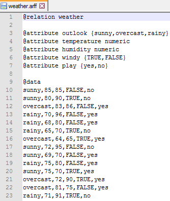

# 处理属性

在本章中，您将学习如何筛选属性、如何离散化属性以及如何执行属性选择。当我们过滤属性时，我们希望从数据集中移除某些属性。为此，我们将使用一个来自无人监管的`filters`包的`Remove`类，以及一个名为`-R`的属性。在本章中，我们还将使用离散化和宁滨。

我们将在本章中讨论以下主题:

*   过滤属性
*   离散化属性
*   属性选择

我们开始吧！


# 过滤属性

在这一节中，我们将学习如何过滤属性。让我们从代码开始。

我们将首先导入以下包和类:

```
import weka.core.Instances;
import weka.core.converters.ArffSaver;
import java.io.File;
import weka.core.converters.ConverterUtils.DataSource;
import weka.filters.Filter;
import weka.filters.unsupervised.attribute.Remove;
```

我们从各自的包中导入了`Instances`、`ArffSaver`、`File`和`DataSource`类，如前面的代码所示。我们在前一章中也使用了它们。`Instance`类将数据库放入内存，我们将在内存中处理数据集。`ArffSaver`类将帮助我们将数据集保存到磁盘上。`File`类将为磁盘命名，而`DataSource`类将从磁盘打开数据集。

正如您在前面的代码片段中看到的，我们从`weka.filters`包中导入了一个新类`Filter`。我们可以使用`Filter`类来应用过滤器。我们将应用的过滤器将是来自`unsupervised.attribute`包的非监督过滤器。

我们将首先把 ARFF 文件放入我们的`DataSource`对象中；然后，我们将使用一个`Instances`类`dt`对象将它存储在内存中，如下所示:

```
DataSource src = new DataSource("weather.arff");//path to the ARFF file on your system.
Instances dt = src.getDataSet();
```

我们已经创建了一个`String`对象，在这里我们可以放置我们想要用来过滤属性的所有选项。因为我们想要删除一个属性，我们将使用`-R`，并且我们将包括我们想要删除的属性的编号:

```
String[] op =  new String[]{"-R","2"};
```

然后我们将为`Remove`类创建一个对象，并使用我们的`String`对象为`Remove`类设置选项，如下所示:

```
Remove rmv = new Remove();
rmv.setOptions(op);
```

我们还将把`setInputFormat`方法放入应该使用它的数据集:

```
rmv.setInputFormat(dt);
```

然后，我们将创建一个新的数据集，并对其应用`Filter.useFilter`方法，提供应该应用过滤器的数据集:

```
Instances nd = Filter.useFilter(dt, rmv);
```

一旦我们完成了这些，我们将为`ArffSaver`类创建一个对象；然后，我们将新数据集`nd`分配给`ArffSaver`对象，并使用`setFile`方法命名该对象:

```
ArffSaver s = new ArffSaver();
s.setInstances(nd);
s.setFile(new File("fw.arff"));
```

最后，我们将使用`writeBatch()`方法将其写入磁盘:

```
s.writeBatch(); 
```

运行代码，您将看到以下输出:


如果构建成功，我们可以比较两个 ARFF 文件，如下面的屏幕截图所示:


正如您在前面的屏幕截图中看到的，`temperature`属性已经从新的数据集(`fw.arff`文件)中删除。如果我们想从文件中删除多个属性，我们在代码的`String[] op = new String[]{"-R","2"};`部分使用一个破折号(`-`)操作符。

例如，`String[] op = new String[]{"-R","2-3"};`将删除`2`到`3`的属性。如果我们使用`2-4`而不是`2-3`，它将从数据集中删除从`2`到`4`的属性。

让我们尝试使用`2-4`删除属性，并再次比较文件，如下所示:


在左侧，我们可以看到我们拥有的属性，在右侧，我们可以看到经过筛选的属性。这意味着我们已经删除了第二、第三和第四个属性。我们只剩下第一个和最后一个属性。

这就是我们如何对数据集应用过滤。


# 离散化属性

我们现在将看看如何使用 Weka 离散化属性。首先，我们来解释一下什么是离散化。**离散化属性**是指将数据集中的一系列数值属性离散化为名义属性。因此，离散化实际上是将数字数据分类。为此，我们将使用宁滨；它跳过`class`属性，如果设置的话。

假设我们有从 1 到 60 的值，我们想把它们分成三个不同的类别。我们希望创建分类数据，而不是数字数据。我们将创建三个箱子。让我们为从 0 到 20 的所有值创建一个库，为从 20 到 40 的值创建另一个库，为从 40 到 60 的值创建第三个库。使用离散化，每个数字数据都将成为分类数据。

我们现在将使用以下选项:

*   `-B<num>`:指定数字属性被分割的箱数。默认值为 10。
*   我们必须指定要进行宁滨的列。`-R`帮助我们创建这些箱子。请注意，离散化将始终适用于数值数据，但不适用于任何名义数据或其他类型的数据。`-R`指定要离散化的列列表。第一个和最后一个是有效的索引；如果我们没有指定任何东西，那么默认是`first-last`。

现在，让我们看一下代码。我们将使用到目前为止一直在使用的类，它们是`Instances`、`ArffSaver`、`File`、`DataSource`和`Filter`，如下所示:

```
import weka.core.Instances;
import weka.core.converters.ArffSaver;
import java.io.File;
import weka.core.converters.ConverterUtils.DataSource;
import weka.filters.Filter;
```

我们还将使用一个新的属性，它是来自`unsupervised.attribute`包的一个非监督属性。我们将使用`unsupervised.attribute`包中的`Discretize`类:

```
import weka.filters.unsupervised.attribute.Discretize;
```

首先，我们将数据集读入我们的`DataSource`类的`src`对象；然后，我们将使用我们的`Instances`类的`dt`对象把它放入内存。一旦我们完成了这些，我们将设置`options`。我们将设置的第一个选项是`-B`。

让我们假设我们想要创建`3`bin，我们想要对第二个和第三个属性应用离散化；下面的代码显示了需要设置的`options`:

```
DataSource src = new DataSource("weather.arff");
Instances dt = src.getDataSet();

String[] options = new String[4];
options[0] = "-B";
options[1] = "3";
options[2] = "-R";
options[3] = "2-3";
```

然后，我们将为`Discretize`类创建一个`dis`对象，并使用`setOptions`方法将这些`options`设置为`Discretize`类。然后我们将把我们的`Instances`类的`dt`对象提供给`setInputFormat`方法，如下所示:

```
Discretize dis = new Discretize();
dis.setOptions(options);
dis.setInputFormat(dt);
```

然后，我们将使用`Filter.useFilter`方法创建一个新实例，我们将使用什么`options`指定这个过滤应该应用于哪个数据集(`dt`);因此，我们将包含一个`Discretize`类的`dis`对象，如下所示:

```
Instances nd = Filter.useFilter(dt, dis);
```

之后，我们将使用`ArffSaver`类保存它，并且我们将使用`setInstance`方法向`ArffSaver`提供实例，以及一个新的`nd`数据集。我们将为`ArffSaver`类提供名称，即`weather-dis.arff`，我们将使用`writeBatch`方法编写它:

```
ArffSaver as = new ArffSaver();
as.setInstances(nd);
as.setFile(new File("weather-dis.arff"));
as.writeBatch();
```

运行代码。一旦我们的构建成功，我们将看到实际发生了什么。以下是我们在`weather.arff`文件中的属性:



我们已经对第二个和第三个属性应用了宁滨，所以`temperature`和`humidity`属性值将被转换成 bins 我们要求创建三个存储箱。我们来看看是不是在`weather-dis.arff`文件里做的，如下截图所示:


我们可以看到，我们已经为`temperature`和`humidity`属性创建了 bin，它们是数值。为`temperature`创建的箱子有`(inf-71]`、`( 71-78]`和`(78-inf)`。湿度箱为`(-inf-75.333333]`、`(75.333333-85.666667]`和`(85.666667-inf)`。如`@data`部分所示，这些值也已被转换成箱。

如果我们想要创建五个而不是三个库，我们可以简单地如下更新`options`代码段，并构建代码:

```
options[0] = "-B";
options[1] = "5";
options[2] = "-R";
options[3] = "2-3";
```

现在，`temperature`属性有五个容器，而`humidity`属性有五个容器，而不是三个容器，如下图所示:


这就是我们如何执行离散化并将数值数据转换为分类数据。


# 属性选择

我们现在将看看如何执行属性选择。**属性选择**是一种决定哪些属性是执行分类或聚类的最有利属性的技术。

所以，让我们看一下代码，看看会发生什么，如下所示:

```
import weka.core.Instances;
import weka.core.converters.ArffSaver;
import java.io.File;
import weka.core.converters.ConverterUtils.DataSource;
import weka.filters.Filter;
import weka.filters.supervised.attribute.AttributeSelection;
import weka.attributeSelection.CfsSubsetEval;
import weka.attributeSelection.GreedyStepwise;
```

前五个类将与我们之前使用的相同。我们还将使用一种新的属性类型，它将是来自`filters.supervised`包和`AttributeSelection`类的一个被监督的属性。然后，我们有一个`attribute.Selection`包，从那里，我们将使用`CfsSubsetEval`类和`GreedyStepwise`类。

在下面的代码中，我们首先将 ARFF 文件读入`DataSource`类的`src`对象；然后，我们将把`src`对象分配给`Instance`类的`dt`对象。然后我们将为`AttributeSelection`、`CfsSubsetEval`和`GreedyStepwise`类创建对象，如下所示:

```
DataSource src = new DataSource("/Users/admin/Documents/NetBeansProjects/Datasets/weather.arff");
Instances dt = src.getDataSet();

AttributeSelection asel = new AttributeSelection();             
CfsSubsetEval evl = new CfsSubsetEval();
GreedyStepwise sh = new GreedyStepwise();
```

然后，我们将把`CfsSubsetEval`和`GreedyStepwise`(实际上是一个搜索过程)类的`evl`和`sh`对象分配给`AttributeSelection`类的`asel`对象。然后，我们将数据集`dt`分配给`asel`对象，如以下代码所示:

```
asel.setEvaluator(evl);
asel.setSearch(sh);
asel.setInputFormat(dt);
```

之后，我们将创建一个新的数据集；我们将使用`Filter.useFilter`方法，给出应该对其进行过滤的数据集的名称(`dt`)，以及我们希望使用哪些选项(`asel`)来执行属性选择:

```
Instances nd = Filter.useFilter(dt, asel);
```

最后，我们将为`ArffSaver`类创建一个`as`对象；我们将把新的数据集(`nd`)分配给`as`对象。我们还将把文件名(`weather-sel.arff`)分配给`as`对象，并将其写入磁盘，如下所示:

```
ArffSaver as = new ArffSaver();
as.setInstances(nd);
as.setFile(new File("weather-sel.arff"));
as.writeBatch();
```

让我们运行代码并比较`weather.arff`文件和新生成的数据集，如下所示:


该文件是使用属性选择创建的。`GreedyStepwise`搜索确定两个数字属性`temperature`和`humidity`对我们的分类/聚类算法最不重要，并从文件中删除了它们。


# 摘要

在本章中，您学习了如何筛选属性，如何使用宁滨离散化属性，以及如何应用属性选择。过滤和离散化属性的过程使用非监督过滤器，而属性选择则使用监督过滤器。

在下一章，你将看到如何应用监督学习。