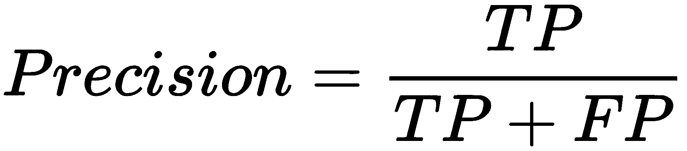
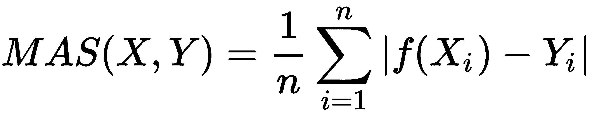

# 一、应用机器学习快速入门

本章介绍了机器学习的基础知识，列出了常见的主题和概念，并使其易于遵循逻辑和熟悉主题。目标是快速学习应用机器学习的分步过程，掌握主要的机器学习原理。在本章中，我们将讨论以下主题:

*   机器学习和数据科学
*   数据和问题定义
*   数据收集
*   数据预处理
*   无监督学习
*   监督学习
*   概括和评价

如果你已经熟悉机器学习，并渴望开始编码，那么请快速跳转到这一章之后的章节。但是，如果您需要刷新您的记忆或澄清一些概念，那么强烈建议您重温本章中介绍的主题。


# 机器学习和数据科学

现在大家都在说机器学习和数据科学。那么，到底什么是机器学习呢？它与数据科学有什么关系？这两个术语经常被混淆，因为它们经常使用相同的方法并且有很大的重叠。所以，我们先明确一下它们是什么。乔希·威尔斯在推特上写道:

“数据科学家是比任何软件工程师都更擅长统计，比任何统计学家都更擅长软件工程的人。”

-乔希·威尔斯

更具体地说，数据科学包括通过整合统计学、计算机科学和其他领域的方法从数据中获得洞察力来获取知识的整个过程。在实践中，数据科学包含数据采集、清理、分析、可视化和部署的迭代过程。

另一方面，机器学习主要关注在数据科学过程的分析和建模阶段使用的通用算法和技术。


# 用机器学习解决问题

在不同的机器学习方法中，有三种主要的学习方法，如下表所示:

*   监督学习
*   无监督学习
*   强化学习

给定一组示例输入 X 及其输出 Y，监督学习旨在学习通用映射函数 f，该函数将输入转换为输出，如 f: (X，Y)。

监督学习的一个例子是信用卡欺诈检测，其中学习算法用标记为正常或可疑(向量 Y)的信用卡交易(矩阵 X)来表示。学习算法产生一个决策模型，将看不见的交易标记为正常或可疑(这是 f 函数)。

相比之下，无监督学习算法不假设给定的结果标签，因为它们专注于学习数据的结构，例如将相似的输入分组到聚类中。因此，无监督学习可以发现数据中隐藏的模式。无监督学习的一个例子是基于物品的推荐系统，其中学习算法发现一起购买的相似物品；比如买了书 A 的人也买了书 b。

强化学习从一个完全不同的角度处理学习过程。它假设一个智能体，可以是机器人、机器人或计算机程序，与动态环境交互以实现特定目标。环境用一组状态来描述，代理可以采取不同的动作从一个状态移动到另一个状态。一些状态被标记为目标状态，如果代理实现了这个状态，它将获得一大笔奖励。在其他州，奖励更少，不存在，甚至是负的。强化学习的目标是找到一个最佳策略或映射函数，指定在每个状态下采取的行动，而无需教师明确告知这是否会导致目标状态。强化学习的一个例子是用于驾驶车辆的程序，其中状态对应于驾驶条件，例如当前速度、路段信息、周围交通、速度限制和道路上的障碍物；这些动作可以是驾驶操作，例如左转或右转、停止、加速和继续。该学习算法产生一个策略，该策略规定了在特定的驾驶条件配置中要采取的行动。

在本书中，我们将只关注监督学习和非监督学习，因为它们有许多相同的概念。如果强化学习激发了你的兴趣，那么一本好书是《强化学习:导论》，作者理查德·萨顿和安德鲁·巴尔托，麻省理工出版社(2018)。


# 应用机器学习工作流

这本书的重点是应用机器学习。我们希望为您提供让学习算法在不同环境中工作所需的实用技能。代替机器学习中的数学和理论，我们将花更多的时间在实践、动手技能(和肮脏的把戏)上，以使这些东西在应用程序中很好地工作。我们将关注监督和非监督机器学习，并学习数据科学中的基本步骤，以建立应用机器学习工作流程。

应用机器学习应用中的典型工作流由回答一系列问题组成，这些问题可以概括为以下步骤:


1.  **数据和问题定义**:第一步，提出有趣的问题，比如:*你正在尝试解决的问题是什么*？*为什么重要*？*哪种格式的结果回答了你的问题*？*这是一个简单的是/否答案*？*是否需要从可用问题中选择一个*？
2.  **数据收集**:一旦你有问题要解决，你将需要数据。问问你自己什么样的数据会帮助你回答这个问题。*你能从现有的来源得到数据吗*？*你必须结合多种来源吗*？*一定要生成数据*吗？*有没有抽样偏倚*？*需要多少数据*？
3.  **数据预处理**:第一个数据预处理任务是**数据清理**。一些示例包括填充缺失值、平滑噪声数据、移除异常值和解决一致性问题。随后通常会集成多个数据源，并将数据转换到特定范围(标准化)、值箱(离散化区间)，并减少维数。
4.  **数据分析和建模**:数据分析和建模包括无监督和有监督的机器学习、统计推断和预测。有各种各样的机器学习算法可用，包括 k-最近邻、朴素贝叶斯分类器、决策树、**支持向量机** ( **支持向量机**)、逻辑回归、k-means 等等。要部署的方法取决于第一步中讨论的问题定义和收集的数据类型。这一步的最终产品是从数据中推断出的模型。
5.  **评估**:最后一步是模型评估。用机器学习建立的模型面临的主要问题是它们对底层数据的建模有多好；例如，如果一个模型过于具体或者过于适合用于训练的数据，那么它很可能在新数据上表现不佳。该模型可能过于一般化，这意味着它对训练数据的拟合不足。比如，当被问及加州的天气如何时，它总是回答晴朗，这在大多数时候确实是正确的。然而，这样的模型对于做出有效的预测并不真正有用。这一步的目标是正确评估模型，并确保它也适用于新数据。评估方法包括单独的测试和训练集、交叉验证和留一交叉验证。

我们将在接下来的几节中仔细研究每个步骤。我们将尝试理解在应用机器学习工作流程中我们必须回答的问题类型，并查看数据分析和评估的相关概念。


# 数据和问题定义

当提出问题定义时，我们需要问一些问题，这些问题将有助于从数据中理解目标和目标信息。我们可以问一些非常常见的问题，例如:*一旦研究了数据，预期的发现是什么？* *数据探索后能提取出什么样的信息？*或者，*需要什么样的格式才能回答问题？*提出正确的问题会让你更清楚地了解下一步该怎么做。数据只是数字、文字、观察、事物描述、图像等形式的测量值的集合。


# 测量标度

表示数据最常见的方式是使用一组属性-值对。考虑下面的例子:

```
Bob = { 
height: 185cm, 
eye color: blue, 
hobbies: climbing, sky diving 
} 
```

例如，`Bob`具有名为`height`、`eye color`和`hobbies`的属性，其值分别为`185cm`、`blue`、`climbing`和`sky diving`。

一组数据可以简单地表示为表格，其中列对应于属性或特征，行对应于特定的数据示例或实例。在监督机器学习中，我们希望根据其他属性 X 的值来预测结果 Y 的值的属性被表示为类或目标变量，如下表所示:

| **名称** | **身高【厘米】** | **眼睛颜色** | **兴趣爱好** |
| 上下移动 | One hundred and eighty-five | 蓝色 | 爬山，跳伞 |
| 安娜；安那（anna 旧时印度货币名） | One hundred and sixty-three | 褐色的 | 阅读 |
| ... | ... | ... | ... |

我们注意到的第一件事是属性值变化有多大。例如，身高是一个数字，眼睛的颜色是文本，爱好是一个列表。为了更好地理解值类型，让我们仔细看看不同类型的数据或度量尺度。斯坦利·史密斯·史蒂文斯(1946 年)定义了以下四种具有越来越多表达性质的衡量尺度:

*   **名义数据**由互斥但不有序的数据组成。例子包括眼睛的颜色、婚姻状况、拥有的汽车类型等等。
*   **顺序数据**对应于顺序重要的类别，而不是值之间的差异，例如疼痛程度、学生信等级、服务质量评级、IMDb 电影评级等等。
*   **区间数据**由两个值之间的差异有意义的数据组成，但没有零的概念，例如标准化考试分数、华氏温度等。
*   **比率数据**具有区间变量的所有性质，也有零的明确定义；当变量等于零时，这个变量将会丢失。身高、年龄、股票价格和每周食物支出等变量是比率变量。

我们为什么要关心测量尺度？嗯，机器学习很大程度上依赖于数据的统计属性；因此，我们应该意识到每种数据类型的局限性。一些机器学习算法只能应用于测量尺度的子集。

下表总结了每种测量类型的主要操作和统计属性:

| **属性** | **标称值** | **序数** | **间隔** | **比率** |
| one | 分布频率 | 真实的 | 真实的 | 真实的 | 真实的 |
| Two | 众数和中位数 |  | 真实的 | 真实的 | 真实的 |
| three | 值的顺序是已知的 |  | 真实的 | 真实的 | 真实的 |
| four | 可以量化每个值之间的差异 |  |  | 真实的 | 真实的 |
| five | 可以增加或减少数值 |  |  | 真实的 | 真实的 |
| six | 可以乘除数值 |  |  |  | 真实的 |
| seven | 具有真零点 |  |  |  | 真实的 |

此外，标称和序数数据对应于离散值，而间隔和比率数据也可以对应于连续值。在监督学习中，我们想要预测的属性值的度量尺度决定了可以使用的机器算法的种类。例如，从有限的列表中预测离散值称为分类，可以使用决策树来实现，而预测连续值称为回归，可以使用模型树来实现。


# 数据收集

一旦问题问对了方向，数据探索的目标就很明确了。所以，下一步就是看数据从哪里来。收集的数据可能非常杂乱，格式也非常多样，这可能涉及到从数据库、互联网、文件系统或其他文档中读取数据。大多数机器学习工具要求数据以特定的格式呈现，以便生成正确的结果。我们有两种选择:观察现有来源的数据，或者通过调查、模拟和实验生成数据。让我们仔细看看这两种方法。


# 查找或观察数据

数据可以在很多地方找到或观察到。一个明显的数据来源是互联网。随着社交媒体使用的增加，以及随着移动数据计划变得更便宜甚至提供无限数据，移动电话渗透得更深，用户消费的数据呈指数级增长。

现在，在线流媒体平台已经出现——下图显示，花费在视频数据上的时间也在快速增长:


要从 internet 获取数据，有多个选项，如下表所示:

*   从维基百科、https://labrosa.ee.columbia.edu/millionsong/、*百万歌曲数据集*(可以在这里找到:)等网站批量下载。
*   通过 API(如谷歌、推特、脸书和 YouTube)访问数据。
*   搜集公开的、非敏感的、匿名的数据是可以的。请务必检查条款和条件，并充分参考信息。

收集数据的主要缺点是，积累数据需要时间和空间，而且它只涵盖发生的事情；例如，没有收集意图以及内部和外部动机。最后，这样的数据可能是嘈杂的、不完整的、不一致的，甚至可能随时间而改变。

另一种选择是从传感器收集测量值，例如移动设备中的惯性和位置传感器、环境传感器以及监控关键性能指标的软件代理。


# 生成数据

另一种方法是由您生成数据，例如，通过调查。在调查设计中，我们必须注意数据抽样；也就是回答调查的回答者是谁。我们只从容易接近并愿意回答的受访者那里获得数据。此外，受访者可以提供符合其自我形象和研究者预期的答案。

或者，可以通过模拟来收集数据，其中领域专家在微观层面上指定用户的行为模型。例如，人群模拟需要指定不同类型的用户在人群中的行为方式。一些例子可以是跟随人群，寻找一个逃避的方法，等等。然后可以在不同的条件下运行模拟，看看会发生什么(Tsai 等人，2011)。模拟适用于研究宏观现象和突发行为；然而，它们通常很难用经验来验证。

此外，您可以设计实验来彻底涵盖所有可能的结果，其中您保持所有变量不变，并且一次只操纵一个变量。这是最昂贵的方法，但通常提供最好的质量。


# 取样陷阱

数据收集可能涉及许多陷阱。为了演示一个，我来分享一个故事。学生之间免费发送普通邮件应该有一个全球性的不成文的规则。如果你在应该贴邮票的地方写上"学生对学生",邮件就会免费送到收件人手中。现在，假设 Jacob 给 Emma 发送了一套明信片，并且 Emma 确实收到了一些明信片，她得出结论所有的明信片都已送达，并且该规则确实成立。艾玛的理由是，当她收到明信片时，所有的明信片都被投递了。然而，她不知道 Jacob 寄出的明信片没有被投递；因此，她无法在她的推论中解释这一点。艾玛经历的是生存偏见；也就是她根据留存下来的数据得出的结论。供您参考，附有学生对学生邮票的明信片上有一个圈起来的黑色字母 T 邮票，这意味着邮资是到期的，收件人应该支付它，包括一笔小额罚款。然而，邮件服务在收取这些费用时通常会有更高的成本，因此不会这样做。(magal hes，2010 年)。

另一个例子是一项研究发现，平均死亡年龄最低的职业是学生。当学生并不会导致你早夭；相反，作为一名学生意味着你年轻。这就是平均水平如此之低的原因。(盖尔曼和诺兰，2002 年)。

此外，一项研究发现，在事故中只有 1.5%的司机报告说他们在使用手机，而 10.9%的人报告说车里的另一个乘客分散了他们的注意力。我们能得出使用手机比与另一个居住者交谈更安全的结论吗？(悉尼科技大学，2003 年)要回答这个问题，我们需要知道手机使用的普遍性。在收集数据期间，很可能有更多的人在开车时与车内的另一位乘客交谈，而不是打手机。


# 数据预处理

数据预处理任务的目标是以尽可能好的方式为机器学习算法准备数据，因为并非所有算法都能够解决丢失数据、额外属性或反规格化值的问题。


# 数据清理

数据清理，也称为数据清理或数据清理，是一个由以下步骤组成的过程:

1.  识别不准确、不完整、不相关或损坏的数据，以将其从进一步处理中移除
2.  解析数据，提取感兴趣的信息，或者验证数据字符串的格式是否可以接受
3.  将数据转换为通用编码格式，例如 UTF-8 或 int32、时间刻度或标准化范围
4.  将数据转换成公共数据模式；例如，如果我们从不同类型的传感器收集温度测量值，我们可能希望它们具有相同的结构


# 填充缺失值

机器学习算法通常不能很好地处理缺失值。罕见的例外包括决策树、朴素贝叶斯分类器和一些基于规则的学习器。理解一个值缺失的原因是非常重要的。它可能由于多种原因而丢失，例如随机误差、系统误差和传感器噪声。一旦我们确定了原因，就有多种方法来处理丢失的值，如下表所示:

*   **删除实例**:如果有足够的数据，并且只有几个不相关的实例有一些丢失的值，那么删除这些实例是安全的。
*   **删除属性**:当大部分值缺失、值不变或者一个属性与另一个属性强相关时，删除一个属性是有意义的。
*   **指定一个特殊值** ( **N/A** ):有时由于有效的原因，某个值会丢失，例如该值超出范围，离散属性值未定义，或者无法获取或测量该值。例如，如果一个人从不评价一部电影，那么他对这部电影的评价就是不存在的。
*   **以平均属性值**为例:如果我们的实例数量有限，我们可能无法承担删除实例或属性的费用。在这种情况下，我们可以通过分配平均属性值来估计缺失值。
*   **预测其他属性的值**:如果属性具有时间相关性，则预测之前条目的值。

正如我们所看到的，值的丢失可能有多种原因，因此，理解值丢失、缺失或损坏的原因是很重要的。


# 移除异常值

数据中的异常值是不同于序列中任何其他值的值，并在不同程度上影响所有学习方法。这些可能是极端值，可以用置信区间来检测，并通过使用阈值来消除。最好的方法是将数据可视化，并检查可视化以检测不规则性。下图显示了一个示例。可视化仅适用于低维数据:

<link href="Styles/Style00.css" rel="stylesheet" type="text/css"> <link href="Styles/Style01.css" rel="stylesheet" type="text/css"> <link href="Styles/Style02.css" rel="stylesheet" type="text/css"> <link href="Styles/Style03.css" rel="stylesheet" type="text/css">     

# 数据转换

数据转换技术将数据集驯服为机器学习算法期望作为输入的格式，甚至可以帮助算法更快地学习并实现更好的性能。它也被称为数据管理或数据争论。例如，标准化假设数据遵循高斯分布，并以平均值为 0、偏差为 1 的方式转换值，如下所示:


另一方面，规范化将属性值调整到一个较小的指定范围，通常在 0 和 1 之间:


很多机器学习工具箱会自动为你将数据规格化、标准化。

最后一种转换技术是离散化，它将连续属性的范围划分为多个区间。我们为什么要关心？一些算法，如决策树和朴素贝叶斯更喜欢离散属性。选择间隔的最常见方法如下:

*   **等宽**:连续变量的区间分为 *k* 等宽区间
*   **等频**:假设有 *N* 个实例，每个 *k* 个区间包含大约 *N* 或 *k* 个实例
*   最小熵(Min entropy):这种方法递归地分割区间，直到度量无序度的熵减少超过区间分割引入的熵增加(法耶兹和伊拉尼，1993)

前两种方法需要我们指定区间数，后一种方法自动设置区间数；然而，它需要 class 变量，这意味着它不适用于无监督的机器学习任务。


# 数据整理

数据约简处理丰富的属性和实例。属性的数量对应于数据集中的维数。预测能力低的维度对整体模型的贡献很小，造成的危害很大。例如，具有随机值的属性可以引入一些随机模式，这些模式将被机器学习算法拾取。可能会出现数据包含大量缺失值的情况，我们必须找到大量缺失值的原因，并在此基础上用一些替代值填充，或者估算或完全删除属性。如果缺少 40%或更多的值，那么建议删除这些属性，因为这会影响模型性能。

另一个因素是方差，其中常数变量可能具有较低的方差，这意味着数据彼此非常接近，或者数据中没有太大的变化。

为了处理这个问题，第一组技术去除这样的属性并选择最有希望的属性。这一过程被称为特征选择或属性选择，包括诸如 ReliefF、信息增益和基尼指数等方法。这些方法主要关注离散属性。

另一组工具侧重于连续属性，将数据集从原始维度转换到低维空间。例如，如果我们在三维空间中有一组点，我们可以将其投影到二维空间中。一些信息丢失了，但是在第三维度不相关的情况下，我们不会丢失太多，因为数据结构和关系几乎被完美地保留了下来。这可以通过以下方法实现:

*   **奇异值分解** ( **SVD** )
*   **主成分分析** ( **PCA** )
*   向后/向前特征消除
*   要素分析
*   **线性判别分析** ( **LDA** )
*   神经网络自动编码器

数据简化的第二个问题与过多的实例有关；例如，它们可能是重复的或者来自非常频繁的数据流。主要思想是选择实例的子集，使得所选数据的分布仍然类似于原始数据分布，更重要的是，类似于观察到的过程。减少实例数量的技术包括随机数据采样、分层等。一旦准备好数据，我们就可以开始数据分析和建模了。


# 无监督学习

无监督学习是关于分析数据和发现未标记数据中的隐藏结构。因为没有给出正确标签的概念，所以也没有错误度量来评估学习模型；然而，无监督学习是一个极其强大的工具。你有没有想过亚马逊如何预测你会喜欢什么书？或者网飞如何在你之前知道你想看什么？答案可以在无监督学习中找到。我们将在下一节看一个类似的无监督学习的例子。


# 查找相似的项目

许多问题可以表述为寻找相似的元素集合，例如，购买相似产品的客户、具有相似内容的网页、具有相似对象的图像、访问相似网站的用户等等。

如果两个项目相距很小，则认为它们是相似的。主要问题是如何表示每个项目，以及如何定义项目之间的距离。距离测量主要有两类:

*   欧几里德距离
*   非欧几里德距离


# 欧几里德距离

在欧几里得空间中，在维度为 *n* 的情况下，两个元素之间的距离是基于元素在这样一个空间中的位置，表示为**p-范数距离**。两种常用的距离度量是 L2 范数距离和 L1 范数距离。

**L2 范数**，也称为欧几里德距离，是最常用的距离度量，用于测量二维空间中两个项目之间的距离。其计算方法如下:


**L1 定额**，也称为曼哈顿距离、城市街区距离和出租车定额，简单地对每个维度的绝对差异求和，如下所示:


# 非欧几里德距离

非欧几里得距离是基于元素的属性，而不是基于它们在空间中的位置。一些众所周知的距离是雅克卡距离、余弦距离、编辑距离和汉明距离。

**Jaccard distance** 用于计算两组之间的距离。首先，我们将两个集合的 Jaccard 相似性计算为它们的交集大小除以它们的并集大小，如下所示:


然后根据以下公式定义 Jaccard 距离:


**两个向量之间的余弦距离**关注的是方向而不是大小，因此，两个方向相同的向量的余弦相似度为 1，而两个垂直的向量的余弦相似度为 0。假设我们有两个多维点，把一个点想象成一个从原点出发的向量( *0，0，...，0* 到它的位置。两个向量构成一个角度，其余弦距离是向量的归一化点积，如下所示:


余弦距离常用于高维特征空间；例如，在文本挖掘中，文本文档代表一个实例，对应于不同单词的特征，它们的值对应于单词在文档中出现的次数。通过计算余弦相似度，我们可以测量两个文档在描述相似内容时匹配的可能性。

**编辑距离**在我们比较两个字符串的时候是有意义的。a=a1，a2，a3 之间的距离，...an 和 b=b1，b2，b3，...bn strings 是将字符串从 a 转换为 b 所需的单个字符的插入/删除操作的最小次数，例如，a = abcd，b = abbd。要将 a 转换成 b，我们必须删除第二个 b，并在它的位置插入 c。没有任何最小数量的运算会将 a 转换成 b，因此距离为 d(a，b) =2。

**汉明距离**比较两个大小相同的向量，并计算它们不同的维数。换句话说，它测量将一个载体转换成另一个载体所需的替换次数。

有许多侧重于各种属性的距离度量，例如，相关性度量两个元素之间的线性关系； **Mahalanobis distance** 度量一个点与其他点的分布之间的距离 **SimRank** 基于图论，度量元素出现的结构的相似性，等等。正如您所想象的，为您的问题选择和设计正确的相似性度量是成功的一半以上。A. A. Goshtasby，Springer Science and Business Media(2012)所著的《图像配准:原理、工具和方法》一书的第 2 章*相似性和不相似性度量* *、*中收集了对相似性度量的令人印象深刻的概述和评估。


# 维度的诅咒

维数灾难指的是这样一种情况，我们有大量的特征，通常有数百个或数千个，这导致数据稀疏的空间非常大，从而导致距离异常。例如，在高维空间中，几乎所有的点对彼此之间的距离都是相等的；事实上，几乎所有配对的距离都接近平均距离。诅咒的另一个表现是任何两个向量几乎是正交的，这意味着所有的角度都接近 90 度。这实际上使任何距离测量变得无用。

一种解决维数灾难的方法可能会在一种数据简化技术中找到，在这种技术中，我们希望减少特征的数量；例如，我们可以运行一个特征选择算法，比如 ReliefF，或者一个特征提取或简化算法，比如 PCA。


# 使聚集

聚类是一种根据一些距离度量将相似的实例分组到簇中的技术。主要思想是将相似(即彼此靠近)的实例放入同一个群集中，同时将不相似的点(即彼此远离的点)放在不同的群集中。下图显示了群集的一个示例:


聚类算法遵循两种根本不同的方法。第一种是分层或凝聚方法，首先将每个点视为其自己的聚类，然后迭代地将最相似的聚类合并在一起。当进一步的合并达到预定义的聚类数量时，或者如果要合并的聚类分布在很大的区域上时，它停止。

另一种方法是基于点分配。首先，例如随机地估计初始聚类中心(即质心)，然后，将每个点分配给最近的聚类，直到所有的点都被分配。这一组中最著名的算法是 k 均值聚类。

k-均值聚类或者选取初始聚类中心作为彼此尽可能远的点，或者(分层地)对数据样本进行聚类，并选取最接近每个 k-聚类中心的点。


# 监督学习

监督学习是语音识别、垃圾邮件过滤、照片中的人脸识别以及检测信用卡欺诈等惊人事情背后的关键概念。更正式地说，给定一组用特征 X 描述的学习示例 D，监督学习的目标是找到预测目标变量 Y 的函数。描述特征 X 和类 Y 之间关系的函数 f 称为模型:


监督学习算法的一般结构由以下决定定义(Hand 等人，2001 年):

1.  定义任务
2.  决定引入特定归纳偏差的机器学习算法；也就是说，它对目标概念的先验假设
3.  决定分数或成本函数，例如，信息增益、均方根误差等等
4.  决定优化/搜索方法以优化得分函数
5.  找出一个描述 X 和 Y 之间关系的函数

许多决定已经由我们所拥有的任务和数据集的类型为我们做出了。在接下来的几节中，我们将进一步了解分类和回归方法以及相应的得分函数。


# 分类

当我们处理一个离散类时，可以应用分类，其中的目标是预测目标变量中的一个互斥值。信用评分就是一个例子，它的最终预测是这个人是否有信用责任。最流行的算法包括决策树、朴素贝叶斯分类器、支持向量机、神经网络和集成方法。


# 决策树学习

决策树学习构建分类树，每个节点对应其中一个属性；边对应于节点源自的属性的可能值(或区间);每片叶子对应一个类别标签。决策树可用于直观和明确地表示预测模型，这使其成为非常透明的(白盒)分类器。值得注意的算法是 ID3 和 C4.5，尽管存在许多替代实现和改进(例如，Weka 中的 J48)。


# 概率分类器

给定一组属性值，概率分类器能够预测一组类的分布，而不是准确的类。这可以作为一定程度的确定性；也就是说，分类器对其预测有多大把握。最基本的分类器是朴素贝叶斯，当且仅当属性条件独立时，它才是最佳分类器。不幸的是，这在实践中极为罕见。

有一个被称为概率图形模型的巨大子领域，包括数百种算法，例如贝叶斯网络、动态贝叶斯网络、隐马尔可夫模型和条件随机场，它们不仅可以处理属性之间的特定关系，还可以处理时间依赖性。Kiran R Karkera 写了一本关于这个主题的优秀入门书籍，*用 Python 构建概率图形模型*，Packt 出版社(2014)，而柯勒和弗里德曼则出版了一本全面的理论圣经，*概率图形模型，*麻省理工出版社(2009)。


# 核心方法

任何线性模型都可以通过对模型应用核技巧(用核函数替换其特征(预测值))而变成非线性模型。换句话说，内核隐式地将我们的数据集转换到更高维度。内核技巧利用了这样一个事实，即在更多维度上分离实例通常更容易。能够对内核进行操作的算法包括内核感知器、支持向量机、高斯过程、PCA、典型相关分析、岭回归、谱聚类、线性自适应滤波器等等。


# 人工神经网络

人工神经网络受生物神经网络结构的启发，能够进行机器学习和模式识别。它们通常用于回归和分类问题，包括各种算法和各种问题类型的变体。一些流行的分类方法有**感知器**、**受限玻尔兹曼机** ( **RBM** )、**深度信念网络**。


# 集成学习

集成方法由一组不同的较弱模型组成，以获得更好的预测性能。单独训练各个模型，然后以某种方式将它们的预测组合起来，以进行整体预测。因此，集成包含多种建模数据的方式，这有望带来更好的结果。这是一类非常强大的技术，因此非常受欢迎。这个类包括 boosting、bagging、AdaBoost 和 random forest。他们之间的主要区别是要结合的弱学习者的类型和结合他们的方式。


# 评估分类

我们的分类器做得好吗？这个比另一个好吗？在分类中，我们会计算我们对某件事进行正确和错误分类的次数。假设有“是”和“否”两种可能的分类标签，则有四种可能的结果，如下表所示:

|  | **预测为阳性？** |
| **是** | **否** |
| **真的阳性？** | **是** | TP-真阳性 | FN-假阴性 |
| **否** | FP-假阳性 | TN-真阴性 |

四个变量:

*   **真肯定** ( **击中**):这表示一个 yes 实例被正确预测为 yes
*   **真否定** ( **正确拒绝**):这表示没有实例被正确预测为否
*   **误报** ( **误报**):表示没有实例预测为是
*   **假阴性** ( **错过**):这表示一个是实例被预测为否

分类器的两个基本性能指标是，首先，分类误差:


其次，分类准确性是另一个性能衡量指标，如下所示:


这两种方法的主要问题是它们不能处理不平衡的类。对信用卡交易是否滥用进行分类是不平衡分类问题的一个例子:有 99.99%的正常交易，只有极小比例的滥用。说每笔交易都是正常交易的分类器有 99.99%的准确率，但我们主要对那些很少出现的少数分类感兴趣。


# 精确度和召回率

解决办法是使用不涉及真正负面的方法。两项此类措施如下:

*   **Precision** :正确预测为正( *TP* )的正例占所有预测为正( *TP + FP* )的正例的比例；



*   **回忆**:这是所有正例( *TP + FN* )中被正确预测为正例( *TP* )的正例的比例；


通常将两者结合起来并报告 *F-measure* ，它同时考虑了精确度和召回率，以加权平均值的形式计算得分，其中得分在 1 时达到最佳值，在 0 时达到最差值，如下所示:


# Roc 曲线

大多数分类算法返回表示为 *f(X)* 的分类置信度，该置信度又用于计算预测。以信用卡滥用为例，规则可能如下所示:


阈值决定了错误率和真阳性率。所有可能阈值的结果可以绘制成**接收器工作特性** ( **ROC** )，如下图所示:


随机预测值用红色虚线绘制，理想预测值用绿色虚线绘制。为了比较 **A** 分类器是否优于 **C** ，我们比较曲线下的面积。

大多数工具箱都提供了所有现成的先前测量。


# 回归

回归处理的是连续的目标变量，而分类处理的是离散的目标变量。例如，为了预测未来几天的室外温度，我们将使用回归，而分类将用于预测是否会下雨。一般来说，回归是一个估计特征之间关系的过程，即改变一个特征如何改变目标变量。


# 线性回归

最基本的回归模型假设特征和目标变量之间的线性相关性。该模型通常使用最小二乘法拟合，即最佳模型使误差的平方最小化。在许多情况下，线性回归不能模拟复杂的关系；例如，下图显示了具有相同线性回归线的四组不同的点。左上角的模型捕捉到了总体趋势，可被视为合适的模型，而左下角的模型拟合点更好(除了一个异常值，应仔细检查)，右上角和右下角的线性模型完全错过了数据的基本结构，不能被视为合适的模型:


# 逻辑回归

当因变量连续时，线性回归有效。然而，如果因变量本质上是二元的，即 0 或 1、成功或失败、是或否、真或假、存活或死亡等等，那么就用逻辑回归来代替。一个这样的例子是药物的临床试验，其中被研究的对象或者对药物有反应或者没有反应。它还用于欺诈检测，即交易是欺诈还是非欺诈。通常，逻辑函数用于衡量因变量和自变量之间的关系。它被视为伯努利分布，当绘制时，看起来类似于字符形状的曲线。


# 评估回归

在回归中，我们从输入 X 预测数字 Y，而预测通常是错误的或不准确的。我们必须问的主要问题是:增加多少？换句话说，我们想要测量预测值和真实值之间的距离。


# 均方误差

**均方误差** ( **MSE** )是预测值和真实值之间的平方差的平均值，如下:


该度量对异常值非常敏感，例如，99 个精确预测和 1 个相差 10 的预测与所有相差 1 的预测得分相同。此外，该度量对均值敏感。因此，通常使用相对平方误差来比较我们的预测值的 MSE 和平均预测值(总是预测平均值)的 MSE。


# 绝对平均误差

**平均绝对误差** ( **MAS** )是预测值和真实值之间绝对差值的平均值，如下所示:



MAS 对异常值不太敏感，但对平均值和标度也很敏感。


# 相关系数

**相关系数** ( **CC** )比较相对于平均值的预测平均值，乘以相对于平均值的训练值。如果数字为负，说明弱相关；正数表示相关性强；零表示没有相关性。真实值 *X* 和预测值 *Y* 之间的相关性定义如下:


CC 测量对平均值和标度完全不敏感，对异常值不太敏感。它能够捕捉相对排序，这使得它对于排序任务非常有用，例如文档相关性和基因表达。


# 概括和评价

一旦建立了模型，我们如何知道它将在新数据上执行？这个模型好吗？为了回答这些问题，我们将首先研究模型的泛化，然后看看如何获得对新数据的模型性能的估计。


# 欠拟合和过拟合

预测器训练可能导致模型过于复杂或过于简单。低复杂度的模型(下图中最左边的模型)可以简单到预测最频繁或平均的类值，而高复杂度的模型(最右边的模型)可以表示定型实例。过于僵硬的模式，显示在左手边，不能捕捉复杂的模式；而右侧所示的过于灵活的模型适合训练数据中的噪声。主要的挑战是选择适当的学习算法及其参数，以便学习的模型将在新数据上表现良好(例如，中间的列):


下图显示了定型集中的错误如何随着模型复杂性的增加而减少。简单的刚性模型对数据拟合不足，误差较大。随着模型复杂性的增加，它可以更好地描述训练数据的基础结构，因此，误差会减小。如果模型太复杂，它会过度拟合训练数据，并且其预测误差会再次增加:


根据任务的复杂性和数据的可用性，我们希望将我们的分类器调整到更复杂或更简单的结构。大多数学习算法都允许这样的调整，如下所示:

*   **回归**:这是多项式的阶
*   **朴素贝叶斯**:这是属性的数量
*   **决策树**:这是树中节点的数量——修剪置信度
*   **K-最近邻居**:这是邻居的数量——基于距离的邻居权重
*   **SVM** :这是内核类型；成本参数
*   **神经网络**:这是神经元和隐含层的数量

通过调整，我们希望最小化泛化误差；也就是说，分类器对未来数据的表现如何。不幸的是，我们永远无法计算真实的泛化误差；但是，我们可以估算一下。然而，如果模型在训练数据上表现良好，但在测试数据上表现差得多，则模型很可能过拟合。


# 训练和测试集

为了估计泛化误差，我们将数据分成两部分:训练数据和测试数据。一个通用的经验法则是按照培训:测试的比例(即 70:30)将它们分开。我们首先根据训练数据训练预测器，然后预测测试数据的值，最后计算误差，即预测值和真实值之间的差异。这给了我们一个真实的泛化误差的估计。

该估计基于以下两个假设:首先，我们假设测试集是来自数据集的无偏样本；第二，我们假设实际的新数据将重组分布作为我们的训练和测试示例。第一个假设可以通过交叉验证和分层来缓解。此外，如果它是稀缺的，人们不能为一个单独的测试集遗漏大量的数据，因为如果学习算法没有接收到足够的数据，它们就不会执行得很好。在这种情况下，使用交叉验证来代替。


# 交叉验证

交叉验证将数据集分成大小大致相同的 *k* 个集合，例如，在下图中，分成五个集合。首先，我们使用集合 2 到 5 进行学习，集合 1 进行训练。然后，我们重复该过程五次，每次留出一组进行测试，并平均五次重复的误差:


这样，我们也可以使用所有的数据进行学习和测试，同时避免使用相同的数据来训练和测试模型。


# 留一验证

交叉验证的一个极端例子是留一验证。在这种情况下，折叠的数量等于实例的数量；我们在除了一个实例之外的所有实例上学习，然后在省略的实例上测试模型。我们对所有实例重复这一过程，以便每个实例只被用于一次验证。当我们只有有限的一组学习示例时，例如少于 50 个，推荐使用这种方法。


# 分层

分层是一个选择实例子集的过程，其方式是每个文件夹大致包含相同比例的类值。当一个类是连续的时，选择的折叠使得平均响应值在所有的折叠中近似相等。分层可以与交叉验证或单独的训练和测试集一起应用。


# 摘要

在这一章中，我们更新了机器学习基础知识。我们回顾了应用机器学习的工作流程，并阐明了主要任务、方法和算法。我们学习了不同类型的回归以及如何评估它们。我们还探索了交叉验证及其应用。

在下一章，我们将学习 Java 库，它们可以执行的任务，以及不同的机器学习平台。