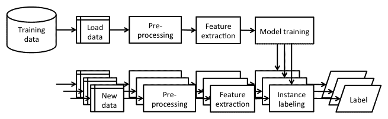

# 二、用于机器学习的 Java 库和平台

自己实现机器学习算法可能是学习机器学习的最佳方式，但如果你站在巨人的肩膀上，利用现有的开源库之一，你可以进步得更快。

本章回顾了 Java 中用于机器学习的各种库和平台。目标是了解每个库带来了什么，以及它能够解决什么样的问题。

在本章中，我们将讨论以下主题:

*   实现机器学习应用程序对 Java 的要求
*   Weka，一个通用机器学习平台
*   Java 机器学习库，机器学习算法的集合
*   Apache Mahout，一个可扩展的机器学习平台
*   Apache Spark，一个分布式机器学习库
*   Deeplearning4j，深度学习库
*   MALLET，一个文本挖掘库

我们还将讨论如何通过将这些库与其他组件一起使用，为单机和大数据应用设计完整的机器学习应用堆栈。


# 对 Java 的需求

新的机器学习算法通常首先在大学实验室编写脚本，将 shell 脚本、Python、R、MATLAB、Scala 或 C++等几种语言粘合在一起，以提供一个新概念，并从理论上分析其属性。一个算法在进入一个具有标准化输入或输出和接口的程序库之前，可能要经历一个漫长的重构过程。虽然 Python、R 和 MATLAB 相当流行，但它们主要用于编写脚本、研究和实验。另一方面，Java 是事实上的企业语言，这可以归功于静态类型、健壮的 IDE 支持、良好的可维护性以及体面的线程模型和高性能并发数据结构库。此外，已经有许多 Java 库可用于机器学习，这使得在现有的 Java 应用程序中应用它们并利用强大的机器学习功能非常方便。


# 机器学习库

MLOSS.org 网站上列出了超过 70 个基于 Java 的开源机器学习项目，可能还有更多未列出的项目位于大学服务器、GitHub 或 Bitbucket 上。在这一节中，我们将回顾主要的库和平台，它们可以解决的问题类型，它们支持的算法，以及它们可以处理的数据类型。


# 新西兰黑秧鸡

**怀卡托知识分析环境** ( **WEKA** )是新西兰怀卡托大学开发的机器学习库，可能是最知名的 Java 库。这是一个通用库，能够解决各种各样的机器学习任务，如分类、回归和聚类。它具有丰富的图形用户界面、命令行界面和 Java API。你可以在 http://www.cs.waikato.ac.nz/ml/weka/的[查看 Weka。](http://www.cs.waikato.ac.nz/ml/weka/)

在写这本书的时候，Weka 总共包含了 267 种算法:数据预处理(82)，属性选择(33)，分类回归(133)，聚类(12)，关联规则挖掘(7)。图形界面非常适合探索您的数据，而 Java API 允许您开发新的机器学习方案，并在应用程序中使用这些算法。

Weka 是在 **GNU 通用公共许可证** ( **GNU GPL** )下发布的，这意味着只要你跟踪源文件中的变化并保持在 GNU GPL 下，你就可以复制、发布和修改它。你甚至可以在商业上发布它，但是你必须公开源代码或者获得商业许可。

除了几种受支持的文件格式之外，Weka 还有自己的默认数据格式，即 ARFF，通过属性-数据对来描述数据。它由两部分组成。第一部分包含一个头，它指定了所有属性及其类型，例如，名义、数字、日期和字符串。第二部分包含数据，其中每一行对应一个实例。头中的最后一个属性被隐式地认为是目标变量，缺少的数据用问号标记。例如，回到来自[第 1 章](11a9489b-c4dd-4544-ace8-f84533d8fd7c.xhtml)、*应用机器学习快速入门*的示例，以 ARFF 文件格式编写的`Bob`实例如下:

```java
@RELATION person_dataset @ATTRIBUTE `Name` STRING @ATTRIBUTE `Height` NUMERIC @ATTRIBUTE `Eye color`{blue, brown, green} @ATTRIBUTE `Hobbies` STRING @DATA 'Bob', 185.0, blue, 'climbing, sky diving' 'Anna', 163.0, brown, 'reading' 'Jane', 168.0, ?, ? 
```

该文件由三部分组成。第一部分以`@RELATION <String>`关键字开始，指定数据集名称。下一部分以关键字`@ATTRIBUTE`开始，后面是属性名和类型。可用的类型有`STRING`、`NUMERIC`、`DATE`和一组分类值。最后一个属性被隐含地假定为我们想要预测的目标变量。最后一部分以关键字`@DATA`开始，每行一个实例。实例值由逗号分隔，并且必须遵循与第二部分中的属性相同的顺序。

更多 Weka 示例将在[第 3 章](e0c71e12-6bd7-4f63-b71d-78bb5a87b801.xhtml)、*基本算法——分类、回归和聚类*以及[第 4 章](6ac8d4de-1e7f-4f60-9cf0-93ab2fe55e4d.xhtml)、*用系综进行客户关系预测*中演示。

要了解关于 Weka 的更多信息，请阅读一本快速入门书籍，由*卡鲁扎出版社*出版的 *Weka How-to、*开始编写代码，或者查阅由 *Witten 和 Frank* 、*摩根考夫曼出版社*出版的*数据挖掘:实用的机器学习工具和 Java 实现技术*，了解理论背景和深入的解释。

Weka 的 Java API 被组织成以下顶级包:

*   `weka.associations`:这些是关联规则学习的数据结构和算法，包括**先验**、**预测先验**、**过滤关联器**、 **FP-Growth** 、**广义序列模式** ( **GSP** )、**热点**、 **Tertius** 。
*   这些是监督学习算法、评估器和数据结构。该包进一步分为以下几个部分:
    *   `weka.classifiers.bayes`:实现了贝叶斯方法，包括朴素贝叶斯、贝叶斯网、贝叶斯逻辑回归等等。
    *   `weka.classifiers.evaluation`:这些是针对名义和数值预测的监督评估算法，比如评估统计、混淆矩阵、ROC 曲线等等。
    *   `weka.classifiers.functions`:这些是回归算法，包括线性回归、保序回归、高斯过程、**支持向量机**(**SVM**)、多层感知器、投票感知器等。
    *   `weka.classifiers.lazy`:这些是基于实例的算法，比如 K-最近邻、K*和懒惰贝叶斯规则。
    *   `weka.classifiers.meta`:这些是监督学习元算法，包括 AdaBoost、bagging、加法回归、随机委员会等等。
    *   `weka.classifiers.mi`:这些都是多实例学习算法，比如引文 k 近邻、多样性密度、AdaBoost 等等。
    *   这些是基于分而治之方法、RIPPER、PART、PRISM 等的决策表和决策规则。
    *   `weka.classifiers.trees`:这些是各种决策树算法，包括 ID3，C4.5，M5，功能树，逻辑树，随机森林等等。
    *   `weka.clusterers`:这些是聚类算法，包括 k-means，CLOPE，Cobweb，DBSCAN 层次聚类，FarthestFirst。
    *   这些是各种实用程序类，例如属性类、统计类和实例类。
    *   这些是用于分类、回归和聚类算法的数据生成器。
    *   `weka.estimators`:这些是离散/名义域的各种数据分布估计器，条件概率估计等等。
    *   这些是一组类，支持运行实验所必需的配置、数据集、模型设置和统计。
    *   `weka.filters`:这些是基于属性和基于实例的选择算法，用于监督和非监督数据预处理。
    *   这些是实现资源管理器、实验器和知识流应用程序的图形界面。Weka Explorer 允许您研究数据集、算法及其参数，并使用散点图和其他可视化方式可视化数据集。Weka 实验器用于设计批量实验，但只能用于分类和回归问题。Weka KnowledgeFlow 实现了一个可视化的拖放用户界面来构建数据流，例如，加载数据、应用过滤器、构建分类器以及评估它。


# Java 机器学习

**Java 机器学习库** ( **Java-ML** )是一个机器学习算法的集合，具有同类型算法的通用接口。它只以 Java API 为特色，因此主要面向软件工程师和程序员。Java-ML 包含数据预处理、特征选择、分类和聚类的算法。此外，它还具有几个 Weka 桥，可以通过 Java-ML API 直接访问 Weka 的算法。可以从 http://java-ml.sourceforge.net 的[下载。](http://java-ml.sourceforge.net/)

Java-ML 也是一个通用的机器学习库。与 Weka 相比，它提供了更一致的接口和其他软件包中不存在的最新算法的实现，例如一组广泛的最先进的相似性度量和特征选择技术，例如，**动态时间扭曲**(**)、随机森林属性评估等等。Java-ML 在 GNU GPL 许可下也是可用的。**

 **Java-ML 支持所有类型的文件，只要它们每行包含一个数据样本，并且用逗号、分号或制表符等符号分隔。

该库是围绕以下顶级包组织的:

*   `net.sf.javaml.classification`:这些是分类算法，包括朴素贝叶斯、随机森林、bagging、自组织地图、k 近邻等等
*   这些是聚类算法，如 k-means、自组织映射、空间聚类、蛛网、ABC 等
*   这些是代表实例和数据集的类
*   这些是测量实例距离和相似性的算法，例如，切比雪夫距离、余弦距离/相似性、欧几里德距离、雅克卡距离/相似性、马哈拉诺比斯距离、曼哈顿距离、闵可夫斯基距离、皮尔逊相关系数、斯皮尔曼尺距、DTW 等等
*   `net.sf.javaml.featureselection`:这些是用于特征评估、评分、选择和排序的算法，例如，增益率、ReliefF、Kullback-Leibler 散度、对称不确定性等等
*   这些是通过过滤、删除属性、设置类或属性值等操作实例的方法
*   `net.sf.javaml.matrix`:这实现了内存或基于文件的数组
*   `net.sf.javaml.sampling`:这实现了采样算法来选择数据集的子集
*   这些是关于数据集、实例操作、序列化、Weka API 接口等等的实用方法
*   这些是算法的实用方法，例如，统计、数学方法、列联表等等** **        

# 阿帕奇看象人

Apache Mahout 项目旨在建立一个可扩展的机器学习库。它使用 MapReduce 范式构建在可扩展的分布式架构(如 Hadoop)之上，MapReduce 范式是一种使用服务器集群通过并行分布式算法处理和生成大型数据集的方法。

Mahout 具有一个控制台界面和 Java API，作为集群、分类和协作过滤的可伸缩算法。它能够解决三个业务问题:

*   **物品推荐**:推荐 **等物品喜欢这部电影的人也喜欢**
*   **聚类**:将文本文档分类成与主题相关的文档组
*   **分类**:学习将哪个主题分配给未标记的文档

Mahout 是在商业友好的 Apache 许可下发布的，这意味着只要您保留 Apache 许可并在程序的版权声明中显示它，您就可以使用它。

Mahout 具有以下库:

*   `org.apache.mahout.cf.taste`:这些是基于基于用户和基于项目的协同过滤和基于 ALS 的矩阵分解的协同过滤算法
*   `org.apache.mahout.classifier`:这些是内存和分布式实现，包括逻辑回归、朴素贝叶斯、随机森林、**隐马尔可夫模型** ( **HMM** )和多层感知器
*   `org.apache.mahout.clustering`:这些是聚类算法，例如树冠聚类、k-均值、模糊 k-均值、流式 k-均值和谱聚类
*   这些是算法的实用方法，包括距离、MapReduce 操作、迭代器等等
*   `org.apache.mahout.driver`:实现了一个通用的驱动程序来运行其他类的 main 方法
*   `org.apache.mahout.ep`:这是使用记录步骤变异的进化优化
*   这些是 Hadoop 中的各种数学工具方法和实现
*   这些是用于数据表示、操作和 MapReduce 作业的类


# 阿帕奇火花

Apache Spark，或简称 Spark，是一个基于 Hadoop 构建的大规模数据处理平台，但是与 Mahout 不同，它不依赖于 MapReduce 范式。相反，它使用内存缓存来提取一组工作数据，对其进行处理，并重复查询。据报道，这比直接处理存储在磁盘中的数据的 Mahout 实现快 10 倍。可以从[https://spark.apache.org](https://spark.apache.org/)抢。

Spark 上构建了许多模块，例如，GraphX 用于图形处理，Spark Streaming 用于处理实时数据流，MLlib 用于机器学习库，具有分类、回归、协同过滤、聚类、降维和优化功能。

Spark 的 MLlib 可以使用基于 Hadoop 的数据源，例如， **Hadoop 分布式文件系统**(**)或 HBase，以及本地文件。支持的数据类型包括:**

 ***   **本地向量**存储在一台机器上。密集向量表示为双类型值的数组，例如(2.0，0.0，1.0，0.0)，而稀疏向量表示为向量的大小、索引数组和值数组，例如[4，(0，2)，(2.0，1.0)]。
*   **标记点**用于监督学习算法，由标记有双类型类值的局部向量组成。标签可以是类别索引、二进制结果或多个类别索引的列表(多类别分类)。例如，标记的密集向量表示为[1.0，(2.0，0.0，1.0，0.0)]。
*   **局部矩阵**在单台机器上存储一个密集矩阵。它由矩阵维数和以列主顺序排列的单个双数组定义。
*   **分布式矩阵**对存储在 Spark 的**弹性分布式数据集** ( **RDD** )中的数据进行操作，该数据集代表了可以并行操作的元素集合。有三种表示法:行矩阵，其中每一行都是可以存储在单台机器上的局部向量，行索引没有意义；索引行矩阵，类似于行矩阵，但行索引是有意义的，即行可以被标识，连接可以被执行；和坐标矩阵，当一行不能存储在单台机器上并且矩阵非常稀疏时使用。

Spark 的 MLlib API 库为各种学习算法和实用程序提供了接口，如下表所示:

*   这些是二元和多类分类算法，包括线性支持向量机、逻辑回归、决策树和朴素贝叶斯
*   这些是 k 均值聚类算法
*   这些是数据表示，包括密集向量、稀疏向量和矩阵
*   `org.apache.spark.mllib.optimization`:这些是在 MLlib 中用作底层原语的各种优化算法，包括梯度下降、**随机梯度下降** ( **SGD** )、分布式 SGD 的更新方案以及有限内存**Broyden–Fletcher–Goldfarb–Shanno**(**BFGS**算法
*   这些是基于模型的协同过滤技术，通过交替最小二乘矩阵分解来实现
*   这些是回归学习算法，比如线性最小二乘法、决策树、Lasso 和岭回归
*   `org.apache.spark.mllib.stat`:这些是稀疏或密集向量格式的样本的统计函数，用于计算平均值、方差、最小值、最大值、计数和非零计数
*   `org.apache.spark.mllib.tree`:这实现了分类和回归决策树学习算法
*   这些是用于加载、保存、预处理、生成和验证数据的方法的集合** **        

# 深度学习 4j

Deeplearning4j，或 DL4J，是一个用 Java 编写的深度学习库。它具有分布式以及单机深度学习框架，包括并支持各种神经网络结构，如前馈神经网络、RBM、卷积神经网络、深度信念网络、自动编码器等。DL4J 可以解决不同的问题，例如识别面孔、声音、垃圾邮件或电子商务欺诈。

Deeplearning4j 也在 Apache 2.0 许可下发布，可以从[http://deeplearning4j.org](http://deeplearning4j.org/)下载。该库的组织结构如下:

*   这些是加载类
*   这些是数学实用方法
*   `org.deeplearning4j.clustering`:这是 k-means 聚类的实现
*   `org.deeplearning4j.datasets`:这是数据集操作，包括导入、创建、迭代等
*   这些是分配的实用方法
*   这些是评估类，包括混淆矩阵
*   `org.deeplearning4j.exceptions`:实现异常处理程序
*   这些是监督学习算法，包括深度信念网络、堆叠自动编码器、堆叠去噪自动编码器和 RBM
*   `org.deeplearning4j.nn`:这些是基于神经网络的组件和算法的实现，比如神经网络、多层网络、卷积多层网络等等
*   `org.deeplearning4j.optimize`:这些是神经网络优化算法，包括反向传播、多层优化、输出层优化等等
*   这些是渲染数据的各种方法
*   这是一个随机数据发生器
*   这些是助手和实用程序方法


# 木槌

语言工具包 ( **木槌**)是一个大型的自然语言处理算法和实用程序库。它可用于多种任务，如文档分类、文档聚类、信息提取和主题建模。它有一个命令行界面和一个 Java API，用于一些算法，如朴素贝叶斯、HMM、潜在狄利克雷主题模型、逻辑回归和条件随机字段。

MALLET 在通用公共许可证 1.0 下可用，这意味着您甚至可以在商业应用程序中使用它。可以从[http://mallet.cs.umass.edu](http://mallet.cs.umass.edu/)下载。MALLET 实例由名称、标签、数据和源表示。但是，有两种方法可以将数据导入 MALLET 格式，如下表所示:

*   **每个文件的实例**:每个文件或文档对应一个实例，MALLET 接受输入的目录名。
*   **每行一个实例**:每行对应一个实例，假设格式如下——`instance_name`标签令牌。数据将是一个特征向量，由作为标记出现的不同单词及其出现次数组成。

该库由以下软件包组成:

*   `cc.mallet.classify`:这些是用于训练和分类实例的算法，包括 AdaBoost、bagging、C4.5，以及其他决策树模型、多元逻辑回归、朴素贝叶斯和 Winnow2。
*   `cc.mallet.cluster`:这些是无监督聚类算法，包括贪婪凝聚、爬山、k-best、k-means 聚类。
*   这个实现了记号赋予器、文档提取器、文档查看器、清理器等等。
*   `cc.mallet.fst`:这个实现了序列模型，包括条件随机场，HMM，最大熵马尔可夫模型，以及相应的算法和评估器。
*   `cc.mallet.grmm`:这实现了图形模型和因子图，比如推理算法、学习和测试，例如，loopy 信念传播、Gibbs 抽样等等。
*   `cc.mallet.optimize`:这些是寻找函数最大值的优化算法，比如梯度上升、有限记忆 BFGS、随机元上升等等。
*   这些方法是将数据处理成 MALLET 实例的管道。
*   这些是主题建模算法，比如潜在狄利克雷分配，四级弹球分配，分级 PAM，DMRT 等等。
*   `cc.mallet.types`:实现数据集、特征向量、实例、标签等基本数据类型。
*   这些是各种各样的实用函数，比如命令行处理、搜索、数学、测试等等。


# Encog 机器学习框架

Encog 是由数据科学家杰夫·希顿开发的 Java/C#机器学习框架。它支持标准化和处理数据以及各种高级算法，如 SVM、神经网络、贝叶斯网络、隐马尔可夫模型、遗传编程和遗传算法。从 2008 年开始积极开发。它支持多线程，可提升多核系统的性能。

可以在[https://www.heatonresearch.com/encog/](https://www.heatonresearch.com/encog/)找到。MLMethod 是基本接口，它包括模型的所有方法。以下是它包含的一些接口和类:

*   `MLRegression`:该接口定义回归算法
*   `MLClassification`:该接口定义了分类算法
*   `MLClustering`:该接口定义了聚类算法
*   这个类代表了一个模型中使用的向量，用于输入或输出
*   `MLDataPair`:该类的功能与`MLData`类似，但可用于输入和输出
*   `MLDataSet`:表示培训师的`MLDataPair`实例列表
*   这个类被用作一个神经元
*   `FreeformConnection`:显示神经元之间的加权连接
*   `FreeformContextNeuron`:这代表一个上下文神经元
*   `InputSummation`:该值指定如何对输入求和以形成单个神经元
*   这是所有输入神经元的简单总和
*   `BasicFreeConnection`:这是神经元之间的基本加权连接
*   `BasicFreeformLayer`:该界面提供了一个图层


# 埃尔基

ELKI 为开发由索引结构支持的 KDD 应用程序创建了一个环境，重点是无监督学习。它为聚类分析和离群点检测提供了各种实现。它提供了诸如 R*树的索引结构来提高性能和可伸缩性。到目前为止，它已被学生和教师广泛应用于研究领域，最近也引起了其他方面的关注。

ELKI 使用 AGPLv3 许可证，可以在[https://elki-project.github.io/](https://elki-project.github.io/)找到。它由以下软件包组成:

*   `de.lmu.ifi.dbs.elki.algorithm`:包含聚类、分类、项目集挖掘等各种算法
*   `de.lmu.ifi.dbs.elki.outlier`:定义基于异常值的算法
*   `de.lmu.ifi.dbs.elki.statistics`:定义统计分析算法
*   这是 ELKI 数据库层
*   `de.lmu.ifi.dbs.elki.index`:这是为了实现索引结构
*   `de.lmu.ifi.dbs.elki.data`:定义各种数据类型和数据库对象类型


# 恐鸟

**大规模在线分析** ( **MOA** )包含大量各种机器学习算法，包括分类、回归、聚类、离群点检测、概念漂移检测和推荐系统的算法，以及评估工具。所有算法都是为大规模机器学习而设计的，有漂移的概念，处理实时数据流。它还可以很好地与 Weka 一起工作和集成。

它以 GNU 许可证的形式提供，可以从 https://moa.cms.waikato.ac.nz/下载。以下是它的主要软件包:

*   `moa.classifiers`:包含分类的算法
*   `moa.clusters`:包含聚类的算法
*   `moa.streams`:包含与流相关的类
*   `moa.evaluation`:用于评估


# 比较库

下表总结了所有提供的库。该表绝不是详尽的，还有更多涵盖特定问题领域的库。这篇综述应该作为 Java 机器学习世界中的大人物的概述:

| **图书馆** | **问题域** | **执照** | **架构** | **算法** |
| 新西兰黑秧鸡 | 通用 | GNU GPL | 单机 | 决策树、朴素贝叶斯、神经网络、随机森林、AdaBoost、层次聚类等等 |
| Java-ML | 通用 | GNU GPL | 单机 | K-means 聚类、自组织映射、马尔可夫链聚类、蛛网、随机森林、决策树、bagging、距离度量等等 |
| 象夫 | 分类、推荐和聚类 | Apache 2.0 许可证 | 分布式单机 | 逻辑回归、朴素贝叶斯、随机森林、HMM、多层感知器、k 均值聚类等等 |
| 火花 | 通用 | Apache 2.0 许可证 | 分布的 | SVM、逻辑回归、决策树、朴素贝叶斯、k 均值聚类、线性最小二乘法、Lasso、岭回归等等 |
| DL4J | 深度学习 | Apache 2.0 许可证 | 分布式单机 | RBM、深度信念网络、深度自动编码器、递归神经张量网络、卷积神经网络和堆叠去噪自动编码器 |
| 木槌 | 文本挖掘 | 通用公共许可证 1.0 | 单机 | 朴素贝叶斯、决策树、最大熵、HMM 和条件随机场 |
| Encog | 机器学习框架 | Apache 2.0 许可证 | 跨平台 | SVM、神经网络、贝叶斯网络、hmm、遗传编程和遗传算法 |
| 埃尔基 | 数据挖掘 | AGPL | 分布式单机 | 聚类检测、异常检测、评估、索引 |
| 恐鸟 | 机器学习 | GNU GPL | 分布式单机 | 分类、回归、聚类、离群点检测、推荐系统、频繁模式挖掘 |


# 构建机器学习应用程序

机器学习应用程序，尤其是那些专注于分类的应用程序，通常遵循下图所示的相同高级工作流程。工作流由两个阶段组成—训练分类器和新实例的分类。这两个阶段有共同的步骤，如下所示:



首先，我们使用一组训练数据，选择一个有代表性的子集作为训练集，对缺失数据进行预处理，并提取其特征。使用选定的监督学习算法来训练模型，在第二阶段部署该模型。第二阶段使新的数据实例通过相同的预处理和特征提取过程，并应用所学习的模型来获得实例标签。如果您能够收集新的标记数据，请定期重新运行学习阶段来重新训练模型，并在分类阶段用重新训练的模型替换旧的模型。


# 传统机器学习架构

结构化数据，如交易、客户、分析和市场数据，通常驻留在本地关系数据库中。给定一种查询语言，如 SQL，我们可以查询用于处理的数据，如上图中的工作流所示。通常，所有的数据都可以存储在内存中，并用机器学习库如 Weka、Java-ML 或 MALLET 进行进一步处理。

架构设计中的一个常见做法是创建数据管道，其中工作流中的不同步骤被拆分。例如，为了创建一个客户数据记录，我们可能必须从不同的数据源中删除数据。然后，可以将记录保存在中间数据库中，以供进一步处理。

为了了解大数据架构的高级别方面有何不同，我们先来澄清一下数据何时被视为大数据。


# 处理大数据

大数据早在这个词被发明之前就存在了。例如，多年来，银行和证券交易所每天处理数十亿笔交易，航空公司拥有全球实时基础设施，用于乘客预订的运营管理，等等。那么，大数据到底是什么？Doug Laney (2001)提出，大数据由三个 v 定义:数量、速度和多样性。因此，要回答你的数据是否庞大的问题，我们可以将此转化为以下三个子问题:

*   **卷**:你能把你的数据存在内存里吗？
*   速度:你能用一台机器处理新的输入数据吗？
*   **多样性**:你的数据来源单一吗？

如果您对所有这些问题的回答都是肯定的，那么您的数据可能并不大，您只是简化了您的应用程序架构。

如果你对所有这些问题的答案都是否定的，那么你的数据是巨大的！然而，如果你有混合的答案，那就复杂了。有人可能会说一个 V 很重要；其他人可能会说其他 v 更重要。从机器学习的角度来看，为了处理内存中的数据或来自分布式存储的数据，在算法实现上有根本的区别。因此，一个经验法则是:如果您无法将数据存储在内存中，那么您应该查看大数据机器学习库。

确切的答案取决于你试图解决的问题。如果你正在开始一个新的项目，我建议你从一个单机库和你的算法原型开始，如果整个数据不适合内存，可能用你的数据的一个子集。一旦你建立了良好的初步结果，考虑转移到一些更重的任务，如驯象或火花。


# 大数据应用架构

文档、博客、社交网络、传感器数据等大数据存储在 NoSQL 数据库(如 MongoDB)或分布式文件系统(如 HDFS)中。如果我们处理结构化数据，我们可以使用构建在 Hadoop 之上的 Cassandra 或 HBase 等系统来部署数据库功能。数据处理遵循 MapReduce 范式，该范式将数据处理问题分解为更小的子问题，并将任务分布在处理节点上。机器学习模型最后用 Mahout、Spark 等机器学习库进行训练。

MongoDB is a NoSQL database, which stores documents in a JSON-like format. You can read more about it at [https://www.mongodb.org](https://www.mongodb.org/). Hadoop is a framework for the distributed processing of large datasets across a cluster of computers. It includes its own filesystem format, HDFS, job scheduling framework, YARD, and implements the MapReduce approach for parallel data processing. We can learn more about Hadoop at [http://hadoop.apache.org/](http://hadoop.apache.org/). Cassandra is a distributed database management system that was built to provide fault-tolerant, scalable, and decentralized storage. More information is available at [http://cassandra.apache.org/](http://cassandra.apache.org/). HBase is another database that focuses on random read/write access for distributed storage. More information is available at [https://hbase.apache.org/](https://hbase.apache.org/).        

# 摘要

选择机器学习库对你的应用架构有重要影响。关键是要考虑你的项目需求。你有什么样的数据？你想解决什么样的问题？你的数据大吗？您需要分布式存储吗？你打算用什么样的算法？一旦你发现你需要什么来解决你的问题，选择一个最适合你需要的库。

在下一章，我们将介绍如何通过使用一些提供的库来完成基本的机器学习任务，如分类、回归和聚类。****