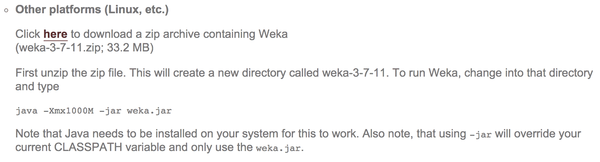

# 三、基本算法——分类、回归和聚类

在前一章中，我们回顾了用于机器学习的关键 Java 库以及它们带来了什么。在这一章中，我们将最终弄脏我们的手。我们将进一步了解基本的机器学习任务，如分类、回归和聚类。每个主题将介绍分类、回归和聚类的基本算法。示例数据集将会很小、简单且易于理解。

本章将涵盖以下主题:

*   加载数据
*   过滤属性
*   构建分类、回归和聚类模型
*   评估模型


# 开始之前

在开始之前，从[http://www.cs.waikato.ac.nz/ml/weka/downloading.html](http://www.cs.waikato.ac.nz/ml/weka/downloading.html)下载 Weka 的最新稳定版本(在撰写本文时为 Weka 3.8)。

有多种下载选项可供选择。您将希望在源代码中使用 Weka 作为库，因此请确保跳过自解压可执行文件并下载 ZIP 存档，如下面的屏幕截图所示。解压缩归档文件，并在解压缩的归档文件中找到`weka.jar`:



我们将使用 Eclipse IDE 来展示例子；请遵循以下步骤:

1.  开始一个新的 Java 项目。
2.  右键单击项目属性，选择 Java 构建路径，单击库选项卡，然后选择添加外部 jar。
3.  导航至提取 Weka 档案并选择`weka.jar`文件。

就是这样；我们已经准备好实现基本的机器学习技术了！


# 分类

我们将从最常用的机器学习技术开始:分类。正如我们在第一章中回顾的，主要思想是自动建立输入变量和结果之间的映射。在接下来的小节中，我们将看看如何加载数据、选择特性、在 Weka 中实现一个基本的分类器，并评估它的性能。


# 数据

对于这个任务，我们将看一下`ZOO`数据库。该数据库包含用 18 个属性描述的 101 个动物数据条目，如下表所示:

| 动物 | 水生的 | 散热片 |
| 头发 | 食肉动物 | 腿 |
| 羽毛 | 锯齿状的 | 尾巴 |
| 蛋 | 毅力 | 国内的 |
| 牛奶 | 呼吸 | 猫的大小 |
| 空运的 | 有毒的 | 类型 |

数据集中的一个示例条目是一只狮子，具有以下属性:

*   `animal`:狮子
*   `hair`:真
*   `feathers`:假
*   `eggs`:假
*   `milk`:真
*   `airborne`:假
*   `aquatic`:假
*   `predator`:真
*   `toothed`:真
*   `backbone`:真
*   `breathes`:真
*   `venomous`:假
*   `fins`:假
*   `legs` : 4
*   `tail`:真
*   `domestic`:假
*   `catsize`:真
*   `type`:哺乳动物

我们的任务是建立一个模型来预测结果变量`animal`，给定所有其他属性作为输入。


# 加载数据

在开始分析之前，我们将加载 Weka 的**属性关系文件格式** ( **ARFF** )的数据，并打印加载实例的总数。每个数据样本保存在一个`DataSource`对象中，而完整的数据集，伴随着元信息，由`Instances`对象处理。

为了加载输入数据，我们将使用接受各种文件格式的`DataSource`对象，并将它们转换成`Instances`:

```java
DataSource source = new DataSource("data/zoo.arff"); 
Instances data = source.getDataSet(); 
System.out.println(data.numInstances() + " instances loaded."); 
System.out.println(data.toString()); 
```

这将提供已加载实例的数量作为输出，如下所示:

```java
101 instances loaded.
```

我们还可以通过调用`data.toString()`方法来打印完整的数据集。

我们的任务是学习一个模型，它能够在我们知道其他属性，但不知道`animal`标签的未来示例中预测`animal`属性。因此，我们将从训练集中删除`animal`属性。我们将通过使用`Remove()`过滤器过滤出动物属性来实现这一点。

首先，我们设置一个参数字符串表，指定必须删除第一个属性。剩余的属性用作训练分类器的数据集:

```java
Remove remove = new Remove(); 
String[] opts = new String[]{ "-R", "1"}; 
```

最后，我们调用`Filter.useFilter(Instances, Filter)`静态方法对所选数据集应用过滤器:

```java
remove.setOptions(opts); 
remove.setInputFormat(data); 
data = Filter.useFilter(data, remove); 
System.out.println(data.toString()); 
```


# 特征选择

如[第一章](11a9489b-c4dd-4544-ace8-f84533d8fd7c.xhtml)、*应用机器学习快速入门*中介绍的，预处理步骤之一集中在特征选择，也称为**属性选择**。目标是选择将在学习模型中使用的相关属性子集。为什么特征选择很重要？一组较小的属性简化了模型，使用户更容易理解。这通常需要较短的训练，并减少过度拟合。

属性选择可以考虑类值，也可以不考虑。在第一种情况下，属性选择算法评估不同的特征子集，并计算表示所选属性质量的分数。我们可以使用不同的搜索算法，如穷举搜索和最佳优先搜索，以及不同的质量分数，如信息增益、基尼指数等。

Weka 用一个`AttributeSelection`对象支持这个过程，它需要两个额外的参数:一个计算属性信息量的赋值器，和一个根据赋值器分配的分数对属性进行排序的排序器。

我们将使用以下步骤来执行选择:

1.  在本例中，我们将使用信息增益作为评估器，并根据信息增益得分对要素进行排名:

```java
InfoGainAttributeEval eval = new InfoGainAttributeEval(); 
Ranker search = new Ranker(); 
```

2.  我们将初始化一个`AttributeSelection`对象，并设置赋值器、排序器和数据:

```java
AttributeSelection attSelect = new AttributeSelection(); 
attSelect.setEvaluator(eval); 
attSelect.setSearch(search); 
attSelect.SelectAttributes(data); 
```

3.  我们将打印属性`indices`的订单列表，如下所示:

```java
int[] indices = attSelect.selectedAttributes(); 
System.out.println(Utils.arrayToString(indices)); 
```

该过程将提供以下结果作为输出:

```java
12,3,7,2,0,1,8,9,13,4,11,5,15,10,6,14,16 
```

最能提供信息的属性是`12`(鳍)`3`(蛋)`7`(水生)`2`(毛发)，等等。基于该列表，我们可以移除额外的、非信息性的特征，以便帮助学习算法实现更准确和更快速的学习模型。

什么会最终决定要保留多少属性？没有与确切数字相关的经验法则；属性的数量取决于数据和问题。属性选择的目的是选择更好地服务于你的模型的属性，所以最好把重点放在属性是否在改善模型上。


# 学习算法

我们已经加载了数据并选择了最佳特征，我们准备学习一些分类模型。让我们从基本的决策树开始。

在 Weka 中，决策树是在`J48`类中实现的，这是 Quinlan 著名的 C4.5 决策树学习器(Quinlan，1993)的重新实现。

我们将通过以下步骤制作一个决策树:

1.  我们初始化一个新的`J48`决策树学习器。我们可以用字符串表传递额外的参数——例如，控制模型复杂性的树修剪(参见[第 1 章](11a9489b-c4dd-4544-ace8-f84533d8fd7c.xhtml)、*应用机器学习快速入门*)。在我们的例子中，我们将构建一棵未修剪的树；因此，我们将传递单个`-U`参数，如下所示:

```java
J48 tree = new J48(); 
String[] options = new String[1]; 
options[0] = "-U"; 

tree.setOptions(options); 
```

2.  我们将调用`buildClassifier(Instances)`方法来初始化学习过程:

```java
tree.buildClassifier(data); 
```

3.  构建的模型现在存储在一个`tree`对象中。我们可以通过调用`toString()`方法来提供整个`J48`未修剪的树:

```java
System.out.println(tree); 
```

输出如下所示:

```java
    J48 unpruned tree
    ------------------

    feathers = false
    |   milk = false
    |   |   backbone = false
    |   |   |   airborne = false
    |   |   |   |   predator = false
    |   |   |   |   |   legs <= 2: invertebrate (2.0)
    |   |   |   |   |   legs > 2: insect (2.0)
    |   |   |   |   predator = true: invertebrate (8.0)
    |   |   |   airborne = true: insect (6.0)
    |   |   backbone = true
    |   |   |   fins = false
    |   |   |   |   tail = false: amphibian (3.0)
    |   |   |   |   tail = true: reptile (6.0/1.0)
    |   |   |   fins = true: fish (13.0)
    |   milk = true: mammal (41.0)
    feathers = true: bird (20.0)

    Number of Leaves  : 9

    Size of the tree : 17

```

输出中的树总共有`17`个节点，其中`9`个是终端(`Leaves`)。

展示树的另一种方式是利用内置的`TreeVisualizer`树查看器，如下所示:

```java
TreeVisualizer tv = new TreeVisualizer(null, tree.graph(), new PlaceNode2()); 
JFrame frame = new javax.swing.JFrame("Tree Visualizer"); 
frame.setSize(800, 500); 
frame.setDefaultCloseOperation(JFrame.EXIT_ON_CLOSE); 
frame.getContentPane().add(tv); 
frame.setVisible(true); 
tv.fitToScreen(); 
```

上述代码会产生以下输出帧:


决策过程从顶层节点开始，也称为根节点。节点标签指定将被检查的属性值。在我们的例子中，首先，我们检查`feathers`属性的值。如果羽毛存在，我们跟随右边的分支，这将我们带到标有`bird`的叶子，表明有`20`的例子支持这个结果。如果羽毛不存在，我们沿着左边的分支，这将我们带到`milk`属性。我们再次检查属性值，然后沿着与属性值匹配的分支前进。我们重复这个过程，直到到达一个叶节点。

我们可以按照相同的步骤构建其他分类器:初始化一个分类器，传递控制模型复杂性的参数，并调用`buildClassifier(Instances)`方法。

在下一节中，您将学习如何使用训练好的模型为标签未知的新示例分配一个类标签。


# 分类新数据

假设我们记录一种动物的属性，但我们不知道它的标签；我们可以从学习到的分类模型中预测它的标签。我们将在此过程中使用以下动物:


首先，我们构建描述新样本的特征向量，如下所示:

```java
double[] vals = new double[data.numAttributes()]; 
vals[0] = 1.0; //hair {false, true} 
vals[1] = 0.0;  //feathers {false, true} 
vals[2] = 0.0;  //eggs {false, true} 
vals[3] = 1.0;  //milk {false, true} 
vals[4] = 0.0;  //airborne {false, true} 
vals[5] = 0.0;  //aquatic {false, true} 
vals[6] = 0.0;  //predator {false, true} 
vals[7] = 1.0;  //toothed {false, true} 
vals[8] = 1.0;  //backbone {false, true} 
vals[9] = 1.0;  //breathes {false, true} 
vals[10] = 1.0;  //venomous {false, true} 
vals[11] = 0.0;  //fins {false, true} 
vals[12] = 4.0;  //legs INTEGER [0,9] 
vals[13] = 1.0;  //tail {false, true} 
vals[14] = 1.0;  //domestic {false, true} 
vals[15] = 0.0;  //catsize {false, true} 
DenseInstance myUnicorn = new DenseInstance(1.0, vals);
myUnicorn.setDataset(data); 
```

然后，我们在模型上调用`classify(Instance)`方法，以获取类值。方法返回标签索引，如下所示:

```java
double result = tree.classifyInstance(myUnicorn); 
System.out.println(data.classAttribute().value((int) result)); 
```

这将提供`mammal`类标签作为输出。


# 评估和预测误差度量

我们建立了一个模型，但我们不知道它是否可信。为了评估它的性能，我们可以应用一种交叉验证技术，这在[第 1 章](11a9489b-c4dd-4544-ace8-f84533d8fd7c.xhtml)、*应用机器学习快速入门*中有所解释。

Weka 提供了一个`Evaluation`类来实现交叉验证。我们传递模型、数据、折叠数和初始随机种子，如下所示:

```java
Classifier cl = new J48(); 
Evaluation eval_roc = new Evaluation(data); 
eval_roc.crossValidateModel(cl, data, 10, new Random(1), new Object[] {}); 
System.out.println(eval_roc.toSummaryString()); 
```

评估结果存储在`Evaluation`对象中。

通过调用`toString()`方法，可以调用最常见指标的组合。请注意，输出不会区分回归和分类，因此请务必注意有意义的指标，如下所示:

```java
    Correctly Classified Instances          93               92.0792 %
    Incorrectly Classified Instances         8                7.9208 %
    Kappa statistic                          0.8955
    Mean absolute error                      0.0225
    Root mean squared error                  0.14  
    Relative absolute error                 10.2478 %
    Root relative squared error             42.4398 %
    Coverage of cases (0.95 level)          96.0396 %
    Mean rel. region size (0.95 level)      15.4173 %
    Total Number of Instances              101  

```

在分类中，我们感兴趣的是正确/错误分类的实例的数量。


# 混乱矩阵

此外，我们可以通过检查混淆矩阵来检查特定的错误分类发生在哪里。混淆矩阵显示了特定类别值是如何预测的:

```java
double[][] confusionMatrix = eval_roc.confusionMatrix(); 
System.out.println(eval_roc.toMatrixString()); 
```

由此产生的混淆矩阵如下:

```java
    === Confusion Matrix ===

      a  b  c  d  e  f  g   <-- classified as
     41  0  0  0  0  0  0 |  a = mammal
      0 20  0  0  0  0  0 |  b = bird
      0  0  3  1  0  1  0 |  c = reptile
      0  0  0 13  0  0  0 |  d = fish
      0  0  1  0  3  0  0 |  e = amphibian
      0  0  0  0  0  5  3 |  f = insect
      0  0  0  0  0  2  8 |  g = invertebrate

```

第一行中的列名对应于由分类节点分配的标签。然后，每个额外的行对应于一个实际的真实类值。例如，第二行对应于带有`mammal`真实类标签的实例。在栏行中，我们读到所有的哺乳动物都被正确地归类为哺乳动物。在第四行`reptiles`中，我们注意到三个被正确分类为`reptiles`，而一个被分类为`fish`，一个被分类为`insect`。混淆矩阵让我们深入了解我们的分类模型可能产生的各种错误。


# 选择分类算法

朴素贝叶斯是机器学习中最简单、高效和有效的归纳算法之一。当特征是独立的时，这在现实世界中很少是真实的，它在理论上是最优的，即使具有依赖的特征，它的性能也是惊人地有竞争力的(张，2004)。主要的缺点是它不能学习特性之间是如何相互作用的；例如，尽管你喜欢加柠檬或牛奶的茶，但你讨厌同时加柠檬或牛奶的茶。

决策树的主要优势在于它是一个易于解释和说明的模型，正如我们在示例中所研究的那样。它既可以处理名义特征，也可以处理数值特征，你不用担心数据是否是线性可分的。

分类算法的一些其他示例如下:

*   `weka.classifiers.rules.ZeroR`:这预测了多数类，并被视为基线；也就是说，如果您的分类器的性能比平均值预测器差，就不值得考虑它。
*   `weka.classifiers.trees.RandomTree`:这构建了一个树，考虑了在每个节点随机选择的 *K* 属性。
*   这构建了一个随机树的集合(森林),并使用多数投票来分类一个新的实例。
*   `weka.classifiers.lazy.IBk`:这是 k-最近邻分类器，能够基于交叉验证选择适当的邻居值。
*   这是一个基于神经网络的分类器，使用反向传播对实例进行分类。网络可以手工构建，或通过算法创建，或两者兼而有之。
*   `weka.classifiers.bayes.NaiveBayes`:这是一个朴素贝叶斯分类器，它使用估计器类，其中基于对训练数据的分析来选择数字估计器精度值。
*   `weka.classifiers.meta.AdaBoostM1`:这是使用`AdaBoost M1`方法提升一个名义类分类器的类。只能解决名义上的阶级问题。这通常会极大地提高性能，但有时会适得其反。
*   `weka.classifiers.meta.Bagging`:该类用于打包分类器以减少方差。这可以根据基础学习者执行分类和回归。


# 使用 Encog 分类

在上一节中，您看到了如何使用 Weka 库进行分类。在这一节中，我们将快速了解如何通过使用 Encog 库实现同样的功能。Encog 要求我们建立一个模型来做分类。从 https://github.com/encog/encog-java-core/releases 下载 Encog 库。下载完成后，在 Eclipse 项目中添加`.jar`文件，如本章开头所述。

对于这个例子，我们将使用`iris`数据集，它以`.csv`格式提供；可以从[https://archive.ics.uci.edu/ml/datasets/Iris](https://archive.ics.uci.edu/ml/datasets/Iris)下载。从下载路径，复制`iris.data.csv`文件到你的数据目录。这个文件包含了 150 种不同花的数据。它包含了花的四个不同的尺寸，最后一列是标签。

我们现在将使用以下步骤执行分类:

1.  我们将使用`VersatileMLDataSet`方法加载文件并定义所有四列。下一步是调用`analyze`方法，该方法将读取整个文件并找到统计参数，比如平均值、标准偏差等等:

```java
File irisFile = new File("data/iris.data.csv");
VersatileDataSource source = new CSVDataSource(irisFile, false, CSVFormat.DECIMAL_POINT);

VersatileMLDataSet data = new VersatileMLDataSet(source); 
data.defineSourceColumn("sepal-length", 0, ColumnType.continuous); 
data.defineSourceColumn("sepal-width", 1, ColumnType.continuous); 
data.defineSourceColumn("petal-length", 2, ColumnType.continuous); 
data.defineSourceColumn("petal-width", 3, ColumnType.continuous); 

ColumnDefinition outputColumn = data.defineSourceColumn("species", 4, ColumnType.nominal);
data.analyze(); 
```

2.  下一步是定义输出列。然后，是时候对数据进行归一化处理了；但在此之前，我们需要决定数据将被规范化的模型类型，如下所示:

```java
data.defineSingleOutputOthersInput(outputColumn); 

EncogModel model = new EncogModel(data); 
model.selectMethod(data, MLMethodFactory.TYPE_FEEDFORWARD);

model.setReport(new ConsoleStatusReportable()); 
data.normalize(); 
```

3.  下一步是在训练集上拟合模型，留出测试集。我们将持有 30%的数据，如第一个参数`0.3`所指定的；下一个参数指定我们想要随机地将数据放入。`1001`表示有一个种子值 1001，所以我们使用一个`holdBackValidation`模型:

```java
model.holdBackValidation(0.3, true, 1001);
```

4.  现在，是时候根据测量值和标签来训练模型并对数据进行分类了。交叉验证将训练数据集分成五种不同的组合:

```java
model.selectTrainingType(data); 
MLRegression bestMethod = (MLRegression)model.crossvalidate(5, true); 
```

5.  下一步是显示每次折叠的结果和错误:

```java
System.out.println( "Training error: " + EncogUtility.calculateRegressionError(bestMethod, model.getTrainingDataset())); 
System.out.println( "Validation error: " + EncogUtility.calculateRegressionError(bestMethod, model.getValidationDataset())); 
```

6.  现在，我们将开始使用模型来预测值，使用以下代码块:

```java
while(csv.next()) { 
            StringBuilder result = new StringBuilder(); 
            line[0] = csv.get(0); 
            line[1] = csv.get(1); 
            line[2] = csv.get(2); 
            line[3] = csv.get(3); 
            String correct = csv.get(4); 
            helper.normalizeInputVector(line,input.getData(),false); 
            MLData output = bestMethod.compute(input); 
            String irisChosen = helper.denormalizeOutputVectorToString(output)[0]; 

            result.append(Arrays.toString(line)); 
            result.append(" -> predicted: "); 
            result.append(irisChosen); 
            result.append("(correct: "); 
            result.append(correct); 
            result.append(")"); 

            System.out.println(result.toString()); 
        } 
```

这将产生类似如下的输出:


Encog 在`MLMethodFactory`中支持许多其他选项，比如 SVM、PNN 等等。


# 使用大量在线分析进行分类

**海量在线分析** ( **MOA** )，如[第二章](6fd557d7-2807-4a6d-8f93-d7c4ca094b7e.xhtml)、*用于机器学习的 Java 库和平台所讨论的，*是另一个可以用来实现分类的库。它主要被设计成与流一起工作。如果它与流一起工作，大量的数据将会在那里；那么，我们如何评价这个模型呢？在传统的批量学习模式中，我们通常将数据分为训练集和测试集，如果数据有限，则首选交叉验证。在流处理中，数据似乎是无限的，交叉验证被证明是昂贵的。我们可以使用的两种方法如下:

*   **Holdout** :当数据已经被分为两部分时，这是很有用的，这是预先定义的。它给出当前分类器的估计，如果它与当前数据相似的话。很难保证维持集和当前数据之间的相似性。
*   **先测试后训练，或先训练后训练**:在这种方法中，模型在用于训练之前，先在示例上进行测试。因此，模型总是被测试它从未见过的数据。在这种情况下，不需要维持方案。它使用可用的数据。随着时间的推移，这种方法将提高分类的准确性。

MOA 提供了多种生成数据流的方法。首先，从 https://moa.cms.waikato.ac.nz/downloads/的[下载恐鸟库。将下载的`.jar`文件添加到 Eclipse，就像我们在本章开始时为 Weka 所做的那样。我们将使用 MOA 提供的 GUI 工具来了解如何使用 MOA 处理流。要启动 GUI，确保`moa.jar`和`sizeofag.jar`在当前路径中；然后，在命令提示符下运行以下命令:](https://moa.cms.waikato.ac.nz/downloads/)

```java
$ java -cp moa.jar -javaagent:sizeofag.jar moa.gui.GUI
```

它将显示以下输出:


我们可以看到它有分类、回归、聚类、异常值等选项。单击配置按钮将显示用于制作分类器的屏幕。它提供了各种学习者和流，如下面的屏幕截图所示:


下面是用`NaiveBayes`和`HoeffdingTree`运行`RandomTreeGenerator`的例子:


# 估价

在开发出模型之后，评估是下一个重要的任务。它让您决定模型是否在给定的数据集上运行良好，并确保它能够处理它从未见过的数据。评估框架主要使用以下功能:

*   **误差估计**:使用维持或交错测试训练方法来估计误差。还使用了 k 倍交叉验证。
*   **性能测量**:使用 Kappa 统计量，它对流式分类器更敏感。
*   **统计验证**:在比较评估分类器时，一定要看随机和非随机实验的差异。McNemar 检验是流中最流行的检验，用于评估两个分类器之间差异的统计显著性。如果我们使用一个分类器，参数估计的置信区间表示可靠性。
*   **流程的成本衡量**:由于我们正在处理流数据，这可能需要访问第三方或基于云的解决方案来获取和处理数据，因此每小时的使用和内存成本将被视为评估目的。


# 基线分类

批量学习已经导致了许多不同范式的分类器的发展，例如分而治之、懒惰学习器、内核方法、图形模型等等。现在，如果我们转移到流中，我们需要了解如何使它们对于流中的大型数据集是增量的和快速的。我们必须考虑模型的复杂性和模型更新的速度，这是需要考虑的主要权衡因素。

**多数类算法**是最简单的分类器之一，它被用作基线。它也用作决策树叶子的默认分类器。另一个是**号** - **变化分类器**，它预测新实例的标签。朴素贝叶斯算法以其在计算能力和简单性方面的低成本而闻名。这是一个增量算法，最适合流。


# 决策图表

决策树是一种非常流行的分类器技术，使得解释和可视化模型变得容易。它以树木为基础。它基于属性值划分或分割节点，并且树的叶子通常落在多数类分类器上。在流数据中，Hoeffding 树是一种非常快速的决策树算法；它等待新的实例，而不是重用实例。它为大数据建立了一棵树。**概念-适应非常快的决策树** ( **CVFDT** )处理漂移的概念，在滑动窗口中保持模型与实例的一致性。其他的树是**超快速森林树** ( **UFFT** )、Hoeffding 自适应树、穷举二叉树等等。


# 懒惰的学习

在流式上下文中， **k 近邻**(**)是最方便的批处理方法。滑动窗口用于确定尚未分类的新实例的 KNN。它通常使用滑动窗口的 1000 个最新实例。当滑动窗口滑动时，它也处理概念漂移。**

**        

# 主动学习

我们都知道分类器对带标签的数据工作得很好，但是对于流数据并不总是这样。例如，来自流的数据可能是未标记的。标记数据的成本很高，因为它需要人工干预来标记未标记的数据。我们知道数据流会产生大量数据。主动学习算法只对选择性数据进行标记。要标记的数据由适合基于池的设置的历史数据决定。需要定期进行再培训，以决定传入实例是否需要标签。标记数据的一个简单策略是使用随机策略。它也被称为基线策略，它要求为每个传入的实例添加一个标签，并给出标签预算的概率。另一个策略是为当前分类器最不确定的实例请求一个标签。这可能工作得很好，但很快，分类器将耗尽其预算或达到其阈值。


# 回归

我们将通过对能效数据集的分析来探索基本的回归算法(Tsanas 和 Xifara，2012)。我们将根据建筑的构造特征(如表面、墙壁和屋顶面积)调查建筑的热负荷和冷负荷要求；身高；玻璃区域；和紧凑性。研究人员使用模拟器设计了 12 种不同的房屋结构，同时改变了 18 种建筑特征。总共模拟了 768 座不同的建筑。

我们的第一个目标是系统地分析每个建筑特征对目标变量(即热负荷或冷负荷)的影响。第二个目标是比较经典线性回归模型与其他方法(如 SVM 回归、随机森林和神经网络)的性能。对于这个任务，我们将使用 Weka 库。


# 加载数据

从[https://archive.ics.uci.edu/ml/datasets/Energy+efficiency](https://archive.ics.uci.edu/ml/datasets/Energy+efficiency)下载能效数据集。

数据集是 Excel 的 XLSX 格式，Weka 无法读取。我们可以通过点击文件|另存为，在保存对话框中勾选`.csv`，将其转换为**逗号分隔值** ( **CSV** )格式，如下图截图所示。确认仅保存活动工作表(因为所有其他工作表都是空的)，确认继续，将丢失一些格式设置功能。现在，该文件已准备好由 Weka 加载:


在文本编辑器中打开文件，检查文件是否被正确转换。可能有些小问题会引起问题。例如，在我的导出中，每一行都以双分号结束，如下所示:

```java
X1;X2;X3;X4;X5;X6;X7;X8;Y1;Y2;; 
0,98;514,50;294,00;110,25;7,00;2;0,00;0;15,55;21,33;; 
0,98;514,50;294,00;110,25;7,00;3;0,00;0;15,55;21,33;; 
```

要删除重复的分号，可以使用查找和替换功能:查找`;;`并用`;`替换它。

第二个问题是我的文件在文档末尾有一长串空行，可以删除，如下所示:

```java
0,62;808,50;367,50;220,50;3,50;5;0,40;5;16,64;16,03;; 
;;;;;;;;;;; 
;;;;;;;;;;; 
```

现在，我们准备加载数据。让我们打开一个新文件，并使用 Weka 的转换器编写一个简单的数据导入函数来读取 CSV 格式的文件，如下所示:

```java
import weka.core.Instances; 
import weka.core.converters.CSVLoader; 
import java.io.File; 
import java.io.IOException; 

public class EnergyLoad { 

  public static void main(String[] args) throws IOException { 

    // load CSV 
    CSVLoader loader = new CSVLoader();
    loader.setFieldSeparator(","); 
    loader.setSource(new File("data/ENB2012_data.csv")); 
    Instances data = loader.getDataSet(); 

    System.out.println(data); 
  } 
} 
```

数据加载完毕！我们继续吧。


# 分析属性

在我们分析属性之前，让我们试着理解我们在处理什么。总共有八个描述建筑特征的属性，还有两个目标变量，即热负荷和冷负荷，如下表所示:

| **属性** | **属性名** |
| `X1` | 相对紧性 |
| `X2` | 表面面积 |
| `X3` | 墙壁面积 |
| `X4` | 屋顶面积 |
| `X5` | 总高 |
| `X6` | 方向 |
| `X7` | 玻璃区域 |
| `X8` | 玻璃面积分布 |
| `Y1` | 供热量 |
| `Y2` | 冷负荷 |


# 构建和评估回归模型

我们将通过在要素位置设置类属性来开始学习热负荷模型:

```java
data.setClassIndex(data.numAttributes() - 2); 
```

现在可以删除第二个目标变量，即冷负荷:

```java
//remove last attribute Y2 
Remove remove = new Remove(); 
remove.setOptions(new String[]{"-R", data.numAttributes()+""}); 
remove.setInputFormat(data);
data = Filter.useFilter(data, remove); 
```


# 线性回归

我们将从一个基本的线性回归模型开始，用`LinearRegression`类实现。与分类示例类似，我们将初始化一个新的模型实例，传递参数和数据，并调用`buildClassifier(Instances)`方法，如下所示:

```java
import weka.classifiers.functions.LinearRegression; 
... 
data.setClassIndex(data.numAttributes() - 2);
LinearRegression model = new LinearRegression(); 
model.buildClassifier(data); 
System.out.println(model);
```

存储在对象中的学习模型可以通过调用`toString()`方法来提供，如下所示:

```java
    Y1 =

        -64.774  * X1 +
         -0.0428 * X2 +
          0.0163 * X3 +
         -0.089  * X4 +
          4.1699 * X5 +
         19.9327 * X7 +
          0.2038 * X8 +
         83.9329

```

线性回归模型构建了一个函数，该函数线性组合输入变量来估计热负荷。特征前面的数字说明了该特征对目标变量的影响:符号对应的是正面/负面影响，幅度对应的是其显著性。例如，特征`X1`的相对紧密度与热负荷呈负相关，而玻璃面积呈正相关。这两个特征也显著影响最终的热负荷估计。该模型的性能同样可以用交叉验证技术进行评估。

十重交叉验证如下:

```java
Evaluation eval = new Evaluation(data); 
eval.crossValidateModel(model, data, 10, new Random(1), new String[]{}); 
System.out.println(eval.toSummaryString()); 
```

我们可以提供常用的评估指标，包括相关性、平均绝对误差、相对绝对误差等，作为输出，如下所示:

```java
Correlation coefficient                  0.956  
Mean absolute error                      2.0923 
Root mean squared error                  2.9569 
Relative absolute error                 22.8555 % 
Root relative squared error             29.282  % 
Total Number of Instances              768      
```


# 使用 Encog 进行线性回归

现在，我们将快速查看如何使用 Encog 来制作回归模型。我们将使用我们在上一节中使用的数据集，*加载数据*。以下步骤显示了如何制作模型:

1.  为了加载数据，我们将使用`VersatileMLDataSet`函数，如下所示:

```java
File datafile = new File("data/ENB2012_data.csv");
VersatileDataSource source = new CSVDataSource(datafile, true, CSVFormat.DECIMAL_POINT);
VersatileMLDataSet data = new VersatileMLDataSet(source); 
data.defineSourceColumn("X1", 0, ColumnType.continuous); 
data.defineSourceColumn("X2", 1, ColumnType.continuous); 
data.defineSourceColumn("X3", 2, ColumnType.continuous); 
data.defineSourceColumn("X4", 3, ColumnType.continuous);
data.defineSourceColumn("X5", 4, ColumnType.continuous);
data.defineSourceColumn("X6", 5, ColumnType.continuous);
data.defineSourceColumn("X7", 6, ColumnType.continuous);
data.defineSourceColumn("X8", 7, ColumnType.continuous);
```

2.  由于我们有两个输出，`Y1`和`Y2`，它们可以通过使用`defineMultipleOutputsOthersInput`函数相加，如下所示:

```java
ColumnDefinition outputColumn1 = data.defineSourceColumn("Y1", 8,    ColumnType.continuous);
ColumnDefinition outputColumn2 = data.defineSourceColumn("Y2", 9,  ColumnType.continuous);
ColumnDefinition outputscol [] = {outputColumn1, outputColumn2};
data.analyze();

data.defineMultipleOutputsOthersInput(outputscol);
```

3.  下一步是通过使用`FEEDFORWARD`实例开发一个简单的回归模型:

```java
EncogModel model = new EncogModel(data); 
model.selectMethod(data, MLMethodFactory.TYPE_FEEDFORWARD);
model.setReport(new ConsoleStatusReportable());

data.normalize();
model.holdBackValidation(0.3, true, 1001);
model.selectTrainingType(data);
MLRegression bestMethod = (MLRegression)model.crossvalidate(5, true);            
NormalizationHelper helper = data.getNormHelper(); 

System.out.println(helper.toString()); 
System.out.println("Final model: " + bestMethod); 
```

现在，我们的回归模型准备好了。下面的屏幕截图给出了输出的最后几行:


# 使用 MOA 进行回归

使用 MOA 进行回归需要我们使用 GUI。可以从[http://www . cs . waikato . AC . NZ/~ Bernhard/Halifax 17/census . ARFF . gz](http://www.cs.waikato.ac.nz/~bernhard/halifax17/census.arff.gz)下载数据集。

以下步骤显示了如何执行回归:

1.  使用以下命令启动 MOA GUI:

```java
$ java -cp moa.jar -javaagent:sizeofag-1.0.4.jar moa.gui.GUI
```

2.  选择回归选项卡并单击配置，如下面的屏幕截图所示:


3.  我们将使用下载的`.arff`文件进行回归。当我们在前面的步骤中单击“配置”时，将显示“配置任务”窗口，如下面的屏幕截图所示:


4.  在流选项中，单击编辑并选择 ArffFileStream 选择我们下载的`.arff`文件，如下图所示:


5.  在 classIndex 中，指定`-1`，它将第一个属性设置为目标。在所有弹出窗口中单击确定，然后单击运行。这需要一些时间，因为人口普查文件有大量数据要处理，如下面的屏幕截图所示:


# 回归树

另一种方法是构建一组回归模型，每个模型都有自己的数据部分。下图显示了回归模型和回归树之间的主要区别。回归模型构建了最适合所有数据的单一模型。另一方面，回归树构建了一组回归模型，每个模型对数据的一部分进行建模，如右侧所示。与回归模型相比，回归树可以更好地拟合数据，但该函数是一个分段线性图，在建模区域之间有跳跃，如下图所示:


Weka 中的回归树是在`M5`类中实现的。模型构建遵循相同的范例:初始化模型，传递参数和数据，并调用`buildClassifier(Instances)`方法，如下所示:

```java
import weka.classifiers.trees.M5P; 
... 
M5P md5 = new M5P(); 
md5.setOptions(new String[]{""}); 
md5.buildClassifier(data);  
System.out.println(md5); 
```

归纳模型是在叶节点中具有等式的树，如下所示:

```java
    M5 pruned model tree:
    (using smoothed linear models)

    X1 <= 0.75 : 
    |   X7 <= 0.175 : 
    |   |   X1 <= 0.65 : LM1 (48/12.841%)
    |   |   X1 >  0.65 : LM2 (96/3.201%)
    |   X7 >  0.175 : 
    |   |   X1 <= 0.65 : LM3 (80/3.652%)
    |   |   X1 >  0.65 : LM4 (160/3.502%)
    X1 >  0.75 : 
    |   X1 <= 0.805 : LM5 (128/13.302%)
    |   X1 >  0.805 : 
    |   |   X7 <= 0.175 : 
    |   |   |   X8 <= 1.5 : LM6 (32/20.992%)
    |   |   |   X8 >  1.5 : 
    |   |   |   |   X1 <= 0.94 : LM7 (48/5.693%)
    |   |   |   |   X1 >  0.94 : LM8 (16/1.119%)
    |   |   X7 >  0.175 : 
    |   |   |   X1 <= 0.84 : 
    |   |   |   |   X7 <= 0.325 : LM9 (20/5.451%)
    |   |   |   |   X7 >  0.325 : LM10 (20/5.632%)
    |   |   |   X1 >  0.84 : 
    |   |   |   |   X7 <= 0.325 : LM11 (60/4.548%)
    |   |   |   |   X7 >  0.325 : 
    |   |   |   |   |   X3 <= 306.25 : LM12 (40/4.504%)
    |   |   |   |   |   X3 >  306.25 : LM13 (20/6.934%)

    LM num: 1
    Y1 = 
      72.2602 * X1 
      + 0.0053 * X3 
      + 11.1924 * X7 
      + 0.429 * X8 
      - 36.2224

    ...

    LM num: 13
    Y1 = 
      5.8829 * X1 
      + 0.0761 * X3 
      + 9.5464 * X7 
      - 0.0805 * X8 
      + 2.1492

    Number of Rules : 13

```

树有`13`片叶子，每片叶子对应一个线性方程。下图显示了上述输出:


该树可以类似于分类树来阅读。最重要的特性在树的顶部。终端节点(叶节点)包含一个线性回归模型，解释到达树的这一部分的数据。

评估将提供以下结果作为输出:

```java
    Correlation coefficient                  0.9943
    Mean absolute error                      0.7446
    Root mean squared error                  1.0804
    Relative absolute error                  8.1342 %
    Root relative squared error             10.6995 %
    Total Number of Instances              768     
```


# 避免常见回归问题的技巧

首先，我们必须使用先前的研究和领域知识来确定哪些特性要包含在回归中。查阅文献、报告和以前的研究，了解什么样的功能起作用，以及为您的问题建模的一些合理变量。假设您有一个包含随机数据的大型要素集；很有可能几个特征将与目标变量相关联(即使数据是随机的)。

为了避免过度拟合，我们必须保持模型简单。奥卡姆剃刀原则指出，你应该选择一个模型，最好地解释你的数据，用最少的假设。实际上，该模型可以简单到只有两到四个预测特征。


# 使聚集

与监督分类器相比，聚类的目标是识别一组未标记数据中的内在组。它可以用于识别同类组的代表性示例，找到有用和合适的分组，或者找到异常的示例，如异常值。

我们将通过分析一个银行数据集来演示如何实现聚类。该数据集由 11 个属性组成，描述了 600 个实例，包括年龄、性别、地区、收入、婚姻状况、子女、汽车拥有状况、储蓄活动、当前活动、抵押贷款状况和 PEP。在我们的分析中，我们将尝试通过应用**期望最大化** ( **EM** )聚类来识别常见的客户群。

EM 的工作方式如下:给定一组聚类，EM 首先为每个实例分配属于特定聚类的概率分布。例如，如果我们从三个集群(即 A、B 和 C)开始，一个实例可能得到概率分布 0.70、0.10 和 0.20，分别属于 A、B 和 C 集群。第二步，EM 重新估计每类概率分布的参数向量。该算法迭代这两个步骤，直到参数收敛或达到最大迭代次数。

EM 中使用的聚类数可以手动设置，也可以通过交叉验证自动设置。确定数据集中聚类数量的另一种方法包括肘方法。这种方法着眼于用特定数量的分类解释的方差百分比。该方法建议增加聚类的数量，直到附加的聚类不会添加太多信息，也就是说，它解释了很少的附加变化。


# 聚类算法

构建聚类模型的过程与构建分类模型的过程非常相似，即加载数据并构建模型。聚类算法在`weka.clusterers`包中实现，如下所示:

```java
import java.io.BufferedReader; 
import java.io.FileReader; 

import weka.core.Instances; 
import weka.clusterers.EM; 

public class Clustering { 

  public static void main(String args[]) throws Exception{ 

    //load data 
    Instances data = new Instances(new BufferedReader
       (new FileReader("data/bank-data.arff"))); 

    // new instance of clusterer 
    EM model = new EM(); 
    // build the clusterer 
    model.buildClusterer(data); 
    System.out.println(model); 

  } 
} 
```

该模型确定了以下六个集群:

```java
    EM
    ==

    Number of clusters selected by cross validation: 6

                     Cluster
    Attribute              0        1        2        3        4        5
                       (0.1)   (0.13)   (0.26)   (0.25)   (0.12)   (0.14)
    ======================================================================
    age
      0_34            10.0535  51.8472 122.2815  12.6207   3.1023   1.0948
      35_51           38.6282  24.4056  29.6252  89.4447  34.5208   3.3755
      52_max          13.4293    6.693   6.3459  50.8984   37.861  81.7724
      [total]         62.1111  82.9457 158.2526 152.9638  75.4841  86.2428
    sex
      FEMALE          27.1812  32.2338  77.9304  83.5129  40.3199  44.8218
      MALE            33.9299  49.7119  79.3222  68.4509  34.1642   40.421
      [total]         61.1111  81.9457 157.2526 151.9638  74.4841  85.2428
    region
      INNER_CITY      26.1651  46.7431   73.874  60.1973  33.3759  34.6445
      TOWN            24.6991  13.0716  48.4446  53.1731   21.617  17.9946
    ...

```

该表如下所示:第一行表示六个分类，而第一列显示属性及其范围。例如，属性`age`被分成三个范围:`0-34`、`35-51`和`52-max`。左侧的列指示每个群集中有多少实例属于特定范围；例如，`0-34`年龄组中的客户主要在聚类 2 中(122 个实例)。


# 估价

聚类算法的质量可以通过使用`logLikelihood`度量来估计，该度量测量所识别的聚类的一致性。数据集被拆分成多个文件夹，并对每个文件夹运行聚类。这样做的动机是，如果聚类算法为没有用于拟合参数的相似数据分配了很高的概率，那么它可能在捕获数据结构方面做得很好。Weka 提供了`CluterEvaluation`类来估计它，如下所示:

```java
double logLikelihood = ClusterEvaluation.crossValidateModel(model, data, 10, new Random(1));
System.out.println(logLikelihood);  
```

它提供以下输出:

```java
-8.773410259774291 
```


# 使用 Encog 进行聚类

Encog 支持 k 均值聚类。让我们考虑一个非常简单的例子，数据显示在下面的代码块中:

```java
DATA = { { 28, 15, 22 }, { 16, 15, 32 }, { 32, 20, 44 }, { 1, 2, 3 }, { 3, 2, 1 } };
```

为了从该数据生成`BasicMLDataSet`，使用了一个简单的`for`循环，它将数据添加到数据集:

```java
BasicMLDataSet set = new BasicMLDataSet();

for (final double[] element : DATA) {
    set.add(new BasicMLData(element));
}
```

使用`KMeansClustering`函数，让我们将数据集分成两个集群，如下所示:

```java
KMeansClustering kmeans = new KMeansClustering(2, set);

kmeans.iteration(100);

// Display the cluster
int i = 1;
for (MLCluster cluster : kmeans.getClusters()) {
    System.out.println("*** Cluster " + (i++) + " ***");
    final MLDataSet ds = cluster.createDataSet();
    final MLDataPair pair = BasicMLDataPair.createPair(ds.getInputSize(), ds.getIdealSize());
    for (int j = 0; j < ds.getRecordCount(); j++) {
        ds.getRecord(j, pair);
        System.out.println(Arrays.toString(pair.getInputArray()));
        }
    }
```

这将生成以下输出:

```java
*** Cluster 1 ***
[16.0, 15.0, 32.0]
[1.0, 2.0, 3.0]
[3.0, 2.0, 1.0]
*** Cluster 2 ***
[28.0, 15.0, 22.0]
*** Cluster 3 ***
[32.0, 20.0, 44.0]
```


# 使用 ELKI 进行聚类

ELKI 支持许多聚类算法。下面列出了一些例子:

*   **仿射传播聚类算法**:这是一个使用仿射传播的聚类分析。
*   **DBSCAN** :这是一种基于密度的聚类，尤其适用于有噪声的应用；它根据密度在数据库中查找集合。
*   **EM** :该算法基于期望最大化算法创建聚类。
*   **AGNES** : **层次凝聚聚类(HAC)，**或**凝聚嵌套(AGNES)，**是一种经典的层次聚类算法。
*   **SLINK** :这是单链路算法。
*   **叮当**:用于完全联动。
*   **HDBSCAN** :这是一个抽取集群层次。

此外，KMeansSort、KMeansCompare、KMedianLloyd、KMediodsEM、KMeansBisecting 等等都是 KMean 家族中的一些例子。

在[https://elki-project.github.io/algorithms/](https://elki-project.github.io/algorithms/)可以找到聚类算法的详细列表，包括 ELKI 支持的所有算法。

我们需要从[https://elki-project.github.io/releases/](https://elki-project.github.io/releases/)那里得到所需的`.jar`文件。下载可执行文件，从[https://elki-project.github.io/datasets/](https://elki-project.github.io/datasets/)下载鼠标数据集。

在终端或命令提示符下，运行以下命令:

```java
$ java -jar elki-bundle-0.7.1.jar 
```

上述命令会生成以下输出:


我们可以看到橙色的两个选项:`dbc.in`和`algorithm`。我们需要指定值。在`dbc.in`中，点击圆点(`...`，选择我们下载的`mouse.csv`文件。在`algorithm`中，点击加号(`+`)选择`k-Mean Clustering algorithm`，找到`kmean.k`，填入数值`3`。单击“运行任务”按钮，该按钮现已启用。它将生成以下输出:


# 摘要

在本章中，您学习了如何使用 Weka 实现基本的机器学习任务:分类、回归和聚类。我们简要讨论了属性选择过程和训练模型，并评估了它们的性能。

下一章将关注如何应用这些技术来解决现实生活中的问题，比如客户保持。**