# 四、集成的客户关系预测

提供服务、产品或体验的任何类型的公司都需要对他们与客户的关系有充分的了解；因此，**客户关系管理** ( **CRM** )是现代营销策略的关键要素。企业面临的最大挑战之一是需要准确理解是什么导致客户购买新产品。

在本章中，我们将使用由法国电信公司 Orange 提供的真实世界营销数据库。该任务将评估以下客户行为的可能性:

*   交换机提供商(流失)
*   购买新产品或服务(欲望)
*   购买向他们建议的升级或附加产品，以提高销售利润(追加销售)

我们将参加 2009 年**知识发现和数据挖掘** ( **KDD** )杯挑战赛，并展示使用 Weka 处理数据的步骤。首先，我们将解析和加载数据，并实现基本的基线模型。稍后，我们将讨论高级建模技术，包括数据预处理、属性选择、模型选择和评估。

The KDD Cup is the leading data mining competition in the world. It is organized annually by the ACM **Special Interest Group on Knowledge Discovery and Data Mining**. The winners are announced at the Conference on Knowledge Discovery and Data Mining, which is usually held in August. Yearly archives, including all of the corresponding datasets, are available at [http://www.kdd.org/kdd-cup](http://www.kdd.org/kdd-cup).        

# 客户关系数据库

建立客户行为知识的最实用的方法是产生解释目标变量的分数，如客户流失、亲和力或追加销售。分数是由模型使用描述客户的输入变量计算的；例如，他们当前的订阅、购买的设备、消耗的分钟数等等。这些分数随后被信息系统用于提供相关的个性化营销活动。

在大多数基于客户的关系数据库中，客户是主要实体；了解顾客的行为很重要。客户的行为会产生一个与客户流失、欲望或追加销售相关的分数。基本思想是使用计算模型产生分数，该计算模型可以使用不同的参数，例如客户的当前订购、购买的设备、消耗的分钟数等等。分数一旦形成，信息系统就根据他或她的行为决定下一步的策略，这是专门为顾客设计的。

2009 年，KDD 会议组织了一次关于客户关系预测的机器学习挑战。


# 挑战

给定一大组客户属性，挑战中的任务是估计以下目标变量:

*   **流失概率**:这是客户更换提供商的可能性。流失率也称为损耗率或参与者周转率，是一种用于计算在给定时间段内进出给定集合的个人、对象、术语或项目数量的方法。该术语在由客户驱动并使用基于订户的模型的行业中大量使用；例如，手机行业和有线电视运营商。
*   **欲望概率**:这是购买服务或产品的倾向。
*   **追加销售概率**:这是客户购买附加产品或升级产品的可能性。追加销售意味着销售客户已经使用的产品之外的产品。就像大多数手机运营商提供的增值服务一样。使用销售技巧，销售人员试图让客户选择增值服务，这将带来更多的收入。很多时候，客户不知道还有其他选择，销售人员说服他们使用或考虑这些选择。

挑战在于击败 Orange Labs 开发的内部系统。对于参与者来说，这是一个证明他们能够处理大型数据库的机会，包括异构的、有噪声的数据和不平衡的类分布。


# 资料组

为了应对这一挑战，Orange 发布了一个大型客户数据数据集，包含大约 100 万个客户，在十个包含数百个字段的表中进行描述。第一步，他们对数据进行了重新采样，以选择一个不太不平衡的子集，其中包含 100，000 名客户。在第二步中，他们使用了一个自动特征构造工具，该工具生成了 20，000 个描述客户的特征，然后这些特征被缩小到 15，000 个。第三步，通过随机化要素顺序、丢弃属性名称、用随机生成的字符串替换名义变量以及将连续属性乘以随机因子，对数据集进行匿名化。最后，所有实例被随机分成训练和测试数据集。

KDD 杯提供了两组数据，一组大数据和一组小数据，分别对应于快挑战和慢挑战。训练集和测试集都包含 50，000 个示例，数据的划分类似，但是每个集的样本排序不同。

在本章中，我们将使用由 50，000 个实例组成的小型数据集，每个实例都用 230 个变量来描述。50，000 行数据中的每一行都对应于一个客户，它们与三个二元结果相关联，三个挑战(向上销售、流失和欲望)中的每一个都有一个。

为了使这一点更清楚，下表说明了数据集:

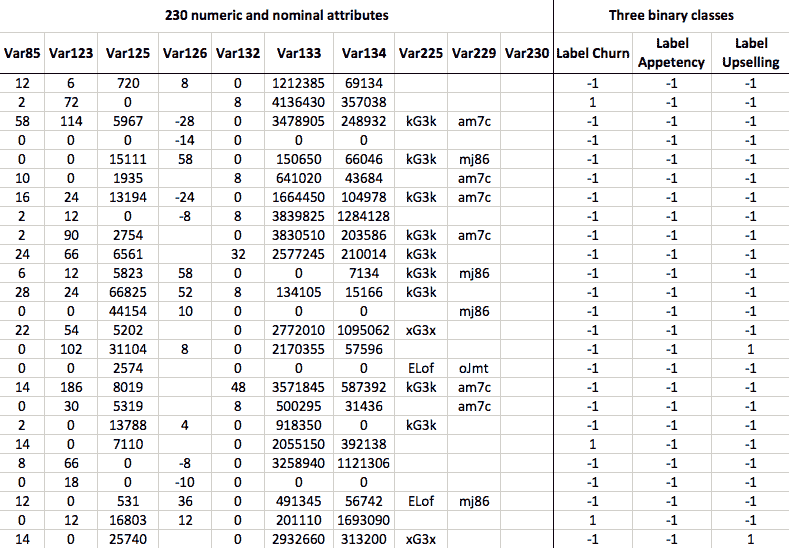

该表描述了前 25 个实例，即客户，每个用 250 个属性描述。对于本例，只显示了 10 个属性的选定子集。数据集包含许多缺失值，甚至空属性或常量属性。表格的最后三列对应于涉及基本事实的三个不同的类别标签，即客户是否确实更换了提供商(流失)、购买了服务(欲望)或购买了升级(追加销售)。但是，请注意，标签是与三个不同文件中的数据分开提供的，因此保留实例和相应类标签的顺序以确保正确对应是非常重要的。


# 估价

根据三项任务(流失、亲和力和追加销售)的 ROC 曲线下面积的算术平均值对提交的内容进行评估。ROC 曲线将模型的性能显示为一条曲线，该曲线通过绘制用于确定分类结果的各种阈值的灵敏度对特异性而获得(参见[第 1 章](11a9489b-c4dd-4544-ace8-f84533d8fd7c.xhtml)、*应用机器学习快速入门*、章节 *ROC 曲线*)。现在，ROC **曲线** ( **AUC** )下的**面积与该曲线下的面积相关——面积越大，分类器越好)。包括 Weka 在内的大多数工具箱都提供了计算 AUC 分数的 API。**


# 基本朴素贝叶斯分类器基线

根据挑战赛的规则，参与者必须超越基本的朴素贝叶斯分类器才能有资格获得奖励，它假设特征是独立的(参见[第 1 章](11a9489b-c4dd-4544-ace8-f84533d8fd7c.xhtml)、*应用机器学习快速入门*)。

KDD 杯组织者运行了香草朴素贝叶斯分类器，没有任何特征选择或超参数调整。对于大型数据集，朴素贝叶斯在测试集上的总体得分如下:

*   **流失问题** : AUC = 0.6468
*   **亲和力问题** : AUC = 0.6453
*   **追加销售问题** : AUC=0.7211

请注意，基线结果仅针对大型数据集进行报告。此外，虽然训练和测试数据集都在 KDD 杯网站上提供，但测试集的实际真实标签并未提供。因此，当我们用模型处理数据时，没有办法知道模型在测试集上的表现如何。我们要做的只是使用训练数据，并通过交叉验证来评估我们的模型。结果不会是直接可比的，但是尽管如此，我们将对 AUC 评分的合理幅度有所了解。


# 获取数据

在 KDD 杯的网页上([http://kdd.org/kdd-cup/view/kdd-cup-2009/Data](http://kdd.org/kdd-cup/view/kdd-cup-2009/Data)，你应该会看到一个类似下面截图的页面。一、下小版(230 var。)头，下载`orange_small_train.data.zip`。接下来，下载与该训练数据相关联的三组真实标签。以下文件位于 Real binary targets (small)标题下:

*   `orange_small_train_appentency.labels`
*   `orange_small_train_churn.labels`
*   `orange_small_train_upselling.labels`

保存并解压缩红框中标记的所有文件，如屏幕截图所示:

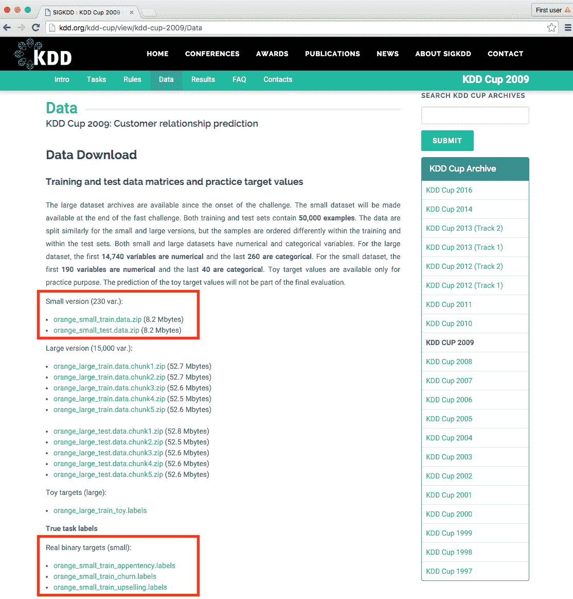

在接下来的部分中，首先，我们将数据加载到 Weka 中，并用朴素贝叶斯分类器应用基本建模，以获得我们自己的基线 AUC 分数。稍后，我们将研究更高级的建模技术和技巧。


# 加载数据

我们将直接从`.csv`格式加载数据到 Weka。为此，我们将编写一个函数来接受数据文件和真实标签文件的路径。该函数将加载并合并两个数据集，并移除空属性。我们将从下面的代码块开始:

```java
public static Instances loadData(String pathData, String 
  pathLabeles) throws Exception { 
```

首先，我们使用`CSVLoader()`类加载数据。此外，我们将`\t`选项卡指定为字段分隔符，并强制将最后 40 个属性解析为名义属性:

```java
// Load data 
CSVLoader loader = new CSVLoader(); 
loader.setFieldSeparator("\t"); 
loader.setNominalAttributes("191-last"); 
loader.setSource(new File(pathData)); 
Instances data = loader.getDataSet(); 
```

`CSVLoader`类接受许多附加参数，指定列分隔符、字符串包围符、是否存在标题行等等。完整的文档可在[http://WEKA . SourceForge . net/doc . dev/WEKA/core/converters/CSV loader . html](http://weka.sourceforge.net/doc.dev/weka/core/converters/CSVLoader.html)获得。

有些属性不包含单个值，Weka 会自动将它们识别为`String`属性。我们实际上并不需要它们，所以我们可以使用`RemoveType`过滤器安全地删除它们。此外，我们指定了`-T`参数，它删除了一个特定类型的属性，并指定了我们想要删除的属性类型:

```java
// remove empty attributes identified as String attribute  
RemoveType removeString = new RemoveType(); 
removeString.setOptions(new String[]{"-T", "string"}); 
removeString.setInputFormat(data); 
Instances filteredData = Filter.useFilter(data, removeString); 
```

或者，我们可以使用在`Instances`类中实现的`void deleteStringAttributes()`方法，它具有相同的效果；例如，`data.removeStringAttributes()`。

现在，我们将加载数据并为其分配类别标签。我们将再次使用`CVSLoader`，这里我们指定文件没有任何标题行，即`setNoHeaderRowPresent(true)`:

```java
// Load labeles 
loader = new CSVLoader(); 
loader.setFieldSeparator("\t"); 
loader.setNoHeaderRowPresent(true); 
loader.setNominalAttributes("first-last"); 
loader.setSource(new File(pathLabeles)); 
Instances labels = loader.getDataSet(); 
```

一旦我们加载了两个文件，我们就可以通过调用`Instances.mergeInstances (Instances, Instances)`静态方法将它们合并在一起。该方法返回一个新的数据集，该数据集包含第一个数据集中的所有属性，以及第二个数据集中的属性。请注意，两个数据集中的实例数量必须相同:

```java
// Append label as class value 
Instances labeledData = Instances.mergeInstances(filteredData, 
   labeles); 
```

最后，我们设置最后一个属性，也就是我们刚刚添加的标签属性，作为目标变量，并返回结果数据集:

```java
// set the label attribute as class  
labeledData.setClassIndex(labeledData.numAttributes() - 1); 

System.out.println(labeledData.toSummaryString()); 
return labeledData; 
} 
```

该函数提供一个摘要作为输出，如下面的代码块所示，并返回带标签的数据集:

```java
    Relation Name:  orange_small_train.data-weka.filters.unsupervised.attribute.RemoveType-Tstring_orange_small_train_churn.labels.txt
    Num Instances:  50000
    Num Attributes: 215

    Name          Type  Nom  Int Real     Missing      Unique  Dist
    1 Var1        Num   0%   1%   0% 49298 / 99%     8 /  0%    18 
    2 Var2        Num   0%   2%   0% 48759 / 98%     1 /  0%     2 
    3 Var3        Num   0%   2%   0% 48760 / 98%   104 /  0%   146 
    4 Var4        Num   0%   3%   0% 48421 / 97%     1 /  0%     4
    ...

```


# 基本建模

在这一部分，我们将按照 KDD 杯组织者采用的方法来实现我们自己的基线模型。然而，在我们进入模型之前，让我们首先实现评估引擎，它将返回所有三个问题的 AUC。


# 评估模型

现在，让我们仔细看看评估函数。评估函数接受一个初始化的模型，在所有三个问题上交叉验证该模型，并以 ROC 曲线下面积(AUC)的形式报告结果，如下所示:

```java
public static double[] evaluate(Classifier model) 
   throws Exception { 

  double results[] = new double[4]; 

  String[] labelFiles = new String[]{ 
    "churn", "appetency", "upselling"}; 

  double overallScore = 0.0; 
  for (int i = 0; i < labelFiles.length; i++) { 
```

首先，我们调用前面实现的`Instance loadData(String, String)`函数来加载训练数据，并将其与选定的标签合并:

```java
    // Load data 
    Instances train_data = loadData( 
     path + "orange_small_train.data", 
      path+"orange_small_train_"+labelFiles[i]+".labels.txt"); 
```

接下来，我们初始化`weka.classifiers.Evaluation`类并传递我们的数据集。(数据集仅用于提取数据属性；不考虑实际数据。)我们调用`void crossValidateModel(Classifier, Instances, int, Random)`方法开始交叉验证，我们创建了五个折叠。因为验证是在数据的随机子集上进行的，所以我们也需要传递一个随机种子:

```java
    // cross-validate the data 
    Evaluation eval = new Evaluation(train_data); 
    eval.crossValidateModel(model, train_data, 5,  
    new Random(1)); 
```

评估完成后，我们通过调用`double areUnderROC(int)`方法读取结果。因为度量取决于我们感兴趣的目标值，所以该方法需要一个类值索引，可以通过搜索 class 属性中的`"1"`值的索引来提取该索引，如下所示:

```java
    // Save results 
    results[i] = eval.areaUnderROC( 
      train_data.classAttribute().indexOfValue("1")); 
    overallScore += results[i]; 
  } 
```

最后，计算结果的平均值并返回:

```java
  // Get average results over all three problems 
  results[3] = overallScore / 3; 
  return results; 
}
```


# 实现朴素贝叶斯基线

现在，当我们有了所有的成分，我们可以复制朴素贝叶斯方法，我们有望超越它。这种方法不包括任何额外的数据预处理、属性选择或模型选择。由于我们没有测试数据的真实标签，我们将应用五重交叉验证来评估小数据集上的模型。

首先，我们初始化一个朴素贝叶斯分类器，如下:

```java
Classifier baselineNB = new NaiveBayes(); 
```

接下来，我们将分类器传递给我们的评估函数，该函数加载数据并应用交叉验证。该函数返回所有三个问题的 ROC 曲线得分下的面积，以及总体结果:

```java
double resNB[] = evaluate(baselineNB); 
System.out.println("Naive Bayes\n" +  
"\tchurn:     " + resNB[0] + "\n" +  
"\tappetency: " + resNB[1] + "\n" +  
"\tup-sell:   " + resNB[2] + "\n" +  
"\toverall:   " + resNB[3] + "\n"); 
```

在我们的例子中，模型返回以下结果:

```java
    Naive Bayes
      churn:     0.5897891153549814
      appetency: 0.630778394752436
      up-sell:   0.6686116692438094
      overall:   0.6297263931170756

```

当我们用更高级的建模来应对挑战时，这些结果将作为基线。如果我们用更加精密、耗时和复杂的技术来处理数据，我们希望结果会好得多。否则，我们只是在浪费资源。一般来说，在解决机器学习问题时，创建一个简单的基线分类器作为方向点总是一个好主意。


# 集成高级建模

在前面的部分中，我们实现了一个方向基线；现在，我们来关注一下重型机械。我们将遵循 IBM 研究团队(Niculescu-Mizil 等人)开发的 2009 年 KDD 杯获奖解决方案所采用的方法。

为了应对这一挑战，他们使用了集合选择算法(Caruana 和 Niculescu-Mizil，2004)。这是一种集成方法，这意味着它构建了一系列模型，并以特定的方式组合它们的输出，以便提供最终的分类。它有几个令人满意的特性，非常适合这一挑战，如下所示:

*   它被证明是健壮的，产生出色的性能。
*   它可以针对特定的性能指标进行优化，包括 AUC。
*   它允许将不同的分类器添加到库中。
*   这是一种随时可用的方法，意味着如果我们没有时间了，我们有一个可用的解决方案。

在本节中，我们将大致按照他们报告中描述的步骤进行操作。请注意，这并不是他们方法的精确实现，而是一个解决方案概述，其中包括深入研究的必要步骤。

这些步骤的概述如下:

1.  首先，我们将通过删除显然不会带来任何值的属性来预处理数据——例如，所有缺失值或常量值；修复缺失值，以帮助无法处理它们的机器学习算法；并将分类属性转换成数字属性。
2.  接下来，我们将运行属性选择算法，仅选择有助于任务预测的属性子集。
3.  在第三步中，我们将用各种各样的模型实例化集成选择算法，最后，我们将评估性能。


# 开始之前

对于这个任务，我们将需要一个额外的 Weka 包，`ensembleLibrary`。Weka 3.7.2 及更高版本支持外部包，主要由学术界开发。WEKA 软件包列表可在[http://weka.sourceforge.net/packageMetaData](http://weka.sourceforge.net/packageMetaData)获得，如下图所示:

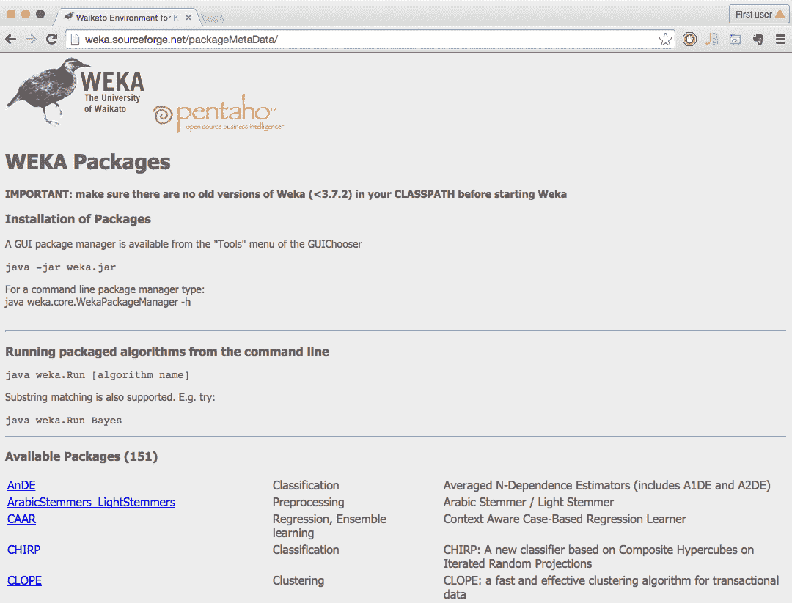

在[http://pr downloads . SourceForge . net/WEKA/ensemble library 1 . 0 . 5 . zip 找到并下载最新版本的`ensembleLibrary`包？下载](http://prdownloads.sourceforge.net/weka/ensembleLibrary1.0.5.zip?download)。

解压软件包后，找到`ensembleLibrary.jar`并将其导入到代码中，如下所示:

```java
import weka.classifiers.meta.EnsembleSelection; 
```


# 数据预处理

首先，我们将利用 Weka 的内置`weka.filters.unsupervised.attribute.RemoveUseless`过滤器，正如其名称所暗示的那样。它会删除变化不大的属性，例如，所有常量属性都会被删除。仅适用于名义属性的最大方差由`-M`参数指定。默认参数为 99%，这意味着如果 99%以上的实例都具有唯一的属性值，则该属性将被删除，如下所示:

```java
RemoveUseless removeUseless = new RemoveUseless(); 
removeUseless.setOptions(new String[] { "-M", "99" });// threshold 
removeUseless.setInputFormat(data); 
data = Filter.useFilter(data, removeUseless); 
```

接下来，我们将使用`weka.filters.unsupervised.attribute.ReplaceMissingValues`过滤器，用训练数据中的模式(名义属性)和均值(数值属性)替换数据集中所有缺失的值。一般而言，在考虑属性的含义和上下文时，应谨慎进行缺失值替换:

```java
ReplaceMissingValues fixMissing = new ReplaceMissingValues(); 
fixMissing.setInputFormat(data); 
data = Filter.useFilter(data, fixMissing); 
```

最后，我们将离散化数值属性，也就是说，我们将使用`weka.filters.unsupervised.attribute.Discretize`过滤器将数值属性转换为区间。使用`-B`选项，我们将数值属性分割成四个区间，`-R`选项指定属性的范围(只有数值属性会被离散化):

```java
Discretize discretizeNumeric = new Discretize(); 
discretizeNumeric.setOptions(new String[] { 
    "-B",  "4",  // no of bins 
    "-R",  "first-last"}); //range of attributes 
fixMissing.setInputFormat(data); 
data = Filter.useFilter(data, fixMissing); 
```


# 属性选择

在下一步中，我们将只选择信息属性，即更有可能帮助预测的属性。解决这个问题的标准方法是检查每个属性携带的信息增益。我们将使用`weka.attributeSelection.AttributeSelection`过滤器，它需要两个额外的方法:赋值器(如何计算属性有用性)和搜索算法(如何选择属性子集)。

在我们的例子中，首先，我们初始化`weka.attributeSelection.InfoGainAttributeEval`，它实现了信息增益的计算:

```java
InfoGainAttributeEval eval = new InfoGainAttributeEval(); 
Ranker search = new Ranker(); 
```

为了只选择高于阈值的顶部属性，我们初始化`weka.attributeSelection.Ranker`，以便对信息增益高于特定阈值的属性进行排序。我们用`-T`参数指定它，同时保持阈值较低，以便保持属性至少包含一些信息:

```java
search.setOptions(new String[] { "-T", "0.001" }); 
```

The general rule for setting this threshold is to sort the attributes by information gain and pick the threshold where the information gain drops to a negligible value.

接下来，我们可以初始化`AttributeSelection`类，设置赋值器和排序器，并将属性选择应用于数据集，如下所示:

```java
AttributeSelection attSelect = new AttributeSelection(); 
attSelect.setEvaluator(eval); 
attSelect.setSearch(search); 

// apply attribute selection 
attSelect.SelectAttributes(data); 
```

最后，我们通过调用`reduceDimensionality(Instances)`方法来删除上次运行中没有选择的属性:

```java
// remove the attributes not selected in the last run 
data = attSelect.reduceDimensionality(data); 
```

最后，我们只剩下 230 个属性中的 214 个。


# 型号选择

多年来，机器学习领域的从业者开发了各种各样的学习算法，并对现有算法进行了改进。有这么多独特的监督学习方法，很难跟踪所有这些方法。由于数据集的特征各不相同，没有一种方法在所有情况下都是最好的，但是不同的算法能够利用给定数据集的不同特征和关系。

首先，我们需要通过初始化`weka.classifiers.EnsembleLibrary`类来创建模型库，这将帮助我们定义模型:

```java
EnsembleLibrary ensembleLib = new EnsembleLibrary(); 
```

接下来，我们将模型及其参数作为字符串值添加到库中；例如，我们可以添加三个具有不同参数的决策树学习器，如下所示:

```java
ensembleLib.addModel("weka.classifiers.trees.J48 -S -C 0.25 -B -M 
   2"); 
ensembleLib.addModel("weka.classifiers.trees.J48 -S -C 0.25 -B -M 
   2 -A"); 
```

如果您熟悉 Weka 图形界面，您还可以在那里探索算法及其配置，并复制配置，如下图所示。右键单击算法名称并导航至编辑配置|复制配置字符串:

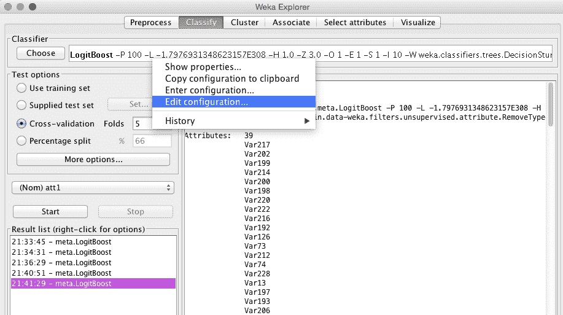

为了完成此示例，我们添加了以下算法及其参数:

*   用作默认基线的朴素贝叶斯:

```java
ensembleLib.addModel("weka.classifiers.bayes.NaiveBayes"); 
```

*   基于懒惰模型的 k-最近邻:

```java
ensembleLib.addModel("weka.classifiers.lazy.IBk"); 
```

*   具有默认参数的简单逻辑回归:

```java
ensembleLib.addModel("weka.classifiers.functions.SimpleLogi
   stic"); 
```

*   具有默认参数的支持向量机:

```java
ensembleLib.addModel("weka.classifiers.functions.SMO"); 
```

*   `AdaBoost`，其本身是一种集合方法:

```java
ensembleLib.addModel("weka.classifiers.meta.AdaBoostM1"); 
```

*   `LogitBoost`，基于逻辑回归的集成方法:

```java
ensembleLib.addModel("weka.classifiers.meta.LogitBoost"); 
```

*   `DecisionStump`，一种基于一级决策树的集成方法:

```java
ensembleLib.addModel("classifiers.trees.DecisionStump"); 
```

由于`EnsembleLibrary`实现主要关注 GUI 和控制台用户，我们必须通过调用`saveLibrary(File, EnsembleLibrary, JComponent)`方法将模型保存到一个文件中，如下所示:

```java
EnsembleLibrary.saveLibrary(new 
   File(path+"ensembleLib.model.xml"), ensembleLib, null); 
System.out.println(ensembleLib.getModels()); 
```

接下来，我们可以通过实例化`weka.classifiers.meta.EnsembleSelection`类来初始化集成选择算法。首先，让我们回顾一下以下方法选项:

*   `-L </path/to/modelLibrary>`:指定`modelLibrary`文件，继续所有型号列表。
*   `-W </path/to/working/directory>`:指定工作目录，所有的模型都存储在这里。
*   `-B <numModelBags>`:设置行李数量，即运行集合选择算法的迭代次数。
*   `-E <modelRatio>`:设置随机选择的库模型的比例，以填充每个模型包。
*   `-V <validationRatio>`:设置将被保留用于验证的训练数据集的比率。
*   `-H <hillClimbIterations>`:设置每个模型包要进行的爬山迭代次数。
*   `-I <sortInitialization>`:设置在初始化每个模型行李的集合时，分拣初始化算法能够选择的集合库的比率。
*   `-X <numFolds>`:设置交叉验证的折叠次数。
*   `-P <hillclimbMetric>`:指定在爬山算法中用于模型选择的度量。有效的指标包括准确性、rmse、roc、精确度、召回率、fscore 和所有指标。
*   `-A <algorithm>`:指定用于集合选择的算法。有效的算法包括用于正向选择的正向(默认)、用于反向消除的反向、用于正向和反向消除的反向、仅打印来自集合库的最佳表现者、以及仅训练集合库中的模型的库。
*   `-R`:该标志表示是否可以为一个组合多次选择模型。
*   `-G`:表示当性能下降时，排序初始化是否贪婪地停止添加模型。
*   `-O`:这是详细输出的标志。这将打印所有选定型号的性能。
*   `-S <num>`:这是一个随机数种子(默认为`1`)。
*   `-D`:如果设置，分类器在调试模式下运行，并且可以向控制台提供附加信息作为输出。

我们用以下初始参数初始化算法，其中我们指定优化 ROC 度量:

```java
EnsembleSelection ensambleSel = new EnsembleSelection(); 
ensambleSel.setOptions(new String[]{ 
  "-L", path+"ensembleLib.model.xml", // </path/to/modelLibrary>
     "-W", path+"esTmp", // </path/to/working/directory> -  
"-B", "10", // <numModelBags>  
  "-E", "1.0", // <modelRatio>. 
  "-V", "0.25", // <validationRatio> 
  "-H", "100", // <hillClimbIterations>  
"-I", "1.0", // <sortInitialization>  
  "-X", "2", // <numFolds> 
  "-P", "roc", // <hillclimbMettric> 
  "-A", "forward", // <algorithm>  
  "-R", "true", // - Flag to be selected more than once 
  "-G", "true", // - stops adding models when performance degrades 
  "-O", "true", // - verbose output. 
  "-S", "1", // <num> - Random number seed. 
  "-D", "true" // - run in debug mode  
}); 
```


# 性能赋值

计算和内存方面的评估都很繁重，所以确保用额外的堆空间初始化 JVM(例如，`java -Xmx16g`)。根据模型库中包含的算法数量，计算可能需要几个小时或几天。该示例在一个 12 核英特尔至强 E5-2420 CPU 上运行了 4 小时 22 分钟，该 CPU 配有 32 GB 内存，平均使用了 10%的 CPU 和 6 GB 的内存。

我们调用我们的评估方法并提供结果作为输出，如下所示:

```java
double resES[] = evaluate(ensambleSel); 
System.out.println("Ensemble Selection\n"  
+ "\tchurn:     " + resES[0] + "\n" 
+ "\tappetency: " + resES[1] + "\n"  
+ "\tup-sell:   " + resES[2] + "\n"  
+ "\toverall:   " + resES[3] + "\n"); 
```

模型库中的特定分类器集实现了以下结果:

```java
    Ensamble
      churn:     0.7109874158176481
      appetency: 0.786325687118347
      up-sell:   0.8521363243575182
      overall:   0.7831498090978378

```

总的来说，与我们在本章开始时设计的初始基线相比，这种方法为我们带来了超过 15 个百分点的显著改进。虽然很难给出一个明确的答案，但这种改进主要归因于三个因素:数据预处理和属性选择，探索各种各样的学习方法，以及使用集成构建技术，该技术能够利用各种基分类器而不会过度拟合。然而，这种改进需要显著增加处理时间和工作记忆。


# 整体方法 MOA

顾名思义，就是一起或同时观看。它用于组合多个学习算法，以获得更好的结果和性能。有各种各样的技巧可以用于合奏。一些常用的集成技术或分类器包括装袋、提升、堆叠、一桶模型等等。

**海量在线分析** ( **MOA** )支持集成分类器，比如准确度加权集成、准确度更新集成等等。在本节中，我们将向您展示如何利用 bagging 算法:

1.  打开终端并执行以下命令:

```java
java -cp moa.jar -javaagent:sizeofag-1.0.4.jar moa.gui.GUI
```

2.  选择分类选项卡，然后单击配置按钮:

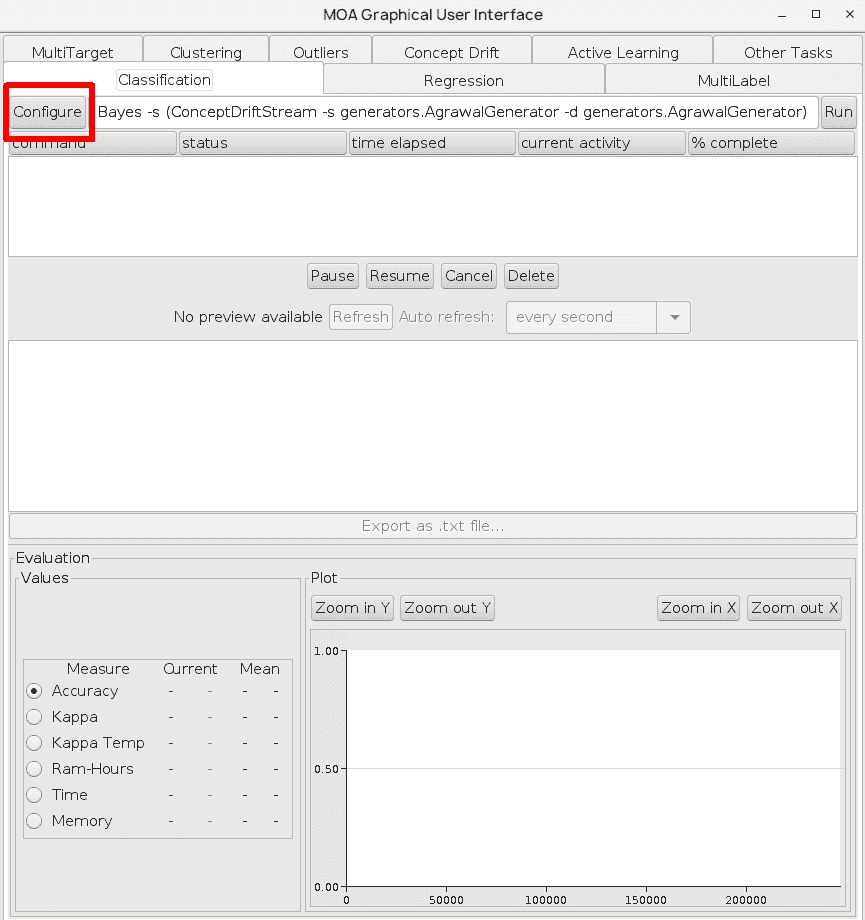

这将打开配置任务选项。

3.  在“学习者”选项中，选择贝叶斯。NaiveBayes，然后在 stream 选项中，点击 Edit，如下图截图所示:

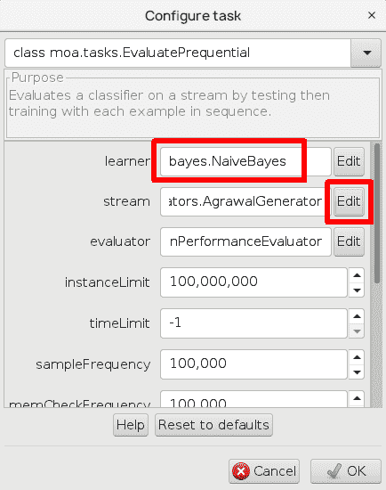

4.  选择 ConceptDriftStream，并在 Stream 和 DriftStream 中选择 AgrawalGenerator 它将为流生成器使用 Agrawal 数据集:

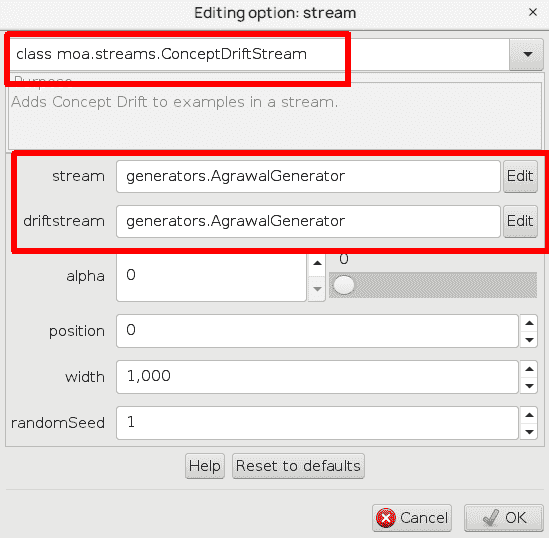

5.  关闭所有窗口，然后单击运行按钮:

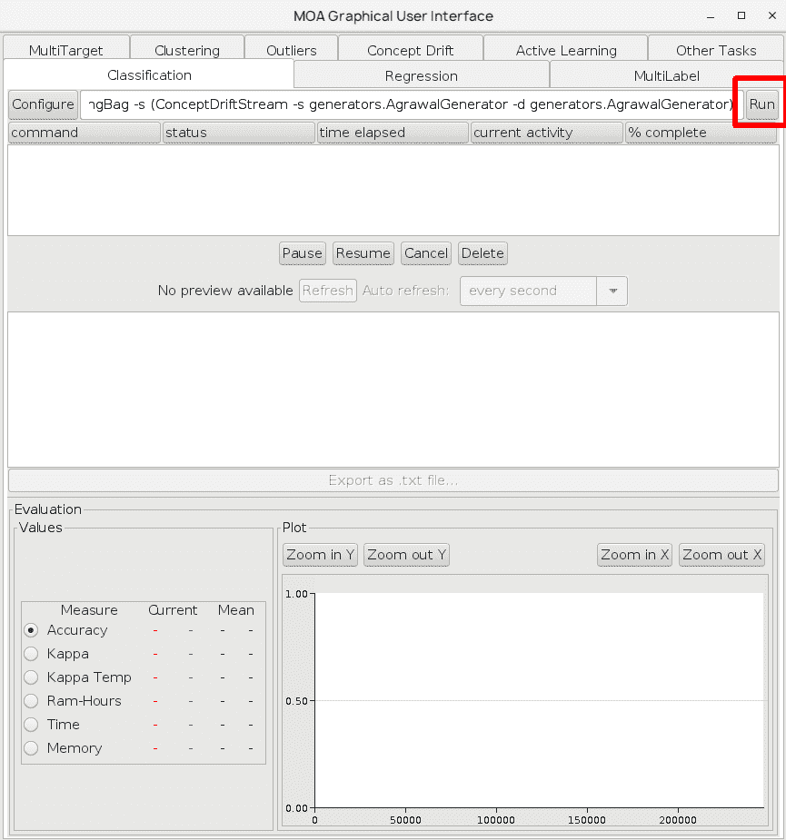

这将运行任务并生成以下输出:

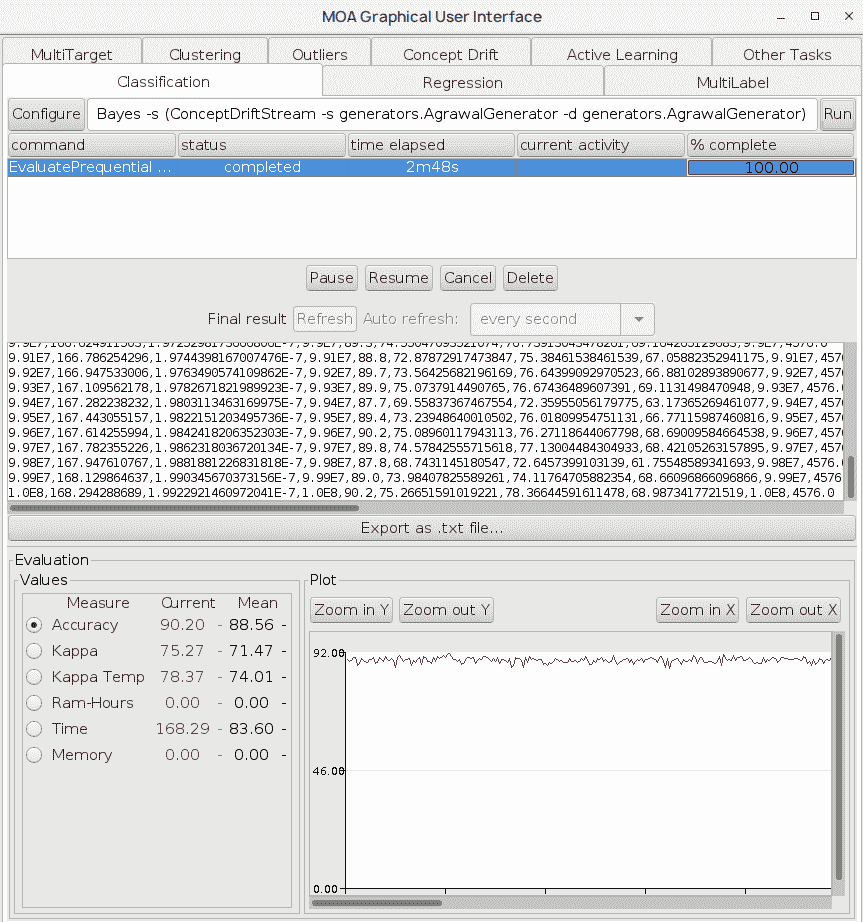

6.  让我们使用 LeveragingBag 选项。为此，打开“配置任务”窗口并选择 baseLearner 中的“编辑”选项，这将显示以下内容:从第一个下拉框中选择 LeveragingBag。您可以在第一个下拉框中找到其他选项，如增强和平均重量组合:

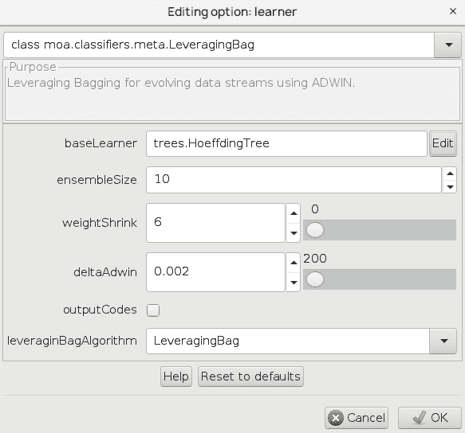

将流保留为 AgrawalGenerator，如下面的屏幕截图所示:

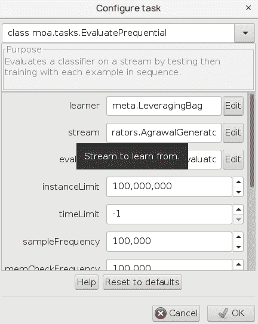

7.  关闭“配置任务”窗口，然后单击“运行”按钮；这将需要一些时间来完成:

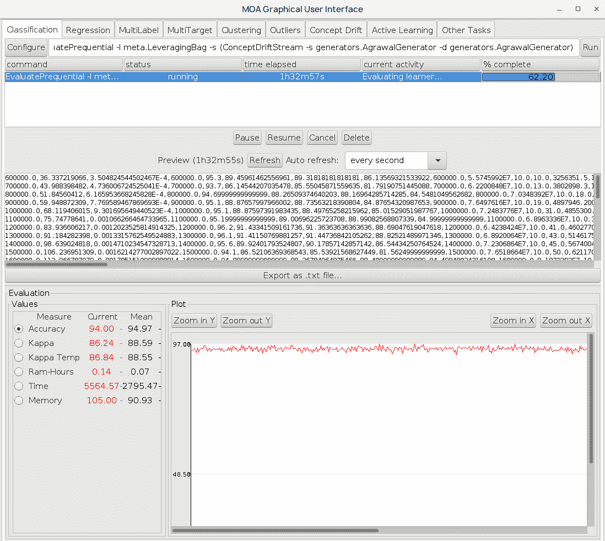

输出显示了每 10，000 个实例后的评估、分类正确性花费的 RAM 时间以及 Kappa 统计。正如您所看到的，随着时间的推移，分类的正确性会随着实例的增加而增加。前面截图中的图表显示了实例的正确性和数量。


# 摘要

在这一章中，我们解决了 2009 年 KDD 杯客户关系预测挑战，实现了数据预处理步骤，并解决了丢失值和冗余属性的问题。我们跟踪了获胜的 KDD 杯解决方案，并研究了如何通过使用一篮子学习算法来利用集成方法，这可以显著提高分类性能。

在下一章，我们将解决另一个关于顾客行为的问题:购买行为。您将学习如何使用算法来检测频繁出现的模式。