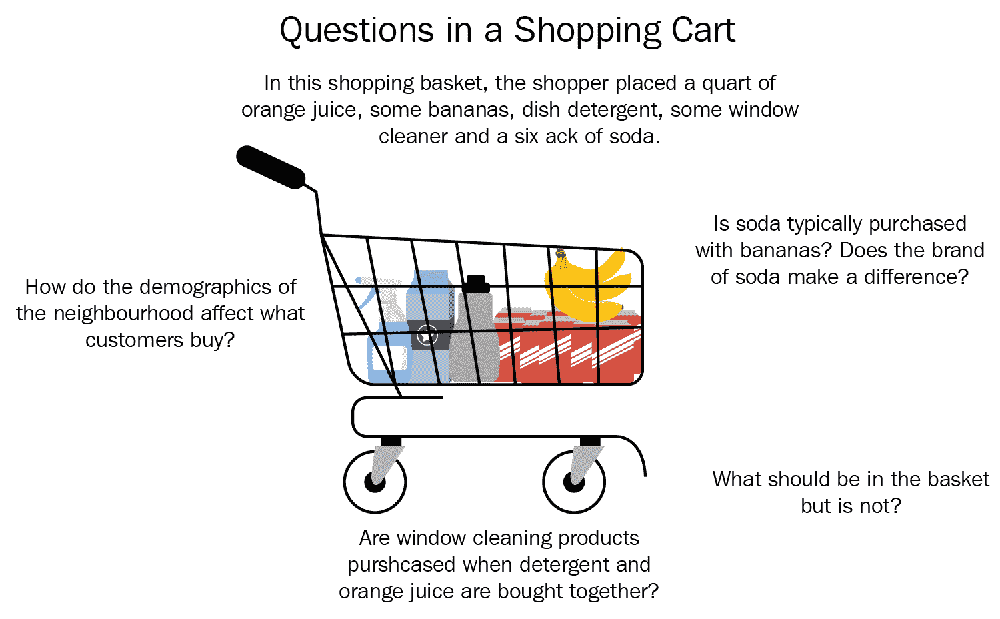
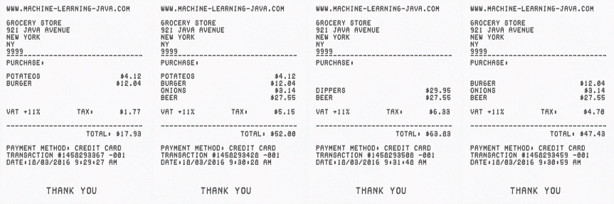
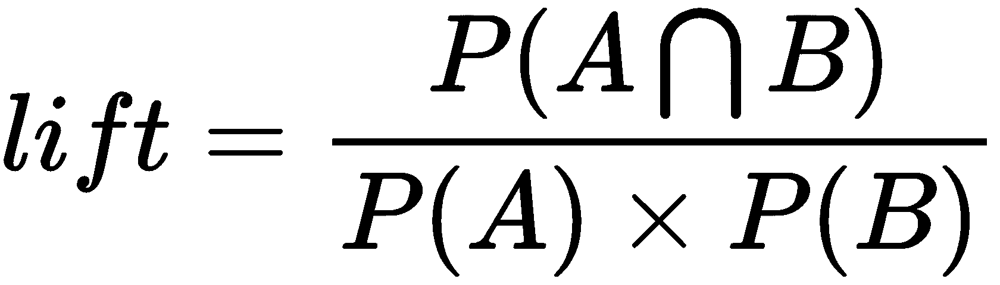
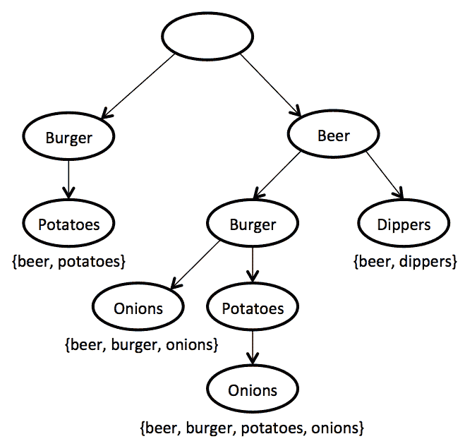
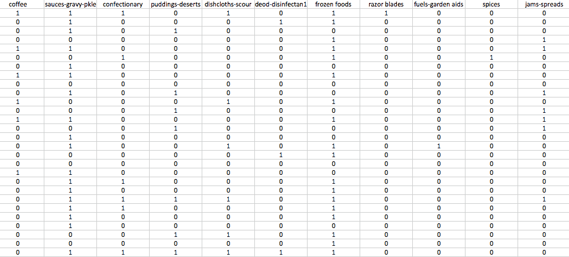

<link href="Styles/Style00.css" rel="stylesheet" type="text/css"> <link href="Styles/Style01.css" rel="stylesheet" type="text/css"> <link href="Styles/Style02.css" rel="stylesheet" type="text/css"> <link href="Styles/Style03.css" rel="stylesheet" type="text/css">     

# 亲和力分析

亲和力分析是**购物篮分析** ( **MBA** )的核心。它可以发现由特定用户或组执行的活动之间的共现关系。在零售业，亲和力分析可以帮助你了解顾客的购买行为。这些见解可以通过智能交叉销售和追加销售策略增加收入，并帮助您制定忠诚度计划、促销和折扣计划。

在本章中，我们将探讨以下主题:

*   工商管理硕士
*   关联规则学习
*   各种领域中的其他应用

首先，我们将修改核心关联规则学习的概念和算法，如支持和提升 Apriori 算法和 FP-Growth 算法。接下来，我们将使用 Weka 对一个超市数据集执行我们的第一次相似性分析，并研究如何解释产生的规则。我们将通过分析关联规则学习如何应用于其他领域(如 IT 运营分析和医学)来结束本章。

<link href="Styles/Style00.css" rel="stylesheet" type="text/css"> <link href="Styles/Style01.css" rel="stylesheet" type="text/css"> <link href="Styles/Style02.css" rel="stylesheet" type="text/css"> <link href="Styles/Style03.css" rel="stylesheet" type="text/css">     

# 市场篮子分析

自从引入电子销售点以来，零售商已经收集了数量惊人的数据。为了利用这些数据产生业务价值，他们首先开发了一种方法来整合和聚合数据，以了解业务的基础。

最近，焦点转移到最底层的粒度——市场篮交易。在这种详细程度下，零售商可以直接看到在他们商店购物的每个顾客的购物篮，不仅了解特定购物篮中购买的商品数量，还了解这些商品是如何相互搭配购买的。这可用于驱动关于如何区分商店分类和商品的决策，以及有效地组合多个类别内和跨类别的产品，以推动更高的销售额和利润。这些决策可以在整个零售链中、通过渠道、在当地商店层面、甚至针对特定客户实施，通过所谓的个性化营销，为每个客户提供独特的产品:



MBA 涵盖各种各样的分析:

*   **物品相似度**:定义两件(或多件)物品被一起购买的可能性。
*   **驱动项的识别**:可以识别驱动人们到商店并且总是需要库存的项目。
*   **行程分类**:分析购物篮的内容，并将购物行程分类为一个类别:每周一次的购物行程、特殊场合等等。
*   **店与店比较**:了解购物篮的数量可以让任何指标除以购物篮的总数，从而有效地创建一种方便简单的方法来比较不同特征的商店(每个顾客售出的数量、每笔交易的收入、每个购物篮的商品数量等等)。
*   **收入优化**:这有助于确定这家商店的神奇价位，增加购物篮的规模和价值。
*   **营销**:这有助于识别更有利可图的广告和促销活动，更精确地定位优惠以提高投资回报率，通过纵向分析产生更好的会员卡促销活动，并为商店吸引更多流量。
*   **运营优化**:这有助于根据贸易区人口统计数据定制商店和商品组合，并优化商店布局，从而使库存与需求相匹配。

预测模型有助于零售商将正确的报价引导到正确的客户群或客户群，并了解什么对哪个客户有效，预测客户对该报价做出响应的概率得分，以及了解客户从接受报价中获得的价值。

<link href="Styles/Style00.css" rel="stylesheet" type="text/css"> <link href="Styles/Style01.css" rel="stylesheet" type="text/css"> <link href="Styles/Style02.css" rel="stylesheet" type="text/css"> <link href="Styles/Style03.css" rel="stylesheet" type="text/css">     

# 亲和力分析

**相似性分析**用于确定一组商品被一起购买的可能性。在零售业，有天然的产品亲缘关系；例如，对于买汉堡肉饼的人来说，很典型的是买汉堡卷，以及番茄酱、芥末、西红柿和其他组成汉堡体验的物品。

虽然有些产品相似性可能看起来微不足道，但有些相似性并不十分明显。一个经典的例子是牙膏和金枪鱼。似乎吃金枪鱼的人更倾向于在吃完饭后马上刷牙。那么，为什么对零售商来说，很好地掌握产品亲缘关系很重要呢？该信息对于适当地计划促销是至关重要的，因为降低某些项目的价格可能会导致相关高亲和力项目的价格飙升，而无需进一步促销这些相关项目。

在下一节中，我们将研究关联规则学习的算法:Apriori 和 FP-Growth。

<link href="Styles/Style00.css" rel="stylesheet" type="text/css"> <link href="Styles/Style01.css" rel="stylesheet" type="text/css"> <link href="Styles/Style02.css" rel="stylesheet" type="text/css"> <link href="Styles/Style03.css" rel="stylesheet" type="text/css">     

# 关联规则学习

关联规则学习已经成为在大型数据库中发现项目间有趣关系的流行方法。它最常用于零售业，以揭示产品之间的规律性。

关联规则学习方法使用不同的兴趣度在数据库中发现作为有趣的强规则的模式。例如，下面的规则表明，如果客户一起购买洋葱和土豆，他们可能也会购买汉堡肉:{洋葱，土豆}--> {汉堡}。

另一个可能在每个机器学习课上都会讲的经典故事是啤酒和尿布的故事。对超市购物者行为的分析显示，购买尿布的顾客，大概是年轻男性，也倾向于购买啤酒。它立即成为一个流行的例子，说明如何从日常数据中发现意想不到的关联规则；然而，对于这个故事有多少是真实的，人们有不同的看法。在《DSS 新闻 2002》中，丹尼尔·鲍尔 *s* 这样说道:

“1992 年，Teradata 零售咨询集团经理 Thomas Blischok 和他的工作人员对大约 25 家 Osco 药店的 120 万个市场篮进行了分析。开发数据库查询是为了识别亲缘关系。分析确实发现，在下午 5 点到 7 点之间，消费者会购买啤酒和尿布。Osco 经理没有利用啤酒和尿布的关系，将货架上的产品靠得更近。

除了前面 MBA 的例子之外，关联规则现在还应用于许多应用领域，包括 web 使用挖掘、入侵检测、连续生产和生物信息学。我们将在本章的后面更仔细地研究这些领域。

<link href="Styles/Style00.css" rel="stylesheet" type="text/css"> <link href="Styles/Style01.css" rel="stylesheet" type="text/css"> <link href="Styles/Style02.css" rel="stylesheet" type="text/css"> <link href="Styles/Style03.css" rel="stylesheet" type="text/css">     

# 基本概念

在我们深入研究算法之前，让我们先回顾一下基本概念。

<link href="Styles/Style00.css" rel="stylesheet" type="text/css"> <link href="Styles/Style01.css" rel="stylesheet" type="text/css"> <link href="Styles/Style02.css" rel="stylesheet" type="text/css"> <link href="Styles/Style03.css" rel="stylesheet" type="text/css">     

# 交易数据库

在关联规则挖掘中，数据集的结构与第一章中介绍的方法稍有不同。首先，没有类值，因为这不是学习关联规则所必需的。接下来，数据集被表示为一个事务表，其中每个超市商品对应一个二进制属性。因此，特征向量可能非常大。

考虑下面的例子。假设我们有四张收据，如下所示。每张收据对应一项采购交易:



为了以交易数据库的形式书写这些收据，我们首先识别收据中出现的所有可能的项目。这些物品是**洋葱**、**土豆**、**汉堡**、**啤酒**和**蘸料**。每一次购买，即交易，都在一行中呈现，如果是在交易中购买的，则有 *1* ，否则有 *0* ，如下表所示:

| **交易 ID** | **洋葱** | **土豆** | **汉堡** | **啤酒** | **铲斗** |
| one | Zero | one | one | Zero | Zero |
| Two | one | one | one | one | Zero |
| three | Zero | Zero | Zero | one | one |
| four | one | Zero | one | one | Zero |

这个例子真的很小。在实际应用中，数据集通常包含数千或数百万个交易，这使得学习算法能够发现统计上显著的模式。

<link href="Styles/Style00.css" rel="stylesheet" type="text/css"> <link href="Styles/Style01.css" rel="stylesheet" type="text/css"> <link href="Styles/Style02.css" rel="stylesheet" type="text/css"> <link href="Styles/Style03.css" rel="stylesheet" type="text/css">     

# 项目集和规则

**Itemset** 简单来说就是一组项目，例如，{洋葱，土豆，汉堡}。规则由两个项目集 X 和 Y 组成，格式如下:

X -> Y

这表明当观察 X 项目集时，也观察 Y 的模式。为了选择感兴趣的规则，可以使用各种显著性度量。

<link href="Styles/Style00.css" rel="stylesheet" type="text/css"> <link href="Styles/Style01.css" rel="stylesheet" type="text/css"> <link href="Styles/Style02.css" rel="stylesheet" type="text/css"> <link href="Styles/Style03.css" rel="stylesheet" type="text/css">     

# 支持

对于项集，支持度被定义为包含该项集的事务的比例。上表中的`{potatoes, burger}`项集具有以下支持，因为它出现在 50%的事务中(四个事务中的两个):supp({ potatos，burger}) = 2/4 = 0.5。

直观地说，它表明了支持该模式的事务的份额。

<link href="Styles/Style00.css" rel="stylesheet" type="text/css"> <link href="Styles/Style01.css" rel="stylesheet" type="text/css"> <link href="Styles/Style02.css" rel="stylesheet" type="text/css"> <link href="Styles/Style03.css" rel="stylesheet" type="text/css">     

# 电梯

Lift 是对目标模型(关联规则)在预测或分类具有增强响应(相对于总体而言)的病例时的性能的度量，根据随机选择目标模型进行测量。使用以下公式定义:



<link href="Styles/Style00.css" rel="stylesheet" type="text/css"> <link href="Styles/Style01.css" rel="stylesheet" type="text/css"> <link href="Styles/Style02.css" rel="stylesheet" type="text/css"> <link href="Styles/Style03.css" rel="stylesheet" type="text/css">     

# 信心

规则的可信度表明它的准确性。使用以下公式定义:

[]

比如{洋葱，汉堡}--> {啤酒}规则，上表中的置信度 *0.5/0.5 = 1.0* ，表示洋葱和汉堡一起买的时候，100%的时候啤酒也买。

<link href="Styles/Style00.css" rel="stylesheet" type="text/css"> <link href="Styles/Style01.css" rel="stylesheet" type="text/css"> <link href="Styles/Style02.css" rel="stylesheet" type="text/css"> <link href="Styles/Style03.css" rel="stylesheet" type="text/css">     

# Apriori 算法

**Apriori 算法**是一种经典算法，用于事务上的频繁模式挖掘和关联规则学习。通过识别数据库中频繁出现的单个项目并将其扩展到更大的项目集，Apriori 可以确定关联规则，这些规则突出了数据库的总体趋势。

Apriori 算法构造一组项集，例如 itemset1= {Item A，Item B}，并计算支持度，支持度计算数据库中出现的次数。Apriori 然后使用自底向上的方法，在这种方法中，频繁项集被一次一项地扩展，它的工作方式是通过首先查看较小的集并认识到除非其所有子集都是频繁的，否则大型集不可能是频繁的，从而排除最大的集作为候选集。当没有找到进一步的成功扩展时，算法终止。

虽然 Apriori 算法是机器学习中的一个重要里程碑，但它存在许多低效和折衷之处。在下一节中，我们将研究一种更新的 FP-Growth 技术。

<link href="Styles/Style00.css" rel="stylesheet" type="text/css"> <link href="Styles/Style01.css" rel="stylesheet" type="text/css"> <link href="Styles/Style02.css" rel="stylesheet" type="text/css"> <link href="Styles/Style03.css" rel="stylesheet" type="text/css">     

# FP-增长算法

**FP-Growth** (其中 FP 是频繁模式)将事务数据库表示为后缀树。首先，该算法计算数据集中项目的出现次数。在第二遍中，它构建一个后缀树，这是一个有序的树数据结构，通常用于存储字符串。下图显示了基于上一个示例的后缀树示例:



如果许多事务共享最频繁的项目，后缀树提供接近树根的高压缩。大项集直接增长，而不是生成候选项并对整个数据库进行测试。通过找到匹配最小支持度和置信度的所有项目集，从树的底部开始增长。一旦递归过程完成，所有具有最小覆盖的大项目集都被找到，关联规则创建开始。

FP-Growth 算法有几个优点。首先，它构建了一个 FP-tree，以一种非常紧凑的方式对原始数据集进行编码。其次，它利用 FP-tree 结构和分治策略高效地构建频繁项集。

<link href="Styles/Style00.css" rel="stylesheet" type="text/css"> <link href="Styles/Style01.css" rel="stylesheet" type="text/css"> <link href="Styles/Style02.css" rel="stylesheet" type="text/css"> <link href="Styles/Style03.css" rel="stylesheet" type="text/css">     

# 超市数据集

位于`data/supermarket.arff`的超市数据集描述了超市顾客的购物习惯。大多数属性代表特定的项目组，例如，乳制品、牛肉和土豆；或者它们代表一个部门，例如，79 部门、81 部门等等。下表显示了数据库的摘录，其中如果客户购买了一件商品，则值为 *t* ,否则将丢失。每个客户有一个实例。数据集不包含类属性，因为这不是学习关联规则所必需的。下表显示了一个数据示例:



<link href="Styles/Style00.css" rel="stylesheet" type="text/css"> <link href="Styles/Style01.css" rel="stylesheet" type="text/css"> <link href="Styles/Style02.css" rel="stylesheet" type="text/css"> <link href="Styles/Style03.css" rel="stylesheet" type="text/css">     

# 发现模式

为了发现购物模式，我们将使用我们之前研究过的两种算法:Apriori 和 FP-Growth。

<link href="Styles/Style00.css" rel="stylesheet" type="text/css"> <link href="Styles/Style01.css" rel="stylesheet" type="text/css"> <link href="Styles/Style02.css" rel="stylesheet" type="text/css"> <link href="Styles/Style03.css" rel="stylesheet" type="text/css">     

# 推测的

我们将使用 Weka 中实现的`Apriori`算法。它迭代地减少最小支持度，直到找到所需数量的具有给定最小置信度的规则。我们将使用以下步骤实现该算法:

1.  我们将使用以下代码行导入所需的库:

```
import java.io.BufferedReader; 
import java.io.FileReader; 
import weka.core.Instances; 
import weka.associations.Apriori; 
```

2.  首先，我们将加载`supermarket.arff`数据集:

```
Instances data = new Instances(new BufferedReader(new FileReader("data/supermarket.arff"))); 
```

3.  我们将初始化一个`Apriori`实例并调用`buildAssociations(Instances)`函数来开始频繁模式挖掘，如下所示:

```
Apriori model = new Apriori(); 
model.buildAssociations(data); 
```

4.  我们可以输出发现的项目集和规则，如下面的代码所示:

```
System.out.println(model); 
```

输出如下所示:

```
   Apriori
    =======

    Minimum support: 0.15 (694 instances)
    Minimum metric <confidence>: 0.9
    Number of cycles performed: 17

    Generated sets of large itemsets:
    Size of set of large itemsets L(1): 44
    Size of set of large itemsets L(2): 380
    Size of set of large itemsets L(3): 910
    Size of set of large itemsets L(4): 633
    Size of set of large itemsets L(5): 105
    Size of set of large itemsets L(6): 1

    Best rules found:

     1\. biscuits=t frozen foods=t fruit=t total=high 788 ==> bread and cake=t 723    <conf:(0.92)> lift:(1.27) lev:(0.03) [155] conv:(3.35)
     2\. baking needs=t biscuits=t fruit=t total=high 760 ==> bread and cake=t 696    <conf:(0.92)> lift:(1.27) lev:(0.03) [149] conv:(3.28)
     3\. baking needs=t frozen foods=t fruit=t total=high 770 ==> bread and cake=t 705    <conf:(0.92)> lift:(1.27) lev:(0.03) [150] conv:(3.27)
    ...

```

该算法根据置信度输出 10 个最佳规则。让我们看看第一条规则，并解释输出，如下所示:

```
biscuits=t frozen foods=t fruit=t total=high 788 ==> bread and cake=t 723    <conf:(0.92)> lift:(1.27) lev:(0.03) [155] conv:(3.35)

```

上面说当`biscuits`、`frozen foods`、`fruits`一起购买，购买总价高的时候，也很有可能`bread`、`cake`也被购买。`{biscuits, frozen foods, fruit, total high}`项集出现在`788`事务中，而`{bread, cake}`项集出现在`723`事务中。该规则的置信度是`0.92`，这意味着该规则在存在`{biscuits, frozen foods, fruit, total high}`项集的 92%的事务中成立。

输出还报告了额外的度量，如提升、杠杆和信念，这些度量根据我们的初始假设来估计准确性；例如，`3.35`信念值表明，如果关联纯粹是随机的，则该规则将错误`3.35`倍。如果 X 和 Y 在统计上是独立的`(lift=1)`，Lift 测量它们一起出现的次数。X - > Y 法则中的`2.16`升力意味着 X 的概率比 Y 的概率大`2.16`倍

<link href="Styles/Style00.css" rel="stylesheet" type="text/css"> <link href="Styles/Style01.css" rel="stylesheet" type="text/css"> <link href="Styles/Style02.css" rel="stylesheet" type="text/css"> <link href="Styles/Style03.css" rel="stylesheet" type="text/css">     

# FP-增长

现在，让我们试着用更有效的 FP-Growth 算法得到同样的结果。
FP-Growth 也在`weka.associations`包中实现:

```
import weka.associations.FPGrowth; 
```

FP-Growth 算法的初始化类似于我们前面所做的:

```
FPGrowth fpgModel = new FPGrowth(); 
fpgModel.buildAssociations(data); 
System.out.println(fpgModel); 
```

输出显示 FP-Growth 发现了`16 rules`:

```
    FPGrowth found 16 rules (displaying top 10)

    1\. [fruit=t, frozen foods=t, biscuits=t, total=high]: 788 ==> [bread and cake=t]: 723   <conf:(0.92)> lift:(1.27) lev:(0.03) conv:(3.35) 
    2\. [fruit=t, baking needs=t, biscuits=t, total=high]: 760 ==> [bread and cake=t]: 696   <conf:(0.92)> lift:(1.27) lev:(0.03) conv:(3.28) 
    ...

```

我们可以观察到 FP-Growth 发现了与 Apriori 相同的一套规则；然而，处理较大数据集所需的时间可以大大缩短。

<link href="Styles/Style00.css" rel="stylesheet" type="text/css"> <link href="Styles/Style01.css" rel="stylesheet" type="text/css"> <link href="Styles/Style02.css" rel="stylesheet" type="text/css"> <link href="Styles/Style03.css" rel="stylesheet" type="text/css">     

# 各种领域的其他应用

我们研究了亲和力分析来揭开超市购物行为模式的神秘面纱。虽然关联规则学习的基础是分析销售点交易，但它们也可以应用于零售业之外，以发现其他类型的购物篮之间的关系。购物篮的概念可以很容易地扩展到服务和产品，例如，分析使用信用卡购买的项目，如租赁汽车和酒店房间，以及分析电信客户购买的增值服务的信息(呼叫等待、呼叫转移、DSL、快速呼叫等)，这可以帮助运营商确定改进服务套餐捆绑的方法。

此外，我们将研究以下潜在跨行业应用的示例:

*   医疗诊断
*   蛋白质序列
*   普查数据
*   客户关系管理
*   IT 运营分析

<link href="Styles/Style00.css" rel="stylesheet" type="text/css"> <link href="Styles/Style01.css" rel="stylesheet" type="text/css"> <link href="Styles/Style02.css" rel="stylesheet" type="text/css"> <link href="Styles/Style03.css" rel="stylesheet" type="text/css">     

# 医疗诊断

在医疗诊断中应用关联规则可以用来在治疗病人时帮助医生。归纳可靠的诊断规则的一般问题是困难的，因为从理论上讲，没有归纳过程可以保证归纳假设本身的正确性。实际上，诊断不是一个简单的过程，因为它涉及不可靠的诊断测试和训练样本中存在的噪声。

然而，关联规则可以用来识别一起出现的可能症状。在这种情况下，事务对应于医学案例，而症状对应于项目。当患者接受治疗时，症状列表被记录为一个交易。

<link href="Styles/Style00.css" rel="stylesheet" type="text/css"> <link href="Styles/Style01.css" rel="stylesheet" type="text/css"> <link href="Styles/Style02.css" rel="stylesheet" type="text/css"> <link href="Styles/Style03.css" rel="stylesheet" type="text/css">     

# 蛋白质序列

许多研究已经深入了解蛋白质的组成和性质；然而，许多事情仍有待于令人满意地理解。现在普遍认为蛋白质的氨基酸序列不是随机的。

使用关联规则，可以识别蛋白质中不同氨基酸之间的关联。蛋白质是由 20 种氨基酸组成的序列。每种蛋白质都有独特的三维结构，这取决于氨基酸序列；序列的微小变化可能会改变蛋白质的功能。应用关联规则，一个蛋白质对应一个事务，氨基酸及其结构对应条目。

这种关联规则对于增强我们对蛋白质组成的理解是可取的，并且有可能提供关于蛋白质中出现的一些特定氨基酸组之间的全局相互作用的线索。人工蛋白质的合成非常需要这些关联规则或约束的知识。

<link href="Styles/Style00.css" rel="stylesheet" type="text/css"> <link href="Styles/Style01.css" rel="stylesheet" type="text/css"> <link href="Styles/Style02.css" rel="stylesheet" type="text/css"> <link href="Styles/Style03.css" rel="stylesheet" type="text/css">     

# 普查数据

人口普查为研究人员和公众提供了大量关于社会的一般统计信息。与人口和经济普查相关的信息可以在规划公共服务(教育、卫生、交通和资金)以及商业(建立新工厂、购物中心或银行，甚至营销特定产品)时进行预测。

为了发现频繁模式，每个统计区域(例如，自治市、城市和街区)对应于一个事务，收集的指标对应于项目。

<link href="Styles/Style00.css" rel="stylesheet" type="text/css"> <link href="Styles/Style01.css" rel="stylesheet" type="text/css"> <link href="Styles/Style02.css" rel="stylesheet" type="text/css"> <link href="Styles/Style03.css" rel="stylesheet" type="text/css">     

# 客户关系管理

正如我们在前面章节中简要讨论的那样，客户关系管理是一个丰富的数据来源，公司希望通过它来识别不同客户群、产品和服务的偏好，以增强他们的产品、服务和客户之间的凝聚力。

关联规则可以强化知识管理过程，让营销人员更好地了解客户，提供更优质的服务。例如，可以应用关联规则从客户档案和销售数据中检测不同时间快照的客户行为变化。基本思想是从两个数据集发现变化，从每个数据集生成规则，进行规则匹配。

<link href="Styles/Style00.css" rel="stylesheet" type="text/css"> <link href="Styles/Style01.css" rel="stylesheet" type="text/css"> <link href="Styles/Style02.css" rel="stylesheet" type="text/css"> <link href="Styles/Style03.css" rel="stylesheet" type="text/css">     

# IT 运营分析

基于大量交易的记录，关联规则学习非常适合应用于日常 IT 运营中定期收集的数据，使 IT 运营分析工具能够检测频繁模式并识别关键变化。IT 专家需要看到全局并理解，例如，数据库上的问题如何影响应用服务器。

对于特定的一天，IT 运营部门可能会接收各种警报，并将它们呈现在事务性数据库中。使用关联规则学习算法，IT 运营分析工具可以关联和检测频繁出现的警报模式。这有助于更好地理解一个组件如何影响另一个组件。

通过识别警报模式，可以应用预测分析。例如，一个特定的数据库服务器托管了一个 web 应用程序，突然触发了一个关于数据库的警报。通过研究由关联规则学习算法识别的频繁模式，这意味着 IT 人员需要在 web 应用程序受到影响之前采取行动。

关联规则学习还可以发现源自同一 IT 事件的警报事件。例如，每次添加新用户时，都会检测到 Windows 操作系统中的六个变化。接下来，在**应用组合管理** ( **APM** )中，它可能会面临多个警报，显示数据库中的事务时间很长。如果所有这些问题都源于同一个来源(例如，收到数百个关于全部由 Windows 更新引起的更改的警报)，这种频繁的模式挖掘有助于快速排除大量警报，使 IT 操作员能够专注于真正关键的更改。

<link href="Styles/Style00.css" rel="stylesheet" type="text/css"> <link href="Styles/Style01.css" rel="stylesheet" type="text/css"> <link href="Styles/Style02.css" rel="stylesheet" type="text/css"> <link href="Styles/Style03.css" rel="stylesheet" type="text/css">     

# 摘要

在本章中，您学习了如何利用事务数据集上的关联规则学习来深入了解频繁模式。我们在 Weka 中进行了关联性分析，并了解到困难在于结果分析——在解释规则时需要仔细注意，因为关联(即相关性)与因果关系不同。

在下一章中，我们将看看如何使用可扩展的机器学习库 Apache Mahout 将商品推荐问题提升到一个新的水平，Apache Mahout 能够处理大数据。