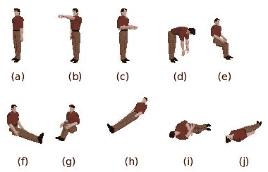
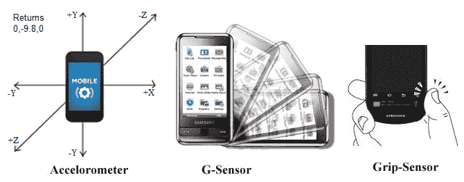
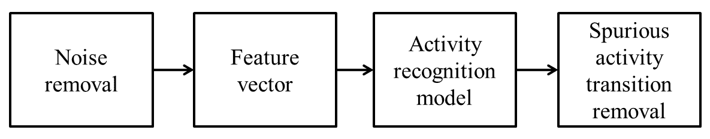
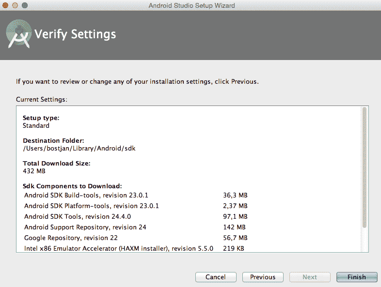
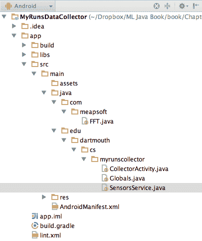
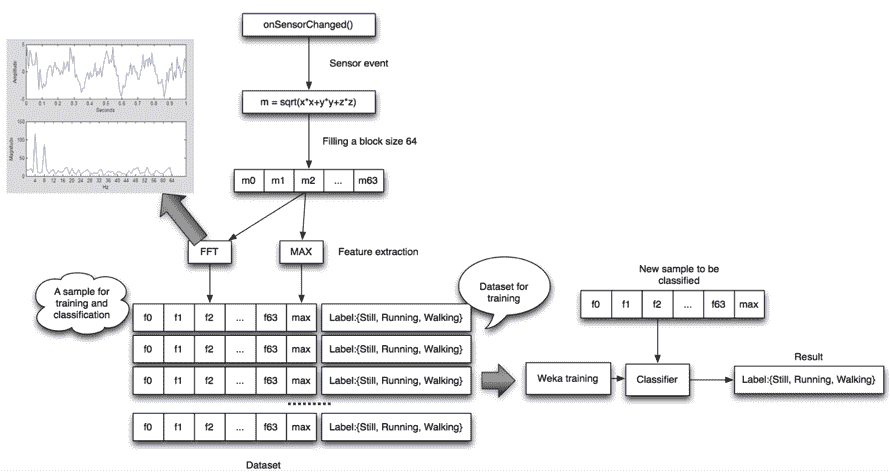
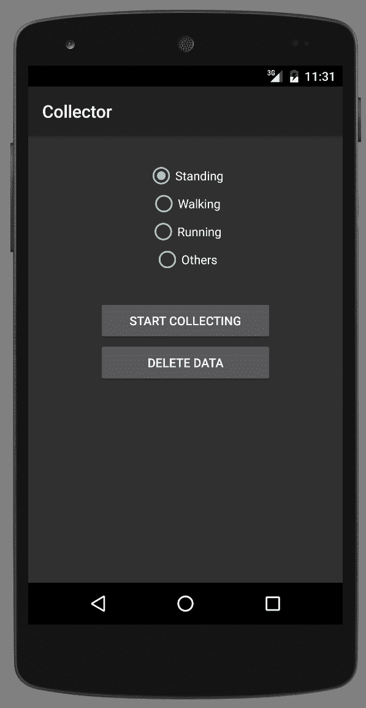
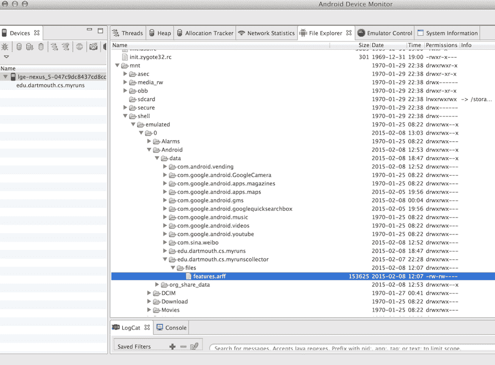

# 九、利用手机传感器进行活动识别

虽然上一章关注的是图像中的模式识别，但本章讨论的是识别传感器数据中的模式，与图像不同，传感器数据具有时间依赖性。我们将讨论如何使用手机惯性传感器识别日常活动，如走路、坐着和跑步。本章还提供了相关研究的参考，并强调了活动识别社区的最佳实践。

本章涵盖的主题将包括以下内容:

*   介绍活动识别，涵盖手机传感器和活动识别渠道
*   从移动设备收集传感器数据
*   讨论活动分类和模型评估
*   部署活动识别模型


# 介绍活动识别

活动识别是行为分析的基础步骤，涉及健康的生活方式、健康跟踪、远程协助、安全应用、老年人护理等。活动识别将来自加速度计、陀螺仪、压力传感器和 GPS 位置等传感器的低级传感器数据转换为行为原语的高级描述。

在大多数情况下，这些都是基本的活动，例如，走、坐、躺、跳等等，如下图所示，或者它们可以是更复杂的行为，例如上班、准备早餐和购物:



在本章中，我们将讨论如何将活动识别功能添加到移动应用程序中。我们将首先看看活动识别问题是什么样的，我们需要收集什么样的数据，主要的挑战是什么，以及如何解决它们。

稍后，我们将通过一个示例来了解如何在一个 Android 应用程序中实际实现活动识别，包括数据收集、数据转换和构建分类器。

开始吧！


# 手机传感器

我们先来回顾一下手机传感器都有哪些种类，报的是什么。大多数智能设备现在都配备了几个内置传感器，可以测量周围环境的运动、位置、方向和条件。由于传感器提供高精度、高频率和高准确度的测量，因此有可能重建复杂的用户动作、手势和移动。传感器经常被结合到各种应用中；例如，陀螺仪读数用于操纵游戏中的对象，GPS 数据用于定位用户，加速度计数据用于推断用户正在进行的活动，例如骑自行车、跑步或步行。

下图显示了传感器能够检测到的交互类型的几个示例:



移动电话传感器可分为以下三大类:

*   **运动传感器:**该传感器测量沿三个垂直轴的加速度和旋转力。这类传感器的例子包括加速度计、重力传感器和陀螺仪。
*   **环境传感器:**该传感器测量各种环境参数，如光照、空气温度、压力和湿度。这一类包括气压计、光度计和温度计。
*   **位置传感器:**该传感器测量设备的物理位置。这一类包括方位传感器和磁力计。

有关不同移动平台的更多详细说明，请访问以下链接:

*   **安卓传感器框架**:[http://developer . Android . com/guide/topics/sensors/sensors _ overview . html](http://developer.android.com/guide/topics/sensors/sensors_overview.html)
*   **iOS 核心运动框架**:[https://developer . apple . com/library/iOS/documentation/Core Motion/Reference/Core Motion _ Reference/](https://developer.apple.com/library/ios/documentation/CoreMotion/Reference/CoreMotion_Reference/)
*   **Windows phone**:[https://msdn . Microsoft . com/en-us/library/Windows/apps/hh 202968(v = vs . 105)。aspx](https://msdn.microsoft.com/en-us/library/windows/apps/hh202968(v=vs.105).aspx)

在这一章中，我们将只使用 Android 的传感器框架。


# 活动识别管道

正如我们在前面章节中看到的，对多维时间序列传感器数据进行分类本质上比对传统名义数据进行分类更复杂。首先，每个观测值在时间上与前一个和后一个观测值相关，这使得很难只对一组观测值进行简单的分类。第二，传感器在不同时间点获得的数据是随机的，也就是说，由于传感器噪声、环境干扰和许多其他因素的影响，这些数据是不可预测的。此外，一项活动可以由以不同方式执行的各种子活动组成，每个人执行活动的方式稍有不同，这导致了较高的组内差异。最后，所有这些原因使得活动识别模型不精确，导致新数据经常被错误分类。活动识别分类器的一个非常理想的特性是确保所识别的活动序列的连续性和一致性。

为了应对这些挑战，活动识别应用于管道，如下图所示:



第一步，我们尽可能多地衰减噪声，例如，通过降低传感器采样速率、移除异常值、应用高通或低通滤波器等。在下一阶段，我们构建一个特征向量。例如，我们通过应用**离散傅立叶变换** ( **DFT** )将传感器数据从时域转换到频域。DFT 是一种将样本列表作为输入并返回按频率排序的正弦系数列表的方法。它们表示原始样本列表中存在的频率组合。

A gentle introduction to the Fourier transform was written by Pete Bevelacqua at [http://www.thefouriertransform.com/](http://www.thefouriertransform.com/). If you want to get a more technical and theoretical background on the Fourier transform, take a look at the eighth and ninth lectures in the class by Robert Gallager and Lizhong Zheng at this MIT open course: [http://theopenacademy.com/content/principles-digital-communication](http://theopenacademy.com/content/principles-digital-communication).

接下来，基于特征向量和训练数据集，我们可以构建一个活动识别模型，为每个观察分配一个原子动作。因此，对于每个新的传感器读数，模型将输出最可能的活动标签。然而，模型也会出错。因此，最后一个阶段通过删除实际上不可能发生的转换来平滑活动之间的转换；例如，躺-站-躺活动之间的转换在少于半秒的时间内发生在物理上是不可行的，因此，活动之间的这种转换被平滑为躺-躺-躺。

活动识别模型是用监督学习方法构建的，该方法包括训练和分类步骤。在训练步骤中，提供一组标记数据来训练模型。第二步是由训练好的模型给新的看不见的数据分配一个标签。两个阶段中的数据必须用相同的工具集进行预处理，例如过滤和特征向量计算。

后处理阶段，即虚假活动去除，也可以是模型本身，因此也需要学习步骤。在这种情况下，预处理步骤还包括活动识别，这使得分类器的这种排列成为元学习问题。为了避免过度拟合，重要的是用于训练后处理阶段的数据集不同于用于训练活动识别模型的数据集。


# 这个计划

该计划包括培训阶段和部署阶段。培训阶段可归结为以下步骤:

1.  安装 Android Studio，导入`MyRunsDataCollector.zip`。
2.  在你的 Android 手机上加载应用程序。
3.  收集您的数据，例如站立、行走和跑步，并将数据转换为由 FFT 组成的特征向量。不要慌；FFT 等低级信号处理函数将不会从头开始编写，因为我们将使用现有代码来完成。这些数据将被保存在手机上一个名为`features.arff`的文件中。
4.  使用导出的数据创建和评估活动识别分类器，并实施过滤器以消除虚假的活动转换。
5.  将分类器插回到移动应用程序中。

如果你没有 Android 手机，或者如果你想跳过所有与移动应用程序相关的步骤，只需抓取位于`data/features.arff`的收集数据集，并直接跳转到*构建分类器*部分。


# 从手机收集数据

本节描述了该计划的前三个步骤。如果您想直接处理数据，您可以跳过这一部分，继续到*构建分类器*部分。该应用程序实现了收集不同活动类别(例如，站立、行走、跑步等)的传感器数据的基本要素。

让我们从准备 Android 开发环境开始。如果您已经安装了它，请跳到*加载数据采集器*部分。


# 安装 Android Studio

Android Studio 是 Android 平台的开发环境。我们将快速回顾在手机上启动应用程序所需的安装步骤和基本配置。关于 Android 开发的更详细的介绍，我推荐一本入门书，Packt 出版社的 Kyle Mew 的《Android 5 编程示例》。

在[https://developer.android.com/studio/](https://developer.android.com/studio/)为开发者下载最新的 Android Studio，并按照 http://developer.android.com/sdk/installing/index.html?[的安装说明进行操作 pkg =工作室](http://developer.android.com/sdk/installing/index.html?pkg=studio)。安装大约需要 10 分钟，占用大约 0.5 GB 的空间。

按照说明选择您喜欢的安装选项，最后单击 Finish 开始安装，如下面的屏幕截图所示:




# 加载数据采集器

首先从 GitHub 上抓取`MyRunsDataCollector`的源代码。安装 Android Studio 后，选择打开一个现有的 Android Studio 项目选项，如下图所示，并选择`MyRunsDataCollector`文件夹。这将把项目导入 Android Studio:


项目导入完成后，您应该能够看到项目文件结构，如下图所示。采集器由`CollectorActivity.java`、`Globals.java`和`SensorsService.java`组成。该项目还显示了`FFT.java`实现低电平信号处理:



主`myrunscollector`包包含以下类:

*   `Globals.java`:定义全局常量，如活动标签和 id，以及数据文件名。
*   `CollectorActivity.java`:实现用户界面动作，也就是按下特定按钮时发生的事情。
*   这实现了一个收集数据、计算特征向量的服务，我们将在下面的章节中讨论，并将数据存储到手机上的一个文件中。

我们要解决的下一个问题是如何设计功能。


# 特征抽出

找到一个人的活动的适当表示可能是活动识别中最具挑战性的部分。行为需要用简单和通用的特征来表示，以便使用这些特征的模型也将是通用的，并且在不同于学习集中的行为上工作良好。

事实上，在一个训练集中设计特定于捕获的观察的特征并不困难；这样的功能在他们身上会很好用。然而，由于训练集仅捕获人类行为的整个范围的一部分，过于具体的特征可能会在一般行为上失败:



让我们看看这是如何在`MyRunsDataCollector`中实现的。当应用程序启动时，一个名为`onSensorChanged()`的方法获取带有特定时间戳的三个加速度计传感器读数( **x** 、 **y** 和 **z** )，并根据传感器读数计算大小。该方法在计算 FFT 系数之前缓冲多达 64 个连续的幅度标记。

现在，让我们继续实际的数据收集。


# 收集培训数据

我们现在可以使用收集器来收集活动识别的训练数据。默认情况下，收集器支持三种活动:站立、行走和跑步，如下图所示。

您可以选择一个活动，即目标类值，并通过单击 START COLLECTING 按钮开始记录数据。确保每项活动至少记录三分钟；例如，如果选择了步行活动，请按开始收集并步行至少三分钟。活动结束时，按停止收集。对每个活动重复这一步骤。

您还可以收集涉及这些活动的不同场景，例如，在厨房里行走、在外面行走、排队行走等等。通过这样做，您将拥有每个活动类的更多数据和一个更好的分类器。有道理，对吧？数据越多，分类器就越不混乱。如果只有少量数据，将会出现过度拟合，分类器会混淆类别-站立与行走，行走与跑步，等等。然而，数据越多，他们越不会感到困惑。当你调试的时候，你可能每个类收集不到三分钟的数据，但是对于你最终的成品来说，数据越多越好。多个记录实例将简单地累积在同一个文件中。

请注意，删除数据按钮会删除存储在手机文件中的数据。如果你想重新开始，在开始前点击删除数据；否则，新收集的数据将被附加到文件的末尾:



收集器实现了前面几节中讨论的图表:它收集加速度计样本，计算幅度，使用`FFT.java`类计算系数，并产生特征向量。然后，数据被存储在 Weka 格式的`features.arff`文件中。特征向量的数量会根据您收集的数据量而有所不同。收集数据的时间越长，积累的特征向量就越多。

一旦您停止使用收集器工具收集训练数据，我们就需要获取数据来继续工作流。我们可以使用 Android 设备监视器中的文件浏览器从手机上传`features.arff`文件，并将其存储在电脑上。您可以通过单击 Android robot 图标来访问您的 Android 设备监视器，如下图所示:


通过在左侧选择您的设备，您的手机存储内容将显示在右侧。浏览`mnt/shell/emulated/Android/data/edu.dartmouth.cs.myrunscollector/files/features.arff`，如下图所示:



要将此文件上传到您的计算机，您需要选择该文件(突出显示)并单击上传。

现在，我们准备构建一个分类器。


# 构建分类器

一旦传感器样本被表示为特征向量并分配了类别，就可以应用标准技术进行监督分类，包括特征选择、特征离散化、模型学习、k-fold 交叉验证等。本章不会深入研究机器学习算法的细节。可以应用任何支持数字特征的算法，包括支持向量机、随机森林、AdaBoost、决策树、神经网络、多层感知器等等。

因此，让我们从一个基本的开始:决策树。在这里，我们将加载数据集，构建 set class 属性，构建决策树模型，并输出模型:

```
String databasePath = "/Users/bostjan/Dropbox/ML Java Book/book/datasets/chap9/features.arff"; 

// Load the data in arff format 
Instances data = new Instances(new BufferedReader(new 
   FileReader(databasePath))); 

// Set class the last attribute as class 
data.setClassIndex(data.numAttributes() - 1); 

// Build a basic decision tree model 
String[] options = new String[]{}; 
J48 model = new J48(); 
model.setOptions(options); 
model.buildClassifier(data); 

// Output decision tree 
System.out.println("Decision tree model:\n"+model); 
```

该算法首先输出模型，如下所示:

```
    Decision tree model:
    J48 pruned tree
    ------------------

    max <= 10.353474
    |   fft_coef_0000 <= 38.193106: standing (46.0)
    |   fft_coef_0000 > 38.193106
    |   |   fft_coef_0012 <= 1.817792: walking (77.0/1.0)
    |   |   fft_coef_0012 > 1.817792
    |   |   |   max <= 4.573082: running (4.0/1.0)
    |   |   |   max > 4.573082: walking (24.0/2.0)
    max > 10.353474: running (93.0)

    Number of Leaves  : 5

    Size of the tree : 9
```

该树非常简单，看起来很准确，因为终端节点中的多数类分布非常高。让我们运行一个基本分类器评估来验证结果，如下所示:

```
// Check accuracy of model using 10-fold cross-validation 
Evaluation eval = new Evaluation(data); 
eval.crossValidateModel(model, data, 10, new Random(1), new 
   String[] {}); 
System.out.println("Model performance:\n"+ 
   eval.toSummaryString()); 
```

这将输出以下模型性能:

```
    Correctly Classified Instances         226               92.623  %
    Incorrectly Classified Instances        18                7.377  %
    Kappa statistic                          0.8839
    Mean absolute error                      0.0421
    Root mean squared error                  0.1897
    Relative absolute error                 13.1828 %
    Root relative squared error             47.519  %
    Coverage of cases (0.95 level)          93.0328 %
    Mean rel. region size (0.95 level)      27.8689 %
    Total Number of Instances              244     
```

分类准确率得分非常高，`92.62%`，这是一个惊人的结果。结果这么好的一个重要原因在于我们的评价设计。我在这里的意思是:连续的实例彼此非常相似，所以如果我们在 10 倍交叉验证期间随机地将它们分开，那么我们很有可能在训练和测试中使用几乎相同的实例；因此，直接的 k 倍交叉验证产生了对模型性能的乐观估计。

更好的方法是使用对应于不同测量集甚至不同人的折叠。例如，我们可以使用应用程序收集五个人的学习数据。然后，运行 k 人交叉验证是有意义的，其中模型在四个人身上训练，在第五个人身上测试。对每个人重复该过程，并对结果进行平均。这将使我们对模型性能有一个更加真实的估计。

抛开评价评论，让我们看看如何处理分类器错误。


# 减少杂散跃迁

在活动识别管道的最后，我们希望确保分类不会太不稳定，也就是说，我们不希望活动每毫秒都发生变化。一个基本的方法是设计一个忽略活动序列中快速变化的滤波器。

我们构建了一个过滤器，它能记住最后的窗口活动并返回最频繁的活动。如果有多个得分相同的活动，它将返回最近的一个。

首先，我们创建一个新的`SpuriousActivityRemoval`类，它将保存一个活动列表和`window`参数:

```
class SpuriousActivityRemoval{ 

  List<Object> last; 
  int window; 

  public SpuriousActivityRemoval(int window){ 
    this.last = new ArrayList<Object>(); 
    this.window = window; 
  } 
```

接下来，我们创建`Object filter(Object)`方法，该方法将接受一个活动并返回一个经过过滤的活动。该方法首先检查我们是否有足够的观察值。如果没有，它只存储观察值并返回相同的值，如下面的代码所示:

```
  public Object filter(Object obj){ 
    if(last.size() < window){ 
      last.add(obj); 
      return obj; 
  } 
```

如果我们已经收集了`window`观察值，我们只需返回最频繁的观察值，删除最早的观察值，并插入新的观察值:

```
    Object o = getMostFrequentElement(last); 
    last.add(obj); 
    last.remove(0); 
    return o; 
  } 
```

这里缺少的是一个从对象列表中返回最频繁元素的函数。我们使用哈希映射来实现这一点，如下所示:

```
  private Object getMostFrequentElement(List<Object> list){ 

    HashMap<String, Integer> objectCounts = new HashMap<String, 
       Integer>(); 
    Integer frequntCount = 0; 
    Object frequentObject = null; 
```

现在，我们遍历列表中的所有元素，将每个唯一的元素插入到一个哈希映射中，或者更新它的计数器(如果它已经在哈希映射中的话)。在循环结束时，我们存储目前为止找到的最频繁的元素，如下所示:

```
    for(Object obj : list){ 
      String key = obj.toString(); 
      Integer count = objectCounts.get(key); 
      if(count == null){ 
        count = 0; 
      } 
      objectCounts.put(key, ++count); 

      if(count >= frequntCount){ 
        frequntCount = count; 
        frequentObject = obj; 
      } 
    } 

    return frequentObject; 
  } 

} 
```

让我们运行一个简单的例子:

```
String[] activities = new String[]{"Walk", "Walk", "Walk", "Run", 
   "Walk", "Run", "Run", "Sit", "Sit", "Sit"}; 
SpuriousActivityRemoval dlpFilter = new 
   SpuriousActivityRemoval(3); 
for(String str : activities){ 
  System.out.println(str +" -> "+ dlpFilter.filter(str)); 
} 
```

该示例输出以下活动:

```
    Walk -> Walk
    Walk -> Walk
    Walk -> Walk
    Run -> Walk
    Walk -> Walk
    Run -> Walk
    Run -> Run
    Sit -> Run
    Sit -> Run
    Sit -> Sit
```

结果是一系列连续的活动，也就是说，我们没有快速的变化。这增加了一些延迟，但除非这对应用程序绝对重要，否则这是可以接受的。

可以通过将由分类器识别的 *n* 个先前活动附加到特征向量来增强活动识别。附加先前活动的危险在于，机器学习算法可能知道当前活动总是与先前活动相同，因为这将是经常的情况。该问题可以通过具有两个分类器 A 和 B 来解决:分类器 B 的属性向量包含由分类器 A 识别的 *n* 个先前活动。分类器 A 的属性向量不包含任何先前活动。这样，即使 B 对之前的活动赋予了很大的权重，A 认可的之前的活动也会因为 A 没有背负 B 的惯性而改变。

剩下要做的就是将分类器嵌入并过滤到我们的移动应用程序中。


# 将分类器插入移动应用程序

有两种方法可以将分类器集成到移动应用程序中。第一个包括以 Weka 格式导出模型，在我们的移动应用程序中使用 Weka 库作为依赖项，加载模型，等等。该过程与我们在第 3 章、*中看到的示例相同——分类、回归和聚类*。第二种方法更加轻量级:我们将模型导出为源代码，例如，我们创建一个实现决策树分类器的类。然后，我们可以简单地将源代码复制并粘贴到我们的移动应用程序中，甚至不需要导入任何 Weka 依赖项。

幸运的是，一些 Weka 模型可以通过`toSource(String)`函数轻松导出到源代码:

```
// Output source code implementing the decision tree 
System.out.println("Source code:\n" +  
  model.toSource("ActivityRecognitionEngine")); 
```

这将输出一个与我们的模型相对应的`ActivityRecognitionEngine`类。现在，让我们仔细看看输出代码:

```
class ActivityRecognitionEngine { 

  public static double classify(Object[] i) 
    throws Exception { 

    double p = Double.NaN; 
    p = ActivityRecognitionEngine.N17a7cec20(i); 
    return p; 
  } 
  static double N17a7cec20(Object []i) { 
    double p = Double.NaN; 
    if (i[64] == null) { 
      p = 1; 
    } else if (((Double) i[64]).doubleValue() <= 10.353474) { 
    p = ActivityRecognitionEngine.N65b3120a1(i); 
    } else if (((Double) i[64]).doubleValue() > 10.353474) { 
      p = 2; 
    }  
    return p; 
  } 
... 
```

输出的`ActivityRecognitionEngine`类实现了我们之前讨论过的决策树。机器生成的函数名，如`N17a7cec20(Object [])`，对应决策树节点。分类器可以通过`classify(Object[])`方法调用，在这里我们应该传递一个通过与我们在前面章节中讨论的相同过程获得的特征向量。像往常一样，它返回一个`double`，表示一个类标签索引。


# 摘要

在本章中，我们讨论了如何为移动应用程序实现一个活动识别模型。我们研究了完整的过程，包括数据收集、特征提取、模型构建、评估和模型部署。

在下一章，我们将继续讨论另一个针对文本分析的 Java 库:Mallet。