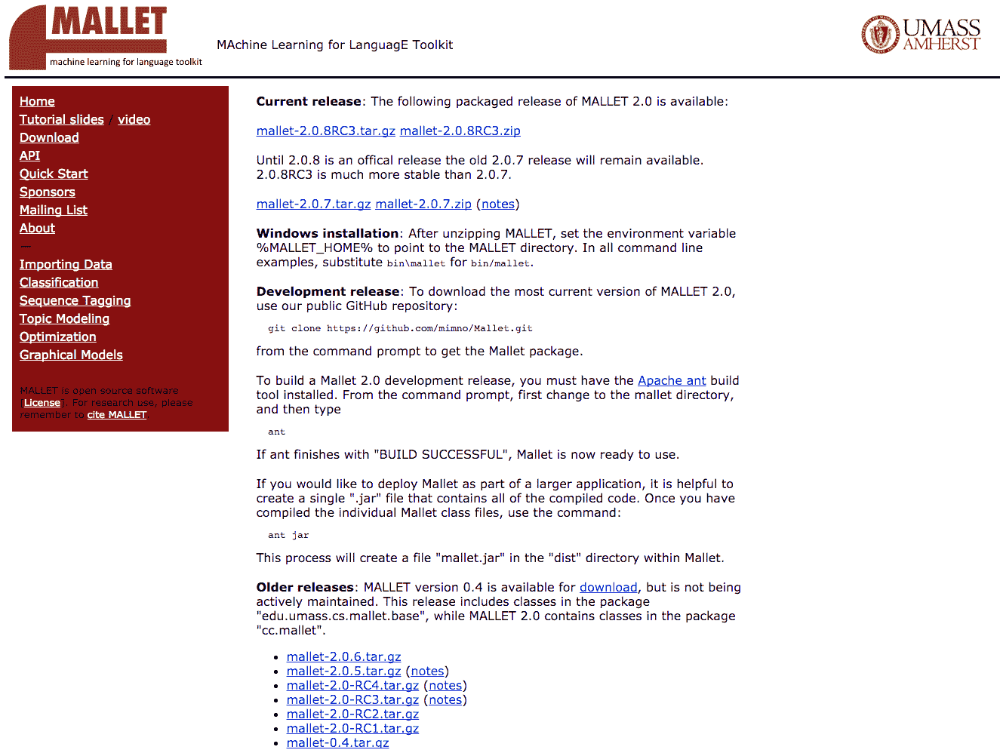
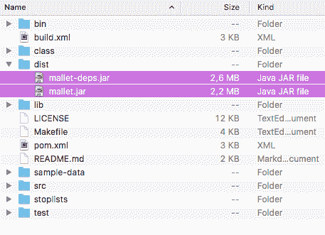
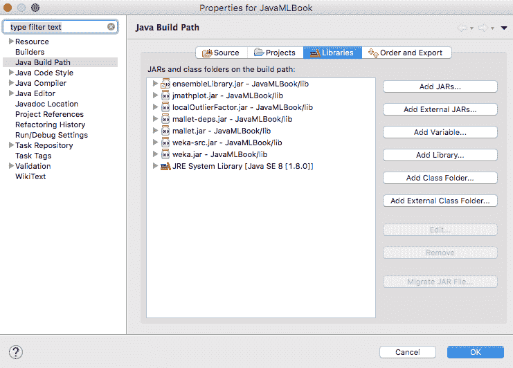
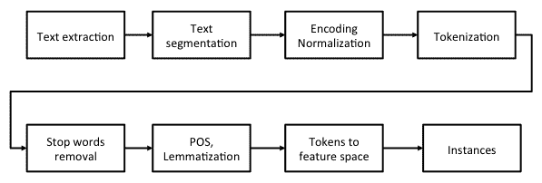
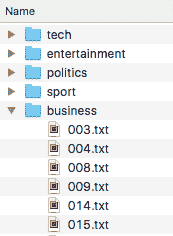
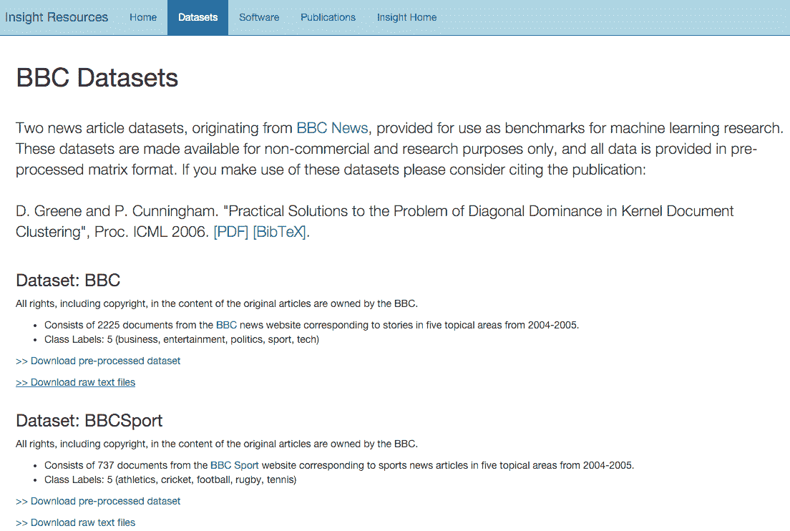
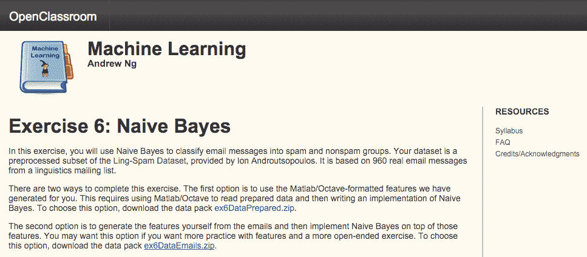
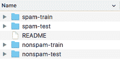
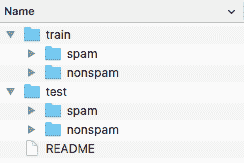

<link href="Styles/Style00.css" rel="stylesheet" type="text/css"> <link href="Styles/Style01.css" rel="stylesheet" type="text/css"> <link href="Styles/Style02.css" rel="stylesheet" type="text/css"> <link href="Styles/Style03.css" rel="stylesheet" type="text/css">     

# 基于 Mallet 主题建模的文本挖掘和垃圾邮件检测

在这一章中，我们将首先讨论什么是**文本挖掘**，它能够提供什么样的分析，以及为什么你可能想在你的应用程序中使用它。然后我们将讨论如何使用 **Mallet** ，一个用于自然语言处理的 Java 库，包括数据导入和文本预处理。之后，我们将研究两个文本挖掘应用程序:**主题建模**，在这里我们将讨论如何使用文本挖掘来识别在文本文档中发现的主题，而无需单独阅读它们；以及**垃圾邮件检测**，在这里我们将讨论如何自动将文本文档分类。

本章将涵盖以下主题:

*   文本挖掘简介
*   安装和使用木槌
*   主题建模
*   垃圾邮件检测

<link href="Styles/Style00.css" rel="stylesheet" type="text/css"> <link href="Styles/Style01.css" rel="stylesheet" type="text/css"> <link href="Styles/Style02.css" rel="stylesheet" type="text/css"> <link href="Styles/Style03.css" rel="stylesheet" type="text/css">     

# 文本挖掘简介

文本挖掘或文本分析是指从文本文档中自动提取高质量信息的过程，这些文档通常用自然语言编写，其中高质量信息被认为是相关的、新颖的和有趣的。

虽然典型的文本分析应用程序用于扫描一组文档以生成搜索索引，但文本挖掘可以用于许多其他应用程序，包括特定领域的文本分类；自动组织一组文档的文本聚类；情感分析以识别和提取文档中的主观信息；能够从文档中识别人、地点、组织和其他实体的概念或实体提取；文档摘要自动提供原始文档中最重要的点；和学习命名实体之间的关系。

基于统计模式挖掘的过程通常包括以下步骤:

1.  信息检索和提取
2.  将非结构化文本数据转换成结构化数据；例如，解析、去除干扰词、词法分析、计算词频以及导出语言特征
3.  从结构化数据和标记或注释中发现模式
4.  结果的评估和解释

在本章的后面，我们将研究两个应用领域:主题建模和**文本分类**。让我们看看他们带来了什么。

<link href="Styles/Style00.css" rel="stylesheet" type="text/css"> <link href="Styles/Style01.css" rel="stylesheet" type="text/css"> <link href="Styles/Style02.css" rel="stylesheet" type="text/css"> <link href="Styles/Style03.css" rel="stylesheet" type="text/css">     

# 主题建模

主题建模是一种无人监督的技术，如果您需要分析一个大型的文本文档存档，并且希望了解存档中包含的内容，而不需要亲自阅读每一个文档，那么主题建模可能会很有用。文本文档可以是博客帖子、电子邮件、推文、文档、书籍章节、日记条目等等。主题建模在文本语料库中寻找模式；更准确地说，它将主题识别为以统计上有意义的方式出现的单词列表。最著名的算法是**潜在狄利克雷分配** ( **LDA** )，它假设作者通过从可能的词篮中选择词来组成一段文本，其中每个词篮对应一个主题。使用这个假设，就有可能将文本数学地分解成单词最可能出现的篮子。然后，该算法迭代这个过程，直到它收敛到单词在篮子中最可能的分布，我们称之为*主题*。

例如，如果我们对一系列新闻文章使用主题建模，该算法将返回最有可能包含这些主题的主题和关键字的列表。以新闻文章为例，该列表可能如下所示:

*   赢家，进球，足球，得分，第一名
*   公司、股票、银行、信用、商业
*   选举，对手，总统，辩论，即将到来

通过查看关键字，我们可以识别出新闻文章关注的是体育、商业、即将到来的选举等等。在本章的后面，我们将学习如何使用新闻文章的例子来实现主题建模。

<link href="Styles/Style00.css" rel="stylesheet" type="text/css"> <link href="Styles/Style01.css" rel="stylesheet" type="text/css"> <link href="Styles/Style02.css" rel="stylesheet" type="text/css"> <link href="Styles/Style03.css" rel="stylesheet" type="text/css">     

# 文本分类

在文本分类或文本分类中，目标是根据文本文档的内容将其分配到一个或多个类别或范畴，这些类别或范畴往往是更一般的主题领域，例如车辆或宠物。这样的一般类称为主题，分类任务则称为**文本分类**、**文本分类**、**主题分类**或**主题定位**。虽然可以根据其他属性(如文档类型、作者和出版年份)对文档进行分类，但本章只关注文档内容。文本分类的示例包括以下组件:

*   电子邮件、用户评论、网页等中的垃圾邮件检测
*   色情内容的检测
*   情感检测，自动将产品或服务评论分为正面或负面
*   根据内容分类电子邮件
*   特定主题搜索，搜索引擎将搜索限制在特定的主题或类型，从而提供更准确的结果

这些例子显示了文本分类在信息检索系统中的重要性；因此，大多数现代信息检索系统使用某种文本分类器。在本书中，我们将使用的分类任务是用于检测垃圾邮件的文本分类。

本章我们将继续介绍 Mallet，这是一个基于 Java 的包，用于统计自然语言处理、文档分类、聚类、主题建模、信息提取和其他文本的机器学习应用。然后，我们将介绍两个文本分析应用程序，即主题建模和作为文本分类的垃圾邮件检测。

<link href="Styles/Style00.css" rel="stylesheet" type="text/css"> <link href="Styles/Style01.css" rel="stylesheet" type="text/css"> <link href="Styles/Style02.css" rel="stylesheet" type="text/css"> <link href="Styles/Style03.css" rel="stylesheet" type="text/css">     

# 安装木槌

Mallet 可以在 http://mallet.cs.umass.edu/download.php 大学的网站上下载。导航到下载部分，如下图所示，并选择最新的稳定版本( **2.0.8** ，在撰写本书时):



下载 ZIP 文件并提取内容。在解压后的目录中，您应该会找到一个名为`dist`的文件夹，其中有两个 JAR 文件:`mallet.jar`和`mallet-deps.jar`。第一个包含所有打包的 Mallet 类，而第二个包含所有的依赖项。我们将把这两个 JARs 文件作为引用库包含在您的项目中，如下面的屏幕截图所示:



如果您正在使用 Eclipse，右键单击 Project，选择 Properties，然后选择 Java Build Path。选择“库”选项卡，然后单击“添加外部 jar”。现在，选择两个 jar 文件并确认，如下面的屏幕截图所示:



现在我们准备开始使用木槌。

<link href="Styles/Style00.css" rel="stylesheet" type="text/css"> <link href="Styles/Style01.css" rel="stylesheet" type="text/css"> <link href="Styles/Style02.css" rel="stylesheet" type="text/css"> <link href="Styles/Style03.css" rel="stylesheet" type="text/css">     

# 使用文本数据

文本挖掘的主要挑战之一是将非结构化的书面自然语言转换成结构化的基于属性的实例。该过程包括许多步骤，如下所示:



首先，我们从互联网、现有文档或数据库中提取一些文本。在第一步结束时，文本仍然可以以 XML 格式或其他专有格式呈现。下一步是提取实际的文本并将其分割成文档的各个部分，例如标题、大标题、摘要和正文。第三步是规范化文本编码，以确保字符以相同的方式呈现；例如，以 ASCII、ISO 8859-1 和 Windows-1250 等格式编码的文档被转换为 Unicode 编码。接下来，标记化将文档拆分成特定的单词，而下一步将删除通常预测能力较低的常用单词，例如，the、a、I 和 we。

可以包括**词性** ( **词性**)标记和词条化步骤，通过移除词尾和修饰语，将每个单词转换为其基本形式，这被称为**词条**。比如跑步变成了跑，更好变成了好。一种简化的方法是词干化，它对单个单词进行操作，而不考虑该特定单词如何使用的任何上下文，因此不能根据词性来区分具有不同含义的单词，例如，axes 作为 axes 以及 axis 的复数。

最后一步将记号转换到特征空间。最常见的情况是，特征空间是一个**单词袋** ( **鞠躬**)表示。在这个演示中，创建了出现在数据集中的所有单词的集合。然后，每个文档以一个向量的形式呈现，该向量计算某个特定单词在文档中出现的次数。

考虑以下两个句子的例子:

*   雅各布喜欢乒乓球。艾玛也喜欢乒乓球
*   雅各布也喜欢篮球

这个例子中的 BoW 由{Jacob，likes，table，tennis，Emma，too，also，basketball}组成，它有八个不同的单词。现在可以使用列表的索引将这两个句子表示为向量，指示特定索引处的单词在文档中出现的次数，如下所示:

*   [1, 2, 2, 2, 1, 0, 0, 0]
*   [1, 1, 0, 0, 0, 0, 1, 1]

这样的向量最终成为进一步学习的实例。

另一个基于 BoW 模型的非常强大的演示是 **word2vec** 。Word2vec 于 2013 年由谷歌的托马斯·米科洛夫领导的研究团队推出。Word2vec 是一个学习单词的分布式表示的神经网络。这个演示的一个有趣的特性是单词以簇的形式出现，因此一些单词关系，例如类比，可以使用向量数学来重现。一个著名的例子说明了国王男人+女人回报王后。进一步的细节和实施可在以下链接获得:【https://code.google.com/archive/p/word2vec/】T2。

<link href="Styles/Style00.css" rel="stylesheet" type="text/css"> <link href="Styles/Style01.css" rel="stylesheet" type="text/css"> <link href="Styles/Style02.css" rel="stylesheet" type="text/css"> <link href="Styles/Style03.css" rel="stylesheet" type="text/css">     

# 导入数据

在这一章中，我们不会研究如何从网站上删除一组文档或者从数据库中提取它们。相反，我们将假设我们已经将它们收集为一组文档，并以`.txt`文件格式存储它们。现在让我们来看看加载它们的两个选项。第一个选项解决了每个文档存储在自己的`.txt`文件中的情况。第二个选项通过每行获取一个文档来解决所有文档都存储在一个文件中的情况。

<link href="Styles/Style00.css" rel="stylesheet" type="text/css"> <link href="Styles/Style01.css" rel="stylesheet" type="text/css"> <link href="Styles/Style02.css" rel="stylesheet" type="text/css"> <link href="Styles/Style03.css" rel="stylesheet" type="text/css">     

# 从目录导入

Mallet 支持用`cc.mallet.pipe.iterator.FileIterator`类从目录中读取。文件迭代器由以下三个参数构成:

*   包含文本文件的`File[]`目录列表
*   指定在目录中选择哪些文件的文件过滤器
*   应用于文件名以产生类别标签的模式

考虑结构化到文件夹中的数据，如下面的屏幕截图所示。我们将文档按文件夹(`tech`、`entertainment`、`politics`、`sport`和`business`)组织成五个主题。每个文件夹都包含特定主题的文档，如下面的屏幕截图所示:



在这种情况下，我们初始化`iterator`如下:

```
FileIterator iterator = 
  new FileIterator(new File[]{new File("path-to-my-dataset")}, 
  new TxtFilter(), 
  FileIterator.LAST_DIRECTORY); 
```

第一个参数指定了我们的根文件夹的路径，第二个参数将迭代器限制为仅针对`.txt`文件，而最后一个参数要求方法使用路径中的最后一个目录名作为类标签。

<link href="Styles/Style00.css" rel="stylesheet" type="text/css"> <link href="Styles/Style01.css" rel="stylesheet" type="text/css"> <link href="Styles/Style02.css" rel="stylesheet" type="text/css"> <link href="Styles/Style03.css" rel="stylesheet" type="text/css">     

# 从文件导入

加载文档的另一个选项是通过`cc.mallet.pipe.iterator.CsvIterator.CsvIterator(Reader, Pattern, int, int, int)`，它假设所有的文档都在一个文件中，并在正则表达式提取的每一行返回一个实例。该类由以下组件初始化:

*   `Reader`:这是指定如何从文件中读取的对象
*   `Pattern`:这是一个正则表达式，提取三组:数据、目标标签、文档名
*   `int, int, int`:这些是出现在正则表达式中的数据、目标和名称组的索引

考虑以下格式的文本文档，指定文档名称、类别和内容:

```
AP881218 local-news A 16-year-old student at a private 
   Baptist...  
AP880224 business The Bechtel Group Inc. offered in 1985 to...  
AP881017 local-news A gunman took a 74-year-old woman hostage...  
AP900117 entertainment Cupid has a new message for lovers 
   this...  
AP880405 politics The Reagan administration is weighing w...  
```

要将一行解析为三组，我们可以使用以下正则表达式:

```
^(\\S*)[\\s,]*(\\S*)[\\s,]*(.*)$
```

括号`()`中出现了三组，其中第三组包含数据，第二组包含目标类，第一组包含文档 ID。`iterator`初始化如下:

```
CsvIterator iterator = new CsvIterator ( 
fileReader, 
Pattern.compile("^(\\S*)[\\s,]*(\\S*)[\\s,]*(.*)$"), 
  3, 2, 1)); 
```

这里，正则表达式提取由空格分隔的三个组，它们的顺序是`3, 2, 1`。

现在让我们转到数据预处理管道。

<link href="Styles/Style00.css" rel="stylesheet" type="text/css"> <link href="Styles/Style01.css" rel="stylesheet" type="text/css"> <link href="Styles/Style02.css" rel="stylesheet" type="text/css"> <link href="Styles/Style03.css" rel="stylesheet" type="text/css">     

# 预处理文本数据

一旦我们初始化了一个遍历数据的迭代器，我们就需要通过一系列的转换来传递数据，如本节开头所述。Mallet 通过管道和管道中可能包含的各种各样的步骤来支持这个过程，这些都被收集在`cc.mallet.pipe`包中。一些例子如下:

*   `Input2CharSequence`:这是一个可以从各种文本源(URL、文件或阅读器)读入`CharSequence`的管道
*   `CharSequenceRemoveHTML`:这个管道从`CharSequence`中移除 HTML
*   `MakeAmpersandXMLFriendly`:将令牌序列的令牌中的`&`转换为`&amp`
*   `TokenSequenceLowercase`:将数据字段中令牌序列中每个令牌的文本转换成小写
*   `TokenSequence2FeatureSequence`:将每个实例的数据字段中的令牌序列转换为特征序列
*   `TokenSequenceNGrams`:将数据字段中的令牌序列转换为 ngrams 的令牌序列，即两个或多个单词的组合

处理步骤的完整列表可在以下 Mallet 文档中找到:[http://mallet.cs.umass.edu/api/index.html?cc/mallet/pipe/iterator/package-tree . html](http://mallet.cs.umass.edu/api/index.html?cc/mallet/pipe/iterator/package-tree.html)。

现在我们准备构建一个导入数据的类。我们将通过以下步骤实现这一点:

1.  让我们构建一个管道，其中每个处理步骤在 Mallet 中都表示为一个管道。管道可以用一系列`ArrayList<Pipe>`对象以串行方式连接在一起:

```
ArrayList<Pipe> pipeList = new ArrayList<Pipe>(); 
```

2.  让我们从从 file 对象读取数据并将所有字符转换成小写开始:

```
pipeList.add(new Input2CharSequence("UTF-8")); 
pipeList.add( new CharSequenceLowercase() );
```

3.  我们将使用正则表达式来标记原始字符串。以下模式包括 unicode 字母和数字以及下划线字符:

```
Pattern tokenPattern = 
Pattern.compile("[\\p{L}\\p{N}_]+"); 

pipeList.add(new CharSequence2TokenSequence(tokenPattern)); 
```

4.  我们现在将使用标准的英语停用词表删除停用词，即没有预测能力的常用词。两个额外的参数指示停用字词的删除是否应该区分大小写并标记删除，而不仅仅是删除字词。我们将它们都设置为`false`:

```
pipeList.add(new TokenSequenceRemoveStopwords(new File(stopListFilePath), "utf-8", false, false, false));
```

5.  我们可以不存储实际的单词，而是将它们转换成整数，在 BoW 中表示一个单词索引:

```
pipeList.add(new TokenSequence2FeatureSequence()); 
```

6.  我们将为类标签做同样的事情；我们将使用一个整数来代替标签字符串，表示标签在单词包中的位置:

```
pipeList.add(new Target2Label()); 
```

7.  我们还可以通过调用`PrintInputAndTarget`管道来打印特征和标签:

```
pipeList.add(new PrintInputAndTarget()); 
```

8.  我们将管道列表存储在一个`SerialPipes`类中，该类将通过一系列管道转换实例:

```
SerialPipes pipeline = new SerialPipes(pipeList); 
```

现在让我们看看如何在文本挖掘应用程序中应用它！

<link href="Styles/Style00.css" rel="stylesheet" type="text/css"> <link href="Styles/Style01.css" rel="stylesheet" type="text/css"> <link href="Styles/Style02.css" rel="stylesheet" type="text/css"> <link href="Styles/Style03.css" rel="stylesheet" type="text/css">     

# BBC 新闻的主题建模

如前所述，主题建模的目标是识别文本语料库中对应于文档主题的模式。在这个例子中，我们将使用来自 BBC 新闻的数据集。该数据集是机器学习研究中的标准基准之一，可用于非商业和研究目的。

我们的目标是构建一个分类器，能够将一个主题分配给一个未分类的文档。

<link href="Styles/Style00.css" rel="stylesheet" type="text/css"> <link href="Styles/Style01.css" rel="stylesheet" type="text/css"> <link href="Styles/Style02.css" rel="stylesheet" type="text/css"> <link href="Styles/Style03.css" rel="stylesheet" type="text/css">     

# BBC 数据集

2006 年，格林和坎宁安收集了英国广播公司的数据集来研究一个特定的文档— *使用支持向量机的聚类挑战*。该数据集由 2004 年至 2005 年 BBC 新闻网站的 2225 份文件组成，对应于从五个主题领域收集的故事:商业、娱乐、政治、体育和技术。数据集可以在以下网站看到:【http://mlg.ucd.ie/datasets/bbc.html 。

我们可以在 Dataset: BBC 部分下载原始文本文件。您还会注意到，该网站包含一个已经处理过的数据集，但是，对于本例，我们希望自己处理数据集。ZIP 包含五个文件夹，每个主题一个。实际的文档放在相应的主题文件夹中，如下面的屏幕截图所示:



现在，让我们构建一个主题分类器。

<link href="Styles/Style00.css" rel="stylesheet" type="text/css"> <link href="Styles/Style01.css" rel="stylesheet" type="text/css"> <link href="Styles/Style02.css" rel="stylesheet" type="text/css"> <link href="Styles/Style03.css" rel="stylesheet" type="text/css">     

# 建模

我们将使用以下步骤开始建模阶段:

1.  我们将从导入数据集开始，并使用以下代码行处理文本:

```
import cc.mallet.types.*; 
import cc.mallet.pipe.*; 
import cc.mallet.pipe.iterator.*; 
import cc.mallet.topics.*; 

import java.util.*; 
import java.util.regex.*; 
import java.io.*; 

public class TopicModeling { 

  public static void main(String[] args) throws Exception { 

String dataFolderPath = "data/bbc"; 
String stopListFilePath = "data/stoplists/en.txt"; 
```

2.  然后我们将创建一个默认的`pipeline`对象，如前所述:

```
ArrayList<Pipe> pipeList = new ArrayList<Pipe>(); 
pipeList.add(new Input2CharSequence("UTF-8")); 
Pattern tokenPattern = Pattern.compile("[\\p{L}\\p{N}_]+"); 
pipeList.add(new CharSequence2TokenSequence(tokenPattern)); 
pipeList.add(new TokenSequenceLowercase()); 
pipeList.add(new TokenSequenceRemoveStopwords(new File(stopListFilePath), "utf-8", false, false, false)); 
pipeList.add(new TokenSequence2FeatureSequence()); 
pipeList.add(new Target2Label()); 
SerialPipes pipeline = new SerialPipes(pipeList); 
```

3.  接下来，我们将初始化`folderIterator`对象:

```
FileIterator folderIterator = new FileIterator( 
    new File[] {new File(dataFolderPath)}, 
    new TxtFilter(), 
    FileIterator.LAST_DIRECTORY);
```

4.  我们现在将使用我们想要用来处理文本的`pipeline`构建一个新的实例列表:

```
InstanceList instances = new InstanceList(pipeline);
```

5.  我们处理由`iterator`提供的每个实例:

```
instances.addThruPipe(folderIterator); 
```

6.  现在让我们使用实现简单线程 LDA 模型的`cc.mallet.topics.ParallelTopicModel.ParallelTopicModel`类创建一个包含五个主题的模型。LDA 是一种常见的主题建模方法，它使用狄利克雷分布来估计所选主题生成特定文档的概率。在这一章中，我们不会深究细节；读者可参考 D. Blei 等人(2003 年)的原始论文。

注:机器学习中还有另一种同样初始化的分类算法是指**线性判别分析** ( **LDA** )。除了常见的缩写，它与 LDA 模型没有任何共同之处。

该类是用参数 alpha 和 beta 实例化的，可以大致解释如下:

*   高 alpha 值意味着每个文档可能包含大部分主题的混合，而不是特定的单个主题。较低的 alpha 值对文档施加的约束较少，这意味着文档更有可能包含几个甚至一个主题的混合。
*   高 beta 值意味着每个主题可能包含大多数单词的混合，而不是任何特定的单词；而低值意味着一个主题可能只包含几个单词的组合。

在我们的例子中，我们最初将两个参数都保持为低(alpha_t = `0.01`，beta_w = `0.01`)，因为我们假设数据集中的主题没有混合太多，并且每个主题都有许多单词:

```
int numTopics = 5; 
ParallelTopicModel model =  
new ParallelTopicModel(numTopics, 0.01, 0.01); 
```

7.  我们将把`instances`添加到模型中，由于我们使用并行实现，我们将指定并行运行的线程数量，如下所示:

```
model.addInstances(instances); 
model.setNumThreads(4);
```

8.  我们现在将运行模型一个选定的迭代次数。每次迭代用于更好地估计内部 LDA 参数。对于测试，我们可以使用较小的迭代次数，例如 50 次；而在实际应用中，使用`1000`或`2000`迭代。最后，我们将调用实际构建 LDA 模型的`void estimate() `方法:

```
model.setNumIterations(1000); 
model.estimate(); 
```

该模型输出以下结果:

```
    0 0,06654  game england year time win world 6 
    1 0,0863  year 1 company market growth economy firm 
    2 0,05981  people technology mobile mr games users music 
    3 0,05744  film year music show awards award won 
    4 0,11395  mr government people labour election party blair 

    [beta: 0,11328] 
    <1000> LL/token: -8,63377

    Total time: 45 seconds

```

`LL/token`表示模型的对数似然性，除以标记总数，表示数据给定模型的可能性。值增加意味着模型在改进。

输出还显示了描述每个主题的热门词汇。这些词非常符合最初的主题:

*   **Topic 0** : `game` , `england` , `year` , `time` , `win` , `world` , `6`  ⇒ sport
*   **话题一** : `year`、`1`、`company`、`market`、`growth`、`economy`、`firm`财务
*   **话题二** : `people`，`technology`，`mobile`，`mr`，`games`，`users`，`music`tech
*   **话题三** : `film`、`year`、`music`、`show`、`awards`、`award`、`won`娱乐
*   **话题四** : `mr`、`government`、`people`、`labor`、`election`、`party`、`blair`政治

还有一些词没有多大意义，比如`mr`、`1`、`6`。我们可以把它们包含在停用词列表中。还有，有些词会出现两次，例如，`award`和`awards`。这是因为我们没有应用任何词干分析器或词尾化管道。

在下一节中，我们将看看这个模型是否有任何优点。

<link href="Styles/Style00.css" rel="stylesheet" type="text/css"> <link href="Styles/Style01.css" rel="stylesheet" type="text/css"> <link href="Styles/Style02.css" rel="stylesheet" type="text/css"> <link href="Styles/Style03.css" rel="stylesheet" type="text/css">     

# 评估模型

由于统计主题建模具有无监督的性质，这使得模型选择困难。对于某些应用程序，可能会有一些外部任务，如信息检索或文档分类，可以对这些任务的性能进行评估。然而，一般来说，我们希望评估模型概括主题的能力，而不考虑任务。

在 2009 年，Wallach 等人介绍了一种方法，通过计算模型下被拒绝的文档的对数概率来测量模型的质量。看不见文档的可能性可用于比较模型——更高的可能性意味着更好的模型。

我们将使用以下步骤评估模型:

1.  让我们将文档划分为训练集和测试集(即延期文档)，其中 90%用于训练，10%用于测试:

```
// Split dataset 
InstanceList[] instanceSplit= instances.split(new Randoms(), new 
   double[] {0.9, 0.1, 0.0}); 
```

2.  现在让我们仅使用我们的文档来重建我们的模型:

```
// Use the first 90% for training 
model.addInstances(instanceSplit[0]); 
model.setNumThreads(4); 
model.setNumIterations(50); 
model.estimate(); 
```

3.  我们将初始化一个`estimator`对象，该对象实现 Wallach 的持有文档的对数概率，`MarginalProbEstimator`:

```
// Get estimator 
MarginalProbEstimator estimator = model.getProbEstimator(); 
```

Annalyn Ng 在她的博客中总结了对 LDA 的直观描述:[https://annalyzin . WordPress . com/2015/06/21/laymans-explain-of-topic-modeling-with-LDA-2/](https://annalyzin.wordpress.com/2015/06/21/laymans-explanation-of-topic-modeling-with-lda-2/)。要更深入地了解 LDA 算法、其组件及其工作原理，请查看 David Blei 等人(2003 年)在 http://jmlr.csail.mit.edu/papers/v3/blei03a.html发表的论文 LDA 原文，或者查看布朗大学的 D. Santhanam 在[http://www . cs . Brown . edu/courses/csci 2950-p/spring 2010/lectures/2010-03-03 _ Santhanam . pdf](http://www.cs.brown.edu/courses/csci2950-p/spring2010/lectures/2010-03-03_santhanam.pdf)发表的摘要。

该类实现了许多估计器，这些估计器需要对 LDA 方法如何工作有相当深入的理论知识。我们将选择从左到右的评估器，它适用于广泛的应用程序，包括文本挖掘和语音识别。从左到右赋值器被实现为`double evaluateLeftToRight`方法，接受以下组件:

*   `Instances heldOutDocuments`:测试实例。
*   `int numParticles`:该算法参数表示从左到右的令牌数，默认值为 10。
*   `boolean useResampling`:表示是否在从左到右的评估中对主题进行重采样；重采样更精确，但会导致文档长度的二次缩放。
*   `PrintStream docProbabilityStream`:这是一个文件或`stdout`，我们在其中写入每个文档的推断对数概率。

4.  让我们运行`estimator`，如下所示:

```
double loglike = estimator.evaluateLeftToRight( 
  instanceSplit[1], 10, false, null);); 
System.out.println("Total log likelihood: "+loglike); 
```

在我们的特殊情况下，`estimator`输出下面的`log likelihood`，这在与使用不同参数、管道或数据构建的其他模型相比时是有意义的——对数似然性越高，模型越好:

```
    Total time: 3 seconds
    Topic Evaluator: 5 topics, 3 topic bits, 111 topic mask
    Total log likelihood: -360849.4240795393
```

现在让我们来看看如何利用这个模型。

<link href="Styles/Style00.css" rel="stylesheet" type="text/css"> <link href="Styles/Style01.css" rel="stylesheet" type="text/css"> <link href="Styles/Style02.css" rel="stylesheet" type="text/css"> <link href="Styles/Style03.css" rel="stylesheet" type="text/css">     

# 重用模型

由于我们通常不会动态地构建模型，因此训练一次模型并重复使用它来分类新数据通常是有意义的。

请注意，如果您想要对新文档进行分类，它们需要像其他文档一样通过相同的管道——训练和分类的管道需要相同。在训练期间，管道的数据字母表随着每个训练实例而更新。如果使用相同的步骤创建新管道，则不会产生相同的管道，因为其数据字母表为空。因此，要在新数据上使用模型，我们必须保存或加载管道和模型，并使用该管道添加新实例。

<link href="Styles/Style00.css" rel="stylesheet" type="text/css"> <link href="Styles/Style01.css" rel="stylesheet" type="text/css"> <link href="Styles/Style02.css" rel="stylesheet" type="text/css"> <link href="Styles/Style03.css" rel="stylesheet" type="text/css">     

# 保存模型

Mallet 支持基于序列化保存和恢复对象的标准方法。

我们简单地创建一个`ObjectOutputStream`类的新实例，并将对象写入一个文件，如下所示:

```
String modelPath = "myTopicModel"; 

//Save model 
ObjectOutputStream oos = new ObjectOutputStream( 
new FileOutputStream (new File(modelPath+".model"))); 
oos.writeObject(model); 
oos.close();    

//Save pipeline 
oos = new ObjectOutputStream( 
new FileOutputStream (new File(modelPath+".pipeline"))); 
oos.writeObject(pipeline); 
oos.close(); 
```

<link href="Styles/Style00.css" rel="stylesheet" type="text/css"> <link href="Styles/Style01.css" rel="stylesheet" type="text/css"> <link href="Styles/Style02.css" rel="stylesheet" type="text/css"> <link href="Styles/Style03.css" rel="stylesheet" type="text/css">     

# 恢复模型

恢复通过序列化保存的模型只是一个使用`ObjectInputStream`类的逆向操作:

```
String modelPath = "myTopicModel"; 

//Load model 
ObjectInputStream ois = new ObjectInputStream( 
  new FileInputStream (new File(modelPath+".model"))); 
ParallelTopicModel model = (ParallelTopicModel) ois.readObject(); 
ois.close();    

// Load pipeline 
ois = new ObjectInputStream( 
  new FileInputStream (new File(modelPath+".pipeline"))); 
SerialPipes pipeline = (SerialPipes) ois.readObject(); 
ois.close();    
```

我们讨论了如何构建一个 LDA 模型来将文档自动分类到主题中。在下一个例子中，我们将研究另一个文本挖掘问题——文本分类。

<link href="Styles/Style00.css" rel="stylesheet" type="text/css"> <link href="Styles/Style01.css" rel="stylesheet" type="text/css"> <link href="Styles/Style02.css" rel="stylesheet" type="text/css"> <link href="Styles/Style03.css" rel="stylesheet" type="text/css">     

# 检测垃圾邮件

垃圾邮件或电子垃圾邮件是指未经请求的消息，通常带有广告内容、受感染的附件、指向网络钓鱼或恶意软件站点的链接等。虽然最广泛认可的垃圾邮件形式是电子邮件垃圾邮件，但垃圾邮件滥用也出现在其他媒体中:网站评论、即时消息、互联网论坛、博客、在线广告等等。

在本章中，我们将讨论如何建立朴素贝叶斯垃圾邮件过滤，使用 BoW 表示来识别垃圾邮件。朴素贝叶斯垃圾邮件过滤是在第一个商业垃圾邮件过滤器中实现的基本技术之一；例如，Mozilla Thunderbird 邮件客户端使用这种过滤的本地实现。虽然本章中的示例将使用电子邮件垃圾邮件，但基本方法也可以应用于其他类型的基于文本的垃圾邮件。

<link href="Styles/Style00.css" rel="stylesheet" type="text/css"> <link href="Styles/Style01.css" rel="stylesheet" type="text/css"> <link href="Styles/Style02.css" rel="stylesheet" type="text/css"> <link href="Styles/Style03.css" rel="stylesheet" type="text/css">     

# 垃圾邮件数据集

2000 年，Androutsopoulos 等人收集了第一批垃圾邮件数据集之一，用于测试垃圾邮件过滤算法。他们研究了如何使用朴素贝叶斯分类器来检测垃圾邮件，如果额外的管道(如非索引列表、词干分析器和词汇化)有助于提高性能。该数据集由吴恩达在 OpenClassroom 的机器学习课上进行了重组，可在[http://open classroom . Stanford . edu/main folder/document page . PHP 下载？课程=机器学习&doc =练习/ex6/ex6.html](http://openclassroom.stanford.edu/MainFolder/DocumentPage.php?course=MachineLearning&doc=exercises/ex6/ex6.html) 。

选择并下载第二个选项`ex6DataEmails.zip`，如下图所示:



ZIP 包含以下文件夹:

*   `nonspam-train`和`spam-train`文件夹包含您将用于培训的预处理电子邮件。他们每人有 350 封电子邮件。
*   `nonspam-test`和`spam-test`文件夹构成测试集，包含 130 封垃圾邮件和 130 封非垃圾邮件。这些是你将要做预测的文件。请注意，即使单独的文件夹告诉您正确的标签，您也应该在没有这些知识的情况下对所有的测试文档进行预测。做出预测后，您可以使用正确的标注来检查您的分类是否正确。

为了利用 Mallet 的文件夹迭代器，让我们按如下方式重新组织文件夹结构。我们将创建两个文件夹，`train`和`test`，并将`spam/nospam`文件夹放在相应的文件夹下。初始文件夹结构如下图所示:



最终的文件夹结构如下图所示:



下一步是将电子邮件转换成特征向量。

<link href="Styles/Style00.css" rel="stylesheet" type="text/css"> <link href="Styles/Style01.css" rel="stylesheet" type="text/css"> <link href="Styles/Style02.css" rel="stylesheet" type="text/css"> <link href="Styles/Style03.css" rel="stylesheet" type="text/css">     

# 特征生成

我们将使用以下步骤执行特征生成:

1.  我们将创建一个默认管道，如前所述:

```
ArrayList<Pipe> pipeList = new ArrayList<Pipe>(); 
pipeList.add(new Input2CharSequence("UTF-8")); 
Pattern tokenPattern = Pattern.compile("[\\p{L}\\p{N}_]+"); 
pipeList.add(new CharSequence2TokenSequence(tokenPattern)); 
pipeList.add(new TokenSequenceLowercase()); 
pipeList.add(new TokenSequenceRemoveStopwords(new 
   File(stopListFilePath), "utf-8", false, false, false)); 
pipeList.add(new TokenSequence2FeatureSequence()); 
pipeList.add(new FeatureSequence2FeatureVector()); 
pipeList.add(new Target2Label()); 
SerialPipes pipeline = new SerialPipes(pipeList); 
```

注意，我们添加了一个额外的`FeatureSequence2FeatureVector`管道，将一个特征序列转换成一个特征向量。当我们在特征向量中有数据时，我们可以使用任何分类算法，就像我们在前面的章节中看到的那样。我们将继续 Mallet 中的例子来演示如何构建分类模型。

2.  我们初始化一个文件夹迭代器，将我们的示例加载到由`spam`和`nonspam`子文件夹中的电子邮件示例组成的`train`文件夹中，这些示例将被用作示例标签:

```
FileIterator folderIterator = new FileIterator( 
    new File[] {new File(dataFolderPath)}, 
    new TxtFilter(), 
    FileIterator.LAST_DIRECTORY); 
```

3.  我们将用我们想要用来处理文本的`pipeline`对象构建一个新的实例列表:

```
InstanceList instances = new InstanceList(pipeline); 
```

4.  我们将处理迭代器提供的每个实例:

```
instances.addThruPipe(folderIterator); 
```

我们现在已经加载了数据，并将其转换为特征向量。让我们在训练集上训练我们的模型，并在`test`集上预测`spam/nonspam`分类。

<link href="Styles/Style00.css" rel="stylesheet" type="text/css"> <link href="Styles/Style01.css" rel="stylesheet" type="text/css"> <link href="Styles/Style02.css" rel="stylesheet" type="text/css"> <link href="Styles/Style03.css" rel="stylesheet" type="text/css">     

# 培训和测试

Mallet 在`cc.mallet.classify`包中实现了一组分类器，包括决策树、朴素贝叶斯、AdaBoost、bagging、boosting 等等。我们将从一个基本的分类器开始，即朴素贝叶斯分类器。分类器由`ClassifierTrainer`类初始化，当我们调用它的`train(Instances)`方法时，它返回一个分类器:

```
ClassifierTrainer classifierTrainer = new NaiveBayesTrainer(); 
Classifier classifier = classifierTrainer.train(instances); 
```

现在让我们看看这个分类器是如何工作的，并在一个单独的数据集上评估它的性能。

<link href="Styles/Style00.css" rel="stylesheet" type="text/css"> <link href="Styles/Style01.css" rel="stylesheet" type="text/css"> <link href="Styles/Style02.css" rel="stylesheet" type="text/css"> <link href="Styles/Style03.css" rel="stylesheet" type="text/css">     

# 模型性能

要在单独的数据集上评估分类器，我们将使用以下步骤:

1.  让我们从导入位于`test`文件夹中的电子邮件开始:

```
InstanceList testInstances = new 
   InstanceList(classifier.getInstancePipe()); 
folderIterator = new FileIterator( 
    new File[] {new File(testFolderPath)}, 
    new TxtFilter(), 
    FileIterator.LAST_DIRECTORY); 
```

2.  我们将通过我们在培训期间初始化的同一管道传递数据:

```
testInstances.addThruPipe(folderIterator); 
```

3.  为了评估分类器的性能，我们将使用`cc.mallet.classify.Trial`类，它由一个分类器和一组测试实例初始化:

```
Trial trial = new Trial(classifier, testInstances); 
```

4.  初始化时立即执行评估。然后，我们可以简单地删除我们关心的措施。在我们的示例中，我们希望检查垃圾邮件分类的精确度和召回率，或 F-measure，它返回两个值的调和平均值，如下所示:

```
System.out.println( 
  "F1 for class 'spam': " + trial.getF1("spam")); 
System.out.println( 
  "Precision:" + trial.getPrecision(1)); 
System.out.println( 
  "Recall:" + trial.getRecall(1)); 
```

评估对象输出以下结果:

```
    F1 for class 'spam': 0.9731800766283524
    Precision: 0.9694656488549618
    Recall: 0.9769230769230769

```

结果表明，该模型正确发现了 97.69%的垃圾邮件(召回)，当它将一封邮件标记为垃圾邮件时，它在 96.94%的情况下是正确的。换句话说，它每 100 封垃圾邮件中会漏掉大约 2 封，每 100 封有效邮件中会有 3 封被标记为垃圾邮件。所以，它并不真的完美，但它不仅仅是一个好的开始！

<link href="Styles/Style00.css" rel="stylesheet" type="text/css"> <link href="Styles/Style01.css" rel="stylesheet" type="text/css"> <link href="Styles/Style02.css" rel="stylesheet" type="text/css"> <link href="Styles/Style03.css" rel="stylesheet" type="text/css">     

# 摘要

在这一章中，我们讨论了文本挖掘与传统的基于属性的学习有何不同，它需要大量的预处理步骤来将书面自然语言转换为特征向量。此外，我们讨论了如何通过将 Mallet 应用于两个实际问题来利用它，Mallet 是 NLP 的一个基于 Java 的库。首先，我们使用 LDA 模型对新闻语料库中的主题进行建模，以建立能够将主题分配给新文档的模型。我们还讨论了如何使用 BoW 表示构建朴素贝叶斯垃圾邮件过滤分类器。

本章总结了如何应用各种库来解决机器学习任务的技术演示。由于我们无法涵盖更多有趣的应用，也无法在许多方面给出更多细节，下一章将给出一些关于如何继续学习和深入特定主题的进一步指导。