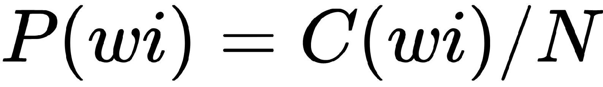
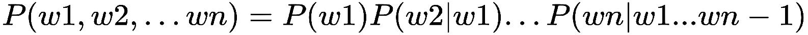
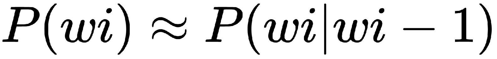
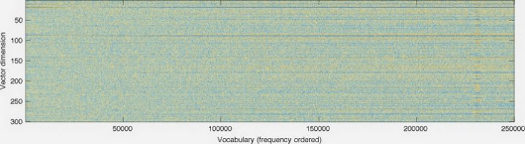
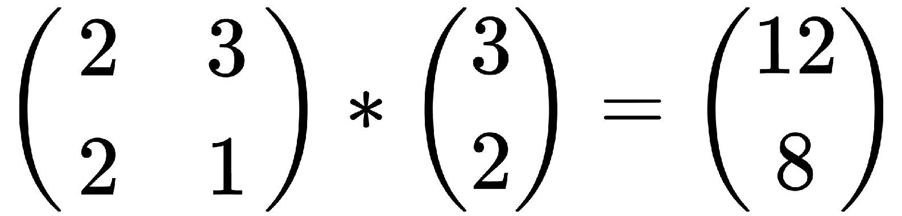
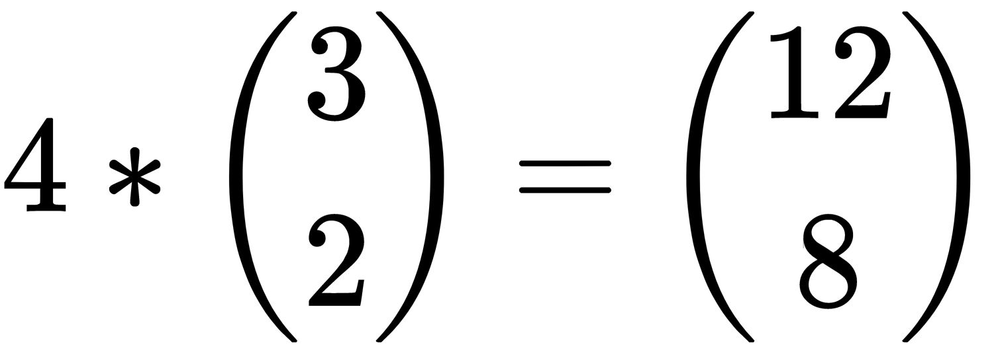
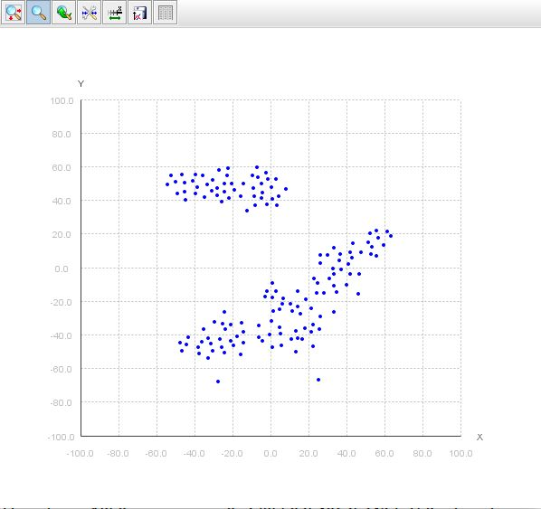

# 六、用特征表示文本

考虑到文本的上下文，文本包含需要提取的特征，但是对机器来说，处理一整节文本以包含上下文是非常困难的。

在这一章中，我们将看到如何使用 N-gram 来呈现文本，以及它们在关联上下文中扮演什么角色。我们将看到单词嵌入，其中单词的表示被转换或映射为数字(实数)，以便机器能够以更好的方式理解和处理它们。由于文本的数量，这可能导致高维数的问题。因此，接下来，我们将看到如何以保持上下文的方式降低向量的维数。

在本章中，我们将讨论以下主题:

*   N-grams
*   单词嵌入
*   手套
*   word2vec
*   降维
*   主成分分析
*   分布式随机邻居嵌入


# N-grams

N-grams 是一种概率模型，用于预测下一个单词、文本或字母。它以统计结构捕捉语言，因为机器更擅长处理数字而不是文本。许多公司在拼写纠正和建议、断词或总结文本时使用这种方法。让我们试着去理解它。n-gram 只是一系列单词或字母，主要是单词。考虑句子`"This is n-gram model"`,它有四个单词或记号，所以它是一个 4-gram；来自同一文本的 n-gram 将是“这是 n-gram”和“是 n-gram 模型”。两个单词是一个双字母，一个单词是一个单字母。让我们使用 Java 和 OpenNLP 来尝试一下:

```
        String sampletext = "This is n-gram model";
        System.out.println(sampletext);

        StringList tokens = new             StringList(WhitespaceTokenizer.INSTANCE.tokenize(sampletext));
        System.out.println("Tokens " + tokens);

        NGramModel nGramModel = new NGramModel();
        nGramModel.add(tokens,3,4); 

        System.out.println("Total ngrams: " + nGramModel.numberOfGrams());
        for (StringList ngram : nGramModel) {
            System.out.println(nGramModel.getCount(ngram) + " - " + ngram);
        }
```

我们从一个字符串开始，使用记号赋予器，我们得到所有的记号。利用`nGramModel`，我们计算出 N-grams 中的*N*；在前面的例子中，它是 3-gram，输出如下:

```
This is n-gram model
Tokens [This,is,n-gram,model]
Total ngrams: 3
1 - [is,n-gram,model]
1 - [This,is,n-gram]
1 - [This,is,n-gram,model]
```

如果我们将`n-gram`行改为 2，输出如下:

```
This is n-gram model
Tokens [This,is,n-gram,model]
Total ngrams: 6
1 - [is,n-gram,model]
1 - [n-gram,model]
1 - [This,is,n-gram]
1 - [This,is,n-gram,model]
1 - [is,n-gram]
1 - [This,is]
```

使用`n-gram`，我们可以找到一个单词序列的概率:哪个单词出现在给定单词 *x* 之前或之后的概率。从前面的二元模型中，我们可以得出结论，`model`出现在单词`n-gram`之后的概率比其他任何单词都高。

下一步是准备一个频率表，找出接下来会出现的单词；例如，对于二元模型，该表如下所示:

| **字 1** | **字 2** | **计数/频率** |
| 是 | 这 | Fifty-five thousand |
| 是 | 这 | Twenty-five thousand |
| 是 | 这 | Forty-five thousand |

从这个表中，我们可以说在给定的上下文中，单词*最有可能出现在单词*和*之前。这看起来很简单，但是想想有 20，000 或更多单词的文本。在这种情况下，频率表可能需要数十亿个条目。*

另一种方式是用概率进行估算，用带单词 *w1，w2 的句子 *W* ，....wn* ，我们要从 *W* 求 *wi* 的概率将是:



这里， *N =总字数*和 *c()* 表示字数。使用概率链规则，它将是这样的:



让我们试着理解我们的句子，“这是 n 元模型”:

*P("这是 n-gram 模型")= P("这")P("是" | "这")P("n-gram"| "这是")P("模型" | "这是 n-gram")*

这看起来简单，但对于长句子和计算估计，这并不简单。但是，使用马尔可夫假设，该等式可以被简化，因为马尔可夫假设说一个单词出现的概率取决于前一个单词:

*P("这是 n-gram 模型")= P("这")P("是" | "这")P("n-gram"| "是")P("模型" | "n-gram")*

所以，现在，我们可以这样说:



# 单词嵌入

需要教会计算机处理上下文。比如说，“我喜欢吃苹果。”电脑需要明白，在这里，苹果是一种水果，而不是一家公司。我们希望单词具有相同含义的文本具有相同的表示，或者至少是相似的表示，以便机器可以理解单词具有相同的含义。单词嵌入的主要目的是捕获尽可能多的关于单词的上下文、层次和形态信息。

单词嵌入可以以两种方式分类:

*   基于频率的嵌入
*   基于预测的嵌入

顾名思义，基于频率的嵌入使用计数机制，而基于预测的嵌入使用概率机制。

基于频率的嵌入可以以不同的方式完成，使用计数向量、TD-IDF 向量或同现向量/矩阵。计数向量试图从所有文档中学习。它将学习一个词汇项，并计算它在目标文档中出现的次数。让我们考虑一个非常简单的例子，有两个文档， *d1* 和 *d2* :

*   *d1* =计数向量，给定总字数
*   *d2* = Count 函数，返回集合中值的总数

下一步是寻找记号，它们是 *["计数"、"向量"、"给予"、"总计"、" of "、"字"、"返回"、"数字"、"值"、" in "、" set"]* 。

给定两个文档和十一个令牌，计数向量或矩阵将如下所示:

|  | **计数** | **矢量** | **给** | **总计** | **共** | **字** | **返回** | **号** | **值** | 中的 | **设置** |
| **d1** | Two | one | one | one | one | one | Zero | Zero | Zero | Zero | Zero |
| **d2** | one | Zero | Zero | one | one | Zero | one | one | one | one | one |

但是，当有很多文档、文本量很大并且有大量文本时，矩阵将很难构造并且包含许多行和列。有时，常用词被删除，如 a、an、the 和 this。

第二种方法是 TF-IDF 载体。 *TF* 代表*词频*，IDF 代表*逆文档频率*。这种方法背后的想法是删除所有文档中常见的、出现频率很高的不必要的单词，但不添加任何意义。这包括诸如 a、an、the、This、that 和 are 等单词。“The”是英语中最常见的单词，因此它会在任何文档中频繁出现。

让我们将 *TF* 定义为术语在文档中出现的次数/术语在文档中的数量， *IDF = log(N/n)* ，其中 *N* 是文档的数量， *n* 是术语在文档中出现的数量。考虑前面的例子，术语或字数在 *d1* 中出现两次，在 *d2* 中出现一次，因此其 TF 计算如下:

*   *TF(计数/ d1) = 2/7*
*   *TF(计数/d2) = 1/8*
*   *TF(总数/d1) = 1/2*
*   *TF(总数/d2) = 1/2*

让我们为单词或 *term total 计算 IDF。**总计*在两个文档中出现一次，因此 IDF 将为:

*IDF(总计)= log(2/2) = 0*

所以，如果这个词出现在每个文档中，那么这个词就有可能不太相关，可以忽略。如果该术语出现在一些文档中，而不是所有文档中，则它可能与字数有一些关联:

*IDF(计数)= log(3/2) = 0.17609*

为了计算 TF-IDF，我们只需将上一步计算的值相乘:

*TF-IDF(合计，d1) = 1/2 * 0 = 0*

*TF-IDF(count，d1) = 2/7 * 0.17609 = 0.0503*

另一种方法是使用共现向量或矩阵。它对一起出现的单词起作用，因此将具有相似的上下文，并因此捕获单词之间的关系。它通过决定上下文窗口的长度来工作，上下文窗口定义了要查找的单词的数量。考虑句子“这是单词嵌入的例子。”

当我们说上下文窗口的大小为 2 时，这意味着我们只对给定单词之前和之后的两个单词感兴趣。假设单词是“word”，那么当我们计算它的共现时，将只考虑“word”之前的两个单词和“word”之后的两个单词。这样的表格或矩阵被转换成概率。它有许多优点，因为它保留了单词之间的关系，但是这种矩阵的大小是巨大的。

另一种方法是使用基于预测的嵌入，这可以使用**连续单词包** ( **CBOW** )或跳格模型来完成。CBOW 预测一个词在给定情境、上下文或场景中出现的概率，可以是单个词，也可以是多个词。考虑句子“使用连续单词包的示例单词”这样，上下文就成了 *["样"、"词"、"用"、"连续"、"包"、"的"、"词】]* 。这将被输入一个神经网络。现在，它将帮助我们预测给定上下文中的单词。

另一种方法是使用 skip-gram 模型，该模型使用与 CBOW 相同的方法，但其目的是根据上下文预测给定单词的所有其他单词，也就是说，它应该预测给定单词的上下文。

这两种方法都需要理解神经网络，其中输入通过使用权重的隐藏层传递。下一层是使用 softmax 函数计算的输出层，其值与原始值进行比较，原始值可能不同于第一次运行的值，然后计算损失。损失是原始值和预测值之间的差异；然后，这个损失被反向传播，权重被调整，并且该过程被重复，直到损失最小或接近 0。

在接下来的几节中，我们将看到如何使用 word2vec，它是 CBOW 和 skip-gram 模型的组合。


# 手套

**单词表示的全局向量** ( **手套**)是单词表示的模型。它属于无监督学习的范畴。它通过开发单词出现的计数矩阵来学习。最初，它从存储几乎所有单词及其共现信息的大矩阵开始，该矩阵存储一些单词在给定文本的序列中出现的频率。Stanford NLP 中提供了对 GloVe 的支持，但 Java 中没有实现。要了解更多关于 GloVe 的信息，请访问 https://nlp.stanford.edu/pubs/glove.pdf。斯坦福手套的简介和一些资源可以在 https://nlp.stanford.edu/projects/glove/[找到。为了了解 GloVe 的功能，我们将使用在](https://nlp.stanford.edu/projects/glove/)[https://github.com/erwtokritos/JGloVe](https://github.com/erwtokritos/JGloVe)找到的 GloVe 的 Java 实现。

代码还包括测试文件和文本文件。文本文件的内容如下:

```
human interface computer
survey user computer system response time
eps user interface system
system human system eps
user response time
trees
graph trees
graph minors trees
graph minors survey
I like graph and stuff
I like trees and stuff
Sometimes I build a graph
Sometimes I build trees
```

GloVe 展示了与上一篇文章相似的单词。从前面的文本中查找类似于`graph`的单词的结果如下:

```
INFO: Building vocabulary complete.. There are 19 terms
Iteration #1 , cost = 0.4109707480627031
Iteration #2 , cost = 0.37748817335537205
Iteration #3 , cost = 0.3563396433036622
Iteration #4 , cost = 0.3483667149265019
Iteration #5 , cost = 0.3434632969758875
Iteration #6 , cost = 0.33917154339742045
Iteration #7 , cost = 0.3304641363014488
Iteration #8 , cost = 0.32717383183159243
Iteration #9 , cost = 0.3240225514512226
Iteration #10 , cost = 0.32196412138868596
@trees
@minors
@computer
@a
@like
@survey
@eps
@interface
@and
@human
@user
@time
@response
@system
@Sometimes
```

所以，第一个匹配的单词是“树”，然后是“未成年人”，依此类推。它用于测试的代码如下:

```
        String file = "test.txt";

        Options options = new Options(); 
        options.debug = true;

        Vocabulary vocab = GloVe.build_vocabulary(file, options);

        options.window_size = 3;
        List<Cooccurrence> c =  GloVe.build_cooccurrence(vocab, file, options);

        options.iterations = 10;
        options.vector_size = 10;
        options.debug = true;
        DoubleMatrix W = GloVe.train(vocab, c, options);  

        List<String> similars = Methods.most_similar(W, vocab, "graph", 15);
        for(String similar : similars) {
            System.out.println("@" + similar);
        }
```


# Word2vec

GloVe 是一个基于计数的模型，其中创建了一个矩阵来对单词进行计数，而 word2vec 是一个预测模型，它使用预测和损失调整来查找相似性。它像一个前馈神经网络一样工作，并使用各种技术进行优化，包括**随机梯度下降** ( **SGD** )，这些都是机器学习的核心概念。它在从向量表示中的给定上下文单词预测单词时更有用。我们将使用来自 https://github.com/IsaacChanghau/Word2VecfJava 的 word2vec 的实现。我们还需要来自[https://drive . Google . com/file/d/0 b 7 xkcwpi 5 kdynlnuttlss 21 pqmm/edit 的`GoogleNews-vectors-negative300.bin`文件？usp=sharing](https://drive.google.com/file/d/0B7XkCwpI5KDYNlNUTTlSS21pQmM/edit?usp=sharing) ，因为它包含针对`GoogleNews`数据集的预训练向量，包含 300 个维度的向量，包含 300 万个单词和短语。示例程序将查找相似的单词来删除。以下是输出示例:

```
loading embeddings and creating word2vec...
[main] INFO org.nd4j.linalg.factory.Nd4jBackend - Loaded [CpuBackend] backend
[main] INFO org.nd4j.nativeblas.NativeOpsHolder - Number of threads used for NativeOps: 2
[main] INFO org.reflections.Reflections - Reflections took 410 ms to scan 1 urls, producing 29 keys and 189 values 
[main] INFO org.nd4j.nativeblas.Nd4jBlas - Number of threads used for BLAS: 2
[main] INFO org.nd4j.linalg.api.ops.executioner.DefaultOpExecutioner - Backend used: [CPU]; OS: [Linux]
[main] INFO org.nd4j.linalg.api.ops.executioner.DefaultOpExecutioner - Cores: [4]; Memory: [5.3GB];
[main] INFO org.nd4j.linalg.api.ops.executioner.DefaultOpExecutioner - Blas vendor: [OPENBLAS]
[main] INFO org.reflections.Reflections - Reflections took 373 ms to scan 1 urls, producing 373 keys and 1449 values 
done...
kill    1.0000001192092896
kills    0.6048964262008667
killing    0.6003166437149048
destroy    0.5964594483375549
exterminate    0.5908634066581726
decapitate    0.5677944421768188
assassinate    0.5450955629348755
behead    0.532557487487793
terrorize    0.5281200408935547
commit_suicide    0.5269641280174255
0.10049013048410416
0.1868356168270111
```


# 降维

单词嵌入现在是自然语言处理的基本构件。GloVe，或者 word2vec，或者任何其他形式的单词嵌入都会生成一个二维矩阵，但是它存储在一维向量中。 *Dimensonality* 这里指的是这些向量的大小，和词汇量的大小不一样。下图取自 https://nlp.stanford.edu/projects/glove/[的](https://nlp.stanford.edu/projects/glove/)，显示了词汇与向量维度的关系:



大维度的另一个问题是在现实世界中使用单词嵌入所需的内存；具有超过一百万个标记的简单的 300 维向量将需要 6 GB 或更多的内存来处理。在真实的 NLP 用例中，使用这么多内存是不实际的。最好的方法是减少维数来减小尺寸。 **t 分布随机邻居嵌入** ( **t-SNE** )和**主成分分析** ( **PCA** )是两种常用的实现降维的方法。在下一节中，我们将看到如何使用这两种算法来实现降维。


# 主成分分析

**主成分分析** ( **PCA** )是一种线性的确定性算法，试图捕捉数据内的相似性。一旦发现相似性，就可以用它从高维数据中去除不必要的维度。它使用特征向量和特征值的概念。假设你对矩阵有基本的了解，一个简单的例子将帮助你理解特征向量和特征值:



这相当于以下内容:



这是特征向量的情况， *4* 是特征值。

PCA 方法很简单。它从数据中减去平均值开始；然后，它找到协方差矩阵，并计算其特征向量和特征值。一旦你有了特征向量和特征值，把它们从高到低排序，这样我们就可以忽略不太重要的部分。如果特征值很小，损耗可以忽略不计。如果您有具有 *n* 维的数据，并且您计算了 *n* 个特征向量和特征值，您可以从 n 个特征向量中选择一些，比如说， *m* 个特征向量，其中 *m* 将总是小于 *n* ，因此最终数据集将只有 *m* 维。


# 分布式随机邻居嵌入

**T-分布式随机邻居嵌入** ( **t-SNE** )，广泛应用于机器学习中，是一种非线性、非确定性的算法，创建了数千维数据的二维映射。

换句话说，它将高维空间中的数据转换成 2D 平面。SNE 霸王龙试图保留数据中的本地邻居。这是一种非常流行的降维方法，因为它非常灵活，能够在其他算法失败的地方找到数据中的结构或关系。它通过计算对象 *i* 选择潜在邻居 *j* 的概率来做到这一点。它将从高维空间中选取相似的对象，因为它比不太相似的对象具有更高的概率。它使用对象之间的欧几里德距离作为相似性度量的基础。t-SNE 使用困惑功能进行微调，并决定如何平衡本地和全球数据。

t-SNE 实现有多种语言版本；我们将使用在 https://github.com/lejon/T-SNE-Java[可用的那个。使用`git`和`mvn`，您可以构建和使用这里提供的例子。执行以下命令:](https://github.com/lejon/T-SNE-Java)

```
> git clone https://github.com/lejon/T-SNE-Java.git
> cd T-SNE-Java
> mvn install
> cd tsne-demo
> java -jar target/tsne-demos-2.4.0.jar -nohdr -nolbls src/main/resources/datasets/iris_X.txt 
```

输出如下所示:

```
TSneCsv: Running 2000 iterations of t-SNE on src/main/resources/datasets/iris_X.txt
NA string is: null
Loaded CSV with: 150 rows and 4 columns.
Dataset types:[class java.lang.Double, class java.lang.Double, class java.lang.Double, class java.lang.Double]
 V0             V1             V2             V3
 0     5.10000000     3.50000000     1.40000000     0.20000000
 1     4.90000000     3.00000000     1.40000000     0.20000000
 2     4.70000000     3.20000000     1.30000000     0.20000000
 3     4.60000000     3.10000000     1.50000000     0.20000000
 4     5.00000000     3.60000000     1.40000000     0.20000000
 5     5.40000000     3.90000000     1.70000000     0.40000000
 6     4.60000000     3.40000000     1.40000000     0.30000000
 7     5.00000000     3.40000000     1.50000000     0.20000000
 8     4.40000000     2.90000000     1.40000000     0.20000000
 9     4.90000000     3.10000000     1.50000000     0.10000000

Dim:150 x 4
000: [5.1000, 3.5000, 1.4000, 0.2000...]
001: [4.9000, 3.0000, 1.4000, 0.2000...]
002: [4.7000, 3.2000, 1.3000, 0.2000...]
003: [4.6000, 3.1000, 1.5000, 0.2000...]
004: [5.0000, 3.6000, 1.4000, 0.2000...]
 .
 .
 .
145: [6.7000, 3.0000, 5.2000, 2.3000]
146: [6.3000, 2.5000, 5.0000, 1.9000]
147: [6.5000, 3.0000, 5.2000, 2.0000]
148: [6.2000, 3.4000, 5.4000, 2.3000]
149: [5.9000, 3.0000, 5.1000, 1.8000]
X:Shape is = 150 x 4
Using no_dims = 2, perplexity = 20.000000, and theta = 0.500000
Computing input similarities...
Done in 0.06 seconds (sparsity = 0.472756)!
Learning embedding...
Iteration 50: error is 64.67259135061494 (50 iterations in 0.19 seconds)
Iteration 100: error is 61.50118570075227 (50 iterations in 0.20 seconds)
Iteration 150: error is 61.373758889762875 (50 iterations in 0.20 seconds)
Iteration 200: error is 55.78219488135168 (50 iterations in 0.09 seconds)
Iteration 250: error is 2.3581173593529687 (50 iterations in 0.09 seconds)
Iteration 300: error is 2.2349608757095827 (50 iterations in 0.07 seconds)
Iteration 350: error is 1.9906437450336596 (50 iterations in 0.07 seconds)
Iteration 400: error is 1.8958764344779482 (50 iterations in 0.08 seconds)
Iteration 450: error is 1.7360726540960958 (50 iterations in 0.08 seconds)
Iteration 500: error is 1.553250634564741 (50 iterations in 0.09 seconds)
Iteration 550: error is 1.294981722012944 (50 iterations in 0.06 seconds)
Iteration 600: error is 1.0985607573299603 (50 iterations in 0.03 seconds)
Iteration 650: error is 1.0810715645272573 (50 iterations in 0.04 seconds)
Iteration 700: error is 0.8168399675722107 (50 iterations in 0.05 seconds)
Iteration 750: error is 0.7158739920771124 (50 iterations in 0.03 seconds)
Iteration 800: error is 0.6911748222330966 (50 iterations in 0.04 seconds)
Iteration 850: error is 0.6123536061655738 (50 iterations in 0.04 seconds)
Iteration 900: error is 0.5631133416913786 (50 iterations in 0.04 seconds)
Iteration 950: error is 0.5905547118496892 (50 iterations in 0.03 seconds)
Iteration 1000: error is 0.5053631170520657 (50 iterations in 0.04 seconds)
Iteration 1050: error is 0.44752244538411406 (50 iterations in 0.04 seconds)
Iteration 1100: error is 0.40661841893114614 (50 iterations in 0.03 seconds)
Iteration 1150: error is 0.3267394426152807 (50 iterations in 0.05 seconds)
Iteration 1200: error is 0.3393774577158965 (50 iterations in 0.03 seconds)
Iteration 1250: error is 0.37023103950965025 (50 iterations in 0.04 seconds)
Iteration 1300: error is 0.3192975790641602 (50 iterations in 0.04 seconds)
Iteration 1350: error is 0.28140161036965816 (50 iterations in 0.03 seconds)
Iteration 1400: error is 0.30413739839879855 (50 iterations in 0.04 seconds)
Iteration 1450: error is 0.31755361125826165 (50 iterations in 0.04 seconds)
Iteration 1500: error is 0.36301524742916624 (50 iterations in 0.04 seconds)
Iteration 1550: error is 0.3063801941900375 (50 iterations in 0.03 seconds)
Iteration 1600: error is 0.2928584822753138 (50 iterations in 0.03 seconds)
Iteration 1650: error is 0.2867502934852756 (50 iterations in 0.03 seconds)
Iteration 1700: error is 0.470469997545481 (50 iterations in 0.04 seconds)
Iteration 1750: error is 0.4792376115843584 (50 iterations in 0.04 seconds)
Iteration 1800: error is 0.5100126924750723 (50 iterations in 0.06 seconds)
Iteration 1850: error is 0.37855035406353427 (50 iterations in 0.04 seconds)
Iteration 1900: error is 0.32776847081948496 (50 iterations in 0.04 seconds)
Iteration 1950: error is 0.3875134029990107 (50 iterations in 0.04 seconds)
Iteration 1999: error is 0.32560416632168365 (50 iterations in 0.04 seconds)
Fitting performed in 2.29 seconds.
TSne took: 2.43 seconds
```



这个例子使用了`iris_X.txt`，它有 150 行 4 列，所以尺寸是 150 x 4。它试图通过将困惑度设置为 20 并将θ设置为 0.5 来将这些维度减少到 2。它对`iris_X.txt`中提供的数据进行迭代，并使用梯度下降，在 2000 次迭代后得出 2D 平面上的图形。该图显示了 2D 平面中数据的聚类，从而有效地降低了维度。对于如何实现这一点的数学方法，有许多关于该主题的论文，维基百科的文章([https://en . Wikipedia . org/wiki/T-distributed _ random _ neighbor _ embedding](https://en.wikipedia.org/wiki/T-distributed_stochastic_neighbor_embedding))也对此进行了解释。


# 摘要

在这一章中，我们讨论了单词嵌入以及它在自然语言处理中的重要性。n-gram 用于显示如何将单词视为向量，以及如何存储单词数以找到相关性。GloVe 和 word2vec 是两种常见的单词嵌入方法，其中单词计数或概率存储在向量中。这两种方法都导致高维数，这在现实世界中是不可行的，尤其是在移动设备或内存较少的设备上。我们已经看到了两种不同的降维方法。在下一章中，[第 7 章](part0164.html#4SCS80-447d219d688d46cb9ed55b88cf17edcf)，*信息检索*我们将看到如何从文本等非结构化格式中进行信息检索。