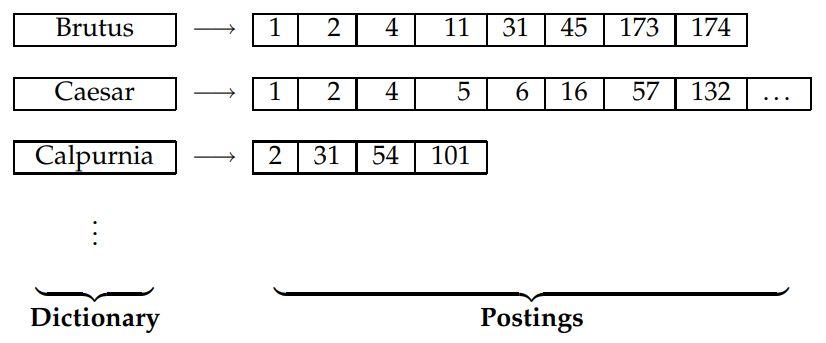
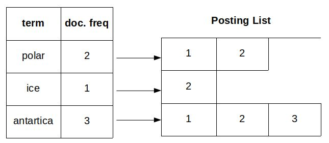
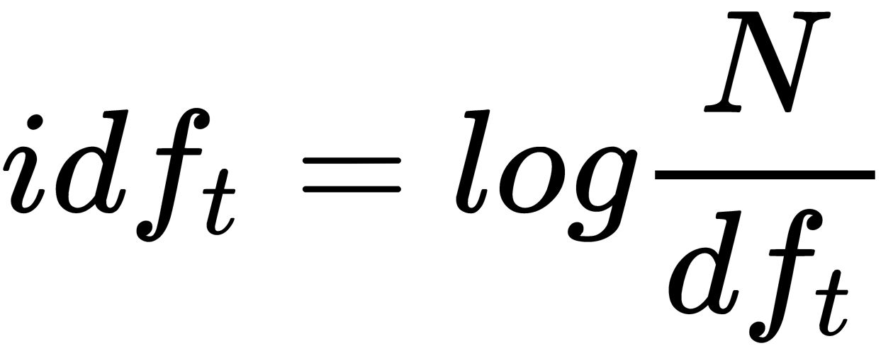

# 信息检索

**信息检索** ( **IR** )处理在非结构化数据中寻找信息。任何没有特定或一般化结构的数据都是非结构化数据，处理这样的数据对机器来说是一个巨大的挑战。非结构化数据的一些例子是本地 PC 或 web 上可用的文本文件、doc 文件、XML 文件等。因此，处理如此大量的非结构化数据并找到相关信息是一项具有挑战性的任务。

我们将在本章中讨论以下主题:

*   布尔检索
*   字典和容错检索
*   向量空间模型
*   评分和术语权重
*   逆文档频率
*   TF-IDF 加权
*   信息检索系统的评价

# 布尔检索

布尔检索处理一种检索系统或算法，其中 IR 查询可以被视为使用操作`AND`、`OR`和`NOT`的术语的布尔表达式。布尔检索模型是一种将文档视为单词并可以使用布尔表达式应用查询词的模型。一个标准的例子是考虑莎士比亚的文集。该查询用于确定包含单词“Brutus”和“Caesar”但不包含“Calpurnia”的戏剧。使用在基于 Unix 的系统上可用的`grep`命令，这样的查询是可行的。

当文档大小有限时，这是一个有效的过程，但是要快速处理大的文档或 web 上可用的数据量，并根据出现次数对其进行排序是不可能的。

另一种方法是提前为文档编制索引。方法是创建一个关联矩阵，以二进制形式记录，并标记该术语是否出现在给定的播放中:

|  | **安东尼和克娄巴特拉** | 尤利乌斯·凯撒 | **暴风雨** | **哈姆雷特** | **奥赛罗** | **麦克白** |
| **布鲁图斯** | one | one | Zero | Zero | Zero | one |
| **凯撒** | one | one | Zero | one | Zero | Zero |
| 卡尔珀尼亚 | Zero | one | Zero | Zero | Zero | Zero |
| **怜悯** | one | Zero | one | one | one | one |
| **错误** | one | Zero | one | one | one | Zero |

现在，为了回答前面对“布鲁图斯”和“凯撒”而不是“卡尔珀尼亚”的请求，这个查询可以变成 110100 和 110111 和 101111 = 100100，所以答案是*安东尼和克利奥帕特拉*和*哈姆雷特*是满足我们查询的戏剧。

前面的矩阵很好，但考虑到语料库很大，它可以增长为任何带有 1 和 0 条目的东西。设想创建一个包含 100 万个文档的 500，000 个术语的矩阵，这将产生一个 500，000 x 100 万个维度的矩阵。如上表所示，矩阵条目将为 0 和 1，因此使用倒排索引。它以字典的形式存储术语和文档列表，如下图所示:

取自 https://nlp.stanford.edu/IR-book/pdf/01bool.pdf

术语中的文档来自一个列表，称为过帐列表，单个文档称为过帐。为了创建这样的结构，文档被标记化，并且所创建的标记通过语言预处理被规范化。一旦形成了规范化的标记，就创建了字典和发布。为了提供排名，还存储了术语的频率，如下图所示:

存储的额外信息对于排名检索模型中的搜索引擎是有用的。为了高效的查询处理，还对发布列表进行排序。使用这种方法，减少了存储需求；回想一下有 1 和 0 的 *m x n* 矩阵。这也有助于处理布尔查询或检索。

# 字典和容错检索

字典数据结构存储列表术语词汇表，以及包含给定术语的文档列表，也作为发布。

字典数据结构可以以两种不同的方式存储:使用哈希表或树。当语料库增长时，存储这种数据结构的幼稚方法将导致性能问题。一些信息检索系统使用散列方法，而另一些使用树方法来制作字典。这两种方法各有利弊。

哈希表以整数的形式存储词汇术语，这是通过哈希得到的。哈希表中的查找或搜索更快，因为它是时间常数 *O(1)* 。如果搜索是基于前缀的搜索，如查找以“abc”开头的文本，那么如果使用散列表来存储术语，将不起作用，因为术语将被散列。不容易找到微小的变异。随着条款的增多，重复使用的成本也越来越高。

基于树方法使用树结构，通常是二叉树，这对于搜索非常有效。它有效地处理前缀库搜索。它比较慢，因为搜索需要花费 *O(log M)* 的时间。采油树的每次重新平衡都很昂贵。

# 通配符查询

通配符查询使用`*`来指定要搜索的内容。它可以出现在不同的地方，如单词的开头或结尾。搜索词可能以`*its`开头，这意味着查找以`its`结尾的单词。这种查询称为后缀查询。搜索词可能会在末尾使用`*`，比如`its*`，表示查找以`its`开头的单词。这种查询称为前缀查询。就树而言，前缀查询很容易，因为它们需要我们在`its <= t <= itt`之间查找术语。后缀查询需要额外的树来维护向后移动的术语。下一种需要更多操作的查询是中间有`*`的查询，比如`"fil*er"`、`"se*te"`和`"pro*cent"`。要解决这样的查询，需要找到`"fil*"`和`"*er"`，并将两个集合的结果求交集。这是一个昂贵的操作，因为需要在树的两个方向上遍历；这需要一个变通方法来简化它。一种方法是修改查询，使其仅在末尾包含`"*"`。permuterm 索引方法为单词添加了一个特殊字符`"$"`；例如，术语“你好”可以表示为`hello$`、`ello$h`、`llo$he`、`lo$hel`或`o$hell`。让我们假设这个查询是针对`hel*o`的，那么它将寻找`hel`和`o`，以`o$hel`结束。它只是旋转通配符，使其只出现在末尾。它将 B 树中的所有旋转相加。也很占地方。另一种方法是使用 bigram (k-gram)索引，它比 permuterm 索引更有效。在二元模型索引中，所有的 bigram 都被枚举。例如，“四月是最残酷的一个月”，拆分成 2-grams (bigrams)将如下所示:

`$a, ap, pr, ri, il, l$, $i, is, s$, $t, th, he, e$, $c, cr, ru, ue, el, le, es, st, t$, $m, mo, on, nt, h$`

`$`用来表示学期的开始或结束。它为所有二元模型和包含该二元模型的字典术语维护第二个索引的倒排形式。它检索所有匹配二元模型的帖子，并与整个列表相交。现在，像`hel*`这样的查询作为`$h`、`he`和`el`运行。它应用后置过滤器来过滤不相关的结果。它既快又节省空间。

# 拼写纠正

拼写纠正最好的例子是谷歌。当我们搜索拼写不正确的内容时，它会给出正确的拼写建议，如下图所示:

谷歌上的拼写纠正简单例子

大多数拼写校正算法使用的两个基本原则如下:

*   找到与拼写错误的单词最接近的匹配项。这就要求我们对术语有接近度。
*   如果两个或两个以上的单词是正确的，并且连在一起，请使用最常用的一个。最常见的单词是基于文档中每个术语的计数计算的；选择最高的。

拼写校正的两种具体形式是孤立术语校正和上下文敏感校正。孤立术语校正处理拼写错误。基本上，它检查每个单词的拼写错误；它不考虑句子的上下文。例如，如果遇到单词“form ”,而不是单词“from ”,它会将其视为正确，因为拼写是正确的。上下文敏感校正将查看周围的单词，并可以建议所需的校正，因此它可以建议“形式”而不是“形式”如果给定的句子是“我们从 A 点飞到 B 点”，在这个句子中，单词“form”是错误的，但是拼写是正确的，所以孤立的术语校正将把它视为正确的，而上下文敏感的校正将建议“from”而不是“form”

# 桑迪克斯

当拼写错误是由听起来像目标术语的查询引起时，需要语音纠正。这主要发生在人名中。这个想法是为每个词生成一个散列，使其与发音相同的单词相同。算法执行语音散列，使得对于相似发音单词的散列是相同的，这被称为 Soundex 算法。它是 1981 年为美国人口普查而发明的。方法如下:

1.  将每个要索引的术语转换为四个字符的简化形式。从这些简化形式到原始术语建立倒排索引；称之为 Soundex 指数。
2.  对查询词进行同样的操作。
3.  当查询要求 Soundex 匹配时，搜索这个 Soundex 索引。

它是许多流行数据库提供的标准算法。Soundex 对信息检索没有太大帮助，但它有自己的应用，其中按人名搜索很重要。

# 向量空间模型

布尔检索工作良好，但它只给出二进制输出；它表示术语匹配或不在文档中，如果只有有限数量的文档，这很好。如果文档数量增加，生成的结果人类很难遵循。考虑一个搜索词，在一百万个文档中搜索 X，其中一半返回肯定结果。下一阶段是根据某种基础(比如等级或其他机制)对文档进行排序，以显示结果。

如果需要排名，那么文档需要附加某种分数，这是由搜索引擎给出的。对于普通用户来说，编写布尔查询本身是一项困难的任务，他们必须使用 and、or 和 not 进行查询。实时查询可以简单到单个单词查询，也可以复杂到包含多个单词的句子。

向量空间模型可以分为三个阶段:

*   文档索引，从文档中提取术语
*   对索引术语进行加权，从而可以增强检索系统
*   基于查询和相似性度量对文档进行排序

总是有元数据与包含各种类型信息的文档相关联，例如:

*   作者详细信息
*   编成日期
*   文件的格式
*   标题
*   出版日期
*   抽象(尽管不总是)

这些元数据有助于形成查询，例如“搜索作者为 *xyz* 并发表于 *2017* 的所有文档”或“搜索标题包含单词 *AI* 且作者为 *ABC* 的文档”对于这样的查询，维护参数索引，并且这样的查询被称为参数搜索。区域包含自由文本，如标题，这在参数索引中是不可能的。通常，为每个参数准备一个单独的参数指数。搜索标题或摘要需要区域方法。为每个区域准备了一个单独的索引，如下图所示:

这确保了数据的有效检索和存储。对于字段和区域的布尔查询和检索，它仍然工作得很好。

将一组文档表示为公共向量空间中的向量被称为向量空间模型。

# 评分和术语权重

术语加权处理评估术语相对于文档的重要性。一个简单的方法是，除了停用词之外，在文档中出现较多的术语是一个重要的术语。可以给每个文档分配 0-1 的分数。分数是显示术语或查询在文档中匹配程度的度量。分数为 0 表示文档中不存在该术语。随着术语在文档中的出现频率增加，分数从 0 向 1 移动。因此，对于给定的术语 *X* ，三个文档、 *d1* 、 *d2* 和 *d3* 的得分分别为 0.2、0.3 和 0.5，这意味着 *d3* 中的匹配比 *d2* 更重要，而 *d1* 对于总得分最不重要。这同样适用于这些区域。如何给术语分配这样的分数或权重需要从一些训练集中学习，或者连续运行并更新术语的分数。

实时查询将是自由文本的形式，而不是布尔表达式的形式；例如，布尔查询将能够回答某个东西是否看起来像 *A* 和 *B* ，但是不能回答 *C* ，而自由文本查询将检查 *A* 是否与 *B* 在一起并且 *C* 是否不存在。因此，在自由文本中，需要一种评分机制，将每个单独术语的分数相加，并根据文档将权重分配给该术语。最简单的方法是分配一个权重，该权重等于该术语在文档中出现的次数。这种加权方案称为词频，通常记为，其中 *tf* 为词频， *t* 为词频， *d* 为文档。

# 逆文档频率

如果我们认为所有的术语对于所有的查询都具有相同的重要性，那么它并不适用于所有的查询。如果文档与冰有关，很明显“冰”几乎会出现在所有文档中，很可能出现频率很高。收集频率和文档频率是两个不同的术语，需要加以解释。一个集合包含许多文档。**集合频率** ( **比照**)显示**术语** ( **t** )在集合中所有文档中出现的频率，而**文档频率** ( **df** )显示 *t* 在单个文档中出现的频率。所以单词“ice”将具有高的收集频率，因为它被假定出现在集合中的所有文档中。一个简单的想法是，如果这些词的收集频率很高，就降低它们的权重。逆频率定义如下:

这里， *N* 是集合中的文档总数。经常性术语的 *idf* 可能较低，而非经常性术语的 idf 可能较高。

# TF-IDF 加权

TF-IDF 结合了**术语频率** ( **TF** )和**逆文档频率** ( **IDF** )的方法，为文档中的每个术语生成一个权重，使用以下公式完成:

换句话说，它给文档 *d* 中的术语 *t* 分配一个权重，如下所示:

*   如果 term *t* 在几个文档中出现多次，它将是最高的
*   如果术语 *t* 在一个文档中出现的次数很少，它将会更低
*   如果术语 *t* 出现在所有文档中，它将是最低的
*   如果术语 *t* 没有出现在任何文档中，则为 0

# 信息检索系统的评价

为了以标准的方式评估一个信息检索系统，需要一个测试集，它应该具有以下内容:

*   一批文件
*   测试所需信息的查询集
*   相关或不相关的二元评估

集合中的文件分为相关和不相关两类。测试文档集合应该有一个合理的大小，这样测试可以有一个合理的范围来找到平均性能。输出的相关性总是相对于所需的信息进行评估，而不是基于查询。换句话说，在结果中有一个查询词并不意味着它是相关的。例如，如果搜索词或查询是“Python”，结果可能显示 Python 编程语言或宠物 Python；两个结果都包含查询术语，但是它是否与用户相关是重要的因素。如果系统包含一个参数化的索引，那么它可以被调优以获得更好的性能，在这种情况下，需要一个单独的测试集合来测试参数。可能发生的情况是，根据也由参数改变的参数，分配的权重是不同的。

有一些标准的测试集可用于信息检索的评估。其中一些如下所列:

*   克兰菲尔德收集了 1398 份空气动力学杂志的摘要和 225 个问题，以及对所有问题的详尽的相关性判断。
*   从 1992 年开始，**文本检索会议** ( **TREC** )维持了一个大的 IR 测试系列用于评估。它由 189 万个文档和 450 个信息需求的相关性判断组成。
*   GOV2 拥有 2500 万个网页。
*   NTCIR 侧重于东亚语言和跨语言信息检索的测试集。http://ntcir.nii.ac.jp/about/
*   路透社由 806，791 份文件组成。
*   20 新闻组是另一个广泛用于分类的集合。

用于发现检索系统有效性的两个度量是精确度和召回率。Precision 是检索到的相关文档的比例，recall 是找到的相关文档的比例。

# 摘要

在本章中，我们讲述了如何使用各种技术从非结构化数据中找到信息。我们讨论了布尔检索、字典和容错检索。我们还讲述了通配符查询及其使用方法。简要介绍拼写校正，然后介绍向量空间模型和 TF-IDF 加权，最后介绍信息检索评估。在下一章[第八章](part0176.html#57R300-447d219d688d46cb9ed55b88cf17edcf)、*文本和文档分类*中，我们将讲述如何对文本和文档进行分类。