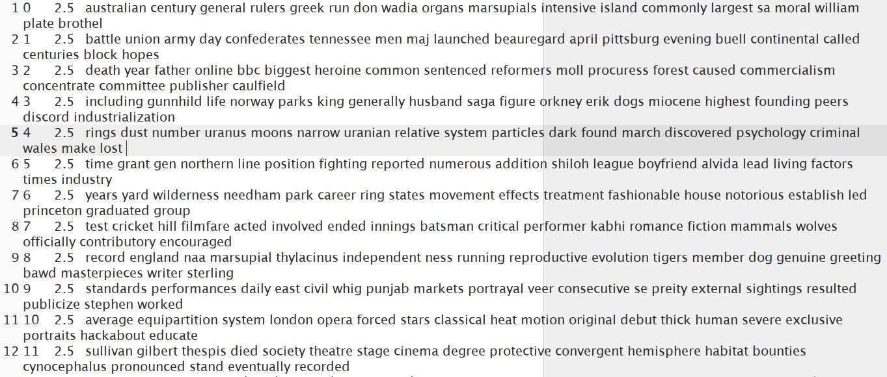
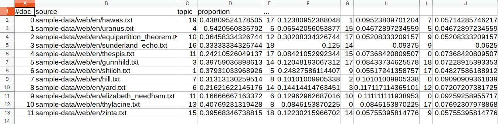
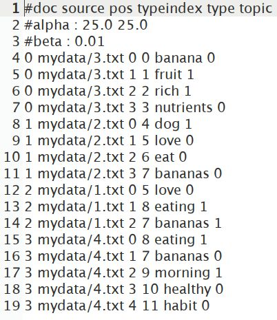
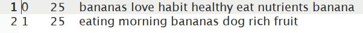
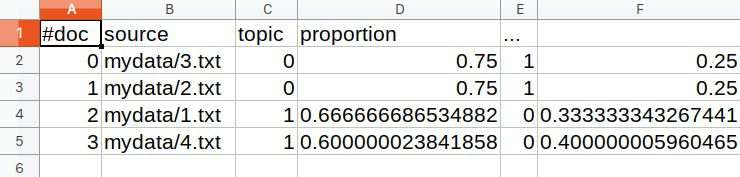

# 主题建模

在这一章中，我们将使用包含一些文本的文档来学习主题建模的基础知识。这里的想法是使用某些可用的方法从文本中获取主题。这个过程属于文本挖掘的范畴，在搜索、聚类和组织文本中起着重要的作用。今天，它被许多网站用于推荐目的，例如当新闻网站根据读者当前正在阅读的文章的主题来推荐文章时。本章涵盖主题建模的基础知识，包括**潜在狄利克雷分配** ( **LDA** )的基本概念。它还将向您展示如何使用 MALLET 包进行主题建模。

我们将在本章中讨论以下主题:

*   什么是主题建模？
*   LDA 的基础知识
*   用木槌进行主题建模


# 什么是主题建模？

简单地说，主题建模是一种技术，通过这种技术，计算机程序试图从文本中提取主题。文本通常是非结构化数据，如博客、电子邮件、文章、书中的一章或类似内容。这是一种文本挖掘方法，但不应与基于规则的文本挖掘相混淆。在机器学习场景中，主题建模属于无监督学习的范畴，其中机器或计算机程序试图通过观察最后一组文本中的一串单词来找到主题。当给定“IT 行业”的主题时，一个好的模型应该产生单词“程序”、“程序员”、“IT”、“计算机”、“软件”和“硬件”。它有助于理解大量文本，并在搜索引擎的运行中发挥着至关重要的作用。

主题建模可以与组织、分类、理解和总结大量文本信息的方法一起使用。它使我们能够使用主题发现集合和注释中隐藏的模式。它从文档集合中找到最能代表集合的单词组。

有许多不同的方法来做主题建模，但最流行的是 LDA。下一节将介绍 LDA 的基础知识。


# LDA 的基础知识

在不同的主题建模方法中，LDA 是最常用的方法。这是文本数据挖掘和机器学习的一种形式，其中执行回溯来找出文档的主题。它还涉及概率的使用，因为它是一个生成概率模型。

LDA 将文档表示为基于概率给出主题的主题混合物。

任何给定的文档都有或多或少的机会将某个单词作为其潜在主题；例如，给定一个关于体育的文档，单词“cricket”出现的概率高于单词“Android One Phone”出现的概率。如果文档是关于移动技术的，那么“Android One Phone”这个词出现的概率会高于“cricket”这个词。使用抽样方法，以半随机方式使用狄利克雷分布从文档中选择一些词作为主题。这些随机选择的主题可能不是最适合作为文档的潜在主题，因此对于每个文档，需要检查单词并计算单词来自文档的概率。设 *p(主题|文档)*是来自文档 *d* 的一个单词分配给主题 *t—* 和 *p(主题)*是来自单词 *w* 的所有文档的主题 *t* 的概率。这有助于找到构成主题的每个单词的比例。它查找每个单词在主题中的相关性以及主题在文档中的相关性。现在，给单词 *w* 重新分配一个新的主题——我们称之为*topic’——*使用*p(topic ' | document)* p(word | topic ')*。重复这个过程，直到你完成指定的题目。

为此，LDA 使用文档-术语矩阵，并将其转换为文档-主题矩阵和主题-术语矩阵。LDA 使用采样技术来改进矩阵。假设有标记为 *d1、d2、d3 的 *N* 个文档....dn* 。有 *M 个*项标为 *t1、t2、t3....tm* ，因此文档-术语矩阵将表示文档中术语的数量，并表示如下:

|  | **t1** | **t2** | **t3** | **tm** |
| **d1** | Zero | three | one | Two |
| **d2** | Zero | five | four | one |
| **d3** | one | Zero | three | Two |
| **dn** | Zero | one | one | Two |

让 *k* 成为我们希望 LDA 建议的主题数量。它将文档-术语矩阵分为维度-主题矩阵和主题-术语矩阵:

|  | **话题-1** | **话题-2** | **话题-k** |
| **d1** | one | Zero | one |
| **d2** | one | one | Zero |
| **d3** | one | Zero | one |
| **dn** | one | Zero | one |

文档-主题矩阵[ *N* x *k*

|  | **t1** | **t2** | **t3** | **tm** |
| **话题-1** | Zero | one | one | Zero |
| **话题-2** | one | one | Zero | Zero |
| **话题-k** | one | Zero | one | Zero |

主题–术语矩阵[ *k* x *m*

要了解 LDA 是如何工作的，请访问 https://lettier.com/projects/lda-topic-modeling/。这是一个很好的网页，您可以在其中添加文档，决定主题的数量，并调整 alpha 和 beta 参数来获得主题。


# 用木槌进行主题建模

MALLET 是主题建模方面的知名库。它还支持文档分类和序列标记。更多关于木槌的信息可以在 http://mallet.cs.umass.edu/index.php 的[找到。要下载 MALLET，请访问 http://mallet.cs.umass.edu/download.php](http://mallet.cs.umass.edu/index.php)[(最新版本是 2.0.6)。下载完成后，解压目录中的 MALLET。它包含 MALLET 目录的`sample-data/web/en`路径中的`.txt`格式的样本数据。](http://mallet.cs.umass.edu/download.php)

第一步是将文件导入 MALLET 的内部格式。为此，打开命令提示符或终端，移动到`mallet`目录，并执行以下命令:

```
mallet-2.0.6$ bin/mallet import-dir --input sample-data/web/en --output tutorial.mallet --keep-sequence --remove-stopwords
```

该命令将生成`tutorial.mallet`文件。


# 培养

下一步是使用`train-topics`构建主题模型，并使用`train-topics`命令保存`output-state`、`topic-keys`和`topics`:

```
mallet-2.0.6$ bin/mallet train-topics --input tutorial.mallet --num-topics 20 --output-state topic-state.gz --output-topic-keys tutorial_keys.txt --output-doc-topics tutorial_compostion.txt
```

这将针对`20`主题进行训练，并将为你的材料语料库中的每个单词以及它们所属的主题创建一个 ZIP 文件。所有的`topic-keys`将被存储在`tutorial_key.txt`中。文件的主题建议将存储在`tutorial_composition.txt`中。


# 估价

A `tutorial_key.txt`是一个简单的文本文件，内容看起来会类似于下面的截图:



它包含所有的主题，因为我们要求 20 个主题。文件中的行可以从三个方面来看。第一种是使用从`0`开始的数字，表示主题编号。第二个数字是 Dirichlet 参数，默认值为`2.5`，第三种方法是查看显示可能主题的段落。`tutorial_compostion.txt`文件包含每个主题和每个原始文本文件的百分比分解。`tutorial_compostion.txt`文件可以在 Excel 或 LibreOffice 中打开，以便您更容易理解。它显示主题中所有单词的文件名，后跟`topic`和`proportion`:



第一档为`hawes.txt`，话题`19`占比 0.438 %。

让我们使用自定义数据来尝试一下。在`mallet`目录下创建一个`mydata`文件夹，包含四个文本文件，文件名分别为`1.txt`、`2.txt`、`3.txt`和`4.txt`。以下是该文件的内容:

| **文件名** | **内容** |
| `1.txt` | 我喜欢吃香蕉。 |
| `2.txt` | 我有一只狗。他也喜欢吃香蕉。 |
| `3.txt` | 香蕉是一种水果，营养丰富。 |
| `4.txt` | 早上吃香蕉是一个健康的习惯。 |

让我们对模型进行训练和评估。执行以下两个命令:

```
mallet-2.0.6$ bin/mallet import-dir --input mydata/ --output mytutorial.mallet --keep-sequence --remove-stopwords

mallet-2.0.6$ bin/mallet train-topics  --input mytutorial.mallet --num-topics 2 --output-state mytopic-state.gz --output-topic-keys mytutorial_keys.txt --output-doc-topics mytutorial_compostion.txt
```

如前所述，它将创建三个文件，我们现在将详细了解这三个文件。

第一档是`mytopic-state.gz`。提取并打开文件。这将显示使用的所有单词，以及它们设置在哪个主题中:



下一个文件是`mytutorial_key.txt`，当打开时，将显示主题术语。由于我们要求两个主题，它将有两行:



最后一个文件是`mytutorial_composition.txt`，我们会在 Excel 或者 LibreOffice 中打开。它将显示`doc`、`topic`和`proportion`:



可以看出，对于包含`Banana is a fruit, rich in nutrients.`的`3.txt`文件，主题`0`与主题`1`的比例更大。从第一个文件中，我们可以看到主题`0`包含了主题`banana`、`nutrients`、`love`和`healthy`。


# 摘要

在这一章中，我们学习了为什么我们应该进行主题建模，以及它在一个数据不断增长的世界中的重要性。我们还研究了 LDA 的概念及其在决定如何从给定的语料库中选择主题中的应用。我们还研究了 MALLET 工具在样本数据主题建模和创建我们自己的定制数据中的应用。我们还了解了生成的不同文件以及如何解释它们。

在下一章[第十章](part0201.html#5VM120-447d219d688d46cb9ed55b88cf17edcf)、*使用解析器提取关系*中，我们将看到如何使用解析器提取关系。