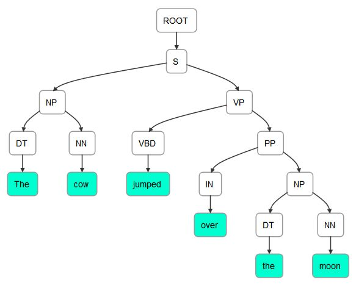
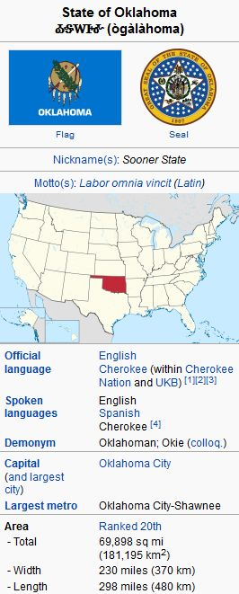
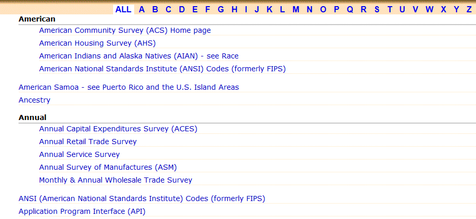

# 十、使用解析器提取关系

解析是为文本单元创建解析树的过程。这个单元可能是一行代码或一个句子。对于计算机语言来说，这很容易做到，因为它们的设计就是为了让这项任务变得简单。然而，这增加了编写代码的难度。自然语言解析要困难得多，这是因为自然语言中存在歧义。这种模糊性使得语言难以学习，但却提供了极大的灵活性和表现力。在这里，我们对解析计算机语言不感兴趣，而是自然语言。

解析树是一种分层的数据结构，表示句子的句法结构。通常，这表现为一个有根的树形图，我们很快就会举例说明。我们将使用解析树来帮助识别树中实体之间的关系。

解析用于许多任务，包括:

*   语言的机器翻译
*   从文本合成语音
*   语音识别
*   语法检查
*   信息提取

**共指消解**是指文本中两个或两个以上的表达式指代同一个人或事物的情况。以这句话为例:

"特德去参加聚会，在那里他出尽了洋相。"

*泰德*、*何*、*本人*这几个词指的是同一个实体，*泰德*。这对于确定文本的正确解释和文本各部分的相对重要性是很重要的。我们将演示斯坦福 API 如何解决这个问题。

从文本中提取关系和信息是一项重要的自然语言处理任务。关系可能存在于实体之间，例如句子的主语和它的宾语、其他实体或者它的行为。我们可能还想确定关系，并以结构化的形式呈现它们。我们可以使用这些信息来呈现结果，供人们立即使用，或者格式化关系，以便它们可以更好地用于下游任务。

在这一章中，我们将研究解析过程，看看解析树是如何使用的。我们将检查关系提取过程，研究关系类型，使用提取的关系，并学习使用 NLP APIs。

我们将在本章中讨论以下主题:

*   关系类型
*   理解解析树
*   使用提取的关系
*   提取关系
*   使用 NLP APIs
*   为问答系统提取关系


# 关系类型

有许多可能的关系类型。下表列出了一些关系类别和示例。一个包含大量关系的有趣网站是 Freebase([https://www.freebase.com/](https://www.freebase.com/))。它是一个按类别组织的人、地点和事物的数据库。WordNet 词库(【http://wordnet.princeton.edu/】T2)包含许多关系:

| **关系** | **例子** |
| 个人的 | 的父亲，姐妹，女朋友 |
| 组织的 | 附属于，小组委员会 |
| 空间的 | 在…的东北方向，在…之下 |
| 身体的 | 的一部分，由...组成 |
| 相互作用 | 与...结合、交往、反应 |

**命名实体识别** ( **NER** )是自然语言处理分类的一个低级类型，在[第 4 章](part0110.html#38STS0-447d219d688d46cb9ed55b88cf17edcf)、*寻找人和事物*中有所涉及。然而，许多应用程序需要超越这一点，并识别不同类型的关系。例如，当 NER 被应用于识别个人时，那么知道我们正在与一个人打交道可以进一步精炼存在的关系。

一旦识别出这些实体，就可以创建到它们包含的文档的链接，或者用作索引。对于问答应用，命名实体通常用于回答。当文本的情感被确定时，它需要被归因于某个实体。

例如，考虑以下输入:

```
He was the last person to see Fred. 
```

使用 OpenNLP NER 作为前一句话的输入，正如我们在[第 4 章](part0110.html#38STS0-447d219d688d46cb9ed55b88cf17edcf)、*寻找人和事*中所做的那样，我们得到以下输出:

```
Span: [7..9) person
Entity: Fred 
```

使用 OpenNLP 解析器，我们得到了更多关于这个句子的信息:

```
    (TOP (S (NP (PRP He)) (VP (VBD was) (NP (NP (DT the) (JJ last) (NN person)) (SBAR (S (VP (TO to) (VP (VB see))))))) (. Fred.)))  
```

考虑以下输入:

```
The cow jumped over the moon. 
```

对于前面的句子，解析器返回:

```
    (TOP (S (NP (DT The) (NN cow)) (VP (VBD jumped) (PP (IN over) (NP (DT the) (NN moon))))))

```

有两种类型的解析:

*   **依存关系**:关注词与词之间的关系
*   **短语结构**:这处理短语和它们的递归结构

依存关系可以使用主语、限定词和介词等标签来查找关系。解析技术包括移位归约、生成树和级联分块。我们在这里不关心这些差异，而是将重点放在各种解析器的使用和结果上。


# 理解解析树

解析树表示文本元素之间的层次关系。例如，依存关系树显示了一个句子的语法元素之间的关系。让我们重新考虑下面这句话:

```
The cow jumped over the moon. 
```

这里显示了前面句子的解析树。它是使用本章后面的*使用词典化解析器类*一节中的技术生成的:

```
    (ROOT
      (S
        (NP (DT The) (NN cow))
        (VP (VBD jumped)
          (PP (IN over)
            (NP (DT the) (NN moon))))
        (. .)))

```

这句话可以图形化描绘，如下图所示。它是使用在[http://nlpviz.bpodgursky.com/](http://nlpviz.bpodgursky.com/)发现的应用程序生成的。另一个允许你以图形化方式检查文本的编辑器是 grammar scope(【http://grammarscope.sourceforge.net/】T2)。这是一个斯坦福支持的工具，它使用基于 Swing 的 GUI 来生成解析树、语法结构、类型依赖和文本语义图:



然而，可能有不止一种方法来解析一个句子。解析是困难的，因为它需要处理大量可能存在歧义的文本。下面的输出说明了前一个例句的其他可能的依赖树。该树是使用 OpenNLP 生成的，这将在本章后面的*使用 OpenNLP* 一节中演示:

```
    (TOP (S (NP (DT The) (NN cow)) (VP (VBD jumped) (PP (IN over) (NP (DT the) (NN moon))))))
    (TOP (S (NP (DT The) (NN cow)) (VP (VP (VBD jumped) (PRT (RP over))) (NP (DT the) (NN moon)))))
    (TOP (S (NP (DT The) (NNS cow)) (VP (VBD jumped) (PP (IN over) (NP (DT the) (NN moon)))))) 
```

每一个都代表了同一个句子的稍微不同的解析。首先显示最有可能的解析。


# 使用提取的关系

提取的关系可用于多种目的，包括:

*   构建知识库
*   创建目录
*   产品搜索
*   专利分析
*   股票分析
*   情报分析

维基百科的信息框展示了一个展示关系的例子，如下图所示。该信息框用于输入 Oklahoma，并包含关系类型，如官方语言、首都及其所在地区的详细信息:



有许多使用维基百科建立的数据库提取关系和信息，例如:

*   **资源描述框架** ( **RDF** ):这使用了像 Yosemite-location-California 这样的三元组，其中位置是关系。这可以在 http://www.w3.org/RDF/的[找到。](http://www.w3.org/RDF/)
*   DBpedia :它拥有超过 10 亿个三元组，是从维基百科创建的知识库的一个例子。这可以在 https://wiki.dbpedia.org/about 的[找到。](https://wiki.dbpedia.org/about)

另一个简单但有趣的例子是当谷歌搜索`planet mercury`时出现的信息框。如下面的屏幕截图所示，我们不仅获得了查询的链接列表，还在页面的右侧看到了 Mercury 的关系和图像列表:


信息抽取也用于创建 web 索引。这些索引是为网站开发的，允许用户在网站中导航。美国人口普查局([http://www.census.gov/main/www/a2z](http://www.census.gov/main/www/a2z))的网页索引示例如下图所示:



# 提取关系

有许多技术可以用来提取关系。这些可以分为以下几类:

*   手工制作的图案
*   监督方法
*   半监督或无监督方法
*   自举方法
*   远程监控方法
*   无监督方法

当我们没有训练数据时，就使用手工构建的模型。这可能发生在新的业务领域或者全新类型的项目中。这些通常需要使用规则。规则可能是:

如果使用了“男演员”或“女演员”一词，而没有使用“电影”或“商业”一词，则该文本应归类为戏剧

然而，这种方法需要花费很多精力，并且需要根据手头的实际文本进行调整。

如果只有很少的训练数据是可亲的，那么朴素贝叶斯分类器是一个很好的选择。当有更多数据可用时，可以使用诸如**支持向量机**(**【SVM】**)、正则化逻辑回归和随机森林等技术。

虽然更详细地理解这些技术是有用的，但是我们在这里不会涉及它们，因为我们的重点是这些技术的使用。


# 使用 NLP APIs

我们将使用 OpenNLP 和 Stanford APIs 来演示关系信息的解析和提取。也可以使用 LingPipe，但这里不讨论。如何使用 LingPipe 解析生物医学文献的示例可以在[http://alias-I . com/LingPipe-3 . 9 . 3/demos/tutorial/MEDLINE/read-me . html](http://alias-i.com/lingpipe-3.9.3/demos/tutorial/medline/read-me.html)找到。


# 使用 OpenNLP

使用`ParserTool`类解析文本很简单。它的静态`parseLine`方法接受三个参数并返回一个`Parser`实例。这些论点如下:

*   包含要分析的文本的字符串
*   一个实例
*   一个整数，指定要返回多少个分析

`Parser`实例保存解析的元素。语法分析按概率顺序返回。为了创建一个`Parser`实例，我们将使用`ParserFactory`类的`create`方法。这个方法使用了一个我们将使用`en-parser-chunking.bin`文件创建的`ParserModel`实例。

这里显示了这个过程，其中使用 try-with-resources 块创建了模型文件的输入流。创建了一个`ParserModel`实例，然后是一个`Parser`实例:

```
String fileLocation = getModelDir() +  
    "/en-parser-chunking.bin"; 
try (InputStream modelInputStream =  
            new FileInputStream(fileLocation);) { 
     ParserModel model = new ParserModel(modelInputStream); 
    Parser parser = ParserFactory.create(model); 
    ... 
} catch (IOException ex) { 
    // Handle exceptions 
} 
```

我们将用一个简单的句子来演示解析过程。在下面的代码序列中，使用第三个参数的值`3`来调用`parseLine`方法。这将返回前三个解析:

```
String sentence = "The cow jumped over the moon"; 
Parse parses[] = ParserTool.parseLine(sentence, parser, 3); 
```

接下来，将显示这些分析及其概率，如下所示:

```
for(Parse parse : parses) { 
    parse.show(); 
    System.out.println("Probability: " + parse.getProb()); 
} 
```

输出如下所示:

```
    (TOP (S (NP (DT The) (NN cow)) (VP (VBD jumped) (PP (IN over) (NP (DT the) (NN moon))))))
    Probability: -1.043506016751117
    (TOP (S (NP (DT The) (NN cow)) (VP (VP (VBD jumped) (PRT (RP over))) (NP (DT the) (NN moon)))))
    Probability: -4.248553665013661
    (TOP (S (NP (DT The) (NNS cow)) (VP (VBD jumped) (PP (IN over) (NP (DT the) (NN moon))))))
    Probability: -4.761071294573854

```

注意，每次解析产生的标签顺序和分配略有不同。下面的输出显示了第一个解析的格式，以便于阅读:

```
    (TOP 
          (S 
              (NP 
                   (DT The) 
                   (NN cow)
              )
              (VP 
                   (VBD jumped) 
                   (PP 
                        (IN over)
                        (NP 
                             (DT the)
                             (NN moon)
                         )
                   )
               )
         )
    )

```

可以使用`showCodeTree`方法来显示父子关系:

```
parse.showCodeTree(); 
```

第一次解析的输出如下所示。每行的第一部分显示了用括号括起来的元素级别。接下来显示标签，后面是由`->`分隔的两个哈希值。第一个数字代表元素，第二个数字代表其父元素。例如，在第三行中，它显示专有名词`The`，拥有名词短语`The cow`的父级:

```
[0] S -929208263 -> -929208263 TOP The cow jumped over the moon
[0.0] NP -929237012 -> -929208263 S The cow
[0.0.0] DT -929242488 -> -929237012 NP The
[0.0.0.0] TK -929242488 -> -929242488 DT The
[0.0.1] NN -929034400 -> -929237012 NP cow
[0.0.1.0] TK -929034400 -> -929034400 NN cow
[0.1] VP -928803039 -> -929208263 S jumped over the moon
[0.1.0] VBD -928822205 -> -928803039 VP jumped
[0.1.0.0] TK -928822205 -> -928822205 VBD jumped
[0.1.1] PP -928448468 -> -928803039 VP over the moon
[0.1.1.0] IN -928460789 -> -928448468 PP over
[0.1.1.0.0] TK -928460789 -> -928460789 IN over
[0.1.1.1] NP -928195203 -> -928448468 PP the moon
[0.1.1.1.0] DT -928202048 -> -928195203 NP the
[0.1.1.1.0.0] TK -928202048 -> -928202048 DT the
[0.1.1.1.1] NN -927992591 -> -928195203 NP moon
[0.1.1.1.1.0] TK -927992591 -> -927992591 NN moon  
```

访问解析元素的另一种方式是通过`getChildren`方法。这个方法返回一个`Parse`对象的数组，每个对象代表解析的一个元素。使用各种`Parse`方法，我们可以获得每个元素的文本、标记和标签。这里举例说明了这一点:

```
Parse children[] = parse.getChildren(); 
for (Parse parseElement : children) { 
    System.out.println(parseElement.getText()); 
    System.out.println(parseElement.getType()); 
    Parse tags[] = parseElement.getTagNodes(); 
    System.out.println("Tags"); 
    for (Parse tag : tags) { 
        System.out.println("[" + tag + "]"  
            + " type: " + tag.getType()  
            + "  Probability: " + tag.getProb()  
            + "  Label: " + tag.getLabel()); 
    } 
} 
```

该序列的输出如下:

```
The cow jumped over the moon
S
Tags
[The] type: DT  Probability: 0.9380626549164167  Label: null
[cow] type: NN  Probability: 0.9574993337971017  Label: null
[jumped] type: VBD  Probability: 0.9652983971550483  Label: S-VP
[over] type: IN  Probability: 0.7990638213315913  Label: S-PP
[the] type: DT  Probability: 0.9848023215770413  Label: null
[moon] type: NN  Probability: 0.9942338356992393  Label: null  
```


# 使用斯坦福 API

Stanford NLP API 中有几种解析方法。首先，我们将演示一个通用解析器，即`LexicalizedParser`类。然后，我们将说明如何使用`TreePrint`类显示解析器的结果。接下来将演示如何使用`GrammaticalStructure`类来确定单词依赖关系。


# 使用 LexicalizedParser 类

`LexicalizedParser`类是一个词汇化的 PCFG 解析器。它可以使用各种模型来执行解析过程。使用`apply`方法和`CoreLabel`对象的`List`实例来创建解析树。

在下面的代码序列中，使用`englishPCFG.ser.gz`模型实例化解析器:

```
String parserModel = ".../models/lexparser/englishPCFG.ser.gz"; 
LexicalizedParser lexicalizedParser =  
   LexicalizedParser.loadModel(parserModel);
```

使用`Sentence`类的`toCoreLabelList`方法创建`CoreLabel`对象的`list`实例。`CoreLabel`对象包含一个单词和其他信息。这些单词没有标记或标签。数组中的单词已被有效地标记化:

```
String[] senetenceArray = {"The", "cow", "jumped", "over",  
    "the", "moon", "."}; 
List<CoreLabel> words =  
    Sentence.toCoreLabelList(senetenceArray); 
```

现在可以调用`apply`方法了:

```
Tree parseTree = lexicalizedParser.apply(words); 
```

显示解析结果的一个简单方法是使用`pennPrint`方法，该方法以与 Penn TreeBank 相同的方式显示`parseTree`([http://www . SFS . uni-tuebingen . de/~ DM/07/autumn/795.10/pt b-annotation-guide/root . html](http://www.sfs.uni-tuebingen.de/~dm/07/autumn/795.10/ptb-annotation-guide/root.html)):

```
parseTree.pennPrint(); 
```

输出如下所示:

```
    (ROOT
      (S
        (NP (DT The) (NN cow))
        (VP (VBD jumped)
          (PP (IN over)
            (NP (DT the) (NN moon))))
        (. .)))

```

`Tree`类提供了许多使用解析树的方法。


# 使用 TreePrint 类

`TreePrint`类提供了一种显示树的简单方法。使用描述要使用的显示格式的字符串创建类的实例。使用静态`outputTreeFormats`变量可以获得一组有效的输出格式，如下表所示:

|  | **树形格式字符串** |  |
| `penn` | `dependencies` | `collocations` |
| `oneline` | `typedDependencies` | `semanticGraph` |
| `rootSymbolOnly` | `typedDependenciesCollapsed` | `conllStyleDependencies` |
| `words` | `latexTree` | `conll2007` |
| `wordsAndTags` | `xmlTree` |  |

斯坦福使用类型依赖来描述句子中存在的语法关系。这些在*斯坦福类型依赖手册*(【http://nlp.stanford.edu/software/dependencies_manual.pdf】T2)中有详细说明。

下面的代码示例说明了如何使用`TreePrint`类。`printTree`方法执行实际的显示操作。

在这种情况下，`TreePrint`对象被创建，显示`"typedDependenciesCollapsed"`:

```
TreePrint treePrint =  
    new TreePrint("typedDependenciesCollapsed"); 
treePrint.printTree(parseTree); 
```

这个序列的输出如下，其中数字反映了它在句子中的位置:

```
det(cow-2, The-1)
nsubj(jumped-3, cow-2)
root(ROOT-0, jumped-3)
det(moon-6, the-5)
prep_over(jumped-3, moon-6)  
```

使用`penn`字符串创建对象会产生以下输出:

```
    (ROOT (S (NP (DT The) (NN cow)) (VP (VBD jumped) (PP (IN over) (NP (DT the) (NN moon)))) (. .)))

```

`dependencies`字符串产生一个简单的依赖列表:

```
    dep(cow-2,The-1)
    dep(jumped-3,cow-2)
    dep(null-0,jumped-3,root)
    dep(jumped-3,over-4)
    dep(moon-6,the-5)
    dep(over-4,moon-6)

```

这些格式可以用逗号组合。以下示例将导致显示同时使用`penn`样式和`typedDependenciesCollapsed`格式:

```
    "penn,typedDependenciesCollapsed"  
```


# 使用 GrammaticalStructure 类查找单词依赖关系

另一种解析文本的方法是结合使用我们在上一节中创建的`LexicalizedParser`对象和`TreebankLanguagePack`接口。树库是已经用句法或语义信息注释的文本语料库，提供关于句子结构的信息。第一个主要的树银行是宾夕法尼亚树银行(【http://www.cis.upenn.edu/~treebank/】[)](http://www.cis.upenn.edu/~treebank/)))。可以手动或半自动创建树库。

下面的例子说明了如何使用解析器格式化一个简单的字符串。一个`TokenizerFactory`创建一个记号赋予器。

我们在*中使用词汇化解析器类*一节中讨论的`CoreLabel`类在这里使用:

```
String sentence = "The cow jumped over the moon."; 
TokenizerFactory<CoreLabel> tokenizerFactory =  
    PTBTokenizer.factory(new CoreLabelTokenFactory(), ""); 
Tokenizer<CoreLabel> tokenizer =  
    tokenizerFactory.getTokenizer(new StringReader(sentence)); 
List<CoreLabel> wordList = tokenizer.tokenize(); 
parseTree = lexicalizedParser.apply(wordList); 
```

`TreebankLanguagePack`接口指定了使用树库的方法。在下面的代码中，创建了一系列对象，最终创建了一个`TypedDependency`实例，用于获取句子元素的依赖信息。一个`GrammaticalStructureFactory`对象的实例被创建并用于创建一个`GrammaticalStructure`类的实例。

正如这个类的名字所暗示的，它存储了树中元素之间的语法信息:

```
TreebankLanguagePack tlp =  
    lexicalizedParser.treebankLanguagePack; 
GrammaticalStructureFactory gsf =  
    tlp.grammaticalStructureFactory(); 
GrammaticalStructure gs =  
    gsf.newGrammaticalStructure(parseTree); 
List<TypedDependency> tdl = gs.typedDependenciesCCprocessed(); 
```

我们可以简单地显示列表，如下所示:

```
System.out.println(tdl);
```

输出如下所示:

```
    [det(cow-2, The-1), nsubj(jumped-3, cow-2), root(ROOT-0, jumped-3), det(moon-6, the-5), prep_over(jumped-3, moon-6)]  
```

也可以使用`gov`、`reln`和`dep`方法
提取这些信息，这些方法分别返回调控字、关系和依赖元素，如下所示:

```
for(TypedDependency dependency : tdl) { 
    System.out.println("Governor Word: [" + dependency.gov()  
        + "] Relation: [" + dependency.reln().getLongName() 
        + "] Dependent Word: [" + dependency.dep() + "]"); 
} 
```

输出如下所示:

```
    Governor Word: [cow/NN] Relation: [determiner] Dependent Word: [The/DT]
    Governor Word: [jumped/VBD] Relation: [nominal subject] Dependent Word: [cow/NN]
    Governor Word: [ROOT] Relation: [root] Dependent Word: [jumped/VBD]
    Governor Word: [moon/NN] Relation: [determiner] Dependent Word: [the/DT]
    Governor Word: [jumped/VBD] Relation: [prep_collapsed] Dependent Word: [moon/NN]  
```

由此，我们可以看出一个句子中的关系以及这种关系的要素。


# 查找共指消解实体

共指消解指的是在文本中出现两个或多个指代同一个人或实体的表达式。考虑下面的句子:

"他拿了他的现金，她拿了她的零钱，他们一起买了午餐。"

这个句子中有几个指代。字*他的*指的是*他*字*她*指的是*她*。另外，*他们*既指*他*又指*她*。

一个**内指**是一个在它之前或之后的表达式的共指。内照应可以分为回指和照应。在下面的句子中，单词 *It* 是指代其先行词*地震*的回指词:

”玛丽感觉到了地震。它震动了整栋大楼。”

在下一个句子中， *she* 是一个后转代词，因为它指向后置的*玛丽*:

"当玛丽坐在那里时，她感觉到了地震。"

斯坦福 API 支持使用`dcoref`注释的`StanfordCoreNLP`类的共指解析。我们将用前面的句子演示这个类的用法。

我们将从创建管道和使用`annotate`方法开始，如下所示:

```
String sentence = "He took his cash and she took her change "  
    + "and together they bought their lunch."; 
Properties props = new Properties(); 
props.put("annotators",  
    "tokenize, ssplit, pos, lemma, ner, parse, dcoref"); 
StanfordCoreNLP pipeline = new StanfordCoreNLP(props); 
Annotation annotation = new Annotation(sentence); 
pipeline.annotate(annotation); 
```

`Annotation` class' `get`方法，当与`CorefChainAnnotation.class`参数一起使用时，将返回`CorefChain`对象的`Map`实例，如下所示。这些对象包含关于在句子中找到的共指的信息:

```
Map<Integer, CorefChain> corefChainMap =  
    annotation.get(CorefChainAnnotation.class); 
```

使用整数对一组`CorefChain`对象进行索引。我们可以迭代这些对象，如下面的代码所示。获取密钥集，然后显示每个`CorefChain`对象:

```
Set<Integer> set = corefChainMap.keySet(); 
Iterator<Integer> setIterator = set.iterator(); 
while(setIterator.hasNext()) { 
    CorefChain corefChain =  
        corefChainMap.get(setIterator.next()); 
    System.out.println("CorefChain: " + corefChain); 
} 
```

将生成以下输出:

```
CorefChain: CHAIN1-["He" in sentence 1, "his" in sentence 1]
CorefChain: CHAIN2-["his cash" in sentence 1]
CorefChain: CHAIN4-["she" in sentence 1, "her" in sentence 1]
CorefChain: CHAIN5-["her change" in sentence 1]
CorefChain: CHAIN7-["they" in sentence 1, "their" in sentence 1]
CorefChain: CHAIN8-["their lunch" in sentence 1]
```

我们使用`CorefChain`和`CorefMention`类的方法获得更详细的信息。后一类包含关于在句子中找到的特定共指的信息。

将以下代码序列添加到前面的`while`循环体中，以获取并显示该信息。该类的`startIndex`和`endIndex`字段是指单词在句子中的位置:

```
System.out.print("ClusterId: " + corefChain.getChainID()); 
CorefMention mention = corefChain.getRepresentativeMention(); 
System.out.println(" CorefMention: " + mention  
    + " Span: [" + mention.mentionSpan + "]"); 

List<CorefMention> mentionList =  
    corefChain.getMentionsInTextualOrder(); 
Iterator<CorefMention> mentionIterator =  
    mentionList.iterator(); 
while(mentionIterator.hasNext()) { 
    CorefMention cfm = mentionIterator.next(); 
    System.out.println("\tMention: " + cfm  
        + " Span: [" + mention.mentionSpan + "]"); 
    System.out.print("\tMention Mention Type: "  
        + cfm.mentionType + " Gender: " + cfm.gender); 
    System.out.println(" Start: " + cfm.startIndex  
        + " End: " + cfm.endIndex); 
} 
System.out.println(); 
```

输出如下。为了节省空间，只显示第一次和最后一次提及:

```
    CorefChain: CHAIN1-["He" in sentence 1, "his" in sentence 1]
    ClusterId: 1 CorefMention: "He" in sentence 1 Span: [He]
      Mention: "He" in sentence 1 Span: [He]
      Mention Type: PRONOMINAL Gender: MALE Start: 1 End: 2
      Mention: "his" in sentence 1 Span: [He]
      Mention Type: PRONOMINAL Gender: MALE Start: 3 End: 4
    ...
    CorefChain: CHAIN8-["their lunch" in sentence 1]
    ClusterId: 8 CorefMention: "their lunch" in sentence 1 Span: [their lunch]
      Mention: "their lunch" in sentence 1 Span: [their lunch]
      Mention Type: NOMINAL Gender: UNKNOWN Start: 14 End: 16

```


# 为问答系统提取关系

在这一节中，我们将研究一种提取关系的方法，这种方法对于回答查询很有用。可能/候选查询包括以下内容:

*   谁是/曾经是美国第 14 任总统？
*   第一任总统的家乡是哪里？
*   赫伯特·胡佛是什么时候的总统？

回答这类问题的过程并不容易。我们将演示一种方法来回答某些类型的问题，但是我们将简化这个过程的许多方面。即使有这些限制，我们也会发现系统对查询的响应很好。

这个过程包括几个步骤:

1.  查找单词依赖关系
2.  确定问题的类型
3.  提取其相关成分
4.  寻找答案
5.  给出答案

我们将展示识别一个问题是否属于何人、何事、何时或何地类型的一般框架。接下来，我们将调查回答*谁*类型问题所需的一些问题。

为了使这个例子简单，我们将把问题限制在与美国总统有关的问题上。将使用一个简单的总统事实数据库来查找问题的答案。


# 查找单词依赖关系

问题存储为简单的字符串:

```
String question =  
    "Who is the 32nd president of the United States?";
```

我们将使用`LexicalizedParser`类，正如在*使用语法结构类*查找单词依赖部分中开发的。为方便起见，此处复制了相关代码:

```
String parserModel = ".../englishPCFG.ser.gz"; 
LexicalizedParser lexicalizedParser =  
    LexicalizedParser.loadModel(parserModel); 

TokenizerFactory<CoreLabel> tokenizerFactory =  
    PTBTokenizer.factory(new CoreLabelTokenFactory(), ""); 
Tokenizer<CoreLabel> tokenizer =  
    tokenizerFactory.getTokenizer(new StringReader(question)); 
List<CoreLabel> wordList = tokenizer.tokenize(); 
Tree parseTree = lexicalizedParser.apply(wordList); 

TreebankLanguagePack tlp =  
    lexicalizedParser.treebankLanguagePack(); 
GrammaticalStructureFactory gsf =  
    tlp.grammaticalStructureFactory(); 
GrammaticalStructure gs =  
    gsf.newGrammaticalStructure(parseTree); 
List<TypedDependency> tdl = gs.typedDependenciesCCprocessed(); 
System.out.println(tdl); 
for (TypedDependency dependency : tdl) { 
    System.out.println("Governor Word: [" + dependency.gov()  
        + "] Relation: [" + dependency.reln().getLongName() 
        + "] Dependent Word: [" + dependency.dep() + "]"); 
} 
```

当执行该问题时，我们得到以下输出:

```
    [root(ROOT-0, Who-1), cop(Who-1, is-2), det(president-5, the-3), amod(president-5, 32nd-4), nsubj(Who-1, president-5), det(States-9, the-7), nn(States-9, United-8), prep_of(president-5, States-9)]
    Governor Word: [ROOT] Relation: [root] Dependent Word: [Who/WP]
    Governor Word: [Who/WP] Relation: [copula] Dependent Word: [is/VBZ]
    Governor Word: [president/NN] Relation: [determiner] Dependent Word: [the/DT]
    Governor Word: [president/NN] Relation: [adjectival modifier] Dependent Word: [32nd/JJ]
    Governor Word: [Who/WP] Relation: [nominal subject] Dependent Word: [president/NN]
    Governor Word: [States/NNPS] Relation: [determiner] Dependent Word: [the/DT]
    Governor Word: [States/NNPS] Relation: [nn modifier] Dependent Word: [United/NNP]
    Governor Word: [president/NN] Relation: [prep_collapsed] Dependent Word: [States/NNPS]
```

这些信息为确定问题的类型提供了基础。


# 确定问题类型

检测到的关系提出了检测不同类型问题的方法。例如，要确定它是否是一个 *who* 类型的问题，我们可以检查关系是否是一个`nominal subject`和总督是否是`who`。

在下面的代码中，我们迭代问题类型依赖项，以确定它是否匹配该组合，如果匹配，则调用`processWhoQuestion`方法来处理问题:

```
for (TypedDependency dependency : tdl) { 
    if ("nominal subject".equals( dependency.reln().getLongName()) 
        && "who".equalsIgnoreCase( dependency.gov().originalText())) { 
        processWhoQuestion(tdl); 
    } 
} 
```

这种简单的区分相当有效。它将正确识别同一问题的所有下列变体:

```
    Who is the 32nd president of the United States?
    Who was the 32nd president of the United States?
    The 32nd president of the United States was who?
    The 32nd president is who of the United States?

```

我们还可以使用不同的选择标准来确定其他问题类型。以下问题代表了其他问题类型:

```
    What was the 3rd President's party?
    When was the 12th president inaugurated?
    Where is the 30th president's home town?

```

我们可以使用下表中建议的关系来确定问题类型:

| **题型** | **关系** | **总督** | **依赖** |
| 什么 | 名词性主语 | 什么 | 钠 |
| 当...的时候 | 状语 | 钠 | 当...的时候 |
| 在哪里 | 状语 | 钠 | 在哪里 |

这种方法确实需要硬编码`relationships.createPresidentList`。


# 寻找答案

一旦我们知道了问题的类型，我们就可以利用课文中的关系来回答问题。为了说明这个过程，我们将开发`processWhoQuestion`方法。这种方法使用`TypedDependency`列表来收集回答*谁*类型的关于总统的问题所需的信息。具体来说，我们需要知道他们对哪个总统感兴趣，基于总统的序数排名。

我们还需要一份主席名单来搜索相关信息。开发了`createPresidentList`方法来执行这项任务。它读取一个文件，`PresidentList`，包含总统的名字，就职年份，以及任职的最后一年。该文件使用以下格式，可以从[https://github . com/packt publishing/Natural-Language-Processing-with-Java-Second-Edition](https://github.com/PacktPublishing/Natural-Language-Processing-with-Java-Second-Edition)下载:

```
    George Washington   (1789-1797) 
```

下面的`createPresidentList`方法演示了如何使用 OpenNLP 的`SimpleTokenizer`类来标记每一行。总统的名字由不同数量的符号组成。一旦确定了这一点，就很容易提取日期:

```
public List<President> createPresidentList() { 
    ArrayList<President> list = new ArrayList<>(); 
    String line = null; 
    try (FileReader reader = new FileReader("PresidentList"); 
            BufferedReader br = new BufferedReader(reader)) { 
        while ((line = br.readLine()) != null) { 
            SimpleTokenizer simpleTokenizer =  
                SimpleTokenizer.INSTANCE; 
            String tokens[] = simpleTokenizer.tokenize(line); 
            String name = ""; 
            String start = ""; 
            String end = ""; 
            int i = 0; 
            while (!"(".equals(tokens[i])) { 
                name += tokens[i] + " "; 
                i++; 
            } 
            start = tokens[i + 1]; 
            end = tokens[i + 3]; 
            if (end.equalsIgnoreCase("present")) { 
                end = start; 
            } 
            list.add(new President(name,  
                Integer.parseInt(start), 
                Integer.parseInt(end))); 
        } 
     } catch (IOException ex) { 
        // Handle exceptions 
    } 
    return list; 
} 
```

`President`类保存总统信息，如下所示。getter 方法已经被省略了:

```
public class President { 
    private String name; 
    private int start; 
    private int end; 

    public President(String name, int start, int end) { 
        this.name = name; 
        this.start = start; 
        this.end = end; 
    } 
    ... 
} 
```

下面是`processWhoQuestion`方法。我们再次使用类型依赖来提取问题的序数值。如果管理者是`president`，`adjectival modifier`是关系，那么从属词就是序数。
这个字符串被传递给`getOrder`方法，该方法返回一个整数形式的序数。我们在上面加 1，因为总统的名单也是从 1 开始的:

```
public void processWhoQuestion(List<TypedDependency> tdl) { 
    List<President> list = createPresidentList(); 
    for (TypedDependency dependency : tdl) { 
        if ("president".equalsIgnoreCase( 
                dependency.gov().originalText()) 
                && "adjectival modifier".equals( 
                  dependency.reln().getLongName())) { 
            String positionText =  
                dependency.dep().originalText(); 
            int position = getOrder(positionText)-1; 
            System.out.println("The president is "  
                + list.get(position).getName()); 
        } 
    } 
}
```

`getOrder`方法如下，简单地获取第一个数字字符并将它们转换成整数。一个更复杂的版本会考虑其他变体，包括“第一”和“第十六”这样的词:

```
private static int getOrder(String position) { 
    String tmp = ""; 
    int i = 0; 
    while (Character.isDigit(position.charAt(i))) { 
        tmp += position.charAt(i++); 
    } 
    return Integer.parseInt(tmp); 
} 
```

执行时，我们得到以下输出:

```
The president is Franklin D . Roosevelt
```

这个实现是一个简单的例子，说明如何从句子中提取信息并用来回答问题。其他类型的问题可以以类似的方式实现，留给读者作为练习。


# 摘要

我们已经讨论了解析过程以及如何使用它从文本中提取关系。它可以用于许多目的，包括语法检查和文本的机器翻译。有许多可能的文本关系。这些关系包括“父亲”、“亲近”和“下级”。他们关心的是文本元素之间的关系。

解析文本将返回文本中存在的关系。这些关系可用于提取感兴趣的信息。我们演示了许多使用 OpenNLP 和 Stanford APIs 解析文本的技术。

我们还解释了如何使用 Stanford API 来查找文本中的共指解析。当两个或两个以上的表达，如*他*或*他们*指同一个人时，就会出现这种情况。

最后，我们用一个例子来说明如何使用解析器从句子中提取关系。这些关系被用来提取信息，以回答关于美国总统的简单查询。

在下一章中，[第 11 章](part0218.html#6FSQK0-447d219d688d46cb9ed55b88cf17edcf)，*联合管道，*我们将探讨在这一章和前几章中开发的技术如何用于解决更复杂的问题。