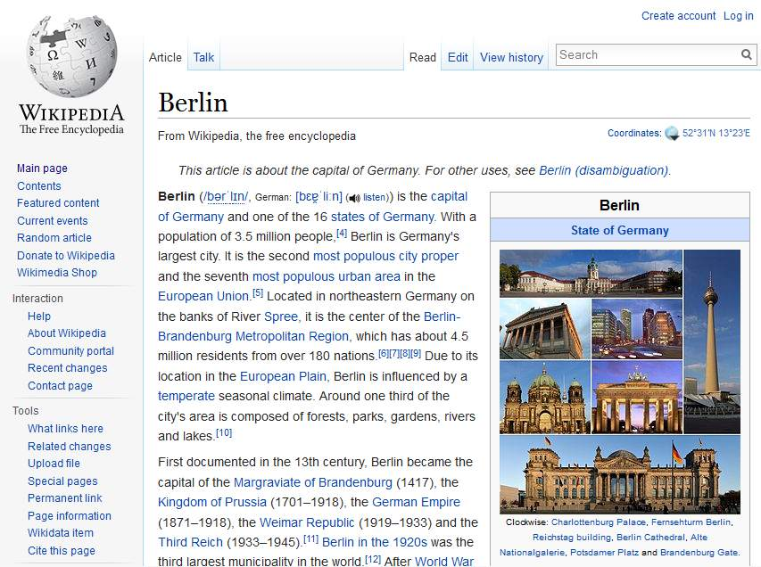
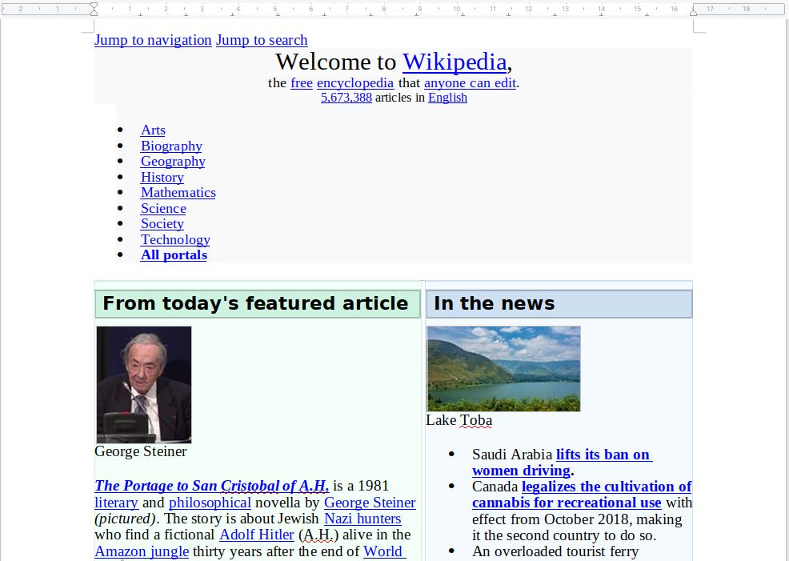
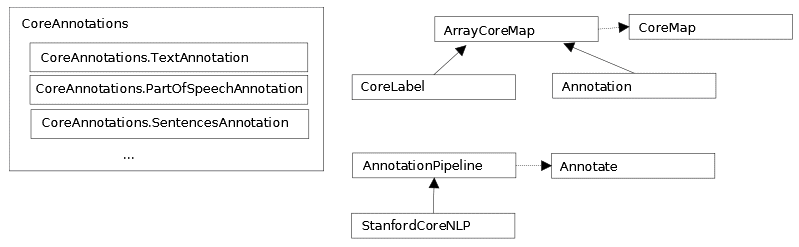

# 十一、组合管道

在这一章中，我们将讨论几个关于使用技术组合来解决 NLP 问题的问题。我们将从简单介绍准备数据的过程开始。接下来是关于管道及其构造的讨论。管道只不过是为解决某些问题而集成的一系列任务。管道的主要优点是能够插入和移除管道的各种元素，以稍微不同的方式解决问题。

斯坦福 API 支持一个很好的管道架构，这一点我们在本书中已经反复使用过。我们将详述这种方法的细节，然后展示如何使用 OpenNLP 来构建管道。为处理准备数据是解决许多 NLP 问题的重要的第一步。我们在[第一章](part0021.html#K0RQ0-447d219d688d46cb9ed55b88cf17edcf)、*自然语言处理简介*中介绍了数据准备过程，然后在[第二章](part0050.html#1FLS40-447d219d688d46cb9ed55b88cf17edcf)、*查找部分文本*中讨论了归一化过程。在这一章中，我们将着重于从不同的数据源中提取文本，例如 HTML、Word 和 PDF 文档。Stanford `StanfordCoreNLP`类是易于使用的管道的一个很好的例子。从某种意义上说，它是预构的。实际执行的任务取决于添加的注释。这适用于许多类型的问题。但是，其他 NLP APIs 不像斯坦福 API 那样直接支持管道架构；虽然构建起来更加困难，但是这些方法对于许多应用来说更加灵活。我们将使用 OpenNLP 演示这个构建过程。

我们将在本章中讨论以下主题:

*   准备数据
*   使用样板文件从 HTML 中提取文本
*   使用兴趣点从 Word 文档中提取文本
*   使用 PDFBox 从 PDF 文档中提取文本
*   使用 Apache Tika 进行内容分析和提取
*   管道
*   利用斯坦福管道
*   在斯坦福管道中使用多核
*   创建搜索文本的管道


# 准备数据

文本提取是你想要进行的任何 NLP 任务的主要阶段。如果给定一篇博客文章，我们希望提取博客的内容，并希望找到文章的标题、文章的作者、文章发布的日期、文章的文本或内容、类似媒体的图像、文章中的视频以及其他文章的链接(如果有的话)。文本提取包括以下内容:

*   结构化，以便识别不同的字段、内容块等
*   确定文档的语言
*   寻找句子、段落、短语和引语
*   将文本分解成标记，以便进一步处理
*   标准化和标记
*   词汇化和词干化，以减少变化并接近词根

这也有助于主题建模，我们已经在[第 9 章](part0194.html#5P0D40-447d219d688d46cb9ed55b88cf17edcf)、*主题建模*中讨论过。在这里，我们将快速介绍如何对 HTML、Word 和 PDF 文档执行文本提取。虽然有几个 API 支持这些任务，但我们将使用以下 API:

*   HTML 的样板文件([https://code.google.com/p/boilerpipe/](https://code.google.com/p/boilerpipe/))
*   Apache POI([http://poi.apache.org/index.html](http://poi.apache.org/index.html))for Word
*   Apache PDF box([http://pdfbox.apache.org/](http://pdfbox.apache.org/))for PDF

一些 API 支持使用 XML 进行输入和输出。例如，Stanford `XMLUtils`类提供了对读取 XML 文件和操作 XML 数据的支持。LingPipe 的`XMLParser`类将解析 XML 文本。组织以多种形式存储数据，通常不是简单的文本文件。演示文稿存储在 PowerPoint 幻灯片中，规范使用 Word 文档创建，公司提供 PDF 文档形式的营销和其他材料。大多数组织都有互联网，这意味着许多有用的信息都可以在 HTML 文档中找到。由于这些数据源的广泛性，我们需要使用工具来提取它们的文本进行处理。


# 使用样板文件从 HTML 中提取文本

有几个库可用于从 HTML 文档中提取文本。我们将演示如何使用样板管([https://code.google.com/p/boilerpipe/](https://code.google.com/p/boilerpipe/))来执行这个操作。这是一个灵活的 API，不仅可以提取 HTML 文档的整个文本，还可以提取 HTML 文档的选定部分，如标题和单个文本块。我们将使用 http://en.wikipedia.org/wiki/Berlin[的 HTML 页面来说明样板文件的使用。该页面的一部分如下面的截图所示:](http://en.wikipedia.org/wiki/Berlin)



为了使用 boilerpipe，您需要下载 Xerces 解析器的二进制文件，可以在[http://xerces.apache.org/index.html](http://xerces.apache.org/index.html)找到。

我们首先创建一个表示这个页面的 URL 对象。我们将使用两个类来提取文本。第一个是代表 HTML 文档的`HTMLDocument`类。第二个是代表 HTML 文档中文本的`TextDocument`类。它由一个或多个`TextBlock`对象组成，如果需要，可以单独访问这些对象。我们将为柏林页面创建一个`HTMLDocument`实例。`BoilerpipeSAXInput`类使用这个输入源创建一个`TextDocument`实例。然后，它使用`TextDocument` class' `getText`方法来检索文本。此方法使用两个参数。第一个参数指定是否包含标记为内容的`TextBlock`实例。第二个参数指定是否应该包含非内容的`TextBlock`实例。在这个例子中，两种类型的`TextBlock`实例都包括在内。以下是工作代码:

```
try{
            URL url = new URL("https://en.wikipedia.org/wiki/Berlin");
            HTMLDocument htmldoc = HTMLFetcher.fetch(url);
            InputSource is = htmldoc.toInputSource();
            TextDocument document = new BoilerpipeSAXInput(is).getTextDocument();
            System.out.println(document.getText(true, true));
        } catch (MalformedURLException ex) {
            System.out.println(ex);
        } catch (IOException ex) {
            System.out.println(ex);
        } catch (SAXException | BoilerpipeProcessingException ex) {
            System.out.println(ex);
        }
```

输出很长，但这里显示了几行:

```
Berlin
From Wikipedia, the free encyclopedia
Jump to navigation Jump to search
This article is about the capital of Germany. For other uses, see Berlin (disambiguation) .
State of Germany in Germany
Berlin
State of Germany
From top: Skyline including the TV Tower ,
City West skyline with Kaiser Wilhelm Memorial Church , Brandenburg Gate ,
East Side Gallery ( Berlin Wall ),
Oberbaum Bridge over the Spree ,
Reichstag building ( Bundestag )
.......
This page was last edited on 18 June 2018, at 11:18 (UTC).
Text is available under the Creative Commons Attribution-ShareAlike License ; additional terms may apply.  By using this site, you agree to the Terms of Use and Privacy Policy . Wikipedia® is a registered trademark of the Wikimedia Foundation, Inc. , a non-profit organization.
Privacy policy
About Wikipedia
Disclaimers
Contact Wikipedia
Developers
Cookie statement
Mobile view
```


# 使用兴趣点从 Word 文档中提取文本

Apache POI 项目([http://poi.apache.org/index.html](http://poi.apache.org/index.html))是一个用于从微软 Office 产品中提取信息的 API。这是一个庞大的库，允许从 Word 文档和其他办公产品(如 Excel 和 Outlook)中提取信息。下载 POI 的 API 时，还需要使用 XMLBeans(【http://xmlbeans.apache.org/】)支持 POI。XMLBeans 的二进制文件可以从 http://www.java2s.com/Code/Jar/x/Downloadxmlbeans524jar.htm 的[下载。我们的兴趣是演示如何使用 POI 从 word 文档中提取文本。](http://www.java2s.com/Code/Jar/x/Downloadxmlbeans524jar.htm)

为了演示这一点，我们将使用一个名为`TestDocument.docx`的文件，其中包含一些文本、表格和其他内容，如下面的截图所示(我们已经获取了维基百科的英文主页):



不同版本的 Word 使用几种不同的文件格式。为了简化选择使用哪个文本提取类，我们将使用`ExtractorFactory`工厂类。尽管 POI 的功能相当强大，但提取文本的过程却很简单。如此处所示，代表文件`TestDocument.docx`的`FileInputStream`对象被`ExtractorFactory`类的`createExtractor`方法用来选择适当的`POITextExtractor`实例。这是几个不同提取器的基类。将`getText`方法应用于提取器以获取文本:

```
private static String getResourcePath(){
        File currDir = new File(".");
        String path = currDir .getAbsolutePath();
        path = path.substring(0, path.length()-2);
        String resourcePath = path + File.separator  + "src/chapter11/TestDocument.docx";
        return resourcePath;
    }
    public static void main(String args[]){
        try {
            FileInputStream fis = new FileInputStream(getResourcePath());
            POITextExtractor textExtractor = ExtractorFactory.createExtractor(fis);
            System.out.println(textExtractor.getText());
        } catch (FileNotFoundException ex) {
            Logger.getLogger(WordDocExtractor.class.getName()).log(Level.SEVERE, null, ex);
        } catch (IOException ex) {
            System.out.println(ex);
        } catch (OpenXML4JException ex) {
            System.out.println(ex);
        } catch (XmlException ex) {
            System.out.println(ex);
        }   
    }
```

输出如下所示:

```
Jump to navigation Jump to search
Welcome to Wikipedia,
the free encyclopedia that anyone can edit.
5,673,388 articles in English
Arts
Biography
Geography
History
Mathematics
Science
Society
Technology
All portals
From today's featured article George Steiner The Portage to San Cristobal of A.H. is a 1981 literary and philosophical novella by George Steiner (pictured). The story is about Jewish Nazi hunters who find a fictional Adolf Hitler (A.H.) alive in the Amazon jungle thirty years after the end of World War II. The book was controversial, particularly among reviewers and Jewish scholars, because the author allows Hitler to defend himself when he is put on trial in the jungle by his captors. There Hitler maintains that Israel owes its existence to the Holocaust and that he is the "benefactor of the Jews". A central theme of The Portage is the nature of language, and revolves around Steiner's lifelong work on the subject and his fascination in the power and terror of human speech. Other themes include the philosophical and moral analysis of history, justice, guilt and revenge. Despite the controversy, it was a 1983 finalist in the PEN/Faulkner Award for Fiction. It was adapted for the theatre by British playwright Christopher Hampton. (Full article...) Recently featured: Monroe Edwards C. R. M. F. Cruttwell Russulaceae Archive By email More featured articles Did you know... Maria Bengtsson ... that a reviewer found Maria Bengtsson (pictured) believable and expressive when she first performed the title role of Arabella by Strauss? ... that the 2018 Osaka earthquake disrupted train services during the morning rush hour, forcing passengers to walk between the tracks? ... that funding for Celia Brackenridge's research into child protection in football was ended because the sport "was not ready for a gay former lacrosse international rummaging through its dirty linen"? ... that the multi-armed Heliaster helianthus sheds several of its arms when attacked by the six-armed predatory starfish Meyenaster gelatinosus? ... that if elected, Democratic candidate Deb Haaland would be the first Native American woman to become a member of the United States House of Representatives? ... that 145 Vietnamese civilians were killed during the 1967 Thuy Bo massacre? ... that Velvl Greene, a University of Minnesota professor of public health, taught more than 30,000 students? ... that a group of Fijians placed a newspaper ad to recruit skiers for Fiji at the 2002 Olympic Games after discussing it at a New Year's Eve party? Archive Start a new article Nominate an article In the news Lake Toba Saudi Arabia lifts its ban on women driving. Canada legalizes the cultivation of cannabis for recreational use with effect from October 2018, making it the second country to do so. An overloaded tourist ferry capsizes in Lake Toba (pictured), Indonesia, killing at least 3 people and leaving 193 others missing. In golf, Brooks Koepka wins the U.S. Open at the Shinnecock Hills Golf Club. Ongoing: FIFA World Cup Recent deaths: Joe Jackson Richard Harrison Yan Jizhou John Mack Nominate an article On this day June 28: Vidovdan in Serbia Anna Pavlova as Giselle 1776 – American Revolutionary War: South Carolina militia repelled a British attack on Charleston. 1841 – Giselle (Anna Pavlova pictured in the title role), a ballet by French composer Adolphe Adam, was first performed at the Théâtre de l'Académie Royale de Musique in Paris. 1911 – The first meteorite to suggest signs of aqueous processes on Mars fell to Earth in Abu Hummus, Egypt. 1978 – In Regents of the Univ. of Cal. v. Bakke, the U.S. Supreme Court barred quota systems in college admissions but declared that affirmative action programs giving advantage to minorities are constitutional. 2016 – Gunmen attacked Istanbul's Atatürk Airport, killing 45 people and injuring more than 230 others. Primož Trubar (d. 1586) · Paul Broca (b. 1824) · Yvonne Sylvain (b. 1907) More anniversaries: June 27 June 28 June 29 Archive By email List of historical anniversaries

Today's featured picture
    Henry VIII of England (1491–1547) was King of England from 1509 until his death. Henry was the second Tudor monarch, succeeding his father, Henry VII. Perhaps best known for his six marriages, his disagreement with the Pope on the question of annulment led Henry to initiate the English Reformation, separating the Church of England from papal authority and making the English monarch the Supreme Head of the Church of England. He also instituted radical changes to the English Constitution, expanded royal power, dissolved monasteries, and united England and Wales. In this, he spent lavishly and frequently quelled unrest using charges of treason and heresy. Painting: Workshop of Hans Holbein the Younger Recently featured: Lion of Al-lāt Sagittarius Japanese destroyer Yamakaze (1936) Archive More featured pictures

Other areas of Wikipedia
Community portal – Bulletin board, projects, resources and activities covering a wide range of Wikipedia areas.
Help desk – Ask questions about using Wikipedia.
```

此外，还可以使用`metaExtractor`提取关于文档的元数据，如下面的代码所示:

```
POITextExtractor metaExtractor = textExtractor.getMetadataTextExtractor();
            System.out.println(metaExtractor.getText());
```

它将生成以下输出:

```
Created = Thu Jun 28 06:36:00 UTC 2018
CreatedString = 2018-06-28T06:36:00Z
Creator = Ashish
LastModifiedBy = Ashish
LastPrintedString = 
Modified = Thu Jun 28 06:37:00 UTC 2018
ModifiedString = 2018-06-28T06:37:00Z
Revision = 1
Application = Microsoft Office Word
AppVersion = 12.0000
Characters = 26588
CharactersWithSpaces = 31190
Company = 
HyperlinksChanged = false
Lines = 221
LinksUpToDate = false
Pages = 8
Paragraphs = 62
Template = Normal.dotm
TotalTime = 1
```

另一种方法是使用`XWPFDocument`创建一个`POIXMLPropertiesTextExtractor`类的实例，它可用于`CoreProperties`和`ExtendedProperties`，如下面的代码所示:

```
fis = new FileInputStream(getResourcePath());
            POIXMLPropertiesTextExtractor properties = new POIXMLPropertiesTextExtractor(new XWPFDocument(fis));
            CoreProperties coreProperties = properties.getCoreProperties();
            System.out.println(properties.getCorePropertiesText());

            ExtendedProperties extendedProperties = properties.getExtendedProperties();
            System.out.println(properties.getExtendedPropertiesText());
```

输出如下所示:

```
Created = Thu Jun 28 06:36:00 UTC 2018
CreatedString = 2018-06-28T06:36:00Z
Creator = Ashish
LastModifiedBy = Ashish
LastPrintedString = 
Modified = Thu Jun 28 06:37:00 UTC 2018
ModifiedString = 2018-06-28T06:37:00Z
Revision = 1

Application = Microsoft Office Word
AppVersion = 12.0000
Characters = 26588
CharactersWithSpaces = 31190
Company = 
HyperlinksChanged = false
Lines = 221
LinksUpToDate = false
Pages = 8
Paragraphs = 62
Template = Normal.dotm
TotalTime = 1
```


# 使用 PDFBox 从 PDF 文档中提取文本

Apache PDF box([http://pdfbox.apache.org/](http://pdfbox.apache.org/))项目是一个处理 PDF 文档的 API。它支持文本提取和其他任务，如文档合并、表单填充和 PDF 创建。我们将只说明文本提取过程。为了演示 POI 的使用，我们将使用一个名为`TestDocument.pdf`的文件。该文件使用`TestDocument.docx`文件保存为 PDF 文档，如*使用 POI 从 Word 文档中提取文本*部分所示。这个过程很简单。为 PDF 文档创建一个`File`对象。`PDDocument`类表示文档，`PDFTextStripper`类使用`getText`方法执行实际的文本提取，如下所示:

```
File file = new File(getResourcePath());
PDDocument pd = PDDocument.load(file);
PDFTextStripper stripper = new PDFTextStripper();
String text= stripper.getText(pd);
System.out.println(text);
```

输出如下所示:

```
Jump to navigation Jump to search  
Welcome to Wikipedia, 
the free encyclopedia that anyone can edit. 
5,673,388 articles in English 
 Arts 
 Biography 
 Geography 
 History 
 Mathematics 
 Science 
 Society 
 Technology 
 All portals 
From today's featured article 

George Steiner 
The Portage to San Cristobal of A.H. is a 1981 
literary and philosophical novella by George Steiner 
(pictured). The story is about Jewish Nazi hunters 
who find a fictional Adolf Hitler (A.H.) alive in the 
Amazon jungle thirty years after the end of World 
War II. The book was controversial, particularly 
among reviewers and Jewish scholars, because the 
author allows Hitler to defend himself when he is 
put on trial in the jungle by his captors. There Hitler 
maintains that Israel owes its existence to the 
Holocaust and that he is the "benefactor of the 
Jews". A central theme of The Portage is the nature 
of language, and revolves around Steiner's lifelong 
work on the subject and his fascination in the power 
and terror of human speech. Other themes include 
the philosophical and moral analysis of history, 
justice, guilt and revenge. Despite the controversy, it 
was a 1983 finalist in the PEN/Faulkner Award for 
Fiction. It was adapted for the theatre by British 

In the news 

Lake Toba 
 Saudi Arabia lifts its ban on 
women driving. 
 Canada legalizes the cultivation of 
cannabis for recreational use 
with effect from October 2018, 
making it the second country to do 
so. 
 An overloaded tourist ferry 
capsizes in Lake Toba (pictured), 
Indonesia, killing at least 3 people 
and leaving 193 others missing. 
 In golf, Brooks Koepka wins the 
U.S. Open at the Shinnecock Hills 
Golf Club. 
Ongoing:  
 FIFA World Cup
.....
```


# 使用 Apache Tika 进行内容分析和提取

Apache Tika 能够从数千个不同类型的文件中检测和提取元数据和文本，如`.doc`、`.docx`、`.ppt`、`.pdf`、`.xls`等。它可以用于各种文件格式，这使得它对于搜索引擎、索引、内容分析、翻译等等非常有用。可以从[https://tika.apache.org/download.html](https://tika.apache.org/download.html)下载。本节将探讨 Tika 如何用于各种格式的文本提取。我们将只使用`Testdocument.docx`和`TestDocument.pdf`。

使用 Tika 非常简单，如以下代码所示:

```
File file = new File("TestDocument.pdf");            
Tika tika = new Tika();
String filetype = tika.detect(file);

System.out.println(filetype);
System.out.println(tika.parseToString(file));            
```

只需创建一个`Tika`的实例，并使用`detect`和`parseToString`方法获得以下输出:

```
application/pdf
Jump to navigation Jump to search  

Welcome to Wikipedia, 
the free encyclopedia that anyone can edit. 

5,673,388 articles in English 

 Arts 

 Biography 

 Geography 

 History 

 Mathematics 

 Science 

 Society 

 Technology 

 All portals 

From today's featured article 

George Steiner 

The Portage to San Cristobal of A.H. is a 1981 

literary and philosophical novella by George Steiner 

(pictured). The story is about Jewish Nazi hunters 

who find a fictional Adolf Hitler (A.H.) alive in the 

Amazon jungle thirty years after the end of World 

War II. The book was controversial, particularly 
....
```

在内部，Tika 将首先检测文档的类型，选择合适的解析器，然后从文档中提取文本。Tika 还提供了解析器接口和类来解析文档。我们也可以使用 Tika 的`AutoDetectParser`或`CompositeParser`来实现同样的事情。使用解析器，可以获得文档的元数据。更多关于 Tika 的信息可以在 https://tika.apache.org/的[找到。](https://tika.apache.org/)


# 管道

管道只不过是一系列操作，其中一个操作的输出被用作另一个操作的输入。我们在前几章的几个例子中看到了它的使用，但是它们都相对较短。特别是，我们看到了 Stanford `StanfordCoreNLP`类如何通过使用注释器对象很好地支持管道的概念。我们将在下一节讨论这种方法。如果结构合理，管道的一个优点是可以轻松添加和删除处理元素。例如，如果管道的一个步骤将一个令牌转换为小写，那么很容易删除这个步骤，而管道的其余元素保持不变。然而，有些管道并不总是如此灵活。一个步骤可能需要前一个步骤才能正常工作。在一个管道中，比如由`StanfordCoreNLP`类支持的管道，需要下面一组注释器来支持 POS 处理:

```
 props.put("annotators", "tokenize, ssplit, pos");
```

如果我们忽略了`ssplit`注释器，就会产生下面的异常:

```
*java.lang.IllegalArgumentException: annotator "pos" requires  annotator "ssplit"*
```

虽然斯坦福管道不需要花费很多精力来建立，但其他管道可能需要。我们将在本章后面的*创建搜索文本的管道*一节中演示后一种方法。


# 利用斯坦福管道

在本节中，我们将更详细地讨论斯坦福管道。虽然我们在本书的几个例子中使用了它，但是我们还没有完全探索它的能力。您以前使用过这个管道，现在能够更好地理解如何使用它。阅读本节后，您将能够更好地评估其功能和对您需求的适用性。`edu.stanford.nlp.pipeline`包保存了 **StanfordCoreNLP** 和注释器类。一般方法使用下面的代码序列来处理文本字符串。`Properties`类保存注释名称，而**注释**类表示要处理的文本。 **StanfordCoreNLP** 类的 **Annotate** 方法将应用属性列表中指定的注释。 **CoreMap** 接口是所有可注释对象的基本接口。它使用键和值对。下图显示了类和接口的层次结构:



它是类和接口之间关系的简化版本。 **CoreLabel** 类实现了 **CoreMap** 接口。它代表一个附有注释信息的单词。附加的信息取决于创建管线时设置的属性。然而，总是有位置信息可用，比如它的开始和结束位置或者实体前后的空白。用于 **CoreMap** 或 **CoreLabel** 的`get`方法返回特定于其参数的信息。`get`方法被重载并返回一个依赖于其参数类型的值。CoreLabel 类已经被用来访问句子中的单个单词。

我们将使用`keyset`方法，该方法返回一组当前由`Annotation`对象持有的所有注释键。在应用`annotate`方法之前和之后都会显示按键。完整的工作代码如下所示:

```
String text = "The robber took the cash and ran";
        Properties props = new Properties();
        props.put("annotators", "tokenize, ssplit, pos, lemma, ner, parse, dcoref");
        StanfordCoreNLP pipeline = new StanfordCoreNLP(props);
        Annotation annotation = new Annotation(text);

        System.out.println("Before annotate method executed ");
        Set<Class<?>> annotationSet = annotation.keySet();
        for(Class c : annotationSet) {
            System.out.println("\tClass: " + c.getName());
        }

        pipeline.annotate(annotation);

        System.out.println("After annotate method executed ");
        annotationSet = annotation.keySet();
        for(Class c : annotationSet) {
            System.out.println("\tClass: " + c.getName());
        }
        List<CoreMap> sentences = annotation.get(SentencesAnnotation.class);
        for (CoreMap sentence : sentences) {
            for (CoreLabel token: sentence.get(TokensAnnotation.class)) {
                String word = token.get(TextAnnotation.class); 
                String pos = token.get(PartOfSpeechAnnotation.class); 
                System.out.println(word);
                System.out.println(pos);
            }
        }
```

以下输出显示了调用前后以及单词和位置:

```
Before annotate method executed 
    Class: edu.stanford.nlp.ling.CoreAnnotations$TextAnnotation
After annotate method executed 
    Class: edu.stanford.nlp.ling.CoreAnnotations$TextAnnotation
    Class: edu.stanford.nlp.ling.CoreAnnotations$TokensAnnotation
    Class: edu.stanford.nlp.ling.CoreAnnotations$SentencesAnnotation
    Class: edu.stanford.nlp.ling.CoreAnnotations$MentionsAnnotation
    Class: edu.stanford.nlp.coref.CorefCoreAnnotations$CorefMentionsAnnotation
    Class: edu.stanford.nlp.ling.CoreAnnotations$CorefMentionToEntityMentionMappingAnnotation
    Class: edu.stanford.nlp.ling.CoreAnnotations$EntityMentionToCorefMentionMappingAnnotation
    Class: edu.stanford.nlp.coref.CorefCoreAnnotations$CorefChainAnnotation
The
DT
robber
NN
took
VBD
the
DT
cash
NN
and
CC
ran
VBD
```


# 在斯坦福管道中使用多核

`annotate`方法也可以利用多个内核。它是一个重载方法，其中一个版本使用一个`Iterable<Annotation>`的实例作为它的参数。它将使用可用的处理器处理每个`Annotation`实例。
我们将使用之前定义的`pipeline`对象来演示这个版本的`annotate`方法。
首先，我们基于四个短句创建四个`Annotation`对象，如下所示。为了充分利用这项技术，最好使用更大的数据集。以下是工作代码片段:

```
Annotation annotation1 = new Annotation("The robber took the cash and ran.");
Annotation annotation2 = new Annotation("The policeman chased him down the street.");
Annotation annotation3 = new Annotation("A passerby, watching the action, tripped the thief "
            + "as he passed by.");
Annotation annotation4 = new Annotation("They all lived happily ever after, except for the thief "
            + "of course.");

ArrayList<Annotation> list = new ArrayList();
list.add(annotation1);
list.add(annotation2);
list.add(annotation3);
list.add(annotation4);
Iterable<Annotation> iterable = list;
pipeline.annotate(iterable);
List<CoreMap> sentences1 = annotation2.get(SentencesAnnotation.class);

for (CoreMap sentence : sentences1) {
    for (CoreLabel token : sentence.get(TokensAnnotation.class)) {
                String word = token.get(TextAnnotation.class);
                String pos = token.get(PartOfSpeechAnnotation.class);
                System.out.println("Word: " + word + " POS Tag: " + pos);
            }
        }
```

输出如下所示:

```
Word: The POS Tag: DT
Word: policeman POS Tag: NN
Word: chased POS Tag: VBD
Word: him POS Tag: PRP
Word: down POS Tag: RP
Word: the POS Tag: DT
Word: street POS Tag: NN
Word: . POS Tag: 
```


# 创建搜索文本的管道

搜索是一个丰富而复杂的主题。有许多不同类型的搜索和执行搜索的方法。这里的目的是演示如何应用各种 NLP 技术来支持这项工作。在大多数机器上，可以在合理的时间内一次处理一个文本文档。然而，当需要搜索多个大型文档时，创建索引是支持搜索的常用方法。这导致搜索过程在合理的时间内完成。我们将演示一种创建索引的方法，然后使用该索引进行搜索。虽然我们将使用的文本不是很大，但它足以演示这个过程。
我们需要做到以下几点:

*   从文件中读取文本
*   标记和查找句子边界
*   删除停用词
*   累积索引统计数据
*   写出索引文件

有几个因素会影响索引文件的内容，包括:

*   停用词的删除
*   区分大小写的搜索
*   查找同义词
*   使用词干化和词汇化
*   允许跨句子边界搜索

我们将使用 OpenNLP 来演示这个过程。这个例子的目的是演示如何在流水线过程中结合 NLP 技术来解决搜索类型的问题。这不是一个全面的解决方案，我们将忽略一些技术，如词干。此外，不会介绍索引文件的实际创建，而是留给读者作为练习。在这里，我们将集中讨论如何使用 NLP 技术。具体来说，我们将执行以下操作:

*   把这本书分成句子
*   将句子转换成小写
*   删除停用词
*   创建内部索引数据结构

我们将开发两个类来支持索引数据结构:`Word`和`Positions`。我们还将扩充在第 2 章、*中开发的`StopWords`类，以支持`removeStopWords`方法的重载版本。新版本将提供一种更方便的删除停用词的方法。我们从一个 try-with-resources 块开始，打开句子模型`en-sent.bin`的流，以及一个包含儒勒·凡尔纳的*海底两万里*内容的文件。这本书是从 http://www.gutenberg.org/ebooks/164 下载的。以下代码显示了搜索的一个工作示例:*

```
try {
            InputStream is = new FileInputStream(new File(getResourcePath() + "en-sent.bin"));
            FileReader fr = new FileReader(getResourcePath() + "pg164.txt");
            BufferedReader br = new BufferedReader(fr);
            System.out.println(getResourcePath() + "en-sent.bin");
            SentenceModel model = new SentenceModel(is);
            SentenceDetectorME detector = new SentenceDetectorME(model);

            String line;
            StringBuilder sb = new StringBuilder();
            while((line = br.readLine())!=null){
                sb.append(line + " ");
            }
            String sentences[] = detector.sentDetect(sb.toString());
            for (int i = 0; i < sentences.length; i++) {
                sentences[i] = sentences[i].toLowerCase();
            }

//            StopWords stopWords = new StopWords("stop-words_english_2_en.txt");
//            for (int i = 0; i < sentences.length; i++) {
//                sentences[i] = stopWords.removeStopWords(sentences[i]);
//            }

            HashMap<String, Word> wordMap = new HashMap();
            for (int sentenceIndex = 0; sentenceIndex < sentences.length; sentenceIndex++) {
            String words[] = WhitespaceTokenizer.INSTANCE.tokenize(sentences[sentenceIndex]);
            Word word;
            for (int wordIndex = 0; 
                    wordIndex < words.length; wordIndex++) {
                String newWord = words[wordIndex];
                if (wordMap.containsKey(newWord)) {
                     word = wordMap.remove(newWord);
                } else {
                    word = new Word();
                }
                word.addWord(newWord, sentenceIndex, wordIndex);
                wordMap.put(newWord, word);
            }

            Word sword = wordMap.get("sea");
            ArrayList<Positions> positions = sword.getPositions();
            for (Positions position : positions) {
                System.out.println(sword.getWord() + " is found at line " 
                    + position.sentence + ", word " 
                    + position.position);
            }
        }

        } catch (FileNotFoundException ex) {
            Logger.getLogger(SearchText.class.getName()).log(Level.SEVERE, null, ex);
        } catch (IOException ex) {
            Logger.getLogger(SearchText.class.getName()).log(Level.SEVERE, null, ex);
        }
```

```
class Positions {
    int sentence;
    int position;

    Positions(int sentence, int position) {
        this.sentence = sentence;
        this.position = position;
    }
}

public class Word {
    private String word;
    private final ArrayList<Positions> positions;

    public Word() {
        this.positions = new ArrayList();
    }

    public void addWord(String word, int sentence, 
            int position) {
        this.word = word;
        Positions counts = new Positions(sentence, position);
        positions.add(counts);
    }

    public ArrayList<Positions> getPositions() {
        return positions;
    }

    public String getWord() {
        return word;
    }
}
```

让我们分解代码来理解它。`SentenceModel`用于创建`SentenceDetectorME`类的实例，如下所示:

```
SentenceModel model = new SentenceModel(is);
SentenceDetectorME detector = new SentenceDetectorME(model);
```

接下来，我们将使用一个`StringBuilder`实例创建一个字符串来支持句子边界的检测。该书的文件被读取并添加到`StringBuilder`实例中。然后应用`sentDetect`方法创建一个句子数组，我们使用`toLowerCase`方法将文本转换成小写。这样做是为了确保当停用词被删除时，该方法将捕获所有停用词，如下所示:

```
String line;
StringBuilder sb = new StringBuilder();
while((line = br.readLine())!=null){
    sb.append(line + " ");
}
String sentences[] = detector.sentDetect(sb.toString());
for (int i = 0; i < sentences.length; i++) {
    sentences[i] = sentences[i].toLowerCase();
}
```

下一步是基于处理后的文本创建一个类似索引的数据结构。这个结构将使用`Word`和`Positions`类。`Word`类由单词字段和`Positions`对象的`ArrayList`组成。因为一个单词可能在文档中出现不止一次，所以列表用于维护它在文档中的位置。`Positions`类包含一个字段，用于表示句子编号`sentence`，以及单词在句子中的位置`position`。这两个类的定义如下:

```
class Positions {
    int sentence;
    int position;

    Positions(int sentence, int position) {
        this.sentence = sentence;
        this.position = position;
    }
}

public class Word {
    private String word;
    private final ArrayList<Positions> positions;

    public Word() {
        this.positions = new ArrayList();
    }

    public void addWord(String word, int sentence, 
            int position) {
        this.word = word;
        Positions counts = new Positions(sentence, position);
        positions.add(counts);
    }

    public ArrayList<Positions> getPositions() {
        return positions;
    }

    public String getWord() {
        return word;
    }
}
```

为了使用这些类，我们创建一个`HashMap`实例来保存文件中每个单词的位置信息。在 map 中创建单词条目的过程如下面的代码所示。每个句子都被标记化，然后检查每个标记，看它是否存在于映射中。该单词被用作哈希映射的关键字。`containsKey`方法确定单词是否已经被添加。如果有，那么删除`Word`实例。如果之前没有添加过这个单词，那么就会创建一个新的`Word`实例。不管怎样，新的位置信息被添加到`Word`实例中，然后被添加到地图中，如下所示:

```
HashMap<String, Word> wordMap = new HashMap();
            for (int sentenceIndex = 0; sentenceIndex < sentences.length; sentenceIndex++) {
            String words[] = WhitespaceTokenizer.INSTANCE.tokenize(sentences[sentenceIndex]);
            Word word;
            for (int wordIndex = 0; 
                    wordIndex < words.length; wordIndex++) {
                String newWord = words[wordIndex];
                if (wordMap.containsKey(newWord)) {
                     word = wordMap.remove(newWord);
                } else {
                    word = new Word();
                }
                word.addWord(newWord, sentenceIndex, wordIndex);
                wordMap.put(newWord, word);
            }
```

为了演示实际的查找过程，我们使用`get`方法返回单词“reef”的`Word`对象的一个实例。用`getPositions`方法返回位置列表，然后显示每个位置，如下所示:

```
Word sword = wordMap.get("sea");
            ArrayList<Positions> positions = sword.getPositions();
            for (Positions position : positions) {
                System.out.println(sword.getWord() + " is found at line " 
                    + position.sentence + ", word " 
                    + position.position);
            }
```

输出如下所示:

```
sea is found at line 0, word 7
sea is found at line 2, word 6
sea is found at line 2, word 37
sea is found at line 3, word 5
sea is found at line 20, word 11
sea is found at line 39, word 3
sea is found at line 46, word 6
sea is found at line 57, word 4
sea is found at line 133, word 2
sea is found at line 229, word 3
sea is found at line 281, word 14
sea is found at line 292, word 12
sea is found at line 320, word 22
sea is found at line 328, word 21
sea is found at line 355, word 22
sea is found at line 363, word 1
sea is found at line 391, word 13
sea is found at line 395, word 6
sea is found at line 450, word 12
sea is found at line 460, word 6
.....
```

这个实现相对简单，但是演示了如何组合各种 NLP 技术来创建和使用可以保存为索引文件的索引数据结构。其他增强功能也是可能的，包括以下内容:

*   其他过滤操作
*   将文档信息存储在`Positions`类中
*   将章节信息存储在`Positions`类中
*   提供搜索选项，例如:
    *   区分大小写的搜索
    *   精确文本搜索
    *   更好的异常处理

这些是留给读者的练习。


# 摘要

在本章中，我们讨论了准备数据的过程，并讨论了管道。我们展示了几种从 HTML、Word 和 PDF 文档中提取文本的技术。我们还看到了 Apache Tika 如何轻松地用于任何类型的文档提取。我们证明了流水线只不过是为解决某个问题而集成的一系列任务。我们可以根据需要插入和移除管道中的各种元素。详细讨论了斯坦福管道体系结构。我们研究了可以使用的各种注释器。探索了该流水线的细节，以及它如何与多个处理器一起使用。在下一章，[第 12 章](part0229.html#6QCGQ0-447d219d688d46cb9ed55b88cf17edcf)，*创建聊天机器人*我们将致力于创建一个简单的聊天机器人来演示我们到目前为止看到的 NLP 的使用。